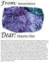
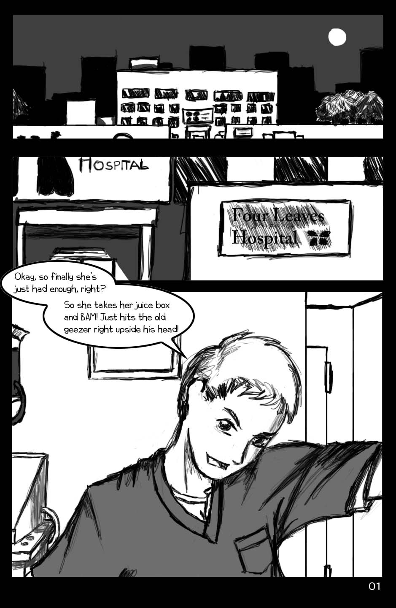

> I really wish there was magic in the world. I would do anything for there to be magic that could make her, make everything all right again. 
> 
> *Nurse-Kun*

*Damaged Goods* is a classic from 4chan's (supposedly) "Golden Age" (2006-2007) where a registered male nurse (dubbed "Nurse-kun") asked /b/ for advice when his boring everyday life in a nursing home was interrupted by the arrival of a badly hurt 7-year-old girl. 

At first he merely thought this an interesting anecdote, flavoring it to get the attention of the "fucked-up" /b/tards known as Anonymous, but in an uncharacteristic change of heart, some anons pressed him to actually help the little girl out.

As the events unfold, the magic of the story somehow enchanted the cold heart of Anonymous. The people famous for mercilessly crushing 12-year old girls convinced Nurse-kun to grant the broken soul one friend in the world, and to save her from an unfortunate end. One thing led to another, and for once, the legions of Anonymous found themselves giving the little girl something to smile about. 

It does more than just tell a riveting tale about one guy and a girl; it gives a window into what 4chan was, what this influential community became, and what the site truly meant to the users who lurked and posted at the time.

# Table of contents
1. [Chapter 1 - Byouin Otoko](#chapter1)
2. [Chapter 2 - Covert Ops](#chapter2a)
   1. [Thread A](#chapter2a)
   2. [Thread B](#chapter2b)
   3. [Thread C](#chapter2c)
3. [Chapter 3 - Full Disclosure](#chapter3)
4. [Chapter 4 - The Nightmare Before Christmas: Part 1](#chapter4)
5. [Chapter 5 - The Nightmare Before Christmas: Part 2](#chapter5)
6. [Chapter 6 - Elite Beat Loli](#chapter6)
7. [Chapter 7 - Christmas Spirit](#chapter7)
   1. [Chapter 7a - The End](#chapter7a)
8. [Chapter 8 - Nurse-kun Returns](#chapter8)
9. [Chapter 9 - Nurse-kun Is Shit At Origami](#chapter9)
10. [Chapter 10 - Paper Hearts](#chapter10)
11. [Chapter 11 - System Shock](#chapter11)
12. [Chapter 12 - Awakening a Sleeping Giant](#chapter12)
13. [Chapter 13 - Two Steps Forward](#chapter13a)
    1. [Part 1](#chapter13a)
    2. [Part 2](#chapter13b)
14. [Chapter 14 - Valentines](#chapter14)
15. [Chapter 15 - Tough as Nails](#chapter15)
16. [Chapter 16 - Day Tripper](#chapter16)
17. [Chapter 17 - I'm Spartacus!](#chapter17)
18. [Chapter 18 - No, I'm Spartacus! (fake)](#chapter18)
19. [Chapter 19 - I Hate That Girl in Elite Beat Agents](#chapter19)
20. [Chapter 20 - Pool's Closed](#chapter20)
21. [Chapter 21 - Duet Dans L'Eau](#chapter21)
22. [Chapter 22 - Maison Encore](#chapter22)
23. [Chapter 23 - Of Pokemans and Haikus](#chapter23)
    1. [Addendum: Finding Nurse-kun](#adtxt)
24. [Chapter 24 - Epilogue](#chapter24)

## Part 1 (December 16th)  ##

### 17405827 (OP) ###

/b/, I need your advice on something, since you're probably the ones most qualified to give it.

I'm a nurse-orderly at a nursing home, been there for a year so far, I work the night shift on the west wing. It's not that tough, since most of the residents are so old and medicated that they sleep the night away, only rarely dying or stroking out or getting up to eat their own poop or something. I usually wind up playing with my DS or reading at the nurse's station for the full four hours I'm on watch alone, from 1 to 5.

However, a new patient arrived a month ago, which got my attention. A seven year old girl that was in a car crash that killed her parents, and took her legs, right arm, and right eye. As a ward of the state, and so messed up by all the trauma mentally that no foster parents would touch her, she got sent here when she got out of the hospital. God, she's so cute, she's half-japanese, but has blonde hair, and the rest of her body that didn't get cut away is just perfect, she used to be a gymnast, it seems. I've had to answer her call button several times so far, when she's had to use the restroom in the middle of the night, which meant carrying her from her bed to the toilet, then holding her as she used it, and she always looks away from me when she did so, blushing a little bit.

> The next paragraph is a reference to a sick running joke on /b/, popular in the Civil War Era; that whenever an /b/-tard sees a little girl, they probably might rape her.  
> The reason Nurse-kun posted this is because he mistakenly believed he had to "fit in" with the legendary fucked-up attitude on /b/ to get a response.  
> In later threads, Nurse-kun proves that the post below did not reflect his actual beliefs or intentions at any point in time. In addition, the outpouring of anger by anons persuaded him to help the girl out, rather than turn a blind eye. And thus, a very touching story unfolds out of all the madness.  
> But our job is to record people's recollections as they are presented, not to "clean them up" for public entertainment.  
> You should take this for what it is: he saw a little girl at his unrewarding, difficult job, but felt it would be too risky to try to help her out in her painful situation, so instead he decided to come home and vent about it to other anonymous Internet users.

Anyway, my question: Should I stick it in her pooper (among other things)? I mean, she isn't going to be able to resist, and I can go in there when she's asleep, then cover up her good eye and mouth before she even knows I'm there, with all the drugs she's on. She's so messed up mentally that she probably wouldn't tell anyone, considering she's barely talked to all the shrinks they've had her seeing since the accident. I'm a pretty gentle guy, and there's plenty of lube around here (obviously), and it'd be pretty easy to clean her up afterward, too.

Anyway, what do you think, /b/? Picture somewhat related.

### 17395768

I don't think you have a job. Enjoy your cripple porn.

### 17395802 (OP)

`>>17395768`  
C'mon guys, I need your help here!

### 17395772

You are the cancer that is killing /b/. If this was even 7 months ago before the summer, you would have either been banned or spammed half to death with guro. No one who matters gives a shit about your bosnian bullshit, and /b/ is about the funny, not the drama. Please leave the site now. Leave and never return.

### 17395802

What are you talking about? This shit is actually pretty funny.

### 17395884

`>>17395802`  
/b/ was never funny.

It was "put your head in your hands and ask God, WRYYYYYYYYY"

### 17395984

I fucking loled at the "Should I stick it in the pooper question" right out of left field.

### 17395917

Well, now that he's asking for a serious reply, it's failing. But it's pretty good copypasta by itself.

### 17395968

This is one of the few situations that I have to say no to.

1. She's seven. EW.
2. She's an amputee. EW.

IF 1 and 2 appeal to you, then you have no other valid reason why except that you might lose your job. (Didn't include any moral choice since that's probably the least of your worries)

### 17996138

Why can't you just:

* Get to know her.
* Make her like you.
* Cuddle with her. Hug her, sleep in her bed with her.
* Tell her you love her.

Damnit, now I'm wishing I had a half-japanese amputee to cuddle with.

### 17396238 (OP) ###

`>>17996138`  
Well, she already has a bit of a reputation around here as a trouble patient, since she can become really aggressive when she gets frustrated. So she isn't so popular with the rest of the staff, and since she's so young, there's a lot more reluctance to show any 'inappropriate' affection toward her than, say, to some 90 year old that thinks Hitler's invading Paris every time she wakes up.

The main problem is that she's asleep most of the time I have her alone. What should I do?

### 17396562 (OP) ###

`>>17396429`
> Bullshit. good story, but no-one ever sends an orphan to a nursing home, and if she has to go, they use fucking bedpans.

Uh, yeah...they keep orphans with extreme medical and physical care needs in all the orphanages, the ones on every street corner. The ones with qualified nurses and doctors to manage their constant care. And they totally just toss the one-armed girl a bedpan, and cut the cord on the call button.

Don't try and tell me how the system works, asshole, I'm part of the system, and it doesn't fucking work at all.

### 17396426 (OP) ###

`>>17396289`
> Pictures are required before further consultation.

Well, I haven't taken any [pictures] yet (official policy is no photography by the staff for legal reasons, someone got busted in 2001 for taking pictures of the funny things senile old people do and posting them on the net), and I don't go back to work for another 10 hours. So I have no pictures of her to give you.

### 17396690 (OP) ###

`>>17396462`
> Take pictures tomorrow and post them exactly 24 hours from the time of this comment. Deal?

I'll try. But they do random searches on our bags since a new policy was enacted in June, in reaction to another nurse that was stealing narcotics. Thus, the main reason I've been hesitant up till now.

### 17397176

What the fuck is wrong with you? Joking about rape is fine, but actually planning it.. isn't so funny. I mean, not only has she gone through a lot of trauma, but now you just want to put her through more. And if you gain a relationship with her just to do this, she's going to have major trust issues for the rest of her life.

Here's my advice to you: kill yourself. It would do the world some good.

### X17397725

didn't happen, he's lying, no pics, etc.

just some unimaginably sick, lonely individual making up a story--probably masturbating (like myself) to each reply.

### 17397272

`>>17397176`  
I have to agree with this anonymous if OP is real. My second opinion is that you should fall in love with her and make her life a living paradise.

### 17397304

The most serious post this anonymous has ever made on /b/:

If you really cared about this little girl's future, you would not rape her. You realize that would fuck up her already fucked up life even more. You'd just be hurting her. Don't nurses have to take the Hippocratic Oath, too?

### 17397050

`>>17396929`  
I think your only real problem here is the objectification of the girl. I mean, I don't have anything against you wanting to fuck her, that's fine. Rape is bad though, and having sex with a 7 year old permenantly damages them so don't actually go through with it.

If I had a bone to pick with you as far as morals go, it would be that you need to stop treating her like an object and treat her like a person. Buy her some toys and make the quality of her life better, wait a few years and after a real relationship has formed and she's past puberty, THEN consider sticking it in her pooper.

Until then, masturbate. Lots.

### 17397249

`>>17397050`  
I think buying toys to someone who spends their days as a cripple in a bed is more of an insult.

Also, speaking of permanent damage. she seems pretty wrecked already. So relative to a normal 7 years old the percentual fuck-up factor could in no way be as great even if he rape her in a fully conscious state.

### 17397444

`>>17397332`

The internet is for lulz and rape, but not planning rape IRL.

I'd post that picture of the fag from IGN who said, "Rape is just suprise sex lol" in the barbershop, shortly before discovering his barber's daughter had been raped.

Online ideas/conversations do not transfer well to IRL.

### 17397410

Just to let you know, anonymous will turn on you harder than you will ever imagine if you're being truthful.

We'll hunt you down. Make fun of this if you want, but you won't be safe.

### 17396929 (OP)

`>>17396803`

Well fine, if you want honesty, *I was kind of hoping more people would tell me not to do it.*

I mean, HA HA, I'M POSTING IN /B/, but seriously, *I feel bad for her too.*

> Of course, I also feel PENIS-engorged for her, because my words cannot convey just how cute and soft and warm she is.

### 17397258

`>>17396929`

Anon has feelings too. We understand.

Don't raep her, befriend her.

### 17397156 ###

There's a difference between wanting to fuck someone until they're blind and what you're describing.

You don't want to stick it in the pooper at all.

*You're feeling something entirely different*, aren't you?

I suggest finding out what she likes to read, then reading it aloud to her. Gain her trust and adoration, since *you know inside you would rather perform a barrel roll* then raping a 7-year old amputee who had just lost her parents.

You know what to do.

### 17396289 ### 

adopt her?

### 17397116

I think it is pretty obvious that God wants you to adopt her and to be a good father for her, so you must fight your sinfulness every day again and again.

Yeah, he's into some crazy shit, God!

### 17396803

Adoption? not a bad idea actually... seconded. if you're connecting with her, it might do both of you some good to take her in, if you can.

> and if you still feel the need to fuck her, then it can legally be incest as well. bonus points!

### 17396762 (OP) ###

And for all those people telling me to adopt her, I'd love to, she seems like she was a really great kid, bright, outgoing, cheerful, before the accident. The problem is that people involved in the care of kids in the system often find it way harder to adopt them than someone with a less sterling record from OUTSIDE the system. It's fucked up, but that's the way it is.

### 17397047

`>>17396762`  
you couldn't strike a deal with some good friend/relative of yours then? they adopt, you take care of her?

### 17397332 ###

MORALITY?

ON MY /B/?!

What is this shit? If I wanted to learn about conscience, I'd go to my Ethics and Morality class at school. The internet is for lulz and raep.

### 17397471 (OP) ###

Well, um...the problem is, if I'm nice to her, and treat her kindly, more as a friend or father-figure, she'd be likely, as a positive effect, to report it to the facility's psychiatrist during one of their sessions, in all innocence, who might then feel obligated to report that to the administrator. Who would then probably fire me for showing inappropriate affection, woo family services catch-22ism.

### 17397598

What, does the staff often just rape the shit out of the patients?

### 17397596 ###

What kind of affection are you allowed to show? This seems pretty stupid to me, I mean, she obviously needs some kind of friend, I'm sure your supervisor and her psychiatrist would agree.

### 17397589 & 17397642

She sounds like a smart girl, so talk to her as an adult, and treat her well.

If she knows that you're risking your job to take care of her, she should be smart enough to avoid the topic with the psychiatrist.

I mean, if she does start to like you, she'd want want you to stay around, right?

### 17397890 (OP) ###

`>>17397589`

I've considered that, too. I mean, she's actually REALLY smart, like, she was in a school for the gifted before the accident, and her mother was a child psychologist, so they gave her a lot more freedom and choice than the average kid would get. And she was pretty gifted athletically, too, which just makes the whole thing all the more tragic.

Of course, she's also pretty broken now...extremely withdrawn, rare she says three words the whole day; at the same time, she lashes out at anyone that tries to get too close. She actually bit a psych intern who was trying some play therapy with her in the hospital hard enough to draw blood, before she was transferred here. The real problem is, if I were to try and form a bond with her, honestly, I'm afraid she'd do something to get me in trouble just to try and make me leave her alone, even if she really wants some affection.

This would be a lot easier if she was less traumatized.

### 17397936 ###

FUCKING BEFRIEND HER fucker  
UPDATE A BLOG ABOUT IT  
and I SWEAR I WILL MAKE A MANGA OUT OF IT  
it's true, im a doujinshi-drawing weeaaboohoo.  
and this story is GOLD drama material

just think about it;

average /b/tard MEETS a shy half-japanese blonde cute one-eyed orphaned amputee loli

THIS IS THE NEW DENSHA OTOKO

### 17397392 ###

The toy thing might be true though.

Lets all think of things someone with one arm and one eye can enjoy.

* Teddy bears
* Books
* Movies

That's all I can come up with, I'm sure the rest of Anonymous has some better suggestions.

### 17397451

Def Leppard.

### 17397453

prostheses

### 17397572

Well shit - raep it is.

### 17397572

Put her body in a robot.

AND MAKE A LOLI-MECHWARRIOR §§§

### 17397501

Buy her a barbie and rip off the legs and right arm and color over the right eye.

### 17397693

Buy her a lute, her hearing is the only thing not affected by the accident, and the lute can be played with one hand. Plus it's a pretty inexpensive item.

### 17397829

`>>17397693`  
Faggot. You can't play a lute with one hand. Do you even know what a lute is?

### 17397595

Be her foster parent

### 17397697

Wait a minute...male nurse?

GAAAAAAAAAAAAAAAAAAAAAAAAAAAAY.

### 17398173 ###

HELO /B/    
I WOULD LIKE TO SAY YOU ALL TURNED INTO FUCKING GAIA WUSSES AND FAILURES. PLEASE, EVERYONE WHO SAID "PLZ DONT RAEP LOLI NO LEIK REAP", GB2 /GAIA/

### 17398170 ###

My personal suggestion? Music and books.

There are plenty of devices that can help someone with one arm keep a book steady and open, etc, listening to and appreciating different types of music is always an option, and she can still write. If she's as smart as she said, she might be able to vent eventually through writing or drawing. Just give her stimulating, fun, but not patronizing things she can do in this condition.

She might never open up to you, but that's ok; you're just trying to help, and it sounds like the rest of the staff really hasn't bothered with this kind of thing.

(By the way, this scenario involves no rape whatsoever.)

Best case scenario? She realizes that her life's not over and she has people around that are genuinely trying to make her happy.

### 17397682

I think it's the right time for some Katawa Shoujo .

> **Archivist's Note:** A group of anons who witnessed Damaged Goods were inspired to create Katawa Shoujo, albeit the end product was based on concept characters from this famous artist's sketch.

### 17397765

What the hell? The damaged-goods date sim?

MORE PLS

### 17397669

Whole thread keeps bringing this shit to mind

### 17397785

`>>17397669`  
What is That.

### 17397822

seconded

### 17397848 & 17397853 & 17397870

`>>17397785`

Gunslinger Girls.

In that anime, an organization takes unwanted little girls with severe physical problems and rebuilds them into brainwashed cyborg assassins.

Sometimes they even get raped. Though most of the time it's just mentally.

Most of of the time.

### 17397874

`>>17397848`  
Thanks for delivering, sounds cool.

### 17398333 (OP) ###

> _/b/ demands a pic by this time tomorrow._

you know, the main reason I would have not to post pictures is that she's a pretty distinctive girl. I mean, how many half-japanese blonde green-eyed (singular) one-armed, no-legged seven year olds are there? That idiot I mentioned before got busted just for posting random old people, and there are millions of those.

### 17398890 (OP) ###

> _Just curious, but does she have stumps? Any possibility of her getting at least prosthetic legs?_

Actually, she gets bussed to a rehab facility at the hospital almost every day, where she's learning to use prosthetic legs, and an arm. It's like it's the one thing she actually cares about anymore, I hear the staff there are amazed at the progress she's making.

It makes sense, though, because she really hates her wheelchair...the first time I answered one of her calls at night, I'd wheeled it out to put her in it, since that's standard procedure, but she asked me not to use it, so I carried her, instead. I guess that's the first time I thought about her in an illegal manner, really.

Anyway, she wears the prosthetic arm during the day, but I'm not around then, so I've never actually seen her using it. I have seen it in her room, though; it's a nice model, probably the best in the whole facility. I guess her parents had a pretty responsible life insurance policy, so she doesn't have to deal with substandard prosthetics, at least...has a nice prosthetic eye, too, looks just like her real one, as much as a fake one can, anyway. Of course, the scarring over her eye kind of helps give it away.

### 17399199 (OP) ###

> _loli haet raep. lonely, orphaned loli loev caring man. years later, borderline loli secks for you._

I know, I know. I mean, I'd prefer not to rape, too! It's just that it's a really complex situation, and this is /b/. I figured I'd get 'stick it in her pooper' out of the way, to get more productive responses.

### 17399274 ###

She have no relatives or anything?

If you manage to adopt and breed her into a quality /b/tard you've done the world a great service anyway. Hell, you could probably have a tear jerking bestseller written about it too. That based on a real story stamp will make it sell half a million examples in one day. Then you marry her and buy 4chan of doug and found your own kingdom, expanding all over the world, and when you die at the age of 160 you'll have your hot 1/4 japanese loli grangrandchildren at your bed crying, and the entire world would mourn the first king of Terra.

Think of what you'll be missing if you don't adopt her!

### 17400270 (OP) ###

Well, I guess I have to try, at least.

I'll bring her something christmasy tonight...she's been getting especially depressed since the facility started putting up decorations a week ago, poor kid. Good way to see how receptive she is to interacting with me outside emergencies, too.
Not sure what'd be 'appropriate' or disposable enough, though...I know you're hardly the people to ask about 'appropriate' anything, but any ideas, /b/?

### 17400541 ###

it's too late for a christmas advent calendar (love those stupid things) - maybe a christmas orange chocolate, the ones you get to whack really hard.

If candy is against the rules even better, just go "shhhh" and tell her not to let the other staff know she has it.

*Here, the troll from 17398173 ignites a shitstorm of argument over the worthiness of this thread, hilarity ensues*

### 17400857 ###

> _get the fuck out of my 4chan, gaiafags._
> _RAEP AND PICTURES_

If it bothers you so much, then maybe you SHOULD go to Gaia, because one little thread out of a hundred in /b/ alone (and only then for a couple of hours) annoying the fucking hell out of you means you're too sensitive for the crap that gets thrown about in /b/ anyway. After all, we are in actuality the same person.

### 17400991 ###

This thread was grtting epic, why you always got to fuck shit up anonymous

this is why we can't have nice things

### 17401287 (OP) ###

> _<3 bikko, but i think the spam has scared off the op. nice going, idiots._

No, I'm still here, I was just grabbing something from the kitchen. Cute attempt at internet dramas with the flooding, though. And *I'm* the cancer that is killing /b/? Nigra, please.

And for the record, I had actually thought about the red prosthetic eye thing myself once, embarassed as I am to admit it. I'm not that big a Rozen Fag, though.

(Though, she will have some delicious prosjoints...)

### 17402096 ###

/b/ is the cancer that is killing you!

### 17401488 ###

> (First appearance of Desu Girl)
> Befriend her, then fuck her once she is out, if she ever gets out.
>
> 1. You get sex with her
> 2. You get to have pretty much all the sex you want with her
> 3. You don't risk losing your job because you raped a patient

YOU DIDN'T END WITH DESU!

### 17401631 (Desu Girl) ###

That's cause I'm OP's girlfriend from future. He just made me look like that Suiseiseki girl from that Rozen anime. Yeah, I'm the criple and this is the year 2026. I have "delicious prosjoints" and all. I don't end my sentences with "desu" when he's not home because even after all these years it feels sort of silly.

### 17402997 (Desu Girl) ###

> _you would fuck with her head even more_
> _thats fucked /b/_
> _i hate you_

Oh come on, I and OP are going to be happy together.

### 17402270 (OP) ###

> _Can a half japanese chick even HAVE blonde hair and green eyes?!_

Sure they can. I mean, I've seen one myself (you know, in her room). Apparently, her father was almost stereotypically scandanavian, bright blonde hair, blue eyes, six foot+, etc. She's still got pretty clearly Japanese-y features, mostly (luckily, of the cute kind, not the 'oh god, i see why the men raped nanking' kind), but most of her coloration is equally pretty clearly from his side of the family. Her skin is somewhere in between a pale japanese and a pale (rather than goldish) fjordish.

Frankly, I'd say she won the genetic lottery, too bad about the non-predetermined alterations.

### 17402966 ###

> _The rest of her body that didn't get cut away is just perfect_

This is the perfect exemplar of what it is to be a /b/tard.

> _Rape is bad though, and having sex with a 7 year old permenantly damages them so don't actually go through with it._

Wouldn't want to damage the one with all the amputatiuons and mental problems, I guess...

### 17403691 (OP) ###

> So OP, have you already determined your course of action?

Ok, OP here: I won't be poopering her in the foreseeable future. I mean, when /b/ can come down at least in the slight minority against doing a barrel roll into a loli, it clearly isn't the right course of action, though I guess I did know that already.

I really wish I could get you guys a recording of her voice. She doesn't have an accent, because she was born and raised here in America, and her mother (the Japanese half) comes from a long line of Japanese-Americans (who disowned her, I guess, when she married Mr. Swedish Meatball, because loli's relatives/contact information is nonexistent, just social workers), but her voice...well, it's just the most beautiful thing I'd ever heard, when she first spoke to me (about the wheelchair).

Even as flat and brusque as it was, it was like hearing an angel whisper hymns, and I still get goosebumps every time I've heard it since. I can't wait for tonight...I think I should bring her something else, maybe a tiny little keychain sized stuffed doll or something, or maybe a little wristband...any other ideas, guys?

### 17403890 ###

A little stuffed doll could be a nice little gift. Though, if you could get away with it with the administration, give her a normal sized teddybear or something.

### 17403705 ###

> _If she blushes in an innocent way from simple human touch after her parents have been killed and her body maimed, then either she has the willpower of ten men or her priorities are somewhat screwy._

She's also biting orderlies and speaking less than three words a day. And it was the fact that he had to hold her in the bathroom so she could take a fucking piss, not a simple touch. You make a good point though, anonymous.

### 17403984 (OP) ###

Um, I have to admit, she didn't seem to get at all distressed until she may have possibly noticed me looking down there, which I quickly stopped doing, just before I caught her looking away as well, out of my peripheral vision.

I was being pretty unprofessional, it's true, since I'd never had any inclination to look at any other of my patients taking a piss before, but then, half of my patients before her were in depends, and the other half, well, I prayed for their merciful deaths every time.

She's not a robot, or animuishly designed to be the perfect cold-hearted Rei-clone. She's a real girl.

### 17404192 ###

DON'T: give her pizza

cos loli haet pizza

### 17404193 (OP) ###

I'll bring it up at next week's meeting...perhaps a possibility of allowing individual gifts, with the potential that it could improve morale with the rest of the patients to grandparent her a bit (well, the non-racists, anyway).

This is just for tonight. Babysteps...

### 17406275 ###

> _You DO know how epic it would be if you were to post a picture of here here, right?_
>
> _It would instantly become a 4chan legend. Anonymous declares this as fact._

Look, I tried to post a longer version, but it disappeared, so I'll sum up for all of you cunts: Someone in a professional caretaking role for a child taking a picture of that child, clothed or not, then posting it on the internet, is a BAD IDEA.

This is not even taking into account her particular uniqueness, since by the time that picture had made its way around the internets, finally winding up on some disabled children's charity or advocacy group, someone will have wondered who she is, and where it came from.

And, being as unique as she is, they will find her, then they will wonder who took the picture, and they will find me. And at that point, clothed or no, innocent or no, I will be fucked in ways too numerous to mention for the rest of my life, whether I am ever charged, or convicted, of anything.

Think about it, people.

#### Response (A true "WOW" response)  ####

>  _To the OP - I'm in a similiar situation. my older sister is 20years old when she was 18 she was involved in a car crash which resulted in her becoming a vegetable. My mother is divorced and at night when my mother goes to work i have to bath my mentally retarded sister and while bathing her i cant resists but to just finger her until she cums in the bath. I cant help it i no its wrong but its the biggest turn on ever._

### 17407036 ###

> _I hope the FBI or someone nabs ur sick ass. It is sick fuckers like YOU who should end up in Gunatanamo Bay. After her life has been snatched from her, you wish to endure more suffering upon her? Do yourself a favour asshole. ADMIT YOURSELF to NEAREST MENTAL WARD, eh?_
>
> _Dude this story makes me sick. Seriously sick. You need serious help if you are fantasizing about raping a seven yr old. Actually, it's too bad this site has so many fucking pedophiles on here. Some of the stuff is good, but this other stuff needs some attention. I'll make sure to drop a note about this inappropate activity._

Frankly, all of you fucking Wanna/b/ees that are all up in arms over my situation need to take a step back and take a good hard look at both it, and at your mindless idealism.

Yeah, in an ideal world, she wouldn't be in the situation she's in. Why do bad things happen to good people? She certainly didn't deserve to have her parents taken away, any more than she deserved to lose her limbs, or she deserved to have her psyche fractured into a thousand pieces by the trauma of both those events.

But she they did. And she did. And what does life hold for her now? People in social work don't want to admit it, but people like her are completely fucked for the rest of their lives. No honest foster family honestly wants to deal with someone like her, because they're normal human beings, even the saintly ones. It's just too hard. They'd fail. And she'd get sent back into institutional care, with a mark on her record regarding her rejection, which would make it even more likely anyone else would accept her next time.

### 17407252 (OP) ###

And after this process repeated itself a few times, if the first, or subsequent attempts, ever happened at all, she'd wind up in institutional care again, permanently. Probably before she even turns ten years old.

And once she's there, she's there until she's eighteen, at least. Another eight+ years of no love, no affection, minimal contact, surrounded by senile and angry and sad old people and distant caretakers. Maybe she'll get sent to a school for special needs children, assuming they find one that'll take her, with her ever-increasing behavioural problems.

And they WILL increase, the more she's emotionally neglected, it's a guarantee with the sort of problems she has. Even if she masters her legs and arm, even if she can use the bathroom by herself, her life will be an ongoing empty pain that will only grow with every year. Odds are good that she'd find a way to kill herself, with her intelligence and impressive willpower, before she's fifteen.

### 17407403 (OP) ###

So, what's your solution?
Magically turn back time to make the accident not have happened? Magically heal her mind so that her body's imperfections alone are less likely to destroy her future? Maybe you could magically heal both of them, and she'd probably be adopted right away.
There is no magic. The world doesn't work like that. She has no future, not a future she deserves, anyway.
The fact of the matter is that I'm probably her best chance for a future worth living, one way or another. You may not want to admit it, but it's the truth. Go fuck the holes you cut in your son's dolls and cry yourself to sleep over the injustices of the world if you aren't strong enough to face them, fag.

### 17408495 (OP) ###

>  _Note_: _This was posted in a seperate thread that was posted after the original thread went overboard._

I need to get ready for dinner, then hit the mall before heading in to work. Need to pick up that stuff for her that I'd mentioned...wish me luck, guys, and thanks for the productive advice I was given. Food for thought.

The rest of you fags can go fuck yourselves.

# Part Two (December 17th)  ##
*From this point on, most threads will follow the format of story first, and AMA right after.*

## Thread 2A 12/17/06(Sun)13:54:38 No.17445483

### 17445483 (OP) ###

Since I got so many requests in my first thread to keep you all updated on the one-armed, one-eyed loli situation, I thought I'd post what happened during last night's shift. I'm still somewhat hesitant to start a blog, so this'll just have to do for the time being.

Anyway, I picked her up a teeney little stuffed bear, about the size of her hand, and one of those chocolate oranges you smack to split open, and stuffed the toy into the pocket of my scrubs, and the candy into my bag next to my DS, before I headed inside. The security guard at the reception desk, a big indian guy that's always talking about MTV, did a short search, guess it was my lucky night, but only checked the bag, so it was my lucky night indeed. We exchanged mindless pleasentries and I headed to the break room, to check the night's duty log.

Anyway, to make a boring part of a story short, I eventually wound up back at the night station to start my shift, and killed time as best I could until around 1. When I saw that the coast was clear, I hooked the beeper set up to recieve calls from the patient's rooms onto my waistband, for when we're away from the station, and I headed for her room with the bear and orange chocolate in one of my hands.

I listened at the door for a minute or so, noting that there was light coming from under it, (but she's apparently been scared of the dark since the accident, so she always keeps at least a small light on, even when sleeping), trying both to listen for activity and to work up my courage, then finally opened it up.

### 17445916 (Desu Girl) ###

Oh OP, you were always so romantic.

### 17445935 (OP) ###

I found her looking my way, in a mixture of very mild surprise and annoyance. She asked me what I wanted as I stepped in, closing the door behind myself, and walking up to her bedside, where she was propped up with the pillows behind her back, frowning.

I just smiled as gently as I could, and I took my hand out from behind my back, opening it to reveal the dual offerings. She blinked at that, staring at them for a beat or two before looking up at me again, and frowning again...then asking, and I quote, "What?" They were for her, I said...explaining that the other nurses had noticed that she seemed to be feeling down lately, and that a little early christmas gift might help. Then, as I set them down on the corner of her little bedside table, beside her, turning the bear to 'face' her, I also explained that the people in charge here probably wouldn't approve of the nurses, and my, giving them to her, so...could she keep it a secret?

### 17446694 ###

You will continue this story or this man will eat your face.

### 17446086 (OP) ###

I gave her a little wink when I said that last bit, and brought my finger up to my lips in the standard 'shhhh' position. After another few seconds, she turned her gaze from me to the bear, the confused, almost upset look on her face still there, and was silent for almost a minute...I almost had a heartattack, it was beating so fast, worrying she'd react in the worst way possible...but then she mumbled something I almost didn't catch, save for my heightened state of awareness.

"Thank you."

I just smiled again as she refused to look directly at me, turning her good eye downward, instead, into her own lap, and after a moment's debate, reached out and lightly touched the top of her head with my open hand, for just a half-second, before I turned around again, and moved to walk out of the room, barely able to control the butterflies in my stomach. I snuck a peek back as I closed the door again behind myself, after stepping out, and saw her reaching for the bear...a great success, I'd say.

I quietly opened the door again around 3, to find her sleeping, curled up on her left side, the bear still in her hand, near her chest. 'An angel' doesn't even come close, /b/, and I felt better than I had in weeks, cleaned up the foil and the couple pieces left from the chocolate quietly, and stepped back out again.
So far, so good.

## AMA

### 17446274 ###

nice! now just keep it slow. very slow.
emotional bond needs time.
way to go Anonymous!

### 17446288 ###

You're a cruel fucking animal if you're really trying to seduce her.. where do you live so I can call the cops

### 17446594 ###

I hate /b/ noobs who are saying things like (that).
They really don't understand /b/ at all.

### 17446718 ###

as far as this situation is concerned i really think the OP has a genuine interest in seeing that the girl is happy and feels secure

if he;s planning on pooper sticking he deserves to die though....

please OP, make that girl's life worth living, be her friend, dont go down the dark path

### 17447165

Listen /b/,

I've been around here for a long time. Posted a lot of legendary stuff, been in a lot of legendary threads, been around to see a lot of /b/'s development.

I'll leave [4chan for good], if that's what it takes to spare the girl.

Seriously. I'll even request a ban.

### 17446406 (OP) ###

>"into her own lap"
> lol, legless people have laps?

Uh, yeah. She only lost roughly half her legs, in transfemoral amputations. Or, what, do you need knees to qualify?

Anyway, there isn't much more to tell, I just finished up my shift as best I could, in a mixture of nervousness and barely suppressed glee. Nothing much else happened.

Oh, I finished Hard ROCK mode on EBA, but that isn't really salient to the main topic of discussion.

### 17446629 (OP) ###

> is it hard becoming a nurse? I want a little amputee loli

I completed my Registered Nursing program after I finished my bachelor's. It wasn't as 'hard' as med school, I guess, but I didn't really feel like another four years of school and then a bunch more years of interning after that at the time. I had been considering becoming a paramedic, but didn't, for reasons I don't really want to get into here.

Anyway, it's a pretty rewarding career, when the doctors aren't being total dickheads, and the patients are vomiting or pissing or shitting all over you. Uh, maybe that's what drew me to /b/, actually.

### 17445745 ###

Bullshit, mainly because Terrys choco oranges are the HARDEST FUCKING candies to get ready to eat.
Why would you get something that a one armed, one eyed girl could never break open...?
But...please continue anyway.

### 17446578 ###

I was the guy who suggest the christmas chocolate orange - I didnt think it would be TOO hard for a one armed, no legged, one eyed, 7 year old, half japanese, blonde, blue eyed loli to break.

So don't diss my idea :/

### 17445868 ###

instead of difficult-to-eat candy, why don't you just buy her new shoes?

### 17445890 ###

with no feet to wear them?

### 17446760 ###

> I guess it figures that /b/'s answer to Densha Otoko would be incredibly fucked up.
> Anyway, good on you OP, try to get some pics.

Wait, like he said, he could get in deep shit if somebody recognizes it.

We want undeniable proof though. I want to believe you, OP. I think your telling the truth, because your background story, like details about becoming a nurse, check out.

Still, undeniable proof. Can you think of anything?

### 17449086

OP!!!

Post the obituary of the parents blacking out any incriminating evidence (names of people or places).

### 17449271 (OP) ###

`>>17449086`

Damnit Anonymous, I'm a nurse, not a newspaper archivist.

### 17446774 ### 

I beleive this thread and yesterdays 100%

### 17446808 (OP) ###

Shit, I knew I forgot to mention something.

I hadn't really tried one of the chocolate orange things before, so I asked the checkout clerk how hard it would be to 'open' one. She said you have to whack it pretty hard, but that's all part of the fun, right?, and laughed. I laughed too, and left the store. Turning it over in my head on my way home to get ready for work, I decided it probably would be a bit frustrating for her, and I didn't want that, so when I got home, I gave it a couple of medium-strength whacks on my table, then felt around the outside of the foil. It seemed to have seperated somewhat inside, so I left it at that state, then got ready, and the story proceeded as I told it.

And her eyes are/were green, by the way.

### 17446868 (OP) ###

> Holy shit. This has the scent of Truth.
> You're back at your normal time, 14ish est, and there was no pooper sticking.
> What are your plans for the future? Do you really think you can adopt her?

I'm strongly considering it, and looking through some webpages on local laws.

I have a lawyer cousin, so I can get some free legal advice if it comes to it, he'll be at the family's for christmas...I'm considering telling them about her then, and asking their advice on my consideration of trying to help her.

I won't be mentioning poopering to them, no, by the way.

### 17446887

Boring and quite obviously made up, so much so that I didn't even bother to read to the loli raep scene. Seriously, could you make it anymore obvious? You sound like you're writing a novel, not recounting some event.

We're not dumb shits you know.

### 17447002

`>>17446887`

Clearly nothing that happens in real life can be written creatively, which would explain how non-fictional books don't exist. Tard.

I'm liking the story OP, pasta or not. Looking forward to updates and good luck.

### 17447038

`>>17446887`

I want to Habeeb.

He's said nothing yet that's obviously bullshit, and he's acting fairly normal. The only extraordinary thing here is how wonderful this situation is.

### 17447057 (OP) ###

> You have pleased Anonymous about keeping us all updated. Keep the updates coming.
>
> Serious question, OP. How often do you work and will you be giving us updates on /b/ frequently? Even small updates would be appreciated.

I usually work five or six days a week, probably more this month since I don't have a 'family' (spouse/kids) to spend the holidays with. I have tonight off, so I'm a bit nervous about what's happening there while I'm at home, but, not much I can do about that.

I'll probably just spend christmas day with the family, it's about an hour's drive each way, so I'll be seeing her then, and christmas eve, anyway.

### 17447209 ###

you're a good man, through and through. if anyone can adopt her it'll be you.

and if you do adopt her, maybe then you can take a picture of her. just take care of this beauty you have found, and nurture it.

### 17447321 (OP) ###

> This is simultaneously heartwarming and /b/tardtastic.
>
> I want to believe you, but I know that good things are usually lies. I know you can't take a picture or anything, but is there anything else you can do that further solidify my belief in you?
>
> Does your nursing home have a website? Of course we can't know who you are, but the more evidence that this is true the better.

Uh, yeah, I'm really goiong to let slip the name of the place I work at. When I have at least ten percent of the responses telling me I need to die in prison rape funtime, and they want to call the local police on my sick ass.

I'm not totally retarded, people. (No offense to the poster I'm replying to here directly)

I need to afk for ten minutes or so, getting buzzed on my intercom, brb

### 17447099 (Sarafan) ###

Let me throw in my two cents, even though they don't matter. You have an opportunity of a lifetime- you can really get in on this girl if you do it right. However, in light of your recent events, you may be walking closer to the creepy factor if you don't watch it.

I mean, let's look at it from her perspective. Someone busts into your room at 1 in the fucking morning and hands you candy and a bear and tells you to keep a secret. Kinda disturbing. However, it seems like you did it well- if she's holding the bear, it means that she probably appreciated the gift.

Here's what I would do. Stay back for a little bit. Don't get too suddenly grabby, or else the little alarm bells in her head will go off. I don't care how messed up she is, she's a normal human in the head, and she'll probably read you like a book. Keep low and keep nice. Visit her occasionally, preferably if you actually have something to do. Just make your way closer, where you are in her "line of sight", just not obnoxiously so.

And good luck. If you get loli sex, *I will hate you forever.*

**FOREVER.**

### 17447374

`>>17447099`

To an extent I agree with you. Now that you've brought the whole scenario out of fantasy loli land and into reality, it's certainly... dramatic?

However, if OP is completely honest as to her reaction, it could mean that she wanted it. Of course, nightly visits like that are out of the question.

On the other hand, she may have felt put upon to thank him... orz

Not that you should feel despair! You did great OP!

Sometimes I wonder if people at 2chan have these sort of encouraging, nice threads all the time.

### 17447562 ###

You know OP if you [didn't] try to seduce her and instead gave her the platonic love and emotional support she needs to recover after so great a trauma, you would be one of the finest human beings I have ever heard.

'course we would tell you to gtfo, but you would still be a really good human being.

### 17448113

this story is epic fail. i can tell it by the lack of pictures,and not by reading it. since i didn't.

### 17448277

> (After a bit of anti-pedo spam and anons duking it out about whether OP is a pedo, or the spammers are hated furries and gaiafags)

This thread saddens me to no end. The OP has done a genuinely kind act for an unfortunate little girl, and gets spammed with this "DIE PEDO" bullshit. Underaged retards like `>>17448059` are the cancer that is killing /b/

### 17447653

It's one or the other - adopt or sweet loli sex.

.......I'd advise you to go the adoption method. It sounds a hell lot more heartwarming, and there are enough loli pics/stories on the interbutt.

Kindness is something the world shouldn't run out of.

...Regardless of your secret inner dark feelings.

### 17448551

I agree with the person who said that it might look creepy to her, but then it's hard to know exactly how it went unless you were there. I suggest acting like an oni-chan. Big, strong and laughing all the time. If you do that and she starts feeling like a little sister, then as Japan has told us, she will automatically start lusting for oni-chan PENIS!

### 17447959

This brings Lolita (the book) to mind. Lola's parents are dead, mother by car accident, and she is left in the care of Humbert, the step-father. Young Lolita is all into the sex at first, but she gets pretty psychologically fucked later on and comes to haet Humbert. Eventually she runs away from him and believes that he ruined her life.

OP, I'd think about this.

### 17448263 (OP) ###

OP here. Sorry about that, my new neighbour from down the hall needed help moving his christmas tree inside. I'm the only person he knows here so far, and he's been pretty nice and generous so far (free beer and chinese food, woo), so what was I to do?

Anyway, I live alone, so my computer being on isn't, uh, generally a problem. And, um, too many posts to answer, amidst the spam, so I'll just start again from here on.

### 17448732 (OP) ###

Uh, yes, adoption is the most likely course, with the other major choice being 'do nothing', which I would feel like shit over, but remains a possibility simply due to the overwhelmingness of the undertaking.

Poopering, for the last time, isn't on the menu for the foreseeable future, and I haven't even done anything inappropriate to her yet, people. I haven't touched her in any manner outside the boundries of my profession and her position as my patient, and I haven't introduced her to any sexually inappropriate material, verbal or otherwise.

Oh, and for the record, all of you Taxi Driver wannabes out there furiously masturbating to the thought of proving to the world just how big a man you are, needing tweezers to do so be damned: find me one place where I've actually said I planned, or even WANTED to rape her. Go ahead.

Faggots.

### 17452208  ###

> (Commenting on the first post he made)
> OP, you wrote this. It's not like nobody saves this threads, you know. \s

This is /b/, retard. Do you honestly think I would've gotten anything but 'STICK IT IN HER POOPER' or 'DO A BARREL ROLL' if I'd played it more or less straight, simply saying that I was having some very illegal feelings mixed in with less illegal ones toward her? I mean, it's not like I just wandered in here from gaia or something, shithead, I was a /b/tard long before I ever met her.

And again, there's a difference between acknowledging a possibility and stating an intention of acting upon it. GBTBASICLOGIC.

### 17448932

This is a girl with no legs, one arm, and a fake eye, who just lost her parents in a car accident. What you're doing is good, and if she ends up enjoying your company enough, adopting her would be good.

But if you even molest her I swear to God I will track you down and turn you into the authorities. With all the information you've given, it wouldn't really be too difficult.

### 17448940

`>>17448732`

True, Rape isn't the eventual outcome. But think of it like `>>17447917` said.

Do you honestly think anybody could love her but you, [OP]? I know this is a bit heavy, but think about it seriously.

No Legs, 1 arm, 1 eye, half-jap with apparently no family who cares enough to take her in after this tragedy. Only a /b/tard could love her.

But that's way, way, way into the future. Right now you have to think about now.

Seriously though, keep up the good work!

### 17451161

`>>17450973`

OFFICER? THERE'S A MAN ON THE INTERNET WHO SAYS HE'S GOING TO RAPE A LITTLE GIRL... NO, I DON'T KNOW WHAT HIS NAME IS... OR WHAT HE LOOKS LIKE... OR WHERE HE LIVES... OR WHERE HE WORKS. NO, I DON'T KNOW THE LITTLE GIRL'S NAME... OR WHERE SHE LIVES... OR WHAT SHE LOOKS LIKE... HELLO? HELLO?

### 17449025 (OP) ###

And to address the potential creepiness of the situation last night, now that I'm reminded by this post: Yeah, I know. But how else should I have done it? 'Oh yes, go right ahead and start urinating, dear, I've got you, you won't fall in, oh, and by the way, here's a stuffed animal and some candy'? I tried to be as nonthreatening and gentle as I could be, and it seemed pretty clear, to me at least, that nobody had spoken to her this way, to a sad, lonely little girl, as a person that actually cared about her, rather than her making 'progress' in her treatment, more or less since the accident. That was why she didn't have much to say.

I don't intend to proceed straight to 'visiting her room' all night every night from now on. Geez, I'm not that dumb or crude. I'll just be around, available, and a source of kindness if she wants it, and things can proceed from there. She's a smart girl, after all, I'm not going to treat her like some tv-land retardo-kid.

### 17448862

`>>17448212`
> Only issue with her body state is that within a few years her muscles will have degenerated enough to make her appear as a crippled old woman, unable to clean her vagoo, pooper, and whatnot.

I wondered about that too but, when thinking about it, isn't she still able to do simple exercices? Like sit ups, for example. That would keep her body smooth and delicious. I, for one, do sit ups all the time and it works with me. If I had an amputee loli to keep cheerful, I'd do sit ups with her. Then I'd tickle her when she says she's tired :3

### 17449149 (OP) ###

For the record, it's entirely possible for amputees, even multiple ones, to retain muscle tone and fitness. It just takes exercise, the same as for anyone else, though they generally can't do all the usual ones available to the more full-bodied.
She's working very hard at her physical rehab, perhaps because it helps her forget about her difficulty with her mental rehab, unfortunately...

### 17450393 (OP) ###

I'm not really sure about that (her family). There was nobody listed as next of kin on her records, just social workers. Gossip around the workplace, passed on from those of us with friends at the hospital she spent her first two months in, is that her father was a first generation american-fjordian (specific country not mentioned, might have been sweden) only child, and his parents were dead, no information on grandparents. Her mother was a multi-generation-in japanese-american, whose family hasn't made ANY attempt to even contact them, and may have refused to answer any of the various workers' attempts at getting information/attention from them. Guess she pissed them off pretty badly by marrying whitey.

Nobody even vaguely japanese looking has ever visited her since the accident, and from what I've heard, her social worker has been having no luck whatsoever with any sort of family placement...and she has a better chance of growing a new arm and legs than getting placed in a group home or foster care.
The system sucks.

### 17450299

OP, This is Satoko from Higurashi no Naku Koro ni.

Nii nii.

### 17450347

OP, DOES THE LOLI LOOK LIKE THIS?!

### 17451535 (OP) ###

Well, as far as coloration goes, it's rreasonably close. Hairstyle's not too far off, either, at least since the accident. I think she may have had longer hair before, but it's been cut relatively short, since she was getting really frustrated and worked up at not being able to brush her own hair anymore, and refused to let anyone else do it for her...I mean, think about it, her mother probably used to do it for her, and...

...anyway, I guess it's sort of close.

### 17451104 (OP) ###

She's not retarded. She's very intelligent, it's just that she's been so badly traumatized that she's developed severe, SEVERE PTSD. I mean, PTSD that makes fucked up vietnam veterans look healthy. Withdrawing from human contact, depression, anxiety, aggression, fear of the dark, nightmares, she's voiced the thought that she has no future, and nobody wants her anymore, to therapists, she practically goes into a fear-coma every time she has to ride in a vehicle somewhere, as a trigger from the crash...

I really wish there was magic in the world.

*I'd do anything for there to be magic that could make her, make everything, all right again.*

### 17452541

THIS THREAD SHINES BRIGHTER THAN ANY STAR.

### 17452456

Its official:  
The number of posts added from yesterdays thread to todays thread is more than 1,000.

This thread has reached PLATINUM EPIC.

### 17451292

IF THIS TURNS OUT GOOD, ANONYMOUS SHOULD WRITE A BOOK ABOUT THIS SO WE CAN BEAT 2CHAN AND THEIR DENSHA OTOKO

### 17451326

Hey OP. You're now Nurse Otoko.

YOU CAN DO IT, NAASU!

Also start bringing her small gifts each night. Just a brief visit, but the regularity and stability of it is important. Also, say it's for the 12 days of Christmas, or something like that.

### 17452350

What is OP thinking right now! What is he doing! I can only wonder...

You have been given the winnest opportunity of a lifetime. Don't fuck it up!

### 17451331

Everyone on /b/ is playing a role. Trolling, counter trolling, switching sides, spamming, all in the name of lulz.

This is the first time, I've stepped out of character as a /b/tard and just said what I really meant in two years of posting. This whole story just tastes too much like reality to me, and even if it is just a story, it's a damn interesting one.

There are two many inconsistencies, and the OP keeps shifting his perspective between, caring for the girl out of an inborn sense of paternal duty, and the animalistic cunning of a predator.

If this was a story it would be polished and have no holes. Everything would match up and just be too perfect. That's not how life works though.

I sincerely hope that if you do love this girl and have feelings for her that are not merely sexual, that you will try to protect her from the harsh realities being a ward of the state involves, and gently reintergrate her in to normal society.

If you do adopt her be kind and let her find out who she [truly] is, now that who she was [has died].

Also you best kick the shit out of anyone who ever makes a crack about the way she looks.

### 17451742

`>>17451104`

You think other people will treat a 1 armed 1 eyed no legged half-jap like an equal? No. Regardless of her intelligence, the majority of people will treat her like shit. Nobody will ever see her in her prosthetics and with her eye patch across the dance floor at the High School dance and think "Hey, that's the girl with whom I want to dance."

At best, she will be condescended to. That's fucking worse. She could get a pity boyfriend who is going out with her to look good in front of other people, "Hey, I'm going out with the severe cripple!" He might even marry her, but in a few year the charm of being Mr. Nice Guy will wear off, and he'll find an excuse to leave her.

OP, are you doing this because you feel bad for her? Do you think, deep down inside, she would want that? I apologize for sounding harsh, but if you are going to adopt her out of pity alone, just forget about it. I believe you aren't, but really think about it.

### 17451993

if you do anything awfull to her while she is in that state then you have probably assured your seat in hell. do yourself a favor and leave her alone. you are already a terrible person for even having such thoughts about a girl who has gone though such a terrible accident. but if you are OK with an eternity in hell then by all means, do your buisiness. afterwards you'll probably end up slitting your wrist because you will realize how shitty a person you are.

### 17452562 (OP) ###

OP here, pointed out because this will be a short response.

I care about her because I care about her, I'd do it if she had everything intact, physically and mentally. Of course, if that was the case, we probably wouldn't ever have met, and I wouldn't have given her more than a momentary glace as we passed each other in a mall or something, and would've thought 'Wow, cute kid'.

It's complicated. I know I'll get laughed at for this, but I don't go around fantasizing about junior poopers. She's a special case.

### 17452306

this is a heartwarming tale. however, while i don't claim to know much about adoption procedures, i would think it unlikely that they would allow a young single male to adopt anyone other than family. but i understand that the foster care system etc is pretty fucked up, so i guess you might have a chance just by virtue of them wanting to get rid of her.

sorry, but that fairytale shit just doesn't happen.

### 17452342 (OP) ###

I'd put her odds of winding up in foster care, which I'm sure would be spec-tacular for her, at around 1%. Foster parents don't HAVE to accept any kids, they choose to do so...thus, the really messed up ones rarely ever leave group homes.

...and group homes don't HAVE to accept kids they admit they can't care for. Such as those with severe physical and medical needs, let alone severe mental health issues.

That's where the institutional care comes in...which is where she's at, and where she'll stay unless someone, someone outside the system, persay, steps in and takes a risk.

Frankly, I don't see anyone else stepping up to the plate, so far.

### 17451348

odds are if she had any close family left she wouldn't be stuck in a facilty like this, or maybe they live in another country.

adoption is pretty unlikely, even if its uncontested. having a single guy want to adopt a young girl usually raises some red flags. odds are its straight to a foster home of some kind as soon as she's through with rehab.

### 17452812 (OP) ###

Yeah, I know it's a longshot. But I've seen single parents adopt successfully before. I'm actually a pretty upstanding guy, /b/attle scars aside, and I can actually care for her special needs (no, this is not innuendo), which is a big plus in such a case. I have a steady income already, I have friends and family that'll stand beside me, and yeah, nobody in the system wants her.

Frankly, /b/ is my biggest danger here, but I'm a /b/tard, and a /b/tard I shall be. I'll just have to be careful there.

### 17453007

`>>17452812`

This is a terrible thing to do to /b/, but I suggest that you leave /b/ until the adoption process goes through. That would fucking suck because we all want to hear every day about your wonderful life. But in the end it might be the best.

### 17452855

whatever you do, befriend her. if adoption (by you) proves impossible, still keep in touch and support her. the latter outcome may completely elimnate the possiblity of lolisex, but at least she'll have someone to turn to if life keeps treating her bad.

### 17452965 (OP) ###

`>>17452817`
> This thread will be going overboard soon. What do we do after, wait for the next update, like yesterday?

Well, I don't have anything too pressing this afternoon. I could start another thread and stick around a bit longer if people have further questions. It's not like I spend my off-hours curing cancer or something.

### 17453285

I think you should adopt the loli AND spend your off-hours curing cancer!

### 17452840

OP I hope you remember to suggest getting her a teddy bear at the meeting like you said you were going to. Or just smuggle one in. I hope nobody there has the heart to take a teddybear away from her just because it's against regulations.

### 17453030 (OP) ###

Believe me, I hope so too...the head administrator isn't a COMPLETE bitch, and most of the rest of the nursing staff and orderlies are relatively decent people, you know, for being in a high-burnout profession...I can just keep my fingers crossed, and hope that it either causes no furor, or a small enough one that I'll get off with a slap on the wrist.

### 17453274

I'm the doujinshi writer of yesterday's thread and as soon as this story gets to it's first climax* ... we'll finally get our own atrociously perverted answer to densha otoko.

Also... I'm an aspiring** movie director...

    ( * "CLIMAX"! HAHA! OH WOW.)
    ( ** MOAR LIEK WANNABE)

### 17453402

OP- i don't know if this would be possible, but you might consider organizing some of the other nurses to get something for her (perhaps a christmas gift). it would be a lot less creepy, and if you are clearly the ringleader it would still endear you to her. also it would be a good way to make your concern for her known before trying to adopt her. if gifts that she won't talk about mysteriously appear and then out of the blue you apply to adopt her, people might assume you've been doing other things behind their back too.

### 17453119 (OP) ###

OP here - Someone may want to archive this thread before it implodes.

## Thread 2B: 12/17/06(Sun) 17:40:47 No.17454864

> In this thread, it is finally decided that the OP will hereafter be called Nurse-Kun. But not much else happens.

### 17454864 (Nurse-Kun) ###  

Anonynurse here, since some people still seemed to have questions as of the death of today's update thread. I'll keep an eye on this one, if anyone has anything to say or ask.

### 17455604

> After some spam starts to ramp up

DEAR NOOBS:    
WHENEVER SOMEONE SERIOUSLY ASKS FOR HELP, /b/ WILL GIVE HONEST ADVICE.    
WE STOPPED DOING THAT FOR PEOPLE WHO ABUSE OUR GENEROUS OFFER AFTER A WHILE, BUT WE STILL HELP THE NEEDY.

### 17455325

I don't have anything to ask, but I just want to say that your story makes me feel all warm and cozy on the inside, which is truly surprising for /b/.

Good work, Anonynurse, good work.

### 17455471 (Nurse-Kun) ###  

> [Why "anonynurse"? Wasn't it "Nurse Otoko"?]

Well, it was the first thing that sprang to mind, terrible as it was (Anonynurse, that is). I hold neither love nor esteem for it, but while it goes against my Anonymous instincts, I needed something to indicate my identity, such as it is, and OP for the OP seemed rather ludicrous.

I'm not japanese, and don't pretend or try to be, but eh, I'll let 4chan decide.

### 17455476

I think you should be known on /b/ as Nurse-kun and Amputee-chan, since "Anonynurse and the half-japanese loli with no legs, one arm and one eye" takes too long to type.

### 17455500

Ok, serious question. When are you actually going to approach them about adopting? I mean, how long will you keep just doing little things for her, helping her out in the hospital, trying to gain her trust, etc. first?

### 17455537

`>>17455374`

Generally, any ward of the state that's under 18 is available for adoption...not necessarily adoption-likely but one can at least try.

### 17455608

`>>17454864`    
`>>17455374`

If she's up for adoption, I sure would like to try. You and your damned story are too heartwarming. In the words of /b/, "I'm detecting large amounts of win in this thread."

### 17455652 (OP) ###  

I probably wouldn't make a serious inquiry/request until at least the new year, if only because doing it without at least having her half-trust/like me would be both pretty dumb and pretty self-defeating.

### 17455743

`>>17455652`

Yeah, that's what I figured. What are you going to try to accomplish with her in that time? (such as helping her open up, helping her find new hobbies, making friends with her, helping the other staff do the same, etc.)

### 17455711

`>>17455670`
> What exactly do you have to prove to be approved as an adoptive parent?

reasonable doubt that you won't rape and murder the child

### 17455995 (OP) ###  

I'll do what I can. I mean, I really would like to gain her trust, because she doesn't trust anyone right now, and that's probably one of the bigger hindrances to her getting any better. And I'll treat her like I'd treat any other kid in her situation that I was willing to risk my life over...as best I can. It's the only way things will go at all well for anyone involved.

### 17455921

also, OP should never let the adoption authorities know of 4chan.

KEEP IT SECRET. KEEP IT SAFE.

### 17455993

`>>17455921`

I imagine you should hit up /g/ if they demand to check your computer so that you can totally wipe all evidence of 4chan or any other incriminating websites you might have in your cache.

### 17456134  ###  

`>>17455760`
> That Adam Walsh act stripped adoption agencies' ability to consider all factors prior to a criminal record check, so one thing you have to have is a totally clean criminal record.
>
> It's like if you've made a felonious mistake, you're automatically an unfit person to adopt, though you're still allowed to fuck like a bunny and produce massive quantities of Asian babies by saying hello to some Japanese-Americans in their native way. [basically; raep]

My record is clean. Other than browsing /b/, I've never done anything illegal. I don't even have any CP to hide. Which has made my feelings for her, confused as they are, all the more extra-confusing.

`>>17455776`
> Does the place where you work have any sort of rules against employees adopting current/post-patients? I'd guess not, as you said in the first thread that most people there are old as fuck, but it just seems like that could be an obstacle."

Not that I'm aware of. But if it is a problem, and it's the deal breaker, the choice between success and keeping my job...I can get another job, even in my field. There's a health care crisis on, you know.

### 17456184

Question here. How much time in total have you spent with her? Seems like you've only talked to her a few brief times late at night, while gathering most of your info from her records and other people.

If you do adopt her, you'll be committing yourself to the full reality of her situation. You'll have to care for all her needs, you'll have to deal with all her mental problems like the random outbursts, and you'll also have to deal with the fact that you'd be a single parent with an underaged crippled child. I'm sure people will be talking behind your back, both good and bad.

I have no doubt that you'll be able to provide for the girl, but at the same time, this isn't like taking some stray dog off the street. Adopting her would drastically change your life. If you feel you can take on all the physical, emotional, and financial burden as well as the criticism you may get from other people, all the more power to you man.

### 17456247

To the OP, don't you think that the responsible thing to do - as you have somewhat lustful feelings for this girl - is to avoid becoming her guardian?  
Seems to me to be a really bad idea for both of you.

### 17456259  ###  

Believe me, I am VERY aware of this.  
...which is why I'm still in 'hard thinking' mode, not 'painting the spare room pink' mode.

### 17456471

`>>17456259`

Which is why I'm saying. Meeting her at the late hours of the night may turn on your feelings of wanting to protect and care for her, but if you make her a part of your life, you'll also have to deal with the not so favorable sides of her.

If I was in your shoes, I'd also feel sorry for her as well, but I know for a fact that I'm too much of a selfish asshole. You'd have to sacrifice a lot of her, and I'm sure I wouldn't be able to do that.

### 17456917

It's good to see that you seem to be taking a long look at things before jumping to any decisions. The best thing to do is take things a day at a time, and do what you can to help her out. If you can't adopt, or something else happens, at least maybe the memories of someone treating her nice will help her in the future.

### 17456265

`>>17456175`
> What hospital are you working at?

Come on, man, he can't tell where he works.

### 17456425

`>>17456265`

Why not? Nobody gives a shit. I'm working as a pathologist assistant here and there is a somewhat similar situation, thought it might be the same girl.

### 17456541

`>>17456425`

People want to fucking kill him because they think he's a pedo.

Revealing personal info on /b/ is like dropping your pants and bending over in a maximum security prison. Some asshole would find a way to report him.

Authorities might not even take it very seriously, but it could still hurt his chances.

### 17456532 (OP) ###  

As I've already stated since the first post, I'm not working in a hospital.

### 17457033 (OP) ###  

`>>17456707`
> i'd suggest trying to get other workers together on doing things for her. you could be the clear ringleader, but it would be far less creepy and would give everyone context to your request for adoption.

As I mentioned once before, I'm already planning ways to accomplish this. But friday nights, good luck finding anyone still around at 10 pm, and on the weekends, during the day? I'll schedule a meeting come monday, and present my proposal. We are allowed to make recommendations for the consideration of the treatment of patients; like I said, the head administrator isn't a COMPLETE bitch.

> [The next section is spam and firey argument about whether he is a pedo...]

### Anons attempt to judge Nurse-kun

#### 17462640

`>>17462332`
> [talking about the first post]

It's called the /b/ filter. This is an instance of how it works.

Anon: I see a black man sitting at the bus stop.  
/b/ filter  
Anon: OH LAWD HE'S A GOIN' TO KFC FOR SUM CHICKEN

This is just like that.

Anon: I see this cute, strong, and unfortunate little girl. I admire her greatly, and wish to help her.  
/b/ filter:  
Anon: STICK IT IN LOLI POOPER FOR WIN

#### 17456725

I'm no longer worried about the OP raping her.

He shows a degree of judgement too far beyond that of a pedophile. He shows that he has a conscience that would not allow him to do this.

If any of you still doubt this, just keep in mind that this is the kind of man who would regret doing this for the rest of his life.

#### 17457681

`>>17457560`
> For the record, I think it's a terrible idea to even consider adopting someone you have lustful feelings for at any level. Caring for a girl in this situation full-time is hardly going to be easy and if the deicision to adopt is based on clouded judgement there's real potential for disaster.

As a father and a paedophile I can happily inform you that your opinion is null and void. Just because you want to bone a chick who is in your care doesn't mean you can't take good care of her.

#### 17457798

`>>17457681`

Since when did one case = the norm? Just because you haven't fucked up your relationship with your daughter, doesn't mean the OP won't.

Consider also that a single-parent adopting a crippled girl is a considerably different situation to a paedophile assumedly in a relationship caring for his daughter.

#### 17457842

`>>17457798`

So no one should ever have children or adopt or in fact do anything because they might fuck it up.

#### 17457892

`>>17457681`

it always makes me shudder to hear of /b/tards breeding. but i suppose it can't be helped

#### 17456897
`>>17456793`

OP is a fucking nigger pedophile who should kill himself. All the faggots that support him should die too.

P.S. This entire thread is fake. But it sure makes me mad.

#### 17456827 + 17457930

`>>17456725`

Playing devil's advocate here, you seem to be working under the false assumptions that:

A: A paedophile is an inhuman monster who doesn't hold any degree of social normality and thus is easy to spot.   
B: The OP is telling the 100% truth and not making the entire thing up or changing details or lying about his feelings to make himself look better.

If you've spent any time on /b/ you'd know better than to jump to the conclusion "Dudes! This guy isn't a pedo! I can tell from the words he has typed on an Internet forum!".

I think it's going to be pretty important for the people here to research the difference between the following labels for future reference:

* Pedophile
* Ephebophile
* Sex offender
* Sexual Predator
* Violent Sexual Predator

### 17457069

Remember if this story is true, it is being viewed through the OP's eyes. Imagine how much mental masturbation may have happend in his head and has perceived everything happy happy

#### 17457215

`>>17457069`

Exactly. Everyone here has been jumping to conclusions: Either the OP is the lowest form of scum on Earth, a terrible, monstrous pedophile, or he's a gleaming golden god, upholding justice and truth in a messed up world.

I would expect /b/tards to be much more sceptical that this.

#### 17457426

The world isn't black or white, it's all shades of grey. There's no real saints out there, but trying to crucify the guy because of some /b/ style comments is just absurd.

I'm a fairly normal guy, but I also browse /b/ and I'll type things that I'd never say or realisticly think of doing in real life.

I'm not saying he's the Second Coming, but these assholes proclaiming he should instantly be sodomized in a maximum security prison are a fucking joke.

#### 17457414 (OP) ###  

`>>17457215`

I'm no saint.

I'm not taken to wearing dirty trenchcoats and luring children into my white van with candy, either.

The world is full of shit, you can either do your best to tread it, or start eating.

### 17457594

To OP:

I am somewhat confused about your intents. I am pretty sure it is either of the following:

1. Gain her trust, adopt her, care for her, be sexually open toward her and eventually, when appropriate, if she consents, stick it in, or

2. Gain her trust, adopt her, care for her, completely avoid any sexual activity with her forever.

You seem to not want to do anything to hurt her, but if you educate her, and she consents, and she trusts you, since you really seem to care for her, what would the problem be?

Many people here seem to think you are leaning toward one of two extremes: completely avoiding sex or outright coldheartedly raping her to death.

### 17457910 (OP) ###  

I don't have a long-term master plan in place, despite what some may think. I'm basically trying to figure out what my heart, (as faggoty and retarded as that sounds), is telling me I should do.

I wouldn't consider something of this magnitude without being ready for the consequences... *the first thread was as much a subconcious attempt at getting people to tell me to just walk away entirely as anything...* guess it failed.

There is no coldhearted raping in the forecast. And yes, I am quite aware that any sex with an immature person is rape, 'consenting' or not...and I'm not a fucking rationalizing pedo that'd say 'oh, children can be totally mature as any adult, man...'

I didn't go looking for this situation. Fuck.

### 17458080

Some people in this thread have already told you that adopting her is an awful idea. You may want to take that advice to heart.

I suspect you haven't because you don't want to just "give up" on this girl, because you think that would be heartless. Really though, the best thing for her is probably to do exactly that, even if it makes you feel like shit.

### 17458225 + 17458941

Nurse-kun, you should keep trying to befriend her and help her open up, but other than that, just wait.

If the time comes and she still doesn't have anyone who wants to take her in, then you should consider it. But it's far too premature at this point.

This isn't some sort of quick fix for your conscience and your natural protective feelings. This will be a lifetime commitment.

You will have to devote the rest of your life to her health and well being. You will have to be able to protect her form all the people out there that would want to take advantage of her and try to hurt her, just because she is weak.

At the same time, you will have to give her enough leeway to grow and develop independance, so she will be able to function in society without you having to be there at all times to serve as a buffer from reality.

This will take an epic amount of patience, compassion, understanding, and a good sense of humor.

I want this to work, I want you to be all these things and come out of this as the kind of person everyone wishes they could be.

Your story actually made me think about what I'm doing to help people around me that I see in the paper. I have money and time, and I've done nothing in my thirty years to be a good man. Don't let us down, and don't let this girl down. If you are going to give her any hope, be ready to follow through.

### 17458410

`>>17458225`

This is true. Right now, she just thinks you are the nice nurse. It is going to take a long time for her to ever WANT to be adopted by you.

### 17462904 (OP) ###  

`>>17462224`
> OP, I think you should find her a good home, but not with you. No offense, you seem very nice, but how can you trust yourself not to raep your adopted daughter?

Well, to be fair, I haven't raped anyone else so far. Perfect record!

God, you people go on and on and on, and this thread is getting pretty damned boring. But hey, keep jerking it to your impotent thoughts of rage at the monster DARING to give a shit about that poor, poor little girl, that you'd tsk and 'aww' over if you ever saw her, but you'd start feeling uncomfortable with and want to get away from as soon as you could, just like everyone else that hasn't been paid to deal with her thus far have.

She had friends before the accident, you know. She and her parents both. They all came to visit her in the hospital afterward...

...once. None of them ever came back for a second visit. You fags make me sick, with your furious mewlings. Save that virility for your glory holes and GTFO, dramafags.

### Original Archiver's Note

#### 17458411 (Sarafan)

Is this thread going to end anytime soon?  
I'm the guy who'eve archived the last 2 threads, (and have archived this one every second minute for the last hour or so) and I'd prefer knowing this since I probably should go to bed soon (work tomorrow).

On a sidenote, I won't be able to archive any threads tomorrow, anyone else going to in my place?

#### 17458599

`>>17458411`

If you mean for rapidshare, I can do this one.

You're probably several hours ahead of me (it's 7:15 PM, or EST, here)

#### 17458488

`>>17458411`

I'll edit the wiki for this thread tonight, but I can't promise anything about later

#### 17458829 (Sarafan)

`>>17458599`

Good... You think you handle tomorrow too?

Anyways, I live in Denmark, being a GMT +1 country it is currently 01:19 AM here, no a lot, but it's a new job, and I wouldn't wonna be too tired on my second day of work...

So, goodnight anonymous!

#### 17458825 (OP)

OP here, how do i shot web? <spiderman pic here>

#### 17459144 (Sarafan)

`>>17458825`

Well, basically you just right-click on the page and choose "Save site as..." or something like that... and of course save as a complete page (.html)  
This of course isn't a perfect description since my copy of firefox is in danish... but it shouldn't be that hard to figure out...

#### 17460572 (Sarafan)

oh yeah, just remembered, make sure what you archive is http://img.4chan.org/b/res/17454864.html,; not 4chan.org.htm...

But now that I look at the thread I think it's safe to say that not much more is going to happen... You can have my latest archive?

http://rapidshare.com/files/7935439/17454864.rar.html

## Thread 2C: (on /i/)

_Note: The is a side post from the /i/ board in a thread for fanart of the nameless girl. Some posts from the original have been moved here for consistency._

### 17456001

30 minutes in MSpaint.

If there's fanart, then she's a "-chan". And she needs more fanart.

### 17456133

`>>17456001`

Eh. Not worth criticizing.

### 17459299 (OP)

On a non-text related note, fanart of her, based on my description is welcome. I can give further details if necessary.

Fanart of me would be pretty retarded, unless someone wants to draw an Anonymous in scrubs or something.

### 17451794

Fuck I just realised the OP's pic is almost exactly like the girl he's describing; I don't habeeb, must be fanfic.

### 17452248

`>>17451794`

Ever consider that he posted that picture because of that?

### 17452684 (OP)

The picture was found on the internets when I was looking for something not-real but similar.

I'm not a guro fan, so it wasn't much fun finding it.

### 17459132

`>>17457910`

you might consider a different op pic next time. the naked amputee loli was apropos and good for attracting attention to your first post, but it does have a tendency to color everything you say. perhaps find a less erotic one for your next thread, and then post another thread with the loli and a link to the actual one.

### 17460770

OP, keep starting the thread with that amputee loli. If some faggots get their panties in a twist over that and the very first post that you made, I say fuck them.

Besides, that pic is cute. <3

### 17461210 (OP)

I chose the OP picture because it was eyecatching, and, well, pretty close to her situation, disturbingly enough (she doesn't have such extensive scarring on her leg-stumps, and her right arm's is a much 'longer' trans-tibial amputation, rather than a disarticulation). I'm not sure if I should change it, since it's a reasonably good way to suggest that it's a genuine thread about her, though I guess that's easily enough faked. I'll think about it.

I hadn't thought it was very indicative of raep, what with the lack of cocks, or mysterious white fluids, or any sort of a 'come-hither' look or position on the picture-character's part. I'd considered censoring the naughty bits, but this is /b/, and, like I said above, it's eyecatching.

### 17460846

OP, how about starting to post threads with a pic that is less...indicative of loli raep?

The disfigured loli is somewhat unsettling, and distracting from your message.

### 17467162

> On an unrelated note, people kept spamming the picture that inspired Katawa Shoujo

This thread reminds me of this.

WHO WOULD YOU CHOOSE /B/?

### /i/ 44658

Wow.

Uh, I'm not sure exactly what to say, but I suppose I can at least give you a fair description of her.

She's seven years old, scandanavian father, japanese mother. I'm not a geneticist, so I don't know the odds, but she wound up with blonde hair, somewhere between ash and honey, I'd say, and green eyes. She also wound up with a skintone somewhere between his (I'm guessing) pale fjordish and her (also guessing) pale japanese. Her features are predominantly still japanese in configuration, with minor caucasian/fjordish bits here and there: She tends toward the EXTREMELY cute variety of japnese-ish girl features, however, petite and 'idol' worthy. She's beautiful, by any standard.

She was a physically active girl before the accident, involved in both general athletics and gymnastics, it seems...probably the main reason she's doing so well with her rehab. She's rather petite, average-little-japanese-girl sized, but not tiny. No particularly special innate physical characteristics from the neck down.

### /i/ 44665

_Continuation from the thread in /i/ described above_  
Her right arm was amputated trans-tibially (through the upper arm), about four inches below the shoulder. Both her legs are trans-femur amputations (through the thigh), roughly halfway down. She doesn't have Bikko-style hypertrophic scarring at any of these locations, though the injuries only occured roughly three months ago, so they're still quite new, and still healing completely.

She's learning to walk again with a pair of prosthetic legs; these include artificial knees (hydraulic models, I think), and she uses silicone sheathes that then hold the sockets in place via suction. Her prosthetic right arm is a mixture of cosmetic and functional, with a myolectric hand and bodypowered elbow; it's also held in place via suction between the socket and the stump.  
Her right eye was lost, and has since been fitted with a prosthetic orb and a cosmetic 'glass eye' that looks quite a bit like her real one, though you can tell up close. There was some scarring over her eyelids and above and below the socket, since the eye was lost via a chunk of shrapnel in the accident, and it tore up the surroundings somewhat, too. Not as large as the first picture in the thread, but noticible.

She wears relatively simple sets of clothing...gowns, housecoats, etc. Shit, almost forgot: Her hair is somewhat short all-round, the original picture in this thread is actually not that far off...she hasn't been wearing it up in ribbons or barrettes or such much, since she doesn't like people helping her with it, and she can only do so much by herself.  
Not entirely sure what I think about all this, but if people feel the need, who am I to object?

### /i/ 44677

Frankly, all my information about her parents is secondhand gossip from the hospital, and a bit from her records. It hardly included a family tree, or even pictures of what her parents actually looked like.

### 17465306

OP here. I honestly have no problem with a clothed version. If I had the photoshopping skills, I would've done it myself. Anonymous isn't my personal army, though, if someone feels like doing so, it's good, if not, I can manage some black censor bars or something.

(To the edit below): Well, that would be the final distinguishing touch, all right. The hair is actually pretty damn close...good work there.

### /i/ 44766

> _PROTIP: the tibia is a bone in the lower leg. The right word for an amputation through the upper arm is transhumeral. I doubt the OP is a genuine registered nurse, he'd know at least this much._

Fuck, this is why you don't drink and post, as lame and undoubtedly made-up as that sounds.

Guess it's a good thing I didn't go for med school after all. Anyway, need to head in to the 'office' in time for the nurses' lunchtime gathering, to bounce my idea off them before I take it to the administration office.

## Part 3 (December 18th)  ##

### 17505569

Hey, /b/. Sorry to be later than usual, but there's a reason for it.  
I got up early, and headed into the 'office' around ten thirty, then into the staff room. The nurses usually eat lunch together around eleven, before the patients' lunchtime, since it's such an ordeal to get them all to eat, and then to clean up the mess they make. I hung out in there, chatting with various people as everyone began to filter in. I usually work the night shift, but we all swap shifts sometimes as needed, and since I'm single and young, I wind up accepting requests more often than most; thus, they all know me, even if I'm not as common a fixture as most, at this time of day.  
I got to the point, admitting that I'd given her the mini-bear, saying I'd left it in her room while she was asleep. I also admitted that I knew it wasn't exactly orthodox procedure, but explained that I'd felt badly for her, when I saw her during my duties, and wanted to do something nice for her.  
Then I asked if any of them had noticed her with it, and if so, what she seemed to think of it; I got several responses, including the nurse in charge of her during the day, a middle-aged woman that'd been here for at least ten years: apparently, she hadn't been seen *without* it since she was checked upon on sunday morning. She hadn't said anything about where she'd gotten it, in her usual tacitrun manner, but it seemed pretty clear that she liked it.

### 17505871

Relieved to hear this, I then asked how the rest of them felt about her, saying that it seemed wrong to just let her fade away in here, that she reminded me of my niece (she does, a little, though my niece is several years older, and perfectly all right physically and mentally and home-lifeally), and what they thought about giving her a few more little presents from 'the staff', that I'd be happy to pay for them, but would they back me on this?  
There was some discussion on this, of course, because as I've already mentioned, there are certain behaviours and familiarities that can be a bit taboo. I pointed out that nobody minded when we were friendly and kind to our elderly parents...that their children actually appreciated it greatly, that it was viewed as a good thing. Should we wind up treating her harmfully, particularly considering her mental and social fragility, just to avoid making waves? (I'm paraphrasing the discussions here, obviously)  
After further discussion, everyone finally agreed that they'd back me up, so long as I brought the issue to the head administrator and got her permission. I suppose it was the best I could've hoped for, and I'd been thinking I may have to do that anyway, so it went well, all things told.

### 17506206

The administrator always eats outside of the facility come lunchtime, chalking it up as 'business expenses' because she brings a few reports to page through, so I would have to wait until at least one, probably one-thirty, to see her.  
Since that was the case, I decided to take care of something else I'd been thinking about, first, and went to see our resident headshrinker. She's a nice, if somewhat bland, woman in her mid-thirties, and I found her in her office, eating lunch at her desk. I apologized for disturbing her, then asked if she minded my picking her brain a little.  
I told her about how I had been taking care of my little patient, and asked for her advice on how I should be dealing with her, what I should be careful about, and whether my being friendly toward her would do more good or harm.  
While I'd known that she had trouble sleeping, I learned the extent of it, and I was somewhat surprised...apparently, she's been having recurring nightmares since the accident, which is a pretty common symptom/effect of PTSD, particularly in children. She hadn't called me after any such events, so I could only imagine how she was dealing with them...it was painful to think about.  
Her general advice was that it wouldn't necessarily be a bad thing to be friendly when I dealt with her, within common-sense limits, of course, and that offering to be 'there for her', so to speak, might actually be helpful.  
In any case, the meeting went pretty well, and she commended me on my concern for her, before I left.

### 17506518

I killed time until half-past one, when I went to the CA's office, and asked to speak with her regarding a patient. Her secretary had me wait for about ten minutes, pretty typical way staff gets treated when they try to talk with her, then I headed in.  
I came clean, more or less, giving the version of events I gave the other nurses to her, and offering the same proposal of an increase in 'niceness' and giftage toward the patient, being sure to include that the other nurses thought it was a good idea, and were behind me on it; in addition, I brought up our psychiatrist's thinking it might be a good idea, in her professional opinion.  
She frowned, and hemmed, and hawed; she's enjoys what power she has, even if she doesn't quite qualify as a 'tyrant', and clearly wasn't terribly pleased at my initiative. But, luckily for me, for whatever her precise reason, she refrained from punishment, and said that she'd consider my proposal, saying she'd need to speak to our legal counsel about it. I said that I understood, and agreed that I'd 'be careful' in the meantime. Whew. It was a pretty busy morning, but a pretty good one, I think...as good as it could've gone, anyway.  
I'm just glad she likes it.

### 17506731

Sheesh. I'm typing this all out by hand, you know, folks, I'm not copypasting it from a copy written in one chunk ahead of time. Thus, the space between posts, despite it being the singular initial report.  
In the meantime, a billion comments and questions inbetween. Might take me a bit to catch up with them, sorry. Be patient with me.

### 17506825

> _re: "While she likes the teddy bear, she might not understand your intentions fully." etc._

Yes, I know that. I discussed that with our shrink, and she said I definitely needed to tell her that, yes, this was a special treatment meant just for her. She also said that this wouldn't necessarily be a bad thing, since it would help her feel, and understand, that she's cared about individually, not just as 'another patient'.  
Of course, I'll probably be splitting any gift-credit with the rest of the staff, and at the same time, offering to be there if she needs me, wants to talk, etc, individually. I'm trying to do this in a somewhat transparent manner...

### 17506970

> _re: "Anonynurse, if you DO adopt her, you can more or less kiss your current job goodbye. Taking care of an invalid, especially a young invalid, is a very time-intensive task for one person. It's also VERY expensive. Unless you have a very large amount of money and can afford to take a few years off work, it probably won't work out."_

This is a serious point, and I want to address it.  
Believe me, I know. If it does happen, she's going to require full-time care, at least for the foreseeable future. I wouldn't just be a parent, I'd be a fulltime homecare nurse. Fortunately, I'm more qualified for that burden than any non-professional parent could be, though I will admit that I've probably never faced as stressful a situation as that before.  
Someone in her situation, when adopted, comes with a compensation payment to help cover their medical costs...which should help somewhat. As her legal ward, I'd also be responsible for her 'assets', including the remainder of the life insurance from her parents, which would be a helpful backup fund for covering expenses.  
Finally, if it did happen, my family will probably help me out as well, they're good people, so...it could probably work out...financially, anyway. Hopefully.

### 17507114

> _re: "Well... do you still have the reciept for the bear or choco orange? "_

Damn, I tossed it...I'll keep something in mind in the future, perhaps, if I can find a store selling something I buy for her that isn't too region-obvious...maybe wal-mart or something...we'll see. Sorry?

### 17507210

> _re: "You misused the word "taciturn," moron"_

I'm a Nurse, not a Writer, nigger.  
_(This is a real post - Nurse-kun)_

### 17507759

Sigh. Fine, you want to know one of the reasons I haven't given ANY pictures yet?  
I don't have a camera in my cellphone, since I don't use it much, and it's over a year old. I don't have a webcam, because I'm not a fucking camwhore. I don't have a digital camera, because I rarely need, or want, to take pictures. If I do produce photographic evidence, it won't be appearing today, that much is certain.  
Maybe I'll look into a cheap form of one of those items, but it isn't on the agenda for the immediate future. I'm not looking for /b/points, and I don't really even care THAT much if any of you believe me, so, hey, whatever.

### 17508405

Ok, ok. I didn't think it was THAT bad, considering it's /b/, but I have no particular attachment to it. It was just a way to identify that it was me, from the first thread on.  
Starting next thread: New Picture.

### 17508642

Uh, yes, I said I had *sunday's shift off*. You know, when I would've been working from 10pm to 6am, like I usually do? And I didn't work last night, since, uh, I didn't have a shift scheduled.  
And, as I mentioned in my first post today, I went in there ON MY OWN TIME...I will be going in TO WORK, tonight, at 10 pm, as usual.  
Thanks for the orange, again, you're welcome to believe or not believe, read or not, as you wish. This is /b/. I'm not getting or losing anything by your doing so or not either way.

### 17508733

> _re: "he'll definitely groom her for the next 11 years to be the next big thing in amputee porn"_

I have a job already, and I don't know how to manage a porn star.

### 17509002

_Note: As per Anonymous' request, the post Nurse-Kun is replying to has been included._

_When /b/ gives a relatively positive response to someones actions or intentions, people tend to act quicker than normal. (note to the OP: Congrats, but don't rush things too quickly. You probably already know this, but I doubt this little girl, who just had her life flipped upside down, would appreciate any other drastic changes.) Also, even though the OP may seem to have progressed quickly from our perspective, this isn't necessarily true. The OP is describing each minor detail to us, which has piled up to quite a bit of information over his collective posts. However, what has actually occured throughout this time is miniscule. In summary, the only thing he has done besides his job, is give a little lonely girl a small gift despite it being kinda against the hospital's rules and then chat about it with his co-workers. This seems perfectly believable to me, and even if it is fake, its not like lying on 4chan is exactly frowned upon._

You know, this guy is right. I mean, it's not like this is proceeding at the pace of an H-game or something.__  
I won't be poopering her OR adopting her by the end of the week.

### 17509044

> _re: HOUSE AM GOD_

Well, I'm not quite that old or shadowed or opiate-addicted or high-hairlined or cripply just yet, but...

### 17509309

As I've already said in response to another post, if it goes through, I'd likely be at home full-time. There are financial options in place to make this doable.  
I've thought about how a girlfriend might work if it happened, as well...despite this being /b/, I have had them in the past, and I haven't had a tremendous amount of trouble getting/keeping them, the vaguaries of youth nothwithstanding. Still, while you might think that being such a nurturing-looking person by taking care of her, women are human beings too, and people like her are hard for human beings to deal with, even in such a peripheral and minor role of a girlfriend. I couldn't ask one to take care of her.  
And, um, I...well, it's complicated. All I know for sure is that I don't want to hurt her.

### 17509447

> _registered nurse vs. nurse orderly_

Well, I kinda do both jobs, since I'm alone at night, and have to deal with a number of senile or otherwise mentally compromised and occasionally troublesome patients. It was just a layman shorthand of a general job description.  
I am, in fact, a registered nurse. YES, A REGISTERED MALE NURSE. PLZ DO NOT DRAW ME IN CAP WHITE'S OUTFIT W/GIANT NEEDLE.

### 17510719+17511021

> _re: "OBJECTION!" and poorly written phoenix wright dialogue. It was very well written you piece of shit(/B/tard)._

Your lack of knowledge cannot be disguised with bombastity alone. Clearly, while you believe you've spotted some sort of giant gaping hole (much like you are no doubt picturing at the end of her stumps) in my account, all that you've seen is an ignorant fool's picture in your own mind.  
The average time it takes to heal to the point of entirely closed flesh after amputation is under a month, with variations based upon age, general health, and all the other things that determine how fast one heals any other cut or incision. When this initial healing is completed, and all sutures and staples removed, the result is a thin but coherent scar tissue joining the flesh that was knit together during the surgery. While it is 'healed', it remains fragile, and can be worried open again, thus necessitating careful treatment.  
HOWEVER! Her legs had suffered serious burns, which was the main reason for the choice to amputate. While the point to amputate at was chosen at a site above the limit of the burns, the additional trauma caused via nerve damage by these burns has left her in considerable pain even after this 'healing' has occured.  
Furthermore, it is common practice in amputation cases that have been pre-scheduled with some measure of time available beforehand to have a very basic prosthetic limb ready and 'fitted' onto the stump when the patient awakens post-surgery, to help with accepting it psychologically. I find it hard to believe that any medical professional would allow such a thing to happen if even a freshly-amputated and sutured limb being 'capped' would harm the patient!  
Her arm was not burned, and would thus be considered 'fully' healed, as much as any amputation site could be, and she has thus apparently being doing quite well with learning to use that prosthetic limb. On the other hand, since her leg stumps still cause her frequent pain, which will hopefully fade with time, they cannot be considered, by a medical professional, to be 'fully' healed, despite the skin and muscle tissue having healed well enough to begin prosthetic rehab!  
Such rehab consisting largely, at this point, of her learning to balance upon her new legs, particularly without natural knees, the most crucial component in the human legs for the act of walking. She is never unassisted by a rehabilitation professional in these attempts, and would still fall over if she tried to do so on her own. Even if she is learning very quickly as compared to a 'standard' person in her situation, she is nowhere close to walking unassisted yet!  
You should really hire an expert to brief yourself in these matters before launching into an attack, and please keep your RP faggotry in its own threads, TYVM, and GTFO!

### 17511537

>  _In response to "Would you show her the fanart [/b/](//b/) has drawn?_

I've considered it, actually...it was such an idea that first inspired me to suggest people draw such fanart, though clearly, it's a bit of a sticky subject...because if I show it to her, even if she likes it, and it makes her feel better, I'd probably need to ask her to keep it a secret. Because other people learning that I gave descriptions of her to people to draw pictures of her on the internets would self-evidently, for anyone with half a brain, be a serious no-no.  
Even if I tell her that people learned about her on their own and drew it on their own, it's still risky, because people learning I found it and directed it to her would likely trace it back here somehow, and, well.  
I'm still thinking about it.

### 17511894

> _"Apart from the fact it's dangerous jobwise is it really such a great idea to go out of your way to deliberately remind her she's lost most of her limbs by showing her badly drawn pictures of herself minus them? Really doesn't strike me as a very good idea. Stick with generally supportive gifts."_

Well, yes, but this is /b/. I figured a less emotionally-charged reasoning would be more acceptable to the full audience. But yes, I certainly hadn't planned on throwing a handful of printouts at her any time soon.  
Also: Afk for a bit, making some quick dinner.

### 17514052

He's not the OP, since I am. But his archiving is greatly appreciated. Keep up the good work!

### 17514148

And yeah, seems it's winding down, but I suppose there isn't a lot to say anymore today. Perhaps something tomorrow, but I suppose we'll all have to wait and see, hm?

### 17515444

Um, that's the plan. I'm not sure if I should do anything tonight, though I'm considering checking to see if she's awake, and if so, telling her that she doesn't have to keep the bear a secret, etc, just to take that burden off her.

## Part 4 (December 19th)

### 17555176

Hey, /b/. It was a pretty big night, so I wound up oversleeping a bit. Anyway, here we go.  
I headed into work a bit earlier than usual, nothing too special, really, but headed for the staff break room and killed time there. I spoke with a few coworkers about what'd gone down earlier in the day, in my speaking with the morning/day staff, and mostly got some support from the later-working nurses for my ideas. It was nice, reminding me that, even as overworked as we are, and as difficult as our patients can be, we do care about them, on the whole, as much as we can while staying sane, anyway.  
I headed for my station when the time came, nothing too special there, and waited until about 1:15 before I headed for her room. I knocked gently on her door, quietly enough that I wouldn't wake her if she was asleep, but loudly enough that she'd notice if she wasn't...and, it turns out, the latter was the case, as I heard a quiet "What?" after a few second's pause. I opened the door and asked if it was all right if I came inside, and after another short hesitation, she nodded to me.  
I moved over to her bedside, nabbing the room's sole chair on the way and taking a seat upon it, trying to maintain a safe, but not too exclusive, distance from her, not quite close enough to reach out and touch her. She was staring at me, waiting to see what I wanted, and I offered her a casual, but genuine, smile.

### 17555688

I said, first, that I was glad that she liked my gift, noting that the mini-bear was actually sitting on the bed at her side, between her body and the wall. She didn't say anything, just looked down a bit, perhaps in a partial nod; I then took a small breath...and told her I was sorry. That I shouldn't have asked her to keep it secret, and that I'd told everyone that I gave it to her, so she didn't have to worry about that anymore. I then told her that the other nurses and I were making a list for santa, and she should think about a list of what might be nice to get for christmas.  
She...it's hard to put into words, but she looked like an older kid being told something about santa, who plays along to humor a loved one, even though they don't really believe in him anymore. She didn't laugh it off, or make a joke, but just looked up at me...and nodded again, slowly, saying "Okay." quietly. I felt bad, but tried not to let it show, and forged ahead.  
I told her that if she ever wanted to talk about anything, or tell someone something, or ask for anything, that she could call me. That I would be happy to help, trying not to phrase it along the lines of 'it's my job', since it was clear she only thought anyone was doing anything for her for that reason. She looked down again at that...and didn't say anything, or nod, or anything. It was discomforting, but I had to be understanding, and just smiled again, and said I'd be there if she needed anything, again, and said I'd let her get some sleep. Then I got up, moved the chair back, and moved to leave the room, leaving her alone again.

### 17556199

Not much happened for a while, then. I killed time as usual, reading through the day's updates on conditions, playing my DS and reading a new book I'd picked up earlier, answering a call from a man in his 90s that suffers from severe arthritis that sometimes makes sleeping hard around 3:30, and providing him some painkillers and a sleep aid, and helping him get comfortable in the meantime. Nothing too special, really...except for what happened when I was on my way back to my station after I finished taking care of him.  
I was passing by her room...and I heard something. The doors are rather thin, a quirk of cheap construction, and as I paused, and moved my ear closer to hers, I could start to make out...crying. I hesitated...she hadn't called for me, I would've gotten a signal from my pager, on my belt, if she had; maybe she didn't want my attention, maybe she didn't want anything. This could go badly. But I had already made a decision, one I'd informed her of just a few hours earlier. A decision not to just sit by and do nothing...a decision that I wanted to try and help her.  
I opened her door.

### 17556758

She was on her right side in her bed, facing the wall, with her hand up near her face, though I couldn't see exactly what was happening there, clearly. She was making...well, the sounds a child crying, but trying to both stop crying and to keep anyone else from noticing, makes; a painful sound, whimpers and sobs choked by tears...I was almost paralyzed at the door, not sure what to do...she hadn't reacted to me yet, perhaps not having heard me.  
Then I made out a word amidst the sounds, and it broke my heart worse than anything else ever had, which took a lot. "Mom...mom..."...she was whispering it, with a mixture of need and hopelessness that...it just...it hurt to hear almost as much as it was clearly hurting her to say.  
I couldn't hold back anymore at that, stepping closer, slowly, and gently saying her name to get her attention and announce my presence. She started noticibly at that announcement, her body tensing as she curled up tighter and turned her face further away from me, almost grinding it into her pillow, telling me, in a wet voice, fortunately not quite loud enough to likely wake her neighbours, to go away, and leave her alone. I frowned in a bit of frustration, considering whether that would be a wise thing to do, then firmed my resolve, and stepped up to the side of her bed. I said her name again, quietly, gently, not reaching out yet, still hesitant about going too far, and finding no words appropriate for this situation, I didn't say anything else, and could just move to kneel there, watching her painfully.

### 17557550

This went on for another couple of minutes, almost, but it seemed a lot longer...until it finally became too much, and I reached out to, carefully, rest my right hand on her left shoulder, which was still shaking as she seemed to be trying to clamp down on herself, so to speak; I said her name again...and I told her...it'd be ok, that she wasn't alone...taking a guess from my discussion with the resident shrink yesterday, I told her that bad dreams can't hurt us if we wake up and let the light chase them away, similar advice I'd given my little brother once, though it seemed weak for this situation.  
She started crying again after I said that, and I was worried I'd just made things worse, when she moved to grab my hand and rolled over to face me, her face soaked with tears, and in such pain...she looked up at me for just a half-second, then clenched her eyes shut and started sobbing brokenly, what was left of her entire body shaking. My heart started to ache even worse than it had just a moment earlier, and...I did what came naturally, despite all my thoughts and worries about consequences...I leaned in and wrapped my free arm around her loosely, just holding her.

### 17558183

(I'm sorry this is taking so long, but it's a bit hard to write, as it's bringing back still-fresh memories of the event, and, well, I'm an emotions-fag I guess, I know, I know, GTFO, etc)  
We stayed that way, more or less, for what was at least a few minutes, although I hadn't checked my watch ahead of time, and couldn't be sure...slowly, she started to calm down, and the sobs began to lessen, as did the trembling in her small form, just how small, all in all, as even my prior up-close experiences hadn't really made evident to me. Finally, she was quiet, save for an occasional sniffling, and I drew back carefully...I wasn't sure exactly what was going to happen, but flinching away as if something bad had just happened didn't seem like a good idea at all, for either of us. I looked down at her, her face a mess, my scrubs wet where it'd been pressed, and offered a very small, what I hoped was understanding without being amused, smile, and said, again, that it'd be okay, not knowing what else to say.  
I reached, with some contortions considering she was still holding onto my right hand, and it was on my right, over to drag the kleenex box from her bedside table over to an easier usage distance, and started to gently dry her face off, wiping her nose and helping her blow it, and generally just cleaning her up a bit...she stayed quiet through the whole process, keeping her eyes averted from mine, but not turning away...and holding onto my hand with her own the whole time, too.

### 17559326

Fucking fuck fuck fuck fuck. Quick Reply ate my final post. Rewriting...sorry...

### 17559704

I brushed her hair back to some semblance of non-mussedness with my free hand, carefully, and tucked her back in, drawing her rumpled sheets back up over her, adjusting her pillow as best I could. She looked up at me as I was doing this, then, just watching me, whatever she was feeling too hard for me, at least, to read.  
And then I just remained kneeling where I was, and stayed next to her, trying to keep smiling in a reassuring and gentle manner despite my own worked up feelings. She continued watching me, quietly, her small hand squeezing my own all the while...until, after a few minutes, her eyes slowly drooped shut, and she began to relax further...and a few minutes later, she was asleep again. I waited a few more minutes, not wanting to wake her, before carefully extricating my hand from her grasp...I reached over her and found the mini-bear under her pillow, near the wall, and slipped it into her curled fingers in my place. Then I stood, again carefully, and quietly, left the room...

### 17559866

I walked back to my station shakily, and the rest of my shift passed mercifully quietly...I wrote up a report of what'd happened, trying to keep it as professional as I could. To paraphrase: 'Patient had difficulty sleeping due to nightmare, helped them calm down and get back to sleep'. I'd written up similar reports more times than I can count for my other, elderly, patients, so I wasn't making things up...and I refuse to believe I did anything wrong. I guess I can only wait and see what comes next, though...anyway, I was wrung out by the time I got home in the morning and dropped into bed, which, combined with my getting up early on monday, left me sleeping late today. Anyway, that's it for last night, /b/...sorry this took so long.

### 17560304

Just for the record, I'm not so confident she's 'trusting' me entirely yet...but I hope this can help. I'm just glad, at this point, that it went 'well' rather than 'not well'...it's still pretty fresh for me, I'm still thinking about it all...like how she might've gone through a similar situation so many times before this one, with nobody there for any of them to try and comfort her, all alone...it's...pretty overwhelming.

### 17561285

> _You know I'm really not so sure about telling her she didn't need to keep it a secret. I may have been good for her to keep it a secret - I mean, she's basically completely dependent on you guys, it'd probably feel nice to have a little power over them, knowing something they don't._

I just told her she didn't HAVE to keep it a secret, and I didn't say I'd be reporting everything I did...whether she wants to keep secrets will be up to her.

### 17561537

> _Nurse-Kun, I'm a transfemoral, and transtibial amputee (For you non-medical types, I'm missing one leg at the thigh, and the other just below the knee) from a accident with a teenage girl who hit me with her brand new saturn mommy bought her._  
> _One of the things I noticed most about my recovery (this was 3 years ago) was that I hated to be assisted in anything. It made me feel like a failure, and a waste of flesh. I felt like I couldn't do anything, and in my desperation came rage. I turned into a very hateful person._  
> _Please don't let this beautiful girl turn down this path. Please be there for her._

This is one of my bigger concerns in how I relate with and treat her...she does need help with some things, but I'm going to try to let her do what she wants to try and do on her own. I don't control her rehab, of course, or any of the other nurses, but I may speak with them about it if she and I discuss the matter at some point. Since, judging from what I'm hearing about how hard she's working at her physical rehab, she clearly wants to regain at least some of her physical 'freedom', such as it may be...

### 17562612

> _Have you considered trying to play board games or chess with her or something? I'm not suggesting immediately, obviously, but they're something she can do easily with one hand and it'd help her forget about her physical problems, and teaching her how to play chess or something would be a great bonding experience. Something to consider for the longer term._

It's something I've considered, certainly. I'm not at the point where she's really wanted me to keep her company or play with her, so...future, yeah.

### 17562834

> _OP is a faketyfakefakefakeyfake. Posts are too well written for a failure of a registered nurse._

You know, despite making jokes about it at times myself, it's comments like this that piss me off sometimes. It's bad enough that the vast majority of doctors treat us like drooling retards, but the general disrespect from laymen that've seen an episode of ER and think we're barely qualified to change a bandaid makes me want to stab them.  
Then suture there.  
People say there's a doctor shortage (and there is, admittedly), but they have no idea how thinly stretched and dangerous the medical system is in some places simply due to not having enough skilled nurses. And why? Because when you're a nurse, you have to deal with this whole 'so, why didn't you become a doctor?'.

### 17562949

> _Uh... are you still here Anonynurse? Thread's gone awfully quiet._

I'm here, just not a ton to respond to. So I'm taking care of some stuff around the apartment and checking in every few minutes or so.

### 17564078

> _Nurse-Kun, Do amputees eat less?_

As 17563422 has said, there isn't much difference in how much an amputee eats. Part of this is that, for lower-limb amputees, they expend considerably more energy to get around on prosthetic limbs than an 'able-bodied' person does (I hope that term doesn't offend our trans-femoral/trans-tibial friend, but a proper set of terms is still in debate, and I'm not really an expert in this area, despite having done some extra research because of her), because their remaining original body parts have to work harder to 'power' the artificial ones. Prosthetics still have a long way to go before they'll be close to being as efficient as natural parts, though there are good people working on it, thankfully.  
As a tidbit: A double above-knee amputee walking on prosthetic legs expends between 300 and 400 percent more energy to get around than an 'able-bodied' person does. And that's on a flat plane. Think about that. The fact that she's even trying to learn to walk again speaks huge volumes about her courage, and makes me admire her all the more...

### 17564205

> _Anyways, despite this guy's epic failure, I do plan on becoming a nurse OP. I was before this story started, and still plan on it._  
> _Funny how people think it's easy to become a doctor. A nurse is pretty hard as it is, and sometimes people just can't stay in school for 4+ more years, whether its due to money, time, or effort._

Very true. I commend you on your plans, and hope you make it. We can certainly use another /b/tard in the nursinghood.

### 17564969

> _BTW Anonynurse, where are you located? I'm trying to look on Google for something regarding this. I t's very unlikely that a crash like this would go unnoticed unless this kinda thing happened every week where you're at. Give me a state at least. I might send this to someplace and get you on tv, lol._

Uh, I'll pass, thank you. I mean, what are they going to do a story on at this point in time? 'local nurse says contextually very inappropriate things on internets, will be murdered/raped/van'd for questioning after this story airs'?

### 17569102

Well, was asked to keep /b/ updated, and I did that several hours ago. Answering questions and recieving helpful advice is nice, but being told to prove a negative isn't much fun, no matter what it regards.  
I'll post tomorrow.

## Part 5 (December 20th)

### 17606714

Hey /b/. Since the people that seem interested in this haven't told me to stop yet, I'll give it at least one more go. Suppose today's reaction will help determine just where, or if, I'll go with it in the future.   
Last night wasn't too special in setup, got to work, didn't get any flak for the incident on monday night, got to my station and reviewed the patient updates. It seems that she had a relatively 'good' day, in terms of receptivity to treatment, working at her rehab even more vigorously than usual, arguing when she was told it was time to stop for the day...and she hadn't given the other nurses quite as hard a time as she usually did...maybe my telling her about their wish to be 'nicer' to her (paraphrasing)...well, who knows what caused what, really? I debated whether to go over and apologize for checking in on her without being called, but ultimately decided that it could wait for the next time she did, in fact, call me.

### 17606729

Time passed more or less uneventfully, though I did have to deal with a couple of unruly patients. One woman in her 70s that had a stroke a few years back and is paralyzed on her left side, usually pleasent enough, but prone to getting very frustrated at times when she can't do something despite working at it, and, I think, a general unhappiness at being relegated to this home since her husband died...her kids visited her during the day, so I'll let you take a guess at why she was agitated and upset, and couldn't sleep. The other, a woman in her 80s suffering from dementia, was convinced that she'd just fallen asleep in the meeting room a few minutes ago, and we'd 'taken her too soon!', that her family was still out there, waiting for her. It took me a good half hour to calm her down and get her back to sleep, and to change her diaper in the meantime. I just love my job, some days...

### 17606751

It was around four when I got a call from her room...I hurried right over, stepping inside and finding her hunched over in a sitting position in her bed, her good arm holding her abdomen, and sobbing, eyes clenched shut tightly...she opened them and looked up when I came in, looking my way...then looking down and closing them again when I quickly made my way to her bedside, kneeling there and resting my right hand on the bed beside her, close enough to reach out for if she wanted to, but not reaching out myself just yet.   
I asked her, as gently as I could, if she'd had another bad dream...and she nodded, offering a broken-up 'yes' in between the sobs. Not feeling that much better than I had the day before, I suppose my hesitation was dwarfed by what I was feeling for her, and lifted my hand from the bed, and laid it on her back, gingerly, murmering soothing words as best I could; I do admit that I'm not very experienced in this sort of thing, having just tried to comfort a few nieces and nephews, little brothers, rather than kids in a professional situation...but I could only do my best, rather than nothing.

### 17606769

She remained in the position she'd been in for a moment or two longer, then shifted her body to face me more directly, and reached out to grasp at my scrubs, leaning in and crying against me, more muffledly now. After a moment's adjustment to this, I sighed quietly and moved to hug her a bit more tightly; still a loose grasp, to any outside observer, but more closely than just a hand on her back. I continued murmering as soothingly as I could, and shifted a hand up to stroke her hair lightly...it'd seemed to be helpful when my niece fell off her bike a couple summers back...and, well, it didn't seem to cause a bad reaction, at least.   
It was several minutes before she started to calm down again, finally settling into quiet sniffling and trembling; I drew back after she'd relaxed a bit further, though she didn't let go of my scrubs, hanging on near the hemline. Maintaining contact with a hand on her shoulder, I reached out and fetched the kleenex, then helped clean her up again, while trying to maintain a reassuring smile...I asked if she felt better, and while she hesitated slightly in answering that, she finally nodded and told me that she did 'a little bit'. Well, a start, at least...

### 17606781

I helped her lay down again, drawing her sheets and blanket up over her again, fluffing her pillows...finding the minibear wedged into the corner at the wall, and setting it at her side. I asked her if her stomach was all right, and she said it hurt...when I asked, she said that it'd only hurt since she woke up...that it had happened when she felt...bad...'since she was little'. I asked if there was anything I could do to help, that revelation running through my mind, and she looked down, a hint of a conflicted look on her face...and after she remained silent a bit longer, I took a bit of a leap, and asked...if she'd like me to stay here with her for a while.   
She bit her lip at that a little...then nodded, hesitantly...and when I reached for where she held onto my shirt with my own right hand, gently, she let go of them, and grabbed it, instead. I did my best to offer her a comforting smile, and said that she could go to sleep, then...I'd stay, I wouldn't leave her alone. My legs were getting a bit sore at that point from kneeling on thinly carpeted floor, but I did my best to ignore them, focusing on the more important matter at the time.

### 17606804

She finally drifted back off to sleep after another ten minutes or so, her grip on my hand relaxing...but I stayed where I was, just shifting to sit rather than kneel, keeping my hand where it was, under her own, beside her. I also remembered to switch my pager to vibrate, and leaned back against her bedside table, which really isn't as comfortable as you might imagine it to be. But she remained asleep until ten minutes before my shift ended, when I finally slipped away as carefully as I could...and she didn't wake up again, and while I'm not a mindreader, I think she slept as peacefully as she could have.   
Typing this all out ahead of time this time, after the bitching from last time...a single chunk of waiting better than scattered, periodic, ones? Ah, well. In b4 PEDO PEDO PEDO PEDO.

### 17607235

>  _This is like those shitty teeny bopper animus where despite endless sexual tension the protagonist never quite makes it to her pooper._  
>  _The only reason 4chan cares is because you started out with contemplating how to rape the loli. Now it's all retarded and angsty._

I beg your pardon, sir. Neither of us are teenagers.

### 17607352

>  _i cant tell if your talking about a loli or a grandma_
What should I do, toss in my pizza metaphors? Flat chest euphemisms? Toss me a bone here.

### 17607454

>  _hey nurse-kun. quick question:_   
>  _in the beginning, you wanted to stick it in the loli's pooper, but now you kinda have an emotional bond with the loli. Yu attitude seems to have changed. You don't seem to lust over her as much. Do you wanna help her or just rape her?_  

For the record, I never actually said I WANTED to stick it in her pooper. Even the remarks I did make were asking /b/ if I SHOULD stick it in her pooper. And providing risk/benefit details for analysis. Through a /b/ filter.   
But anyway: No, I am not particularly inclined to stick it in her pooper at this moment in time, no.

### 17607709

>  _I didn't say otherwise. I said it was angsty and retarded, just like teeny bopper animus._  
>  _Anyway, this story doesn't morally bother me. Better to be under the wing of a caring pedo than an uncaring orphanage, as far as I can see._  
>  _But at this rate, how long are we going to have to wait for the pooper? At this point it's become a tl;dr._

Well, angst has become a dirty word these days, tainted by the retarded antics of emo kids and goth faggots for longer than most of those current emo kids and goth faggots have been alive. In that vein (cut 4 attention, lols), I don't know that her situation would qualify as 'angsty', in the current use of the word.   
I'd term it 'drowning in a pool of shit', myself. And hey, if you feel so strongly about it, why not write it up as an adaptation of 'Waiting for Godot'? 'Waiting for crippled orphan loli pooper'. I demand royalties, however.

### 17608133

>  _Anonynurse, please forgive us concerning how this thread started as hostile right away. It's just standart 4chan greeting, for once in a while._

Hey, I have no problem with being NIGGERed.   
Particularly as I am a shining example of caucasianhood. Shit, I'm not some gaiafag or something; I have SOME callous built up, obviously.

### 17608223

>  _Blog. Blog. Blog. Blog. Blog._  
>  _You need to make a blog._  
>  _Period._

Unnessecery variables make for unnessecery hassles, you know?

### 17608370

>  _Anonynurse, will you see her on Christmas? Because I am positive that you seeing her on that date would do loads to better her condition._

I'll probably be working on christmas, yeah...likely double-shifting, due to my martial/family status.

### 17608521

>  _I'd say that he's as much pedo as the average /b/-tard. That is, he may like loli but also like other porn, he may think of it as wrong and right at the same time and thinks it depends on the situation, he may wonder about it but isn't dumbshit enough to fuck with that in the real world._

Actually, I don't even have any loli porn. Was never particularly interested, though, yes, as someone in /b/, I can hardly be said to have a small amount of familiarity with it.   
But, uh, the rest is varyingly degrees of more or less correct.

### 17608924

>  _I think you should have kissed her forehead as well... would have been sweet and reassuring - or at least do it once she is asleep bwahahahahaa!!_

Kissing is in a whole different realm of acceptability from a hug. I've seen plenty of nurses hugging patients. Hell, I've hugged patients, particularly people so old and decrepit they've more or less looped back around to the mentality and emotional needs of children. The shrink said hugging could be ok if I was reasonable and sensible about it.   
Since this isn't france, kissing isn't even to be considered. Yeah. (picture related)

### 17609370

>  _I wonder, I'm not sure how good her reading comprehension is but nurse-kun said that she had a mighty fine education. Would she be ready to start a solid book?_  
>  _Because then I'd suggest Harry Potter. She might identity herself to a protagonist who lost both his parents, was placed in a House of Hell and then got out finely._

Well, she certainly seems very intelligent to me, and was, from the gossip, in a school for the gifted of some sort. I wouldn't put it past her to have already read them all.   
But yeah, books are in consideration, I'm trying to figure out what she might like...I'm thinking about asking her more or less directly tonight, about what sort of things she might like.

### 17609500

>  _Harry Potter might seem a bad idea because it focuses on conflict and it has lotsa descriptions of dark areas that could just fuck her mind up even more. Maybe a more lighthearted book would be better._  
> _If i were to recommend any book it would be this_  
> _Dear Pup: Letters to a Young Dog by Diana Pullein-Thompson_

Thank you, I'll look into that...   
As a /b/roadcast to anyone reading, any other suggestions for literature would be appreciated: It doesn't have to be strictly limited to her 'age group', as she's more than smart enough to read things that are aimed higher, but bear in mind that she's rather...fragile, so keep that in mind for content?

### 17609643

>  _eeer what about kissing in France ?_  
>  _French kiss for saying hello (only men/women and women/women or perhaps men/men in family) but not on the lips. "French kiss" is only for lovers, even in France_  
>  _For that, go Russia._

Any kissing, I meant, which is why I used France as an example, where non-lip kissing is casual. Cheek, forehead, wherever, it's a no-go.   
Nurses have even gotten in trouble for kissing a 'boo-boo' to make it better, even a bandaid covered one, and not for health or sanitation reasons. I'd make a 'think of the children!' remark, but that'd likely lure some pedo into going into a massive screed on how children need orgasms or some shit, so, yeah.

### 17609964

>  _anonynurse, i cant say i get you. its starting to really boggle my brain. Maybe its not just you, you lust over the loli but youre smart and are just a nice guy. thats cool. but why the heck are /b/tards eating this up, myself included?_

I dunno, I'd never experienced anything like this in /b/ before either...I mean, it's /b/. But, as a /b/tard that regards, with extreme disdain, the vast majority of other internets communities as vile pits of retarded excrement, where else was I going to post it?

### 17610221

>  _Just to expand, The Secret Garden is about a little girl who lost her family and who is always mean and frustrated at the start. She's sent to a distant relative's house to live with. She slowly gets better socially after a grumpy old gardener remark to her "I think we're alike, we both don't like people and we both don't realise it". Later on, she discovers that there is a sick boy also living in the relative's house but stays shut in his room all the time. Everybody tells him that he's sick and crippled (bad back). She brings him outside, introduce him to a farm boy, they work together in a (secret) garden and in the end he yells "See! I'm alright! I'm not sick! (IN YOUR FACE!)", which makes the old gardener cry._  
>  _It's an incredibly positive book._

I know, I know it turns out nicely. Fuck, the christmas stage in Elite Beat Agents turns out nicely too (assuming you don't fuck it up).   
I still likely wouldn't try and get her to play it (which, yes, I've considered, playing DS with her). Not a matter of the content itself, but the person experiencing it.

### 17610997

>  _I was going to draw a pic of her and I was just wondering, in which side of the room is her bed, u said it was by a wall, dose that make her lie on the left or right side when turning out from the wall?_

If one were to 'face' the room from outside the hallway, and the far wall from the door/hallway wall were posited as 'North', the door would be in the south-east corner, her bed is at the northwest corner, length-wise against the west wall top-wise against the north wall, her bedside table is up along the top, at the north wall, there's a window above it, a dresser and the lone chair are in the northeast corner, the door leading to her bathroom is south of her bed, near the southwest corner. Her wheelchair is generally between her bedside table and the dresser.

The window has bars on it, unfortunately...designed to keep senile patients from trying to climb or break out of them...

### 17611256

>  _This may sound gay but thanks. I'm still in high school and thinking about what I should do for the rest of my life. Though this story, real or not, has been quite strange, it has really helped me decide that I would like to be someway involved in Medicine be it Nurse, Doctor, or w/e. I wish you good luck in helping stablilize this girl's life._

Good for you! I was in a similar position, picking between doctor, paramedic, or nurse, and I'll admit that nurse was the last of the three choices. But here I am, and I'd say it's been a rewarding choice, and I'm glad I made it, though I have little but admiration for paramedics and doctors as well, though the latter can be pricks at times, but hey.

### 17611411

>  _HAY Nurse-kun._  
>  _Is it possible for the loli to be albino or something?_

Well, I guess it WAS possible, back when she was still a hypothetical combination of her parents' genes, but she isn't, so...

### 17611458

>  _Thought you said you were going home to visit family for the weekend? :_

No, I said I was probably going to spend at least part of the day with them. Which I'll try to, for the morning, at least. I'll likely be working the day and night shift, still, though.   
It's not a very long trip to the family home, so it isn't that big a deal to go both ways in one day/morning.

### 17611560

>  _Here's a link to an Amazon list of "Enchanting books for girls ages 7-14"_  
>  _<http://www.amazon.com/Enchanting-Stories-Girls-ages-7-14/lm/2WY53X94YKP4B''>_  
>  _Might find that a decent starting place if you're interested in getting her a book for Christmas._

Thank you, this is quite helpful.

### 17611954

>  _Are you doing anything special for christmas for her?_

I'm still not sure, I'm considering the possibilities. If I do work christmas day, I'll have to deal with all the patients, not just her, so dedicated and singular attention/events for her are unlikely to happen...I'll have to speak with the rest of the staff about all this over the next few days.

### 17612162

>  _Nurse-kun, keep up the good work. My mother was a CNA and several of my friends have nurses for mothers. I've seen the horrid conditions people can end up in while staying in the nursing home._  
> _Thank whatever gods you worship that you can do something for this little girl._

Well, I can only try. I mean, even as terrible as they can be, and I am aware of those boundries, at least the vast majority of people living in nursing homes are at the end of their lives, their hopes and dreams and triumphs behind them...whereas it's just the opposite for her. Which makes the degrading and hopeless aspects of even the best nursing homes...well...

### 17612310

>  _desu_

Already answered, but just to address anyone considering drawing her:   
You're the artists. Draw her however you like. I've provided the description...if you feel like straying from it, however, like, well, whatever floats your boats.

### 17613630

>  _Well, you might decide not to keep going daily, but please keep us informed one way or another._

I'll try to, though it's starting to seem like daily updates aren't wanted. I'm not here to make /b/ unhappy, after all.

## Part 6 (December 22nd) ##  

### 17700181

Hey, /b/. It's been a pretty busy couple of days, and I figured the daily updates were DO NOT WANTed, so I let yesterday go. Just as well, since, as I said, busy-ness.  
Anyway, I went in to speak with her on wednesday night when my shift began, finding her still awake, as is starting to seem more common than I'd thought. I asked her what she might like for christmas, since everyone was getting presents, after all, and I needed to tell Santa what she'd like before time ran short. She responded by telling me that she didn't want anything......and, flatly, that there was no santa. Ouch. I tried not to react too viscerally to her statement, though I wasn't sure just how to respond...and after a long silence, and not sure what else to do, I fished my DS out of my pocket, and asked her if she'd like to play a bit.  
She revealed that she'd had a DS of her own pre-accident, which isn't really that surprising, and when I turned on EBA, it soon came out that she'd had a copy of Ouendan; again not that surprising, particularly since she speaks and reads japanese, so wouldn't have a problem with importing...seems she'd been looking forward to playing EBA when it was released, as well. She was a little hesitant, but finally agreed to try it, and I fetched her prosthetic arm and helped her don it, a new experience in itself for me, then handed the DS over.

### 17700215

The problem arose, however, when she started the first stage on normal...she'd said that she'd been playing Ouendan on Insane difficulty before the accident, with the first note of pride in her voice I'd heard yet, so normal seemed like it'd be easy for her...but...it didn't turn out that way. She'd been right-handed before the accident, you see. And while she's gotten better with her left since the accident, another aspect of her rehab...well, people with EBA that've tried playing with their off-hand know where I'm going with this.  
She did...poorly. Embarassingly poorly...I know I would've been embarassed, as someone who's rather good at the game by now, too. She reacted by throwing the DS down, where it bounced off the corner of the bed, and nearly hit the floor...I was barely lucky, and fast, enough to catch it, then she turned away from me, staring at the wall, flushed. I felt pretty insensitive, not to have seen this coming; I had to try and set things right.

### 17700235

I put on a chagrined expression, and said that was mean of me, and that I was sorry. Then, I switched back out, into easy mode, then restarted the stage, hanging onto the DS myself this time, and...tried to play it with my own left hand. I did pretty shittily, as I'm sure you can imagine. At least as bad as her, actually, on normal. And when I failed, and lost the stage (despite really trying to win it), I smiled embarassedly as well, and offered it back to her, pointing out that I'd just been playing on this version's 'insane' mode earlier that day, and *I* sucked with my left.  
She didn't accept it quickly, but I eventually convinced her to try again. And by the third try, which came after a bit more convincing, she'd managed to beat it! I congratulated her happily, and managed to beat it myself, when she passed the DS back to me, insisting that I do it too. This continued onward, and she got better with her left faster than I did; I think she has a real talent for music, following the rhythm and the beats after only hearing it once, while I failed at music class and dropped out of the band by junior high.

### 17700253

I got called away by another patient around 2:30, leaving the DS with her and telling her I'd be back soon; unfortunately, it took longer than I'd anticipated, and I only managed to return around 3...whereupon I found her asleep, with the ds still on in her lap, and the headphone buds in her ears. I carefully removed both, managing not to wake her, and shifting her from a semi-sitting position to help her lay down...and, after a moment's thought, I keyed a message into the DS' message utility. 'havefun-dontplayxmasstage.'. Then I placed it on her bedside table, heading back to my station and fetching the ac adapter from my backpack, returning and plugging it in...and leaving it there. I left a note in my log about it and the night passed uneventfully, over before much longer.

### 17700276

When I got up and about on thursday afternoon, I gave her social worker a call, and after filling her in on who I was, and the general situation of the previous night's DS-activity and plans for christmas gifts, I asked her what had been done with her family's possessions after the accident. I was informed that many of them had been locked up in a storage company, with that same social worker having the key. When I brought up the possibility of retrieving her DS-lite and games from inside, the worker kind of hemmed and hawed at the trouble it'd take to find it, but I kept on her politely, bringing up christmas, how she'd seemed happier than I'd seen her before when she'd been playing with mine, how I'd help search for it...and, eventually, she relented, and said she'd look into it. I thanked her for her patience and christmas spirit, and the call was over.  
I headed out to the mall and picked up a copy of EBA from EB, then headed home and wrapped it up. Not much else happened, and I didn't hear back from her social worker...so I headed into work a bit early. I headed into the staff lounge first, and had a chat with her afternoon-evening shift nurse on how the DS had been recieved during the day; it seems she'd been playing with it, and took it to the rehab facility with her, most of the day, which was nice to hear! She said that her rehab nurse in charge of her arm usage had sent along a note in particular praising the idea of giving it to her, since she'd been getting more practice with her myoelectric hand by using it than she had otherwise since she'd started. Great success, party time.

### 17700288

I finally headed for my station, read through the reports, etc, and checked in on her room before too much longer. She was awake, and perhaps waiting for me, looking up from the DS when I opened the door. I asked how she was doing, if she was ready to kick my butt some more, and she actually smiled a bit at that! The first one I'd seen from her so far...it was all worth it, /b/, let me tell you. I couldn't control my own grin as I moved the chair and had a seat beside her, whereupon she showed me that she'd actually finished easy mode, and had moved onto normal. I asked her if she'd gotten my message, and played the christmas stage...and she got a bit quieter, then shook her head no, and said that she'd started it and watche the introduction...but...then she'd shut it off before playing the stage, already upset by it, though she didn't admit that directly. I reached out to pat her shoulder lightly, saying that it was okay...it's a sad stage for even grown-ups, and she didn't need to play it just yet.

### 17700305

Changing the subject somewhat, we started playing again, having a nice time, with her skills having improved considerably since I last saw them; she was now kicking my ass quite decisively, which seemed to please her, and that was fine by me, since her knowing she's better at something than an 'able' bodied person is a lot more important than my gaming ego. It was somewhat uneventful, really, and quite pleasent, for me certainly, for both of us hopefully...the only quirk was that she'd seemed to have memorized the songs in just a day or so, and every so often, she'd start singing along as she played, quietly, almost as if she didn't notice she was doing so.  
It was incredibly cute, frankly...she really does have a great voice, and she knows how to use it...it only got a little worrisome when she started singing along to 'la-la', the Cap White stage. People that know of the song and/or have played the stage will probably get why it was a little nervewracking when she started singing it...even if she didn't quite have the, um, energy of the woman that does the cover in the game (I have no idea what the original sounds like), and even if she didn't really seem to grasp the full meaning of what she was singing, it's not quite something someone that gave her the game to play wants other people to hear her repeating. I tried to explain this to her as best I could without getting into the details of why it was an inappropriate song for someone her age to sing, and while she may not have really 'gotten' it all, she said she wouldn't sing that one in public anymore. I felt kind of bad about asking her to restrain a show of expression from her...but I wasn't sure what any other options I might have.

### 17700311

Anyway, we played for an hour and a half or so, long enough for her to get to the last stage on normal with Bs (I only managed one B, mostly Cs and Ds, otherwise...I suck), before she clearly started getting tired, and a short while later, I helped tuck her in and get comfortable, giving her the minibear to hold, and I wished her a good sleep...I didn't mention anything about dreams, since I get the feeling that even wishing her sweet ones would do more harm than good, even if it was just a little. I stayed with her, sitting in the chair, until she drifted off...and began sleeping peacefully, more or less. I felt pretty good, I have to admit...and left the room shortly thereafter.  
Not much else happened during my shift, a couple of other patients needing something or another, wrote up my reports, and headed home when it was my time. Since I've woken up today, nothing much has happened...but I got a message from the social worker, saying she'd have time to check out the storage company just before she got off work, so I called her back to say I'd be there. Things are going pretty well so far, I'd say...it's nice to finally have some generally good news to report on her...I'm keeping my fingers crossed that it continues.

### 17700442

> _epic amount of text hits you for 122342342359982dmg._

Well, people did complain when I posted as I typed it out, so I did it ahead of time in notepad...guess I'm damned if I do, damned if I don't. Two days of events, too.  
Ah, well.

### 17700777

> _yay, anonynurse! you said you bought a copy of a game ... got the receipt to convince all those trollfags?_

As a matter of fact, I might just happen to have a picture of the reciept with sup /b/ on it, the wrapped box, and my scrubs, all in one picture...  
But, lacking a digital means of photography as I do, they would be on a conventional roll of film, inside a camera, at the moment. And since I don't generally take many pictures, said photo would have to wait until I filled the roll with more pictures over christmas before I got it developed.  
I suppose we'll all just have to wait until then to see if such a thing exists...

### 17700839

> _How do you use a DS with one arm?_

She uses the myoelectric hand on her artificial right arm to hold the DS, and plays with her left. It's not that hard (well, I'm not really one to say HOW hard it is, not having had to do so myself, but she doesn't make it look particularly hard).

### 17702148

> _Nurse-kun, you mentioned that the psychiatrist you talked to said that it would be good if you made it clear to amputee-chan that you are giving her special treatment; that you do not really act as "close" to the other patients. Since you sat down to play DS with her, she is probably aware of it, but have you told her this yourself yet?_  
Yes, more or less.  
> _umm, what exactly is that supposed to mean?_  
> _Such a vague answer must be bad..._

No, it just means that I've filled her in, just like our resident shrink told me to; I just didn't really feel like typing out a full account of my recollection of what I actually told her.

### 17702201

> _Once I hear the introduction of a mother into this story, then I KNOW it will be a Bel-Air._

Her mother is dead.  
Mine isn't, but I guess you'll need to wait until christmas to see me likely to mention her, probably. I'll try and surprise you at the lack of her getting scared?

### 17704214

> _at this point it is, sadly, myspace material.. go there and stfu until you get some pics or some sex storiez._

I'd explain why a myspace page might not be a good idea, but either willful or generic stupidity is a part of /b/, after all. That's what makes it so fun sometimes.  
Sometimes, anyway. But I'm just one more anonymous member of /b/, still, more or less...I doubt I'll affect /b/ any more than any of the hundreds of camwhores or furry bullet-magnets that 'contribute', and I don't expect any more adulation than they get.  
Of course, like them, I'll also keep posting to /b/, whether I'm told to GTFO or not.

### 17704802

And as I've stated already, I've cleared the attention I'm giving her with the people in charge. I'm not hiding anything, because I don't really have anything to hide.  
And think about this: How much stuff does a young, reasonably well-off, family with a child have, and where would it all go if, one day, they weren't coming home? I can't say I'm looking forward to digging through all of that aforementioned stuff, but I'll do it. Worse ways to spend an evening, I guess...

### 17704958

> _Nurse-kun, Nurse-kun! Considering that she is a poor amputee girl who likes video games, have you thought of getting some Child's Play love for her?_

Oh, that penny arcade thing? Actually, no, I hadn't considered that...isn't it generally targeted at children's hospitals and such? Her rehab facility (part of a hospital) might get involved, but I don't think a nursing home with one kid would qualify. Doubtful it'll happen this holiday season, anyway, but I might look into the hospital's involvement...

### 17705323

> _I like how in five days she's gone from "PTSD that makes fucked up vietnam veterans look healthy" to singing along to songs on a DS game._  
PTSD doesn't mean 'got turned into a rei-clone anime girl'. Considering some of the brightest minds in the mental health community are still struggling to find effective ways to treat it, let alone understand it well enough to begin trying to treat it, most expectations of behaviour should probably be discarded.

Yes, she seemed to be having fun for a brief while, and expressed herself a bit, vocally, sort of. There's a reason play therapy is one of the primary methodologies for dealing with traumatized children.  
She didn't exactly make a full 'reset-button' recovery when the credits on that encounter rolled. Life doesn't work like that.

### 17707855

OP here: Leaving to meet her social worker for the DS hunt. Wish me luck in finding it, since while I don't mind her using mine, if I don't find it tonight, she probably won't get hers back before christmas...and I wouldn't like that to happen.

## Part 7: December 23rd, 2006 ##

### 17751291 ###

Hey, /b/. Need to keep this short, since I'm getting called in to sub for someone else this afternoon, starting my double-shifting marathon a day early.
After about four hours of shifting, lifting, and digging through boxes (guess it's a good thing I'm used to lifting heavy weights), I finally found several of You-know-who's stuff. I tried to keep from going through her things excessively, to respect her privacy, though what I did see made me feel bad, whenever I think about it since...athletics awards, music awards...she plays the piano and the violin, or did, well enough to...eh, forget about that.
Anyway, I eventually did manage to find her DS lite, which was packed with her games, too. I took everything involved, then packed up the rest of her stuff again, and squared it back away...it was almost nine by then, her social worker having left shortly after we arrived, putting the storage company's night manager in charge of overseeing things. The shed/container/etc was locked back up, and I headed back home to get ready for work, and wrapped up her things in a small box and christmas wrapping...when I got there, and presented it to her, as 'an early christmas gift', she seemed happy to see it, though it clearly stirred up more than a few emotions, too.

### 17751382 ###

Anyway, it went pretty well, all in all...need to get ready for work, so not much posting on my part today.
Oh, one detail I forgot to mention...her DS lite had a Samus Aran sticker on it. Good taste in heroines...

### 17752236 ###

Probably need to get going within 40 minutes or so...huh, and here I'd thought this was my 'usual' posting time. Ah, well.

### 17752441 ###

Thank you for your sentiment. Any and all support is appreciated, of course, half-incoherent or otherwise. It's the holidays...incoherent is the norm.
I haven't posted her name for a variety of reasons, most of which should be somewhat easy to understand...it's somewhat distinctive, if not completely unique, and while it suits her perfectly, it's a situation like pictures of her. Just probably not wise, sorry.

### 17753066 ###

She holds the DS steady with her myoelectric hand on her prosthetic arm, and plays with the stylus using her natural one. She's gotten quite good at holding it steady, actually.

### 17753125 ###

Thanks again. I haven't been able to settle on a good book choice yet, I'll probably wind up buying something on christmas, or something...such is my habit of procrastination.

### The End? (troll attempt #1) ###

> Nurse-kun made a final story post on New Year's Eve, saying only this about the situation:

"[I] Fucking cared. That was my fucking mistake. Those fucking assholes from her mom's side of the family showed up, out of fucking nowhere, as far as I'm aware, anyway, off she goes, never visit her in the hospital, never call or write or even acknowledge her existence, but they can just walk in and hey, sure, here you go, you're obviously totally qualified to take care of her, and fuck it all fucking merry christmas to fucking retarded me."

### Epilogue ###

"Hey, /b/. Happy New Year. I woke up a little while ago, and I guess I'm feeling a bit better...or, at least, a bit more coherent. I'm sorry for all that emo bullshit earlier, it's just that...well, it hurt. But I need to think about what's best for her, not what's best for me...that was always the point, after all, wasn't it? I'll try and get in touch with her social worker tomorrow, see if I can get her new contact information, with the explanation that I had a new years card I wanted to give to her (true), and I need somewhere to send it now. When I can do so, I'll try and talk to her uncle and aunt, offer my expertise, such as it is, as one of her former caretakers, and offer any assistance I can give them, whether it's advice, or anything else...it may be hard, leaving the things and people I know, but it's not about me, it's about her.

"It's about doing whatever I can to make sure her life got flipped-turned upside down, and I'd like to take a minute, just sit right there, I'll tell you how I became the nurse of a town called Bel-Air. In west Philadelphia born and raised, on the playground was where I spent most of my days. Chillin' out maxin' relaxin' all cool, and all shootin some b-ball outside of the school...when a couple of guys who were up to no good, started makin' trouble in my neighborhood. I got in one lil fight and my mom got scared...She said 'You're movin' with your auntie and uncle in bel Air'. I whistled for a cab and when it came near, the license plate said fresh and it had dice in the mirror. If anything I can say this cab was rare, but I thought 'Nah forget it' - 'Yo homes to Bel Air!'. I pulled up to the house about 7 or 8, and I yelled to the cabbie 'Yo homes, smell ya later'; I looked at my kingdom, I was finally there...to sit on my throne as the Nurse of Bel-Air."

---

This is of questionable authenticity, but would have been really
fucking sad and epic if it was true. Since Nurse-kun says in Chapter 8 that he hasn't posted since Christmas morning, this is likely a troll as first post consisted of nothing but "Hey, /b/." (No.18232915), subsequent posts lacked Nurse-kun's writing style, and the time required to relinquish a ward of the state (in any state) would have made her case worker aware of ampu-tan's family's intentions well before Christmas. It is also possible that Nurse-kun was drunk while writing this post. This (getting drunk) would be the logical thing to do in such a situation.

## Part 8: January 21st, 2007  ##

### 19404540

Hey, /b/. I just realized, yesterday, that it's been almost a month since I last posted here; mostly due to my busy schedule this time of year, partly due to what seemed like a lack of interest. I've barely had time to even browse /b/, as it is, being occupied with errands to run and double shifts to work.

She, and by 'she' I refer to 'Amputee-tan' or 'Maimed-tan' or 'Damaged-Goods-Tan' or whatever else you may call her, has been doing relatively well for the last few weeks, at least, since the primary holiday season ended. She enjoyed the gifts I rustled up for her (with the assistance of some smaller contributions from the rest of the staff), said gifts including her own copy of EBA, several books, and an ipod; the stuff my own family came up with later on christmas day went over pretty well too, mostly consisting of clothes and books...she's still wearing the sweater my mom got her quite a bit.

### 19404818

Like I was saying before, it's been pretty hectic. I've approached her social worker to make some inquiries about the possibilities of guardianship, and how one would go about applying for such things, and she was somewhat helpful, thankfully, though she has warned me that it wouldn't be easy, for reasons I've listed before. Still, I'm working at it, and my cousin the lawyer, who I'd also mentioned and who was there at christmas, has been lending a hand as well, pro-bono, looking into and inquiring about, family law with a friend and colleague that specializes in the field. All in all, that aspect is looking pretty good, particularly since I have my family's support in this...they all thought she was pretty darn awesome when they showed up at the home christmas night, and met her for themselves...which felt really good to see, since she took it so well.

### 19404942

There's really just too much to talk about, if I were to mention everything...I could write a small book, really, and since I'm not a writer, and it's my day off, that isn't terribly appealing to me. So I guess I'll open the floor to questions, and try to answer them as best I can, at this point. You know, if anyone cares enough to have any, that is.

Oh, one note before I do so: I did wind up sticking it in her pooper. It was messy.
(ok, joke made out of her problem with constipation and the application of suppositories out of the way now)

### 19405100

Since most of the residents don't know what the hell an iPod is, let alone what to do with it, and the staff helped get it for her and all know who's it is (the 'Property of 'Her Name'' engraved on the back helps there), it shouldn't be much of a problem. If a visitor or someone at the rehab facility were to do so, I'm fairly sure that our friendly neighbourhood Swarthy Security Specialist would track up the culprit and break his/her kneecaps before retrieving it.

She and he have struck up a bit of a rapport in the last few weeks, as it turns out that she'd had a friend in her class pre-accident that belonged to his particular class/sect combination, so she 'gets him' in those ways more than pretty much any of us adults.

### 19405262

Bel-Air? Taken away? What? Shit, someone actually tried to copypasta as me? I don't know if I should feel honored or offended. Was this stuff in the wiki?

Anyway, no, it isn't a Bel-Air (as if people that believe that will believe me saying so), and she wasn't taken away...I haven't posted since christmas morning, so if I've been 'seen' since then, it wasn't me.

### 19405437

I have the headstart on her, but she's got the skills with her 'off' hand on me. And she's been playing it for over a month now, and is doing pretty fucking awesome at it in doing so...she's most of the way through Hard ROCK mode (god, she did not handle the christmas stage well, as I predicted, but she's more or less gotten used to it by now), and generally whoops my non-crippled ass on that difficulty when we play head to head. I can barely make it up to Let's Dance/Anthem/Survivor's 'level' on that difficulty, as is...she's just stuck on JJF, but she's getting closer to beating it all the time.

Her 'hands' rehab nurse has mentioned that it's been really helpful to her skill with her left hand, and she's doing better with her new right myoelectric all the time. I'm just glad she's having fun.

### 19405571

Sadly, my skills at visual art are more or less nonexistent. I couldn't even manage a decent stick figure of her if I tried.

### 19405733

Well, my last two posts disappeared within ten minutes or so, with about 20 posts to each apiece, a quarter of which were me, and half of which were 'gtfo fag'...a guy can get the message after awhile.

### 19406143

Well...she hasn't exactly started arm-thrusting herself out of her bed to flying-hug me when I walk into her room or anything, but I like to think she's continuing to open up to me, slowly but surely...

We talk more, now, when she can't sleep, or after she has another nightmare (which are still very commonplace). About anything she'd like, which usually includes what happened during the day, while I was away. She's telling me about things that frustrate or annoy her, rather than keeping it all to herself, and at the same time, she's also admitting it when she likes or enjoys something, too, which is even newer. I've managed to fill her iPod with most of the songs she's asked for (has an amazing memory, can list exact track and artist names and sources for most of them, which I, well, can't), which has helped too, particularly on the bussing to and from the rehab facility, I've been told.

Our resident headshrinker says that she mentions me fairly often in sessions, almost always in a positive way, which is good...and when it hasn't been overly positive, I've tried to correct my behaviour when I can, but a lot of those 'problems' seem to stem from being reminded of her father, thus making her feel bad...

### 19406604

For the record, though I mentioned this initially, it wasn't technically BUTTSEX. It was a professional doing a professional's job for a suffering patient, that's all. No more, no less.

I even wore a latex glove while doing so, which is not standard BUTTSEX protocal, as far as I am aware (my BUTTSEX familiarity is somewhat lacking, I will admit)

### 19407451

She's beautiful. Beautiful for a child, that is, of course, rather than an adult's beautiful. Even as broken as she still is inside, and with the scarring over her eye, I'd say she's the most beautiful little girl I've ever seen.

Well, she is. You'd agree with me if you saw her.

### 19407601

At this point, some sort of 'arrangement' (which is pretty messed up even outside of official scrutiny, I mean, really) would probably just do more harm than good for my petition. As for girlfriends, I don't have any issues with seeking them out, and I've actually been getting to know the new girl at the local coffeeshop, considering asking her out the next time I'm in there (which will probably be tomorrow).

Still, if it does happen, it's the sort of commitment that would need to be made by everyone involved in the household, including any girlfriends...and it's also the sort that tends to drive casual people away and split previously strong marriages apart. I can always hope, but it's a big thing to face.

### 19407763

I'm not sure, but from what the social worker and my cousin have indicated, it'd be at least a month or so in red tape before any progress was made from the time a formal application for consideration is made and the time it gets looked at by someone in authority, even. Actual vettings and such would be longer, of course.

### 19408225

Well...she's talked about how when I've been nice to her, particularly when comforting her after nightmares, that I make her think about her father. Which, considering her circumstances, is a painful thing to do, even if all her memories of him are good ones...maybe especially because they're good ones. I mean, it isn't healthy for her to have withdrawn as much as she has, a common symptom in PTSD, and she needs to learn to 'feel' again without 'flinching', but...it still hurts, she's said, and I'd have to imagine.
It makes me feel bad for her, and good inside for her comparing me to him, having clearly loved him tremendously as she did...very conflicting...

### 19408978

Well, I may try to be a bit more frequent in my updates, since at least a few people still seem to care, faggort-flooders aside.

As a side note, I finally read through Nana's Everyday Life on Dan Kim's website a few weeks back, for the first time...

...it just hardened my resolve to do the right thing for this real girl. Fiction will remain that way, if I have anything to say about it.

### 19409105

I haven't given them any reason to suspect me of anything, mostly because I really haven't done anything wrong, as of yet. I mean, the suppository incident was the deepest I've waded into shit creek thus far (ho ho, i am so witty), and even that was just me doing my job...the fact that I've talked about her with most of them, and made the fact that her situation makes me feel for her clear, probably helps with my general transparency level, too, of course.

### 19409897

It was december 28th, and all was calm as I came into work for the first of two shifts I'd be working that day...3 pm, the late-afternoon to evening shift, and then my usual 11 to 7 night shift. I'd been working double-shifts for more than a week now, and I was beginning to approach the fine edge of raggedness, but I was soldiering on like a good little trooper as is the role of the nurse, after all.

She'd been pretty calm for the past few days, the unexpected buoying of christmas spirit outpouring overcoming the sting of loss she'd felt at facing her first yuletide alone. The only notable incident had been two days previous, when she'd been trying to stand on her own, beside her bed, on her still-new legs, and taken a fall...when I found her, hearing the crash of plastic and metal prosthetics against furniture in her downward arc from the hallway, she was already in angry tears, biting her lip and practically tearing her legs off herself in frustration, a state which I had to work hard to calm her up from, indeed.

### 19410205

I was giving the log of the morning's activities a quick read-through before getting to the real business at hand when I noted a note in the notices section of her file: 'patient appears to be suffering from abdominal discomfort, refused breakfast'. A frown of worry crossing my face, and making sure there weren't any outstanding calls for assistance (there weren't), I headed for her room, knocking lightly with the back of my hand before opening the door and peeking inside.

She was curled up on her right side, facing the wall, and appeared to have her earbuds in, listening to her iPod. Figuring that she wouldn't notice me from where I was, particularly as she hadn't made any sign that she had as of yet, I stepped into her room, closing the door behind myself and approaching her bed.

### 19410576

Once I got close, I spoke her name loudly enough for her to hear, with her starting slightly from where she'd been reading one of her new books. After she'd sat up somewhat and removed her earphones, and I'd apologized for startling her, I asked her how she was feeling. She told me that she was fine...a bit evasively, but I'd grown accustomed to her tendency to hide her true state of affairs for one reason or another, so a clear conclusion of how she really felt was hard to arrive at. Still, there was little point in badgering her, so I changed the subject, making light conversation about how her morning had been, how her rehab had gone (she'd just returned a few minutes before I arrived at work), and so on, and so forth. I was called away before too long and had to attend to my other patients, leaving her alone again, as always.

### 19411110

The Greatest Generation kept me busy until around seven that evening; she generally had her meals brought to her in her room, very rarely feeling sociable enough to brave the horrors of the senile geriatric dining experience. When I finally had a short break in the neverending stream of depends and ben gay, I checked in on her again, just to be sure...and, sure enough, she'd barely touched her dinner tray, just having sipped some juice, already reading another book (fortunately, the family practically bought a crate of them for her, considering the rate at which she went through them).

I pulled up her chair to her bedside and took a seat, probably looking worried, as it was how I felt. I asked how she was feeling, again, and she looked up, again, and said she was fine...just not feeling very hungry, that's all. Then she told me that she needed to use the washroom, in what I later realized was an attempt to change the subject of her own; still, I carried her over, and she did urinate, at least a bit, so my concerns were assuaged somewhat. I helped her get cleaned up, then took her back to her bed, telling her I'd be back in a bit longer, that we could play some mario kart, as I was being called away by more calls from the damned old.

### 19411831

Another three hours passed by before I was even able to check my watch again, and as the ice-floe candidates began to pack it in for the night, to dream of jalopies and punching nazis and segregated drinking fountains, I finally made my way back to her room.

I opened her door to find her laying on her side again, curled up (as much as she can, anyway, what remains of her thighs drawn up toward her stomach) and making small whimpering sounds. Needless to say, I found this very worrisome, and rushed right over to her bedside, asking her what was wrong. After a moment's hesitation, she finally admitted that her stomach had hurt since last night...and, after a few more moments of consideration, the conclusion was reached that she hadn't had a proper bowel movement in at least five days. It seems that she'd been somewhat embarassed to ask me to he;lp her with that particular bodily function in the washroom, and that 'holding in' while I'd started working double shifts, combined with another new nurse on the third shift of the day, with her usual two on vacation, combined with the painkillers she was still on due to lingering pain at her amputation sites...well, it all combined to make for a painful package, pardon the pun.

### 19412408

I was somewhat dumbstruck my this situation, to say the least. I mean, I'd already been assisting her with washroom trips for number 1, and while it had been decided that policy in her case would be that the female nurses would bathe her (understandable, really), it wasn't as though I hadn't seen anything, thus far. Still, turning it over in my mind, I had to admit that I'd never helped her with this before...maybe she had a reason for shyness in this area, I really didn't know, one way or another...but I did know that it was my duty to help her, somehow.

She was still trying to suppress little whimpers of pain as all of the above ran through my little mind, and I pulled myself back to the present, taking her small hand into my own and giving it a gentle squeeze, giving my best reassuring smile at the same time. I told her it was all right, that she didn't do anything wrong...and that I could help her. I began to explain how an enema works...and she cut me off, an upset expression on her face as she told me that she'd already had that done once, while she was in the hospital, and she never wanted it to happen again, that she hated how it made her feel in her 'tummy'. I was a little surprised, but recovered admirably, I think...and after a mere second's thought, I propose...the route of the suppository.

### 19412760

She was rather hesitant and nervous once I explained said alternative to her, but I assured her that it was quick, firstly, and that it was one of the two recommended treatments for someone her age with her problem, the other being the fleet enema. She finally accepted it, but clearly wasn't too thrilled...I couldn't really blame her, and patted her shoulder gently, extricating my own hand and heading for the supply room for the necessary materials.

Doublechecking the instructions on the package, I split one of the suppositories in half, and, with an extra pair of latex gloves and lubricant in hand, headed back to her room, doublechecking my pager on the way, to make sure there weren't any other emergencies to distract me.

### 19414015

Anyway, I got back to the room, and further explained the procedure to her. She didn't look too thrilled, but really, who could blame her? I could only promise her that I'd be as gentle as possible, and that I'd bring her some ice cream from the kitchen after it was over...somewhat transparent bribery, true, but I had to try something a bit softer than 'suck it up (your pooper)'.

I helped her remove her underwear, setting it aside, and tugging her gown up slightly, to leave her rear exposed, then, after a quick hand sanitizer application, I donned the latex gloves, and squeezed a dab of lubricant onto the tip of my right middle finger, since I'd be using my index finger to peel the suppository in a moment. With a calming word of warning ahead of time, I spread her cheeks gently, just enough to expose her anus, with my left hand, and shifted my right in to carefully rub the bead of lube over and into it, just a bit...she tensed up at first, gasping softly, and I paused, letting her adjust...

### 19414601

After about five seconds of her trying to instinctively 'squeeze me out', she finally started to relax, my murmered encouragement and praise for her courage perhaps helping, perhaps not, and I withdrew, reasoning from experience that it was better to get it out of the way now than while trying to actually insert the tablet. Patting her shoulder and telling her how well she was doing, I moved on to unwrap the foil from the tablet, and scrape away the bit of an edge the machine left on one side, while applying a light coating of the remaining lube from my middle finger to the 'top' of the tablet, pointed for easier insertion. Then I squeezed a more generous quantity onto my index finger's length, gripped the suppository between said index finger and thumb, and spread her cheeks again, letting her know to relax, as I placed the tip against her anus.

I shifted my left hand, now that my finger was ready and waiting, up to tug the glove off, and offer said hand to her...after a moment, she reached out to squeeze it with her own, and I told her that it'd be over in a few seconds. I began counting up from three, and as I finished, I pressed in, gently but firmly, and after a momentary resistance, slipped the tablet, and my finger, inside her.

### 19415115

She cried out as I entered her, mostly out of surprise, as it was a new experience for her, despite having had other entries in the past. Her hand squeezed mine almost painfully, as tightly as she could, her eyes squeezed shut when I looked up to her face to make sure she was all right...it wasn't an expression of serious pain, just of discomfort, so I continued, to try and get it over with as quickly as I could.
Sliding my finger in further, squeezed on all sides by impressive pressure and heat, I soon met some resistance as it reached her hardened stool. Sliding my finger around just a bit, to see if it could go any further, she groaned, trying to stifle herself without much success, her hips shifting uneasily, hand squeezing mine again. Realizing that attempting a deeper penetration wouldn't do much good, I relented, nudging the suppository away from my fingertip as I started to withdraw it, not lingering unduly, but not moving too fast, to avoid exacerbating the situation. Finally, as my finger slid out of her anus completely, a small wet sound accompanying it as she squeezed shut behind it, she moaned one last time, her hips shifting again on the bed, as I peeled the glove off as best I could, using my teeth on the wristline, and tossed it, with the other one, into her wastebasket.

### 19415515

I tugged her gown back up to he;lp her cover herself up, and pulled the sheets up a bit as well, to cover her stumps, giving her hand a squeeze as it continued to hold onto my own, and telling her how brave she was, and how well she handled that, helping her turn onto her back back, and reaching up to brush her hair out of her eyes with my free hand as she opened them again. I told her how it'd be a while before it finished working, and she asked me to stay with her while it did, looking a bit scared; I promised that I would, and moved to sit on the edge of the bed beside her, continuing to hold her hand within my own.

After about five minutes, she started to shift about beneath the bedsheets, and complained that she felt uncomfortable 'in there', that it burned a little...I reassured her that it was normal to feel that way, and that it wouldn't be too much longer...as time went on, it just got worse, but she just bit her lip and made a visible effort to ignore it after ten minutes, though her hand started squeezing mine more tightly.

### 19416030

I did my best to be a soothing presence, stroking her hair with my free hand, while murmering words of encouragement, praising her on how well she was handling it...and, eventually, as we approached the half-hour mark, she began to shift more and more urgently under the bedsheets, her thighs rubbing together, until finally, she groaned again, deeply, and told me, a bit panickedly, that it was time. I scooped her up as quickly as I could, having shifted to a more ready position as I anticipated things coming to a head, and hurried into the washroom, helping her to take her seat on the toilet, and holding her steady with my free hand on her hip, my left still tightly held in her own, as she began moaning again, her eyes squeezed tightly shut, hunching forward slightly...

And, well, she relieved herself. I'll spare you the details. I helped her clean up after she was finished, which took a while, and left her drenched in sweat, giving her a quick abbreviated spongebath in her bathing area, then carried her back to her bed and laid her up again. I told her that she didn't need to be shy about asking me, or the other nurses, for he;lp when she needed it...not even for this; that hopefully, one experience like this would be enough, to which she agreed. Then she leaned toward me, and gave me her best attempt at a hug...which, once I got past surprise, I returned.

### 19416456

> _re: "nurse-kun is awesum! it's not a very interesting question but what's in that iPod? What does she listen to?"_

To answer this question rather late, she listens to a lot of different things; some japanese pop stuff, which I have no ideas the subtleties of, but I'm sure she does; classical music, mozart and beethoven in particular; a few videogame tracks; and some assorted miscellaneous stuff, including copies of the original songs from EBA, which she asked me for but hadn't had before, and I tracked up, eventually. She's a pretty eclectic little kid.

### 19416554

> _re: "How is her treatment and rehabilitation progressing? I know you mentioned she was doing well with her DS, but how well can she use her legs, etc?"_

Her rehab is progressing well, all in all. She's getting better with her legs all the time, and tried the standing-by-her-bed trick I mentioned her failing at nearly a month ago again while I was watching, just recently, and succeeded, shaky though she was...she was in a pretty good mood for the rest of the night after that.

## Part 9: January 24th, 2007 ##

### 19530627 ###

Hey, /b/. Just a quick check-in as I get ready for work, having been busy all day running errands and meeting with various people to do various other things. I figure that some of you might care, so I'll drop off the tidbit, and let you see for yourselves.

Inspired by a few comments at the end of sunday's thread before I was called away and it disappeared, I thought to myself: Why not? And I went out on monday to pick up a book on origami, and a package of origami-specialized paper. I know, unoriginal.

### 19530851 ###

I presented it to her after I signed into work and found no emergencies waiting; she wasn't so hot on the idea at first, similar to her initial reaction to the DS, but I offered to give it a try first, and demonstrate that I was willing to show my own ineptitude, just to prove that a less than perfect first attempt on her part wouldn't be 'her fault'.

My first crane, which was the only origami I ever actually made before then, back in grade nine, looked like it'd been hatched on top of a toxic waste dump, to be kind. It actually provoked a short, stifled laugh from her, which is always very nice to hear, rare as it is, and the fact that she did try to stifle it made me feel a bit better about how badly I'd sucked.

### 19531152 ###

She was still somewhat hesitant, but after a bit of friendly coaxing, she eventually consented to try one, at least. It seems that she'd had at least a little experience with origami before then, which isn't that surprising, considering her mother's parentage, so she didn't need to check the book (she has an amazing memory, as I believe I've mentioned before). I fetched her arm from where it rested beside her bedside and helped her don it, something she's gotten comfortable with my doing, thankfully, and fetched a square for her.
It took her a while, in a state of intense concentration, and I practically held my breath as the crane began to take shape. It was clear that her lack of stereoscopic vision was making it harder for her than it'd been for me, particularly once it began to 'move past' flat folding to giving it three dimensions.

### 19531472 ###

Still, she was doing much better than I had been. Not perfectly, of course, as it was clear that this was a new 'exercise' for her, but very well indeed, all in all. It took her about five minutes, and I was almost ready to jump in and offer her some he;lp at a few points, but I managed to resist, thankfully. She even eventually wound up using her mouth as a secondary grasping tool (something she's been doing for a while, though not in a dirty way, you perverts), and the wings flapped out, and there it was. Sure, it was a bit of an ugly eggling, but it looked considerably better than mine, which seemed to please her, though not in a petty way.

Her looking pleased was enough to make me look that way too. And we went on to make a couple more before I was called away; I returned after a half hour to find another half-dozen waiting for me.

### 19531714 ###

Each of them looked a little better than the previous one, and she seemed pleased by my admiration for her work, even smiling a little, just for a few seconds, at least. We started work on trying a frog next, and, well, time runs short, so I'll synopsize: It was a nice couple of hours, all in all, before she eventually drifted off around one. I'm glad I did it, and I'm looking forward to what I'll find when I show up at work in 45 minutes or so. I'll need to leave in another 15, so I won't be around as long as usual this time, but, well, hey, here you go. She kicks that whiny emo kid's ass in all ways.

### 19531919 ###

> _Im the guy who suggested the chocolate orange. Do you ever sneak in a longer touch when putting on her arm or is it purely proffessional and succinct? Maybe something she wouldn't notice but you would. Embrace a bit of pedo into your heart man!_

Too many questions to answer them all, but I will do this one: No, I haven't. I touch her enough while I'm helping her put them on as it is, let alone for other reasons, and touching her inappropriately would just be more trouble than it's worth, not to mention it being not good in general.

The fact that she's come to be comfortable with me to this extent, moreso than the other nurses, isn't something I want to ruin.

### 19532378 ###

Well, I need to get going now...sorry, like I said, it had to be a short one. Takes me at least 20 minutes on a good night to get from my place to my workplace, so, yeah. Have a good night, /b/, I'll see about updating earlier next time. Oh, and now that it's popped back into my head: To whoever posted on the wiki about going into a field in college related to prosthetics, you have my admiration. Good for you, and good luck. I'm not sure how I feel about having sort of inspired someone else like that, but...still, wow.

See you, I'm out.

## Part 10 (January 24th, 2007) ##

### 19558499 ###

Hey, /b/. I don't have a whole lot to tell you about today, but I did sort-of promise to check in a bit earlier the next time I posted, last night, so here I am. Though I almost did prefer last night's thread, as it was free of spamming, short as it may have been (I don't count the loli pictures as spamming...I think).
Anyway: Last night was mostly uneventful...I showed up, as usual, checked the logs, noted that a couple of comments had been entered on her new origami hobby, all positive, and eventually checked in on her after making sure my other 'wards' were peacefully dreaming of whatever it is people older than I can really fully comprehend within my own head dream of. I found that she was still awake, as usual, (we've discussed it, and she admits she's started staying up to spend more time with me...more on that later), and that her bedside table was covered in miniature paper animals.

### 19558937 ###

I noted to her that she'd been pretty busy, to which she replied that she'd come to enjoy it after all, and gotten better; she offered one of her latest 'models', made just a half-hour earlier, in anticipation of my arrival, for inspection, to prove her point. It was as fine a paper crane as I've seen, personally, though I admit that one can really only 'perfect' origami so far. Still, she'd managed even tiny little details, like a creased beak to give it more 'depth', and folds along the mid-section of the wings that were then rotated slightly, giving them the illusion of being in mid-folding (the not-paper kind) as it came to rest. I gave her my honest reaction of impressed praise, which she clearly seemed to appreciate, even as normally subdued as her reaction was.

I took up the book and studied her other creations, finding that she'd been progressing through it...not as perfect as her crane yet, but still quite recognizable for what they were meant to be. It took me a doubletake, but I even noticed that she'd made a tiny origami bear, which was 'sitting' between her original bear's legs where it sat on the table beside her lamp. I made a joke that she'd left me behind in the dust, and could do fine without my he;lp; to which she grew a bit upset, and said I'd promised to practice with her...

### 19559354 ###

I reassured her that I'd just been joking, and I wouldn't be giving up just yet; then proceeded to make mutant abominations of various sorts with my left hand for the next half hour, with her offering the occasional suggestion for how to handle some tricky parts every now and then.

I got called away just afterward by a patient that'd caught the flu after a visit from his family earlier in the week ('tis the season, goddamnit, hurray), so off I went; of course, once he'd been taken care of and sent back to sleep a bit more comfortable, another patient across the hall from him had woken up and gotten agitated...I swear, sometimes I think they develop some sort of geriatric hive mind, after a while. I eventually managed to calm her up as well, after nearly a half-hour's work, and got back to you-know-who's room, only to find that she'd since fallen asleep, a half-finished turtle still resting in her lap. I turned her lamp off (leaving her nightlight on), set her ninja turtle in training on her table, and tucked her in carefully...then let her be, and headed back to my station. No nightmares afterward, thankfully, so it ended as well as any night could, anyway.

### 19559403 ###

> _is this a Nurse-kun thread? ;_;_

Well, I guess so, as I'm 'Nurse-kun', and I started a thread? I've been doing that again, lately.

### 19559676 ###

I've been thinking about what she's said a few times before...about how she's admitted to staying up even when she's tired, to see me, presumably because she doesn't feel very interested in most of the people around during the day, particularly her fellow residents. I can't say I blame her, since, well, would any of you really want to live with a bunch of geriatrics, let alone with many of them being senile, as well? I know I wouldn't, and I do it for a living, sort of. Plus, the nurses are always busy during the day and early evening shifts, said geriatrics keeping our hands full, to the point where I often barely managed to see her at all during the morning or day shifts while I was doubleshifting for a while there. She needs attention, and the system isn't really designed to give it to her, particularly since (though getting her to admit it even slightly was tough for me, let alone someone else) she feels uncomfortable around the other patients, particularly since it means she has to be confined to her wheelchair while she's amongst them (which she still hates), so group activities are less than optimal; since most of the 'attention-giving' in a facility like this is given to groups of patients at once, rather than one at a time, due to simple resource shortages...well...

### 19560001 ###

Anyway, I'm considering looking into volunteering some of my off-hours to 'keep her company' during the day when she isn't busy with her rehab or whatnot, as a 'quasi-family-visitor', since they have the right to take their old person out of the home for outside activities and such, even if most of them rarely do, sadly. Of course, my being approved for that status isn't exactly going to be as simple as a rubberstamping, so I'll have to discuss it with her social worker and the head admin first, and expect some deliberations...still, if it is approved, and I think it may be possible, it could only he;lp any future chances with the adoption possibility (unless a meteorite hits her while we're in the park or something, but that's a slim possibility), so it'd be worth it.

Just something I'm thinking about today, and was yesterday, anyway...that's about it for my rambling storytelling manglings, though I'll be around my apartment for a while yet, and I'll check the thread. (will not be killing self just yet, apologies, fine sir)

### 19560076 ###

> _Woot! Glad to hear from ya! So how's the legal process going?_

Still in preliminaries, if that. My cousin dropped me an email on monday mentioning that he was going to be having lunch with his friend that works in family law next week, so he might have some more advice for me then.

### 19560465 ###

> _Hate to rehash this nurse-kun... but /b/ really needs pictures desperatly._  
> _I don't know what it will take... but whatever it is it must be done._

I'm aware of /b/'s 'needs', but at this point, I still don't think it'd be a wise course of action...I mean, not just legally or job-wise, even, but I think I'd feel bad if I did it...I know this is kind of GTFO material, but I'd feel guilty if I delivered her likeness into /b/'s clutches, her description and circumstances is bad enough.

### 19561009 ###

> _She is being tested by our Lord (May he ninja forever), to see if she is fit. Perhaps this is the prophesied one who will save /b/ from gaiafags and their ilk._

Well, and I just remembered this incident, she got into a fight with one of the geriatrics a week ago, when she was waiting in the front lobby for her transportation to her rehab, and he wandered in to bother the front desk receptionist about whether his children had arrived yet to visit him (he apparently does this at least twice a day, even when they aren't scheduled or expected, even on his good days, on his bad days, well...). And after he'd bugged her for a couple of minutes, with the receptionist telling him they weren't coming, his attention drifted over to 'her', where she'd been sitting and reading relatively quietly, like she normally does.

Apparently, this was not one of his best days, and he approached her, and started mumbling something about japs (seems he fought in WWII), with her ignoring him at first, and him escalating in volume and intensity as he got closer, which the receptionist noticed, thankfully, and called for security. He was right in front of her by the time they arrived, ranting about the fucking japs and a bunch of other slurs and propaganda-pieces from the time at her, and he started yelling about 'his buddies' and how he was 'gonna show her'.

### 19561338 ###

Now, when he'd started ranting relatively close to her and spewing the racial slurs, (including somewhat coherent suggestions of her being a rape baby from a white woman and a jap bastard) she'd started returning the favour. She set her book up, and looked up at him, and told him his family didn't really love him, that they locked him away in here because they hated having to take care of him, because he was too useless and stupid and ugly to be worth the trouble, cold as ice. That's when he really started flipping out and mentioned the whole 'show her' part, and that's about when security reached him just as he started reaching for her in her chair, and hauled him off.

I admit now, up front, that I was told about all this when I came into work later that night, by the Indian security guy up front, who'd heard it from the front desk receptionist, before she went home, and from his boys in security, too. I asked around, and other people verified the details, so it seems to be true...if she can drive a WWII pacific theatre combat vet to the point of violence, imagine all the gaiafags she could make cry with one post? God, I love her, I really do.

### 19561886 ###

> _omg, hurse-kun. First time i have actuly see one of your threads on here! I've been reading your story from the wikichan and i have to say man, you are a modern day 'knight in shining armor'. You show that dispite the shit of the world theres still an awsome glimer of hope somewhare for the human race. it makes my heart fucking swell man, props to you._

I'm really not that special...I mean, it's not like I'm adopting some poor kid in Russia that I've never seen...I met her, I was exposed to her, I reacted to personal stimuli. I'd say that just makes me human, nothing more. I daresay most of /b/ would've felt something, though just what, and how much of it, would vary depending on which particular /b/tard it was, of course...

### 19561979 ###

> _Time Paradox! According to the archives at Wikichan Mangled-chan was picked up by distant Japanese relatives . . . What do I beleive! How do I know you are the real Nurse-Kun?_

Well, I didn't write that, but, as always, I don't particularly have any evidence to prove that. Guess you'll just have to trust me?

### 19562312 ###

> _unfortunatly we are being spam-fucked_  
> _Im glad she stuck up for herself that way - good for her - if I was her age I would have punched him in the nose and started crying :p_

Isn't there a rule about needing to be 18+ to be on 4chan? I mean, maybe it's just me, but the fact that he showed up fifteen minutes after class lets out in k-12 on the east coast...

Ah, well. A one-limbed girl in a wheelchair still isn't a match for an 80+ year old guy, unfortunately. Thankfully, he was removed before the situation got any worse, and security's been a bit tighter around her since then.

### 19562456 ###

> _She's practicing Origami? Last I heard she was playing her old Nintendo DS to improve her coordination . . ._

She's still playing with her DS. She's just been having some fun with the origami since I gave it to her on monday night. Reminds me, I need to buy her more paper before I head in tonight...

### 19562509 ###

> _May I suggest that Nurse-kun start a new thread...?_

What's the point? Wastes of bandwidth like that will just move into a new thread as well, in addition to irritating more neutral /b/tards that see a new thread and mentally mutter to themselves about there being an infestation of them, which may drive them to become hostile as well...

Can't win if I do, can't win if I don't. Since the mods don't give a shit about bot-spam, there's really nothing I can do at all.

### 19562822 ###

> _Get her some music! I'm dead serious, ask her what she likes and if it's shite, pick out something good. Something exotic that will offer her a escape from reality._  
> _Get her volumes 1-3 of Berserk to start with too. Too, that would be a perfect story for an amputee that's lost their family._

I already got her an iPod for christmas, as I've mentioned before, and it's full of various bits of music she asked me to load onto it for her.

I'm not sure Berserk would be looked upon as an age-appropriate gift for her. Hell, I might be charged with corrupting a minor if I gave it to her and got caught.

## Part Eleven (January 28th)  ##

### 19727602  ###

Hey, /b/. Your friendly neighbourhood male nurse is here once more, with How do I shot Injections and lol i dunnos for all. Not a lot has happened since I last posted, but I've gotten requests to at least stay in touch, so here I am.

I suppose the biggest thing that happened to her since my last update was a success in rehab: namely, she managed to make it up the length of the parallel beams on the walking-walkway, even if she still had to hang onto them as best she could while she did it. Her rehab nurse was right beside her the entire time, of course, and it took her quite a while to do it, but she did it herself, without needing any he;lp...and judging from the pride in her voice and face while she was telling me about it later that night, she felt, feels, pretty damn good about it, and I'm proud of her, too. I don't have a lot of experience in rehab work (something I may need to rectify for future needs...), but it doesn't take an expert to realize she's making incredible progress against incredible odds, which just makes me, well, happy. She's been continuing to origami, and is rapidly filling a shoebox so far, having gone through two replacement packs of paper so far as well, and every shape in the book I got her. It's been a good week, all in all. Questions?

### 19727970  ###

> _re: "Just a quick update, you decided you weren't going to rape her, until you adopted her? something like that? it's been a while, anonynurse, it's good to hear from you._

Uh, well, I did decide I wasn't going to rape her. I hadn't really established a post-adoption clause. As it is, I'm working on a few aspects of that (the adoption-y stuff, not the raping) at the moment, but no tremendous progress there just yet.

### 19728171  ###

> _re: "Also, and I am obligated to ask you this -again-, Anonymous requires pics of amputee-chan/pics of something that will convince us that you're a male nurse."_

Well, I took a picture of my scrubs with a wrapped copy of EBA and its reciept that I got her for christmas just before it, but with my posting having 'dried up', it's still waiting to be developed with the rest of my christmas pics.

Again, though, I won't be taking any pictures of her, or if I did, they won't be posted on /b/, in any case. I'm not enough of an attention whore to toss her to the anonymous hordes the way some other people have in the past. Sorry.

### 19729011  ###

> _re: "So, I'm curious. Assuming there is no outside interferense, how long is Ampu-chan supposed to stay at the clinic where you work? I mean, with the old people I can accept the length of "until they die LU­LZ", but how does that work with someone who (conceivably) still has a long time to live?"_

That's the thing, there isn't generally a very well established set of procedures for people in situations like hers. While there are group homes and foster homes that accept disabled children, none of them HAVE to accept them, and when they have problems as serious as she has, they rarely will...and when they do, it rarely goes well. Group homes are run by professionals, and generally know when they can't handle a patient, and thus don't try something they think will fail miserably for them. Foster homes, and I'm talking about good ones here, generally specialize in either mental or physical disabilities, rarely both, and even the most dedicated are rarely up to the level of problems she has.

Sure, she might get accepted into a foster home in time, as her file gets shuffled through the system, and her social worker (who I think is a pretty good one) tries to advocate for her before she burns out...but, and maybe I'm just being pessimistic, the odds of it being a successful transition are sadly low. Not impossible, of course, but...well, not good, either.

### 19729339  ###

Thus, miracles aside, the most likely outcome for someone in her situation will be...staying in institutional care until the age of majority. Another eleven or so years, in her case. Once her physical rehab is considered sufficient, and her psychological progress having advanced further, they may try sending her to school again, arranging for the local 'handi-bus' to ship her to and from it every day. But other than that? Not much would change for her, and the life, which isn't one I'd want to live, she's living at the moment would continue.

Horribly damaged kids aren't feel-good stories, despite what you might think. People don't like thinking about what to do with them, so they tend to disappear into the system, to their disadvantage. Shit sucks, and it isn't likely to stop any time soon, thanks to basic human nature.

### 19729502  ###

> _re: "geez, took you long enough to update."_

Hey, I posted twice last week. I've been busy.

### 19729854  ###

> _re: "Hey Nurse-kun, there's something that's been preying on my mind recently...the detail with which you described the suppository incident kind of had me a little worried...couple that with your intro post of pooper-sticking, and we've got a pretty good pedo-case against you...I'm not accusing you of anything, but I'm a little perturbed..."_

Well, I mentioned at the time that I wrote that as satire, but hey, suppose I can't he;lp your being perturbed, though I'm not sure why you'd be angry in particular, guessing you meant disturbed.

### 19730046  ###

> _re: "Yay, Nurse-Kun topic! I prefer to read updates on the wiki so I can avoid the nigger floods, but I just want to say that even if this story's total bullshit, I love it. If it's not, it's epic."_

Well, consider this: If most people just read on the wiki rather than contributing, then I'm left rambling on in the thread more or less on my own, otherwise just surrounded by flooding fags and dickheads, which leaves me somewhat discouraged. Food for thought, hm?

### 19730972  ###

> _re: "Nurse-Kun,_  
> _I know you've been looking into information as far as adoption/legal guardianship is concerned, but aren't you getting a little ahead of yourself? I mean, it may pay to be informed, even prepared, but it seems a little on the fast side._  
> _The fact that Amputee-tan has warmed to you is a positive sign, but it seems that concerns over guardianship should first merit a serious discussion on the matter with her. And given the current stage of your relationship, it may not be appropriate to broach the subject yet._  
> _Essentially, I'm somewhat worried that your intent, which by your account is honorable, may be cast badly by overeagerness._  
> _ I may of course be reading into the matter incorrectly. At any rate, I do wish both you luck in the long term, whatever form it may take._

I don't see anything wrong with being prepared. I'll admit, I still haven't come to a final decision on whether I'm ready or able to adopt and care for her myself...as I've said before, time and time again, I'm not a saint, I'm just, you know, a guy. But even so, gathering all the information I can, on both the process and how eligible to participate in it I'd be, seems like a good thing to do...must be my boy scout background acting up.

I like to think I'm smart enough to avoid contaminating my chances with inappropriate interest...I like to, anyway.

### 19731602  ###

> _re: "On an unrelated note, I'm curious as to how she is interacting with the other nurses now. At the beginning of your tale you mentioned she was mostly silent to practically everyone. Has your influnce extended to her being more sociable in general?"_

She has improved a little with the others, but not dramatically, unfortunately. Even with my attempts to try and smooth things over a bit between my coworkers, and her, I'm still practically on my own with her, so to speak. Unfortunately, having one person you can warm up to and confide in and trust somewhat rarely means that you'll feel that way about everyone else in a similar position, as I'm sure everyone here can relate to, remembering a favorite teacher, or relative, or coworker, or classmate, or whatever.

But the fact that she's gotten better with one person gives one hope that she might get better with more in the future...just need to be patient, and stay optimistic.

### 19732385  ###

> _re: "Continuing this topic, how does she interact with her physical therapist and psychologist?"_

Well, I haven't had the opportunity to actually meet her physical therapists, but from what I've heard through the nursing grapevine on the subject, she's very...committed...to the rehabilitation, but still somewhat short on 'committing' to the nurses involved in it. She isn't outright abusive or anything, but she doesn't seem to have been outright friendly with them, either, more the general way she behaves with almost everyone, even me at times, still: withdrawn, distant, hard to reach. Not 'Rei'-ish and empty, just...withdrawn. It's a pretty common PTSD symptom, particularly in kids...

Anyway, with our resident headshrinker, from what she's told me herself, she's a troublesome patient. Vastly more lucid and 'together' than the majority of her other patients (those being the geriatrics), but at the same time, more difficult to deal with, due to the aforementioned withdrawing and reluctance to open up to others, particularly, it seems, shrinks, which she's had a lot of in the months since the accident. She refuses to even participate in play therapy, for example, and threw the amputee doll that was procured for her, saying it 'wasn't broken enough', as it was only designed with removable legs, her particular level of...damage...not really being common enough to make said dolls to match. In any case...trouble, yes...she's been trying to arrange a setup for her to see some of the pediatric specialists at the hospital again, but navigating the bureaucracy of the companies involved has been hard work, even with some he;lp from her social worker. It's a mess, yes.

### 19732509  ###

> _re: image ------------>_

Ha, I'll come right out and admit that it was the inspiration for my origami present...I'm just glad it worked out, and that, perhaps, she hasn't seen the series, and thus didn't suspect the origins of my gift. (or some sort of suggested link to mr. prettyboy jackass in crippled kid-form, which didn't exist in my mind)

### 19733033  ###

> _re: "What's your general work schedule (Days, Hours, etc...)? How often do you see her, and for how long? _  
> _Also, when not engaged in whatever activity (EBA, Origami, etc...) what do you two do? What do you converse about?" _  

I generally work six days a week, the 11pm-7am night shift. I have sunday nights off to catch up on sleep and do whatever I like to do, though there's rarely all that much to do on sunday nights, out on the town. She's almost always still awake when I come on duty these days, as she's admitted that she stays up to see me, and because she likes having some time to herself where she isn't surrounded by the moaning almost-dead and such (not her words, exactly). As I've mentioned before, I'm considering talking to her social worker and my bosses about volunteering some of my free time during the day some days to simply spending some time with her outside the nursing relationship, sort of like a 'big brothers/big sisters' relationship for single-parent kids. Still working up the nerve for that proposal.

I generally let her talk about her day, vent about things that've bothered her, talk about the people around her and so on and so forth...acting as a sounding board, mostly, someone to listen to her without writing it up in her file and such, you know? She occasionally asks me about similar things, everyday events, stuff I do, what I think about certain things, etc...it's nice, really, though she is still just a kid, so they aren't the deepest conversations I could have, but they're good ones, and I really don't mind any of them in the least. I'm just happy she's opened up enough to make it a possibility in the first place.

### 19733085  ###

> _re: "Seriously, nurse-kun how old are you?"_

Mid-20s. I think that's close enough.

### 19733152  ###

> _re: "Have you talked to your cousin at all about the adoption process? How badly is the fact that you're her attendant and that you're (as far as I'm aware) single going to work against you?"_

Yes, I have, as I've mentioned, we discussed it at christmas, and a couple of times since. He's having lunch with a friend that works in family law this upcoming week, where he'll discuss the situation in general, and get some advice from a specialist to relay to me, hopefully...

...well, I'm not an ideal candidate, simply for the single-person reason. But as I've pointed out before, she's a 'special' case, and they're less likely to outright reject me than they might for a more 'viable' candidate, all things considered...well, I can only hope, y'know?

## Part Twelve (January 30th) ##

### 19816917 ###

Hey, /b/. I was a bit busy yesterday, and two days in a row seems to be pushing it, so I thought I'd check in today, instead. I finally got off the pot, so to speak, and called up her social worker.

Now, no, I didn't discuss adoption procedures. Rather, we had a conversation about the volunteering of social time outside of work, as I've mentioned considering on here before. Though I phrased it more as a 'mentoring' opportunity, since that's kind of the current hip way of putting it, historical use aside. Turns out that she's handled similar situations before, though not with someone that was also in a professional caretaker role with the 'subject' before...except for a highschool teacher that helped out a troubled but gifted kid, once. Fortunately, that situation went well, so it left her with a somewhat open mind on similar other situations...

### 19817415 ###

So she said that she'd think about it, and check the guidelines for such things, and get back to me. We've established a decent relationship so far, so hopefully she'll bear that in mind and give me a chance, rather than dismissing me out of hand according to some 'general regulations' or some such. I haven't told the head administrator of the home about it yet, since I figured I'd get the social worker's word on whether it's a go/no first, lest I create more trouble than I need to in the first place. So, I'm in for a penny, at least...
Anyway, it wasn't actually too eventful at work last night, but it seems that she had another altercation on sunday. She had been wheeled out to movie night (which she generally tries to get out of, but couldn't avoid this time, it seems; understandable, since most of the actors in said movies are dead or dying by now), and was placed in the back row, since her eyesight, even monoscopic as it is, is still better than any of her fellow residents'.

### 19817812 ###

So, there she was, as the rest of them filed in slowly, playing with her DS with her headphones on, perhaps content to do so for the rest of the evening, minding her own business. Apparently, they were showing 'Above and Beyond', some movie from the 50s about the pilot of the Enola Gay. Yeah, great choice there, but pretty standard fare for that crowd, all in all. Now, that didn't seem to be the problem, necessarily, but that guy I'd mentioned her getting into that first altercation with was there, too, talking with a couple of his friends, and apparently noticing her, and sort of half-senilely getting riled up due to the combination of a movie about nuked japs and her. Being a couple of old-people-from-the-40s racists, his friends didn't do much to calm him up, more the opposite, in fact.

So after a few minutes of this, with the nurses and orderlies on hand working the evening shift, and not having been there for the previous incident or the majority of gossip about it and thus not quite picking up on the combination of agitation and glances her way, he got up and headed toward her again...

### 19818180 ###

Once he got there, she finally looked up, not having noticed him approach with her headphones on and her attention on the game, as he cast a shadow over her. She tugged her headphones up and looked up at him, as he started into a rant-speech about what that night's movie was about, pearl harbor, filthy japs, his dead buddies, how they should've done more than just build camps, how they should've nuked the whole island, etc. It was around this time that the staff started really noticing the situation, though they missed whatever she said back to him (I asked her last night, and she said that she told him how her japanese relatives had been living in the country since before the war started, so they were as american as he was), but it seemed to push a button, and he snatched her DS stylus out of her hand, and shouted something else about Tojo while making a violent gesture her way...

...and she threw the opened apple juice container sitting on the table beside her (on her left, natch) right up into his face. Amazing shot, really, for someone with her depth perception problems.

### 19818322 ###

Well, that's when all hell started breaking loose, of course, and as soon as he'd recovered somewhat he made to lunge at her, and got intercepted by the orderlies. He got escorted out, screaming about her being a slanty-eyed whore, amongst other things, and the rest of the residents were somewhat stirred up themselves by all the excitement, the most of the staff having their hands full trying to calm them up again. It was decided that it'd be for the best to wheel her back to her room rather than 'let her' stay for the movie, which she was just fine with, with one of the orderlies returning her stylus to her in the hallway on the way back, having already gotten him to the room, his partner working on calming him up. I thought it was hilarious when I heard about it in the staff room on monday night before my shift (I generally go in a bit early to catch up on what I missed the day before), threat to her safety aside, but it also dawned on me that it probably didn't get percieved entirely as one-sided with others as it did with me, particularly with her trouble relating with the staff in the past.

### 19818671 ###

Still, they do get that she's just a child, and he was, theoretically, the adult (though with the problems of diminished capacity in so many of our residents, assigning responsibility for anything is always a tricky subject) in the interaction. There's been a more stringent note placed in both their files about trying to keep some distance between them in the future, so hopefully that'll be the end of it...though her ownage of him has been a source of warm fuzzy feelings in me for a while now, as disrespectful of the 'greatest generation' it might be. Ah, well.

I met up with her when I went on shift and we discussed it amongst ourselves, with her perspective being added to the third-party observations (both of them merged in my account here), wherein she admitted that she really didn't mind missing the movie after all, since they're always so boring, to her. Then she offered me an origami racecar, and we played Mario Kart for a while (she direction-pads, I button), before she went to sleep. I did my usual thing with the other patients a few times, then got a call from her again around 4, after she'd had another nightmare...and after I helped console her and calm her up enough to fall asleep again, things were quiet...though I did feel more irritated with him (her 'opponent'), as it seems she'd had a nightmare on sunday night, too, which I wasn't there for, the stress of the incident perhaps fueling the flames...mm, I just hope it'll wear off soon. Well, that's about it, I suppose...

### 19818816 ###

Oh yeah! A question: I just realized today that 4chan has a 'papercraft/origami' area, but when I checked it out earlier today, the first few pages were just papercraft. Is there any origami in there at all? I never had a reason to check it out before, thus my not really realizing it exists (I don't check out food, or weapons, either, so cut me some slack...), so I'd just gotten to thinking about some new shapes I could find for her to try, as she's gone through the book I got her, and most of the other books I've seen in stores just have more or less the same basic ones...

### 19818977 ###

> _Wow, she's getting bolder and bolder. Nice reaction there - any 7yo would rather back out rather then make a direct contact or retaliate with juice projectile. Way to go~!_  
> _As for DS - one question Nurse-kun, how does she play one? Stylus + uses one hand to push buttons/cross at the same time whike pressing the whole DS to her lap, or some other technique? I'm curious._

Yeah, I was proud of her, but it is an unusual reaction for a kid to have...but if you think about it, well, where could she go? She can't wheel her chair around herself, with just the one arm (and her insistance of hating them and stubborn refusal to learn to use it precluding them getting her an electric one, it seems), so she can't retreat like a normal child would, and her issues with 'authority figures' and distance from most of the nurses seems to leave her unwilling or unable to go to them for he;lp...well, it's not a normal reaction, like I said, and if you wanted to be harsh about it, you could write it off as another symptom of her PTSD, the increased aggression with stress in particular. Still, I'm trying to hang onto my 'woo, abuse the elderly!' feeling, here.

As for the DS, she's still just playing stylus-control-based games...she uses her left hand to use the stylus, and her myoelectic right prosthetic arm/hand to hold it steady. She's gotten much better at doing both since before christmas, though she's still learning to do both naturally, of course, particularly as she was right-handed before the accident.

### 19819146 ###

> _Well, I must admit, that this guy has a lot of memories to back up his hate. Along with altzheimer, such things surface and accumulate to abnormal levels, so he snaps and propably WILL snap again. Please, keep her out of his reach for a while. ALso - please do talk to her about the incident and hear how she saw it & comment your way of seing it. It'll he;lp her get the tension out -> less tenstion => less nightmares. :3" _  

Well yeah, I can understand his inclinations towards anti-japanese sentiment, as it was pretty universal among people his age during wartime back then...and pretty universally accepted as 'proper', too. So I'm cutting him more slack than I would, say, a neo-nazi, or a KKK member or something (lol, /b/, nigras, shoop da whoop, etc). Still, she's a *seven year old child*. Who isn't even fully Japanese, not that that should really matter at all. Moderate Dementia or no, I can't just write it off entirely. Though I'm not going to be poisoning or roughing him up, either, because a) that's the opposite of my job, and why I got into this job in the first place, and b) he wouldn't even understand why it was happening in the first place, so it'd be pointless. I've been trying not to think about it too much, since it pisses me off to do so, good feelings about her kicking ass aside.

### 19819203 ###

> _From my somewhat limited knowledge, there's rarely any origami posted there at all. Those folks just loooove the papercraft._  
> _On that note though, have you considered introducing a few other crafts to her? She sounds like a bright little kid so I'm sure she'd appreciate different challenges._

Mm, I've thought about it...but I'm not a very craft-oriented person. I mean, I'd never even been in a hobby store before I bought that origami paper for her, it's just never been my thing (and I was just lucky a store at the local mall had it, rather than going across town for it). Any suggestions there, /b/? Bear in mind, her lack of depth perception combined with her one-handedness makes a lot of manual dexterity-requiring projects difficult with her, and it takes her a while even with the origami to figure out the more complex 3-d folds, holding it right up close and turning it this way and that before getting a handle on it...

### 19819566 ###

> _Have you considered buying her one of those gba>SD card carts and loading up some movies for her? You could discuss the movies. _  
> _Protip: Avoid amputation films like Kill Bill. _  

Hm, I never really checked them out before, as I haven't ever really needed to use my DS for such things. What's their capabilities and general costs?

(Also, thanks for the protip, saved me from an embarassing presentation of Blade!)

### 19819665 ###

> _I tought similar - her reaction is somewhat in the pstd area, stressor of the sittuation still percieved as not strong enough to tackle the typical behaviour. Actually, the nightmares might be a way for her to regain and reduce the more balanced scale - as cruel as it sounds the increased frequency might be a healing sign. Poor little girl. ;_;_  
> _As for DS, that's fabulous that she's finally interacting with an object through the prostetic! She's making such progress... ;_;_

Well, I'm not a PTSD specialist by any means, though I've been reading up on it and discussing it with our resident shrink since mid-december or so, now. I can only do my clumsy best to try and avoid doing unintentionally hurtful things, try to do helpful ones, and hope for the best. And yeah, the first night, when I offered the use of my DS, she was really frustrated by her inability to hold it steady with her prosthetic as much as her still clumsiness with her left hand on the stylus...she's gotten a lot better with both since then, and even her hand-rehab nurse sent along a note saying it was a good idea, as she'd told her about it...it's nice to have a good idea every now and then.

### 19819716 ###

> _I love Nurse-kun._  
> _I almost hope this is all true, just to know there's someone out there like this._  
> _Nurse-kun, what's the chance of getting a pic of the girl? I have to know if this is real or not._

I'm sorry, but as I've said in the past, I just can't risk a picture of her in here, for a number of reasons...amongst them, well, while I know it may be the /b/-tard way to give up pictures of naked girlfriends and sisters and MILFs and strangers and anything else that'll get them some attention, I just can't do that to her. Guess I'm just a bleeding cunt, you know?

### 19820064 ###

> _Check him out for altzheimer. "Moderate dementia" sounds funny for the described actions compared to patients background. Altzheimer surfaces hard written memories of highly intensive emotional fluxes from early days. Thus, his snapping about at "japanese girl" with Pearl Harbour mentioned, sound more like the altzheimer diagnosed patients I have met. And - as altzheimer also intensifies some reactions that center on the mentioned events, it modulates the perception of reality so to speak, so he actually feels closer to his memories then the curent situation. Summing up - that's not anything close to KKK/neonazis, he's propably closer to the emotional memories of his budies dying from wartime events, then natural perception of things they are now. Just clarifing, since I had been forcibly in quite the altzheimer-related subject for last several years. _  
> _Just try o act out a sign for medical staff for prolonged altzheimer-related observation. If it's positive, several medications might make the guy a little less inclined towards the past and thus - less agressive towards your one armed ball of cuteness. And keep out of poisining the bastard, lol._

Er, right, it's just that I can't recall his exact diagnosis, off-hand, since he's not in my wing, and I thus don't have access to his file...I just went with 'dementia' more as a layman's catch-all term for 'old person crazy' rather than going out on a limb with a specific altzheimer's declaration, since I'm not sure about it. But yes, his behaviour has struck me as being more inclined that way based on some of my other patients, was just 'playing it safe'. Of course, I'm not involved in his care, so I can't make any recommendations in that regard, and the other nurses said he's being looked over more carefully after these incidents, aside from keeping him away from her, so...not a lot I can do, really.

### 19820574 ###

Ok, to this latest barrage of demands for picskthx, I'll say what I've said before: it's not going to happen, and if that somehow drives you to believe or disbelieve something, well, not much I can do about that.
Besides, she's made it clear in the past that she doesn't enjoy, or want, her picture being taken, and doing so while she's asleep is a bit too much of a violation for me (haha, violation, etc etc).

### 19821117 ###

> _Considering the fake threads that were posted after Christmas, has there been any contact at all from her relatives yet?_

Ah, yes. I saw that on the wiki. No, there's still been nothing from them yet, appalling assholes that I consider them.

### 19821526 ###

> _why not get her play go? go is fun! or make her watch hikaru no go. that'd be awesome, she could become the next sai._

Well...I don't play go. And I don't know if anyone else in the home plays go, either. I suppose I could try it, though...is go appropriate for someone her age? Like, difficulty-wise? She's a damn smart kid, but I don't want to introduce something that'll annoy her one way or another.

### 19822038 ###

> _even little kids play go in japan. she's a smart kid, she can easily learn from a beginner's book. It's too bad tho that she can't play even on the internet. well, give her a book or 2 and she'll be teaching you in no time._

Ok, ok, we'll see. I'll think about it, all right? I was more worried about my not being able to put up a good challenge to her than her being able to get it, if you want the truth.

### 19822103 ###

> _Nurse-kun, I remember that you said that she had a Samus Aran sticker on her DS, so I suposse that she is a Metroid fan._   
> _If that's the case then it must be really sad and frustrating for her not being able to play Metroid Prime: Hunters..._

Mm, yeah...she hasn't said anything about it, but it is amongst her pile of games that don't (as far as I know) get played anymore...I haven't brought it up yet, but then, I haven't brought up her copy of Castlevania: DOS, either...playing Mario Kart together is hard enough.

### 19822821 ###

> _Sup, nurse-kun, I finally get to see one of your threads._  
> _My question is... If you can get the legal permission of being amputee-chan's tutor, how are you going tell her?_  
> _I mean, we don't know if she would be pleased by the idea._

Well, if the mentoring thing does get the a-ok, I'll bring it up to her as what it is...a choice for her to make, whether she'd like the opportunity to get out of the facility and have some fun, do some things other than going to rehab and coming back, basically, do something other than the routine, with me. If she doesn't want to, well, that'll be that, and I'll drop it, of course...I mean, it's hardly productive to force her to do something to make her happy, right?

### 19822845 ###

> _I've been thinking. get her some pizza and see if loli haet it.. I've always been wondering about that one._

Heh, I'll consider going out for pizza on the list, if the mentoring thing goes through. Bringing food into the home from outside is a no-no, though.

### 19822894 ###

> _You wouldn't happen to have the wifi friend code dealie for her MK:DS, would you? :0_

Hm, no, I don't...the home isn't wi-fi equipped, anyway, so she wouldn't be able to play with anyone from outside...besides, if she got randomly buzzed by someone she doesn't know to play, it might not go very well, you know? Sorry, mang.

### 19823278 ###

> **In response to attached image**
Oh god, the awesome. New desktop found. (NK here)
**EDITORIAL NOTE:** No way to know who posted this

### 19825500 ###

> _Wow, I made one of the threads!_  
> _A few questions:_  
> _If things go the way we are all hoping, are you planning on ever telling her you blog about her on the internet? On a related note, will you maybe show her the wiki?_  
> _Speaking of computers, she will learn to use one eventually. Not everyone knows it, but there are Dvorak keyboard layouts specifically designed to be typed on by only one hand (different ones for left and right hands). Learning to type one-handed on Qwerty is probably more useful for portability's sake, but just thought I'd mention the one-hand Dvorak layouts (as a Dvorak user myself)._  
> _Last, any chance of setting up an anonymous contact e-mail for us to message you on a more long term basis?_  
> _You rule!_

Basically, my answer for now on all of those questions is: maybe, we'll see, not sure.
And yeah, I'm sure she'll learn to use one just fine, I mean, people type one-handed all the time, as I'm sure you all know, so it's just a question of just how well she does it.

### 19826043 ###

> **Nurse-kun posted a picture of a one-handed keyboard which needs to be retrieved for here**
> _Well, right. But there's a world of difference between typing one handed for short term convenience and doing it all the time. Try it sometime. I know that's a bit far in the future but it was something I could contribute._

No, I wasn't trying to shoot you up, I'm just saying that, yeah, I'm sure she will learn to use one, and I was aware of one-handed keyboards, with someone having posted this picture in a previous thread. Sorry if it came off dickish.

### 19825852 ###

> _like i said before, i dont mind the actual story posts, what i do mind are the fagg­ot posts showing stuff like caring, apreciation, praise and using words like adore, awesome and other puke inducing remarks._

Yes, because clearly (I would be using italics there if I could) these strange and terrible things will catch on in a big way in /b/, changing it into something completely unrecognizable to us forever, and turning it into what much of society would consider a positive force in the universe.
lol, psych, fag

### 19826926 ###

> _one armed ball of cuteness_

Well, since she's closer to approaching a roughly spherical-ish set of limbs than the vast majority of humans, she might not, well, not just yet, anyway. ...doesn't mean she isn't, though.

Anyway: it's been a while now, and a hectic while at that, since I went through her family's things with her social worker...I was kind of focused on finding the DS & games in particular, and it was dark and we were rushed (she wanted to get home, having gone out there with me as her last task of the day, and it took her into overtime without extra pay), so I didn't really have the time to analyze her belongings when we finally found her boxes. I seem to recall that she had a stuffed lion in one box, but since we came for the DS in particular, I wasn't comfortable enough requesting to add it to the list, since I was kind of pushing it as it was...any music or movies were packed with the rest of the family's media stuff, since most 7 year olds don't keep those things in their own rooms, and I've mostly replaced her music collection via her new iPod, anyway...and to be honest? My memory isn't really all that great, anyway. Maybe I'll bring it up with her, but for now, that's all I can offer.

### 19827144 ###

> _Nurse-kun, What season is Amputan's birthday? I understand something as specific as a day or month would be violating privacy, but can you give us a ballpark figure?_

Summer.

### 19827637 ###

> _A word of Caution to Nurse-kun:_  
> _Don't go too overboard w/ the Weaboo stuff (Origami,Go,etc.). Yes her heritage is Half Japanese but she was born here in the U.S.(?) She may no have the full tendencies of all the Mouth-breathing Otaku here... but just keep it to a minimum. If you are going to encourage her w/ board games start w/ checkers and then move up to the like._

I know. I've born that in mind, and it's not TOO hard to do so, since she speaks with a local accent, has the blonde hair, and is 'clearly' a local girl, too, though I admit that I'm not really sure how a japanese girl would be different in that regard, since I've not really met one (from Japan) before. I like to think I'm not an otaku, or at least I'd be a self-loathing one if I were, though I don't really outright loathe them, either...I mean, anyone that's a regular on 4chan can't really claim to be completely incompatible with them, or they'd be hanging out somewhere else.

Rambling. Anyway...yeah, I know. The origami is the most japanese thing I've introduced to her so far, and while the go suggestion was a good one, as it's not a bad game and easily played one-handed between two people, I think I might try checkers and/or chess, first, simply because I know them better. Really, if I tried to go too 'wapanese' on her, I'd just embarass myself, since I don't even speak the language or anything...even a local girl like her (who can) can detect that stink of desperation, one would think.

### 19827743 ###

> _So Nurse-Kun, what was the impetus that started this 4chan Illiad?_  
> _Really, what posessed you to weave your epic tale of love, compassion, and no-legged loli's?_

Well...the simple fact is that I didn't really have anyone else with whom I could talk about the situation in a frank manner. Amputee or orphan or whatever-specific sites don't quite have /b/'s level
of...brutal...honesty, and I might've just been kicked out or tracked up, 4chan's anonymity (we are not anonymous, lol) being another selling point. I took a gamble that there were at least a few anonymii on here that weren't total shitbags, since I don't think I am, and I'm on here, so...well, it turned out more positively than I'd thought it would, so I think it was for the best. Then it kinda snowballed from there, with interest levels I really wasn't anticipating, and, well, here we are.

### 19828944 ###

> _Hey Nurse-kun, I've got an idea, if you're up for it._  
> _Perhaps for the purpose of preventing future "hoax" posts by the anonii's out there looking to troll you, we could establish a way to determine that you are truely Nurse-kun. ( Beyond post style ) _  
> _I think a picture of a distinctive object, somthing as unique as you can make it, with a post-it saying somthing like "Hey Guys. Nurse-kun here." would suffice. _  
> _Then in future posts you can present pics of the same distinctive object with different message stickies._

Hm, I'll consider this. I'm actually looking across the room at something that would suffice right now...

### 19829187 ###

> _Well, a rock would work. You can't have two rocks that'rye the same._

Well, what it is doesn't really matter, since I still don't have a digital camera medium. So it'll need to be developed, even if I do take one. Besides, it is kinda unfeasible without said digital medium for quick uploading, so...it's never been my thing to consider that sort of thing before, not sure I want to now. I'll think about it.

### 19829754 ###

> _we'd have to talk to moot to give him some type of unique logon_

I have no interest in having a tripcode. Just for the record. If I do decide to pick up a cheapo webcam or something, I may consider the aforementioned 'unique items' method of identification, but that'd be about it.

### 19830450 ###

> _Nurse-kun, look into knitting for her. I'm not sure how well she could manage, but she might be able to with the prosthetic thing. If all else wins, use fire- I mean..._  
> _You could probably borrow a few origami books from a library or photocopy them. Does she like to draw? Or maybe you could get her some modeling clay to mess around with, that stuff is all fun._

It seems she did like to draw, before the accident...pretty talented, too, as our friendly neighbourhood shrink has some photocopies of pictures she did pre-accident, donated to her psych team at the hospital by her teachers. I'm not an art expert or anything, but I would've judged them done by someone quite a bit older than her, and done well, too...and all of it nice, happy, well-adjusted stuff...including pictures of her parents, which were 'realistic' enough to give me a good idea of how they looked. Not so much since, though...the resident shrink has some copies of pictures she did as part of her therapy, and...well...it's some disturbing shit.

And I say that as a /b/tard. It was probably the most sick I've felt in regards to her...not because she grossed me out, but...well, I'm going to sound like a pussy faget assorted adjective nouns saying this, but...it was the realization of just how badly she's been damaged, if the pictures are any indication of her psyche...mm...anyway...

I'm not sure about knitting, don't you need two hands with decent finger control to do that? I guess I could look into it. And yeah, I've considered checking the local library for more origami books, though that website someone pointed me toward earlier has some good stuff in it, too. I'll think about the clay, too.

### 19831085 ###

> _maybe needle-point, if she's not a 'staby-staby' risk... if she can use her prosthetic hand/arm to hold it, should be pretty easy. probably wouldn't even need a thimble._

Well, she's still considered risky enough that sharp objects would probably be ruled out by the administrators/shrink. That might include knitting needles.

### 19831899 ###

> _"become an hero" risky, or "needles in Angry-Vet's applesauce" risky?_

Little of column A, little of column B.

### 19831546 ###

> _She's a stabbing risk? That is awesome. When are you going to introduce her to the beauty that is /b/? Or should you wait until she's a little older before coming here? I think she's probably cynical and jaded enough at this point to understand most of /b/'s borderline misanthropic humor._

Well, geez, man, if I let her on /b/, assuming I got her to a computer where it wasn't blocked in the first place, I'd get banned for underaged posting if she said anything.

More seriously, she's seven years old, dude. /b/ is not a place for seven year olds to be, already messed up or not (perhaps especially not them).

Less seriously, to follow up on the more serious point: If your cat could read and comprehend, would you let it read 'StuffOnMyCat.com' after having posed it with a catgirl figurine on it while it was asleep?

### 19830651 ###

> _So Nurse-kun, another question, and this time it's in complete digression from the Amputee-chan topic. _  
> _How'd you come to be a /b/rother?_

Uh, it's not a very interesting story. A friend of mine linked some pictures from 4chan, I checked them out, looked into the whole 4chan thing, wound up in /b/, found it amusing, kept checking back. The End.
It's not exactly the mythic quest of the ages, y'know?

### 19831030 ###

> _/b/ weeps at stories of little girls whose lives have been ruined. /b/ laughs at genocide, racism, sexism, CP, and every godawful thing known to man. I don't know why, but /b/ seems so brutally honest /b/ is humanity minus the self-deception._

As I said, that's why I came to /b/ with this in the first place. I mean, if anyone was going to tell me 'lol shes fucked', it would be /b/. Thus far, that remains a minority opinion.

### 19831440 ###

> _How does Amputee-chan take to books?_

Quite well. She's been reading relatively steadily since christmas, when me/the family got her a whole box of them, and I'm considering talking to a librarian for advice on further items pretty soon, as she's been going through said box at a rapid pace...one can only play so much DS, after all.

### 19831880 ###

> _You know if you adopt her, one day she will have hormones, and she won't have many friends. You are going to be the manliest guy in her life by a serious amount. Sticking it in her pooper isn't too unrealistic._

I'm trying not to think about that too much, dude. But, at the same time, something I couldn't he;lp thinking about, bad as it may be...another question for /b/ here, and give it to me straight.

Would you be interested in a girl/woman missing three limbs and an eye, even if she used her arm prosthesis really well, covered up her leg prosthetics with stockings or something and was good enough with them to walk or even run almost normally, was good enough with makeup to cover the scar over her eye...? Excluding 'god stumps maek me hard' answers from the sickos out there, asking the non-fetishests here...would you be romantically interested in someone like her, with a great body (that's still intact) and a more or less healed psyche and a fascinating mind? And not just romantically, but sexually, as well?

Think hard about this, /b/, and in particular, think back to when you were a teenager/onward...be honest with yourselves before you answer. It's not something I enjoy thinking about, but it came up after someone posted a similar question in an earlier thread, and it occasionally pops back up in my brain...stuff like this is part of why I came to /b/ with her in the first place, he;lp me out here.

### 19832598 ###

Just for the record here...I'm not asking 'Should *I* go for it?'. Question isn't about if it's ok for me to feel that way, it's a solicitation of thought from others on a hypothetical girl in her situation when they're of age, or at least a teenager with 'you' being of the same age as her, etc.

### 19833789 ###

Well...I'll say this much: we're not in the ass-crack of America, and you can take from that what you will. We aren't in one of the cosmopolitan centers, but we aren't in podunkville, either. Still...I'd say that people are no better or worse than anywhere else, really...and with that, all the good and bad things that suggests.

### 19834134 ###

She has a 'glass' eye, so she does look like she has two eyes, still, except for really-up-close, maybe.

### 19834201 ###

> **There was some picture nurse-kun was responding to but I have no idea wtf it was. Something about glass eyes.**

I'd just like to take this opportunity to say, sir/madam, that your artistic contributions have outright made my day, and put a smile on my face. And I'd like to thank you for it. You, sir/madam, are winrar, and I will be using that picture to launch the next thread.

### 19835979 ###

> _Nurse-kun~!_  
> _This is my third time in one of your threads. ♥_  
> _I've got a question for you._  
> _Do you keep any sort of an online journal? (LJ, GJ, DJ, xanga, etc)_  
> _It'd be a great place to post your epic recollections of the days in, and for some anonymii to reply directly._  
> _(If it's the anonymity issue, there's always proxies~)_

Never been my style, I must admit. I mean, I always sort of saw them as the refuge of those that are desperately seeking a way to make the world recognize their awesomeness that everyone they meet up close seem to miss. Or at least cyber cocksuckings.
No offense intended, of course, and I'm aware there are plenty who'd say I'm doing the same thing here.

### 19836043 ###

> _seconded. any clues to your identity will be exploited, and once they have it, even if most people use it for good, someone will find your workplace and call you out for what you probably aren't._  
> _even after you adopt her (if it happens), a donation drive to he;lp you with expenses would probably work out pretty well. unfortunately, the local child services would be spammed with messages quoting the third paragraph of your first ever post._

Yeah, I know. I mean, I never anticipated it growing into this, so the whole 'watch what you say on...THE INTERNETS' voice wasn't speaking to me at the time. I mean, shit, I didn't even know there was a 4chan wiki before all this, let alone that it'd all wind up archived on one...

## **Part Thirteen (February 13th)**  ##

### 20480580  ###

Hey, /b/. I know it may seem like it's been a while, but I tried posting last tuesday afternoon: the tread died without a single response, while I was writing the third entry or so. After that rather blunt statement of how welcome it was at the time, I didn't try again until sunday, when 4chan seems to have been down, and I gave up. Anyway, I figured I'd give it one more go for now, and I guess we'll see what happens

### 20480758  ###

Anyway, I suppose I'll recap with last week's updates first, though I don't really feel like going into the detail I did back then, just in case it dies a quick death again. My lawyer cousin had lunch with a friend of his that works in family law, and got his advice on someone in my/her/our situation, and the viability of guardianship in said situation. Apparently, I'd have a considerably better chance with her than I would with a healthy, well-adjusted kid, which is kind of sad in a way, suggesting 'well, nobody else wants her, you'll do, I guess' or something. Still, it's good news, for the simple fact that it suggests that it's quite possible, rather than a miracle being required. His friend even gave my cousin his card to give to me, and said he might be interested if I do pursue the matter, so I have it in my wallet right now.

### 20481173  ###

I also went to her social worker, and then to the head administrator at the home, with my idea on mentoring her on my own time. Since I had the resident shrink's approval and recommendation of it being a good idea (in theory, anyway), I felt a bit more confident about doing so, and, well, did. Her social worker seemed to take me seriously, and said that she'd consider the possibility, having worked with a number of other such programs in the past, though not with someone in her/my particular situation. But she admitted that it was a somewhat unique one, so strange arrangements might be necessary. So, it was a somewhat positive 'I'll think about it' from her, anyway. My boss (the administrator, I guess 'boss' is easier than typing out that 13 letter word every time) was a bit less welcoming of the idea, first point blank asking me if I was even sure I wanted to really suggest doing this, then when I said that I was, and offering up the shrink and social worker's varying levels of approval (pending or otherwise), she said that she'd think about it as well...and check with the facility/company's lawyers on the subject. Since I'd been thinking about this for a while, I'd asked my cousin to bring up this situation with his friend as well, and he'd said that he didn't see anything that'd condemn it, though he admitted that I'd probably have to expect being watched by a hawk by my 'own' legal-types; I'd expected this, since it only makes sense that they would, so it wasn't a big surprise. Anyway, final talley with my boss: Maybe, with a capital M. Better than no!

### 20481431  ###

As for you-know-who herself, she'd had more nightmares than usual (which for her, means every night, rather than every two or three nights) since the incident with the geriatric superman. This made me somewhat angry, since she'd been a bit better before then, but it's not like I was going to do anything to him, so all I could do was be there for her. I've been printing out online instructions for origami (she now has a small army of multicolored penguins gathered around her bedside lamp), and I got her a copy of 'Cooking Mama', too, which she seems to be enjoying. Seems she used to 'he;lp out' with her parents when they'd make dinner pre-accident, so it's nice in that way...though she got a bit depressed when she told me about that at the time. It was only a temporary state of affairs, thankfully, and as I said, has been enjoying it since. (I suck at it when I try it left-handed with her, but then, I'm not much of a whiz in the kitchen in real life, either.)

### 20481890  ###

There hasn't been an astounding amount happening in the week since last, with all the previous stuff I just mentioned having happened since then (except for Cooking Mama, which I got her last thursday), which may be a good thing, I suppose, in some ways. A bit of peace is hardly detrimental to recovery in general, and her nightmare/stresses factor has dwindled, to the point where she's more or less back to her 'normal' set of affairs...having one last night, after not having one on sunday, for example. Ah, well... I did hear back from the social worker, however, yesterday. She gave her probationary approval to set up some sort of mentoring plan, pending approval from my boss, of course. I haven't managed to talk to her about it yet, but I did send her an email on the subject and the worker's approval, so hopefully things will progress on that front as well. I haven't actually spoken to the girl at the center of this rigamarole yet, because I didn't want to get her hopes up (if she would even want it to happen at all, really...) only to have them dashed later; even if I get approval for all this, I still need to ask her if she's even interested...if she isn't, well, it stops there, I suppose.

### 20481996  ###

In any case, other than all that, nothing really big has happened with her...it's been a decent, peaceful week so far, so, um, that's about it, really...open to questions as usual, but that's about all I can pry out of my own recollections for the time being. So, um, yeah.

### 20482600  ###

The System, which was set up to protect the kids nobody else was caring about, in the wake of charity-run institutions that couldn't keep up with a population boom, increasing urbanization, and an increased set of protections for children from dying in factories and chimneys and such. Sometimes, it has to hurt you to show it cares, you know.

### 20482738  ###

Awesome. Thanks, both of you, I really hadn't expected such a fast response, let alone two of them. And to answer the question in the first of the two posts...well, if it does happen, things in my life will change...almost completely, I'd imagine. I mean, I'd probably have to find a bigger place to live that's close to the various facilities she needs; I'd need to quit my job to take care of her full time; I'd need the he;lp of my family more than I do now, though I'm not estranged from them or anything, just, you know, a grownup. Dating prospects would probably be pretty rocky for a while at least, though I'm not a total lothario as it is, really. I could go on, but...well, it'd be a sea change. I have a feeling it might be worth it all, though, but I suppose I can't know that till I live it.

### 20482950  ###

>  _"Well all love you nurse-kun, do your best. We all support you and will suck your cock if you dress her as suisekei and then post pics."_

Well, to be fair, she does have the Boku hair at the moment, and seems more comfortable with stabbiness than a watering can right now...um, no promises.now...um, no promises.

### 20483563  ###

>  _"How much money would you get from the government to help care for her?"_

Probably enough to cover expenses, though I doubt I'd be retiring anytime soon, or buying her a pony (not that she'd have much use for one, at least at the moment...). There's also the settlement from the family/estate/whatever of the guy that hit her family's car. Anyway, we wouldn't be facing life in a cardboard box in an alleyway somewhere after a string of medical costs or something, at least...no nanahood for her.

### 20483699  ###

>  _"Will you consider buttesecks with her once she is legally yours and that the vultures of administration forget about you?"_

It seems rather unlikely, old chum. I won't rule it out completely, lest I lose my /b/adge entirely, but unlikely, yes.

### 20484111  ###

>  _"speaking of nana, have you considered getting her to dye her hair that way?"_

Okay, I'll be honest: I've never actually seen Elfen Lied. I've never been much of a guro fan, even horror movies, really, which might be considered funny, I guess, considering my stint as an ER nurse working on trauma cases. Still, there it is. I did finally read through NEL, like, a month or two ago, since people kept making so many references to it, but...yeah, I don't have a particularly large Nana fetish. Does she actually die in the series? Because I've seen the screencaps of her laying there with her limbs sliced off, and that's a fair amount of blood, and...that's about the extent of my knowledge. Whole thing just seemed too depressing for me (which may also be considered funny, I guess.).

### 20484195  ###

>  _"Souseiseki is much cooler anyway. If she weren't, we wouldn't like your stories so much."_

Well, I've always thought so, too. Of course, she is extremely intelligent and used to play the violin at a prodigy-type level, too, but she's too cool to be cast as Kanaria...no egg fetish, either.

### 20484248  ###

And, uh, yes, I guess I just outed myself as a Rozen-fag (mild, I assure you) that isn't a guro/Elfen Lied fan. Some /b/tard I am. How embarassing.

### 20484290  ###

>  _"You should buy amputan some of the GBA Final Fantasy ports, they're easy to play one handed, as I'm sure all of /b/ knows."_

I suppose they would be, at that, though I haven't tried them myself..are they good ports, or PSX-level shitty ones? They are a bit before her time, so I guess they'd be new to her, too...good recommendation, anonymous.

### 20484387  ###

>  _"Does amputan have a TV in her room?"_

No. None of the patients do, due to some regulation that's never been explained to me in a way that makes much sense, but which probably exist just as a method of control. You'd be surprised what you can get away with in a 'care' facility that you can't in a hospital room someone is only going to be living in temporarily. The only tvs are in the rec rooms and other public gathering areas (which are guaranteed never to be showing something she'd like to watch, so she's given up on trying, last I'd heard...)

### 20484500  ###

>  _"Elfen Lied is overrated. Nana doesn't die, she lives happily ever after."_

...seriously? Geez, I never expected that outcome, I'll admit. Maybe I do still have the requisite /b/astardlyness

### 20484869  ###

>  _"A 1-handed DS is perfectly viable if you disregard stylus useage. The package would be considerably thicker due to some reroutes, but definitely doable. I would be proud to engineer this for Nurse-kun."_

Huh. But then, most of her favorite games use the stylus, and most of the best games (in my experience) use it as well. Would it be 'deactivated' somehow if it were altered? And I can't ask for that, certainly not now, anyway...I'd need to discuss it with her, first, anyway, and we'd need to come up with a spare DS, in any case. But all that said, I still appreciate the thought, like I appreciate all the (positive) thoughts people offer.

### 20484957  ###

>  _"much of the humour of the series comes from her attempts at coming to terms with her new artificial limbs.though she has an easier time than most quadra paraplegics due to her being able to control these artificial limbs using the power of her mind."_

Huh, so she's actually in the show beyond the part where she loses her limbs? When I'd heard discussions in the past, nobody ever mentioned her past that point, it was all just about Lucy, or Nyuu, or whoever the other horned girl is, so I got the impression Nana wasn't a recurring character. Learn something new all the time.

And yeah, mind/superpowered-controlled limbs would be nice, I'd imagine, considering the alternatives.

### 20485113  ###

>  _"Let her play (Final Fantasy)5 and 6, 6 being the best. They're very lengthy games, and very fun with a good story. Especially 6, even though the super nonlinear second half could turn off little kids."_

I know, man, I played VI (III) when I was a kid, myself. Well, older than she is now, but still a kid, all in all. Geez, I feel old now. Anyway, yeah, I'll consider them.

### 20485901  ###

>  _"You should find out if she likes animu or other tv shows. She may have been following a series before her accident or something. Even if she can't have a TV, you could probably get a portable DVD player or something. the prices are lower now. Also, show her Rozen maiden as a precursor to making her dress up as boku."_

I've thought about it, particularly since she's fluent in the language, and seems to have been somewhat internet savvy and such. I'll bring it up to her, I suppose, I was just a bit worried about her feeling 'stereotyped' somehow, like 'hey, you're half-japanese, you must LOVE anime, right?' or something.

### 20486045  ###

>  _"Nana ends up being a major character. [sic]. That aside, I have to say I've been following this whole saga since it started, and despite the fact I'm a /b/tard, tred and true, seeing how much YOU'VE changed over the course of these months is definately interesting. You went from someone who wanted to simply stick it in a loli's pooper to someone who has actually grown to care for this girl and I think you would make a great father for her if it works out for you. But seriously, the BUTTSEX? After chicks see what a caring guy you are, they'll be begging you for BUTTSEX. Stick to them and keep being the person that amputee-chan needs."_

Well, I could protest and get into the whole 'I was joking' thing, but that'd probably just prompt fifty posts or so from people quoting old posts at me or something. So I'll take your post in the spirit it was intended, and thank you...and yeah, I haven't given up all hope for future romantic relationships should the adoption go through...yet. And huh, I didn't know that she remained a main character and such, and as someone else earlier said, they use her getting used to prosthetics in the story...might have to check it out, now. Hm.

Anyway, I need to afk for 10-20 minutes or so now, hopefully the thread will still be alive when I get back.

### 20488900  ###

>  _"It's not an important question, but how does playing Mario Kart DS work? You said she does directions, and you do buttons. Does that take a lot of coordination, or does she tell you what to do, or what? Reminded me of playing Mario Kart and switching my Wavebird's channel to my brother's so I could wreck him while I was on a straight-stretch."_

Well, it's certainly a teamwork thing. But yeah, she takes the left side of the DS, I take the right, and we do our best. She does have priority in the braking/accelerating command structure, though she doesn't tell me when to do each and every one, but occasional outbursts of 'brakes!' or 'power slide!' (Multi-track drifting!?!) will escape her lips. Oh, and she tells me who to shell or when to banana, and such, too.
It's a lot of fun, actually, reminds me of playing the original mario kart with my brother, way back when. We may not be ready for any international tournaments yet, but we've steadily gotten better, and I see no reason that trend won't continue! (There's an idea...a Mario Kart themed picture...)

### 20489094  ###

>  _"If she likes to read as you say, get her The Art Of War, the Improvised Munitions Handbook, The Zombie Survival Guide and Starship Troopers. That's some good readin' right there. Educamational too."_

She's smart, but she's still 7.

### 20490610  ###

>  _"I woke up on Valentine's Day filled with hatred and malice towards my fellow man. Because let's face it, people are fuckers. After this thread, however, I am forced to add "except for Nurse-kun and his loli" to the end of that statement. Have a happy V-Day with her, Nurse-kun!"_

I'm fairly sure that giving her a valentine, even an entirely age-appropriate platonic classmate/friend one, wouldn't turn out well. I am considering some candy or chocolate, though.

### 20491478  ###

>  _(replying to two posts) "Have you thought about the cost of modifications you'd have to do to your place to accommodate her? That ain't gonna be cheap, you know."_

Well, I'd probably wind up moving, but yes, I've considered that. I could probably write it off on my taxes, at least, but I'd get better advice than just that before I went ahead with it.

>  _"Get her another one of those chocolate oranges"_

Hm. I'll consider it. Might be seasonal, though.

### 20491815  ###

>  _"Also, how much time will you have to spend with her? If being a nurse in the States is anything like being a nurse here, you'll be leaving home early and coming back late."_

Well, as I've said previously: if it goes through, I'll very likely have to quit my job to look after her full time. But people adopting kids (particularly those with serious problems) are given compensation to take care of them, along with various other sources it should be enough.

### 20491865  ###

>  _"So Nurse-kun, when you do finally adopt her, you are gonna post her picture on /b/, right? There would be no harm in that, she would be your daughter then. DO IT."_

Well, we'll see then, won't we?

### 20492377  ###

>  _"That would be totally fuckawesome. I can't say that quitting a job would be a wise move, but in this case it would be worthwhile"_

Well, there's always work out there for a nurse. Always. I could be in a hospital, a clinic...only reason I'm in the 'home' is because I chose to go there, for personal reasons I don't really want to get into right now...anyway, it's not as much of a problem as it is for some sort of corporate professional or something. Besides, assuming things go well, she'll keep progressing, and eventually require less fulltime care, go back to school, etc...nothing is forever, right?

### 20492730  ###

>  _"This is the first Nurse-kun thread I've seen. And I'd just like to say that you've rekindled my faith in humanity. It may be somewhat pathetic, but reading your posts (on wikichan, naturally) have given me a wide range of emotions that I haven't felt in a long, long time. I just hope this is all true (even if it isn't, I'll continue to believe it is) because it really is a beautiful story. Densha Otoko has nothing on this. Anyway, this is one Anonymous who wishes you luck in the future. I'll even go so far as to say I'll say a prayer or two."_

Thank you. You really give me too much credit, all of you do...if I was really worthy of it all, I wouldn't even be telling anyone about any of this, or wasting my time on the internet; I'd just be doing it, and spending my time doing more to he;lp other people.

That said...thanks, again. The support I get here really does he;lp me in moments of doubt, in the face of the overwhelmingness of it all...thanks, all of you (non-dicks).

### 20493167  ###

>  _"Just be her big brother. Better than 90% of the shit you'll have to take as a medical nurse. Hell, it was bad enough being a combat medic and my friend doing his attachments for his nursing diploma is saying that it's about ten times worse for him. Playing with triple amputee loli chan > performing debridements or catheterizations"_

Well, yes, I could happily go without inserting (or removing) another catheter for the rest of my life. But I'm afraid it's too late for me, I've been ruined for a normal life, much like a ravished girl for marriage.

### 20493747  ###

>  _"When did this thread turn into an emotional circle-jerk? Let's get back to normal discussion. Hey Nurse-kun, when are you going to develop the proof pics you promised us before Christmas?"_

They're around here somewhere. As I've said numerous times, I'm not much of a photography person, so the roll of film is still around here in some nook or cranny. I keep forgetting about it. I'll try to do it relatively soon?

## Part Thirteen B (February 13th)  ##

### 20495315  ###

Hey, /b/. Thread died while I was away making some late dinner, figured I'd start another just in case anyone has anything else to say or ask. Go ahead, if you like, or, well, post just about anything that seems related?

### 20495875  ###

> _:3_  
> _Can she make the :3 face?_

Yes, and she occasionally does so (well, a natural :3 face, a bit of a smirk, not a forced lip-twisting one) when she beats me at DS. It is as cute as one would think it to be.

### 20496334  ###

> _Oh awesome, I actually caught a Nurse-Kun thread for once._ _Anyway man - does she talk at all about what happened to her to cause her loss of limbs? I would assume she doesn't like talking about it at all._ _Does she talk at all about growing up using prosthetics?_

No, she never talks about the accident, or her time in the hospital immediately afterward.
She does occasionally talk about her future, but it usually isn't very pleasent conversation...she's very negative, and often says that she doesn't HAVE a future, that she'll be dead soon too, that nothing matters, that nobody cares, etc...I generally tell her that I care at that point, and it usually causes her to stop talking and look away, and the subject gets changed soon afterward. The resident shrink has said that her talking about it at all, even if it's nothing positive, is still a good thing, so I don't discourage it, but it's painful to see and hear her doing so...I'm not an expert in reading people, but it sure looks and sounds to me like she believes it.

It's more rare for her to talk about her prosthetics at all, except for the occasional recounting of her therapy that day, or asking me to he;lp her get 'into' them to do something or another (usually for her DS).

### 20496539  ###

> _Im the guy who said to find out what shows she liked before the crash._
> _Would it be feasible to get her some DVDs? I had to go and missed your reply._

Well, it might be, but she doesn't really have anything to watch them on at the moment. Maybe if the other suggestion on a portable DVD player pans out, but not much for the time being. Could bring in my laptop some evening, but the home frowns on our bringing in electronics in general, laptops no exception at all, I'd assume.

### 20496654  ###

> _Nurse-kun, I have to know. Has amputan been getting out of shape during her hospital stay? Is she losing her gymnast figure? Is she exercising? Can she pop a walnut with her abs?_

Well, her rehab keeps her in pretty good shape, she does supplementary exercises at the home in the day, and she doesn't eat all that much, really...so she's at a 'healthy' weight, at least. She does still have a 7 year old's metabolism too, of course.

### 20496738  ###

> _-in reply to 20496334- Okay. I know that mindset I've had people close to me go through serious depression and that sort of , nobody cares stage. I'm thankfull that at least you are there to support her when she gets to questioning herself._

Yeah, it's a relatively common outlook for kids her age with PTSD, apparently, according to the shrink. Moreso than could be considered 'normal', of course, but somewhat understandable if you put yourself in her shoes, too, unfortunately...

### 20496911  ###

> _What's she doing about the school she's missing? Does she do any homework in her room or is she missing time from school while she's in rehabilitation?_

The latter. There isn't really as much of a system in place for someone in her situation as there should be, perhaps, since it won't cover/can't handle a private tutor, and nobody on staff is qualified to teach her, and she was at some non-public school for the gifted before the accident, so the link between the Public School System and the Family Services System isn't there to facilitate things...

...so at the moment, she's just...not being educated in much of anything, other than the rehab.

### 20498162  ###

> _Yeah that's what I've been wondering._ _I'm sure you're sick to death of hearing it but the way you talked about her early on and the suppository chapter were worrying. Hopefully you just didn't think it through before posting._ _She's traumatized enough without being sexually abused by the only person she trusts. I'm sure you don't want to harm her but it's hard to know what to make of the situation._

As I've said numerous times, the suppository 'story' was written as satire of all those 'Man, I totally just fucked this woman/little girl' erotic copypastas. Since I'm not much of a Writer, I guess that didn't come through clearly to you. Sorry, I guess.

### 20498622  ###

> _Nurse-kun! Hi, I'm studying nursing in Rutgers University and I'd like to tell you that you're my hero. Your story really inspired me to pursue my profession. I'm only in my first year in a 4 year program and I'd like to know how clinicals are and stuff. Oh, and any more advice for nursing school?_

Be sure you really want to do it. Because unlike some of the other low-paying treated-like-shit but-get-to-he;lp-people jobs out there, cops and paramedics, you don't get the authority thrill, get to beat people up (not suggesting all cops are in it for that, just fringe benefits) get to drive a speeding flashing sirening ambulance or get the adrenaline rush of saving a life on the scene. There aren't a lot of fringe benefits, other than the occasional patient that thanks you for helping them when they needed it. If you can handle all that, and you're still interested, then I'm sure you'll make a fine nurse. ...and if you aren't, you can always go back to school later and try being something else, so hey.

Personally, I'd say good for you, and welcome to the fraternity (in a non-gender way).

### 20498678  ###

> _I've been trying to catch a Nurse-kun thread for weeks!_  
> _Also, that GitS shit is awesome. I just finished watching it. That "I do, I do" song had me crying. Manly tears. ;_;_  
> _But I'd like to chime in on the pedo question. I'm inclined to think it was a sort of forced /b/ thing though.

The first thing any /b/tard would think when they see a loli would be "rape plz ing hawt" from being on /b/ so much and never really dealing with kids, but when you realise the actual situation it become different._ _Eh, I can't explain that well._

I get what you're saying. I admit that I probably had a few jokes and such that ran through my head that the 'normal' person wouldn't, just as a /b/flex. Still, I like to think it was mostly the /b/, and less the me.

### 20499408  ###

> _As a writer, I got to say that as frustrating as it must be for you to field those sorts of questions, the slight hint of moral ambiguity adds a nice hook to your story. This is /b/, you look like a saint next to most of us fucked up slackers, so don't fret about it too much._

---

> _-to which another anonymous replied- I agree, and I caught the satire in the supository story... almost like being Reese's puffed; but it had a bit more originality(as far as writing goes)._  
> _Someone suggested the improvised munitions handbook for her in the last thread? lol. Would be great hearing from you about how the 3rd-reich guy's bedroom blew up late one night and how bottles of cleaner and batteries are missing._  
> _The improvised munitions handbook sucks anyway, if you want to get her anything get her the Poor Man's James Bond. There are better booby traps than the suicide-wish-bombs in the improvised munitions handbook._

Well, I'm glad someone did!

Ah, yes, that may not be the best idea, considering the amount of chemicals scattered throughout the home. But, um, booby-traps, you say? I'm entirely sure I want to come in one night and hear about the morning shift nurse coming in to check on her and getting hoisted up to the ceiling by her ankle via improvised IV tubes-rope or something.

### 20499834  ###

> _Dear Nurse-kun_ _Could you print this out and give it to her?_

That seems unlikely, unfortunately, though I did lol. ...of course, if anyone else wants to give it a go at coming up with something for her, they are more than welcome to try! No deadline tonight, I can make a decision tomorrow?

God knows that /b/ and 4chan can come up with some creative shit when it feels like it, any chance of someone putting this little invitation on the wiki's front page?

### 20501600  ###

> _no word from her parents huh?_  
> _how is she interacting with the rest of your staff? better, worse?_  
> _-anonymous corrected himself- damnit i mean grandparents_

No, still no word from her family. Well, her relatives. And she's interacting about the same as she was before, though she had a small incident last week when one of her day nurses dropped her DS (well, bumped it off her desk), and she had a minor freakout about whether it was broken, which involved some insulting language.

### 20501908  ###

> [Herein anonymous demonstrates his poetic heart, again]
>
> [No, the poem isn't better the second time around]
>
> _I WROTE THIS FOR YOU, MY VALENTINE_
>
> _HERE GOES_

> _Strawberry Snow_
>
> _She completes me, drives away my pain,_\
> _but she will not have me, so my pain cannot end_\
> _I want to know her, to tell her all my feelings,_\
> _but my hands cannot see when my heart speaks to them_
>
> _In this impotent misery, I chastise myself_\
> _for my worthlessness; The cool edge runs_\
> _a burning, red trail o'er the roots of my incapable hands_\
> _I cannot die this way, but it releases my joy and sorrow_
>
> _The sweet agony is lesson enough for me,_\
> _but the throb in my wrists now echoes in my loins_\
> _I gaze upon your face in the yearbook once more,_\
> _And quickly bring myself to satisfaction_
>
> _As I settle into indolent bliss, a new pain_\
> _asserts itself; The stains of my lust have fallen_\
> _upon still-fresh wounds, heralding strange new agonies_\
> _It is a baleful happiness, but I can only relish it_
>
> _If only I could make you understand my love,_\
> _show you the heights of my misery and depths of felicity_\
> _I would give everything and more in hope_\
> _that you could feel such love as this for me_

Wow. Um, on that note, I really need to get going for work. I'll sign back on tomorrow to see if there are any other entries of the valentineish sort, though I'm not sure how one could...top...this.

>  _"did she have any friends before the accident? do any of them try to visit her?"_

Yes, she had friends, no, they don't visit her anymore. I've been told she lashed out a fair bit and burned a lot of bridges post-accident when they showed up, and kids don't tend to like dealing with disfigurations, even if they're gifted little angels, even if parents don't like to admit it, or that they don't particularly like such people either. I guess. Not a shrink myself. Gotta go now. Night, /b/!

## Part Fourteen (February 14th) ##

### 20543035 ###

Hey, /b/. I know this is considerably sooner than I've found tends to work well, but I did say yesterday that I'd check in today, to see if anyone had anymore valentine ideas for a certain limbs/eye-reduced little girl. If so, I can print them out and bring them in for her to see, if not to leave them laying around afterward. Non-appropriate contributions aren't unwelcome, though they'd likely remain within the thread for the amusement of ourselves, rather than her perusal. Hit me with your best shop, /b/ and whoever else read the wiki or whatnot!

### 20543251 ###

On a non-valentine related note, not much happened last night, save for my burning some filet mignon so badly that Mama told me I suck and she laughed herself, quite nearly, sick.

I already went out and picked up some candy and some pink origami paper (as she was running low), so suggestions of that sort aren't really needed, at the moment.

### 20543719 ###

> _Aid- No... To obvious. Dunno. I don't think you should get her something. Too creepy._

Well, if I do bring anything in for her to see, it'd be because it's funny and lighthearted, not romantically inclined. Something to cheer her up in general, because she can rarely afford to pass up such a thing at any given time.

### 20543913 ###

> _Nurse-kun? Twice in a week? I CALL SHENANIGANS!_

No, it's me. I did say, last night, that I'd be checking in tonight, so here I am. IGNORE ME!

### 20544341 ###

> **(posts a picture of a left handed glove)** _Go to your local comic book store and see if they have anything she might be interested in_

I don't think baseball's really her thing, what with the lack of depth perception, and all. I'd post a picture of her trying to catch a ball and getting hit in the face, but I don't have the MS Paint talent.

### 20544403 ###

> _I just love you. That girl is awesome. You should totally take pics of her, even though you have reasons not to. especially because the odds of us knowing some random internet chick are low. i cant remember why you wont do it, explain it again._

The interbutt is forever, you are not anonymous, a picture is considerably easier to spread around to places it shouldn't be than a text post on /b/, I'm not comfortable with exposing her THAT much, etc.

### 20544551 ###

> _because we could send that picture around to all the major hospitals and the like, and if she gets identified refer them to the wiki for enough evidence to bring down Nurse-Kun and THEN copy paste his excruciating description of giving her an enema and the hook paragraph. And get him fired and perhaps even legal action. "Anyway, my question: Should I stick it in her pooper (among other things)? I mean, she isn't going to be able to resist, and I can go in there when she's asleep, then cover up her good eye and mouth before she even knows I'm there, with all the drugs she's on. She's so messed up mentally that she probably wouldn't tell anyone, considering she's barely talked to all the shrinks they've had her seeing since the accident. I'm a pretty gentle guy, and there's plenty of lube around here (obviously), and it'd be pretty easy to clean her up afterward, too." ONE MISTAKE AND WE HAVE YOU._

I'm happy to have provided a new hobby to people so desperately lacking in things to do.

### 20544816 ###

> _>>20544341 was it anything like this? If so don't throw it so hard you fuck._ **(image of soccerball impact a man's face)**

...I was speaking hypothetically. I haven't actually had an opportunity to play catch with her yet, and probably wouldn't, since she'd just wind up embarassed, most likely. Particularly since there was an incident with one of my colleagues, though, who tossed her something, playfully, once, not thinking, and when she missed catching it by a foot or so, kind of surprised it'd been tossed at her in the first place, she dropped into a depressive state for the rest of the day, refusing to speak to anyone about anything. Until I came in later, and she complained to me, bitterly, about how the nurse in question was 'making fun of her', and almost started crying as she talked about it.

Catch isn't on the agenda, no. Besides, she isn't some emo hacker fag; if she's going to be anybody, it's Motoko.

### 20544979 ###

> _At least give her a Waha printout from us._

Heh, well, who can find Waha objectionable...?
But should it be one big page-sized Waha, or a ton of tiled mini-Wahas?

### 20545034 ###

> _print those nana valentine's day cards from dan kim's website_

Somehow, I'm not sure Nana-themed cards would be the most warmly recieved by her. Call it a hunch. The fact that they exist, though, is certainly par for the course for Mr. Kim.

### 20546837 ###

> _What kind of candy was it that you got her, Nurse-kun?_

I got her a special valentine package with chocolate, gummies, skittles, and some licorice. Should be at least one thing she likes in there, depending on her mood!

### 20547395 ###

> _(more waha suggestions.)_

Ok, ok, I'm already planning on the Waha printout...it's just additional 'winners' at this point.

### 20548067 ###

> _NURSE-KUN. print out a pic of nana, cum on it, take pic and post it here. srsly_

Um, maybe another time. It sounds like a great way to celebrate this day of love, but there's the whole lacking digital camera thing and suchlike.

## Part 15 (February 23rd 2007)  ##

### 21054934 ###

Hey, /b/. A lot has happened in the past week+, thus my absence. I'll try and tell you all about it, so just sit right there, and I'll tell you the story...just kidding.

But seriously, a lot has happened. I'll summarize quick, then get into more detail: Approval for the 'mentoring' has gone through, she enjoyed the Waha flipbook and picture I'm posting here, she got into a fight with another kid at rehab, and I'm going to be taking her out for the afternoon on sunday, though I'm not sure yet where to go. Whew.

### 21055463 ###

Okay, after that standard first response, I'll go into more detail. I finally got an answer from my boss on wednesday on the matter of volunteering my time with her, and it was, fortunately, a positive one! It seems that the lawyers decided it could be a good PR opportunity, if it goes well, and 'safe' for the company, if it goes wrong, since they had me sign about a half-dozen different forms taking all responsibility and so-forth as a private citizen, rather than an employee, etc etc. Really touched me, deep down, their compassion for their fellow man. But it was to be expected, so it's no big thing.

I've been playing email tag with her social worker since then, setting up groundrules and a possible probationary chaperone for the initial outings, so this aspect of the whole thing seems to be going quickly, at least! We've just about got it all worked out, and it's looking like the first date is set, as I said in the initial post, for this sunday afternoon.

### 21055859 ###

I finally spoke to her about it wednesday night, since, as I've mentioned before, I didn't want to raise any hopes or such, in case it didn't happen. We played a Vs. games of EBA first (she kicked my ass in the majority, as usual), as I tried to work up the nerve to start the discussion, and after a round of 'You're the Inspiration' (she still doesn't like the main stage/story, but playing it on Vs. is ok), finally managed to do so, practically blurting out the details in a quick stream of information.

She seemed a bit surprised, unsurprisingly; her first words were 'You'd want to do that...with me?'. Which, I now realize, sounds bad being typed out on /b/, but she was referring to spending time with her outside of what I'm paid to do. Which, while I've sort of been doing that already, I have still been on the clock for, so technically, not quite.

### 21056427 ###

I quickly assured her that, trying to sound as casually cheerful as I could manage, that yes, I did want to, because she was a smart, cool, awesome little girl, and she deserved attention and experiences in more ways and places than she'd been having, lately. Well, not in those words exactly, but that was the gist of my response. She didn't seem to know exactly how to respond to that, as she usually can't seem to with most compliments or statements of her worth, and after nearly a minute of silence, I spoke up again, telling her that she didn't have to do it, of course, that she could tell me yes, or she could tell me no, it was all up to her.

She kept staring down at her hand on the bed, where it was twisting the sheet slightly, a nervous habit she's had since I've known her, then, finally, gave a short, abrupt, nod. I leaned in a bit, intending to ask her to confirm it, when I noticed she was tearing up, and fighting to maintain her composure...so I simply gave her a hug, instead, and let her cry for a while on my shoulder.

### 21056804 ###

Moving on...I brought it up yesterday, asking her if there was anywhere she'd like to go for the afternoon, any favorite places she had, or anything she'd like to do; movies, favorite restraunts, museums, anything? She said that...no, she didn't have anywhere she wanted to go in particular, acting somewhat evasive as she did so, which led me to conclude that even if she did, she may have ulterior motives for either not telling me, or not wanting to go. I mean, her wheelchair alone is a problem...for her, at least, in that she hates it, and doesn't like to either spend time in it, or particularly to be seen in it; medical staff is one thing, she's more or less accepted that she has to be in it to get shuttled around by them, but to be seen in it by general members of the public? She doesn't deal with that so well...

Anyway, it's something I'm still thinking about myself, something she might like, since she won't tell me herself; any ideas, /b/? Can't hurt to ask, though I can't promise you'll be The Decider.

### 21057290 ###

Ok, moving on. After the valentine's day thread, I decided on a Waha flipbook, printing out a couple dozen pages of tiled mini-Wahas from that dancing gif, then stapled it on the top-right, so she could hold it with her prosthetic hand and flip it with her left. It made her smile, a least briefly, so it was well worth the paper and ink expenditure, I'd think.

I...also printed out the picture from the OP, and gave it to her as well. I told her that it was done by a friend of mine, after he'd heard about her, and was inspired. As I've mentioned before, she's a Samus/Metroid fan, so thankfully, it turned out to be a big hit. She seemed genuinely tickled by her portrayal, and even more amused by mine. It's currently tacked up onto the wall beside her bed, in a position where the sun can shine onto it from her window.

So there you go, /b/; you've directly, by the actions of one of your members, made an unhappy little girl smile, and hang one of your artistic works on her wall. I'm fairly sure this may be a first.

### 21057447 ###

> _Wow. That's a tough one. Not public? Well, if we combine our /b/tard powers we should be able to come up with something._

Yes, public, just to be clear. I'm not taking her home or anything, particularly since, as I may not have made clear, her social worker is going to be there with us, as a chaperone, at least for the first few times. I was thinking maybe somewhere that wouldn't be full of ignorant kids (you know, any of them) or adults that might stare at her or whisper or something, since as someone trying to he;lp and heal people, punching them would make me feel bad. Doesn't have to be people-free, just maybe screaming jackass lowest common denominator free.

### 21057690 ###

Moving on again...the fight. Yeah, this part isn't as pleasent a sort of news as the others, but I suppose you'd want to hear it, (well, the people that want to hear any of this), as it was somewhat 'big'.
See, the rehab facility is a seperate building on the hospital's grounds, three stories, a pool, etc. I've been there a few times over the years, for various reasons, and it seems like a decent place. Still, I wasn't there when this happened, so I only heard about it secondhand, since I've struck up a bit of a friendship with her primary rehab nurses; introduced by a friend of theirs that works in the home, as her 'primary caretaker', it's a story I'm not really going to get into here, but suffice it to say that I heard all of this from her own rehab nurse, who was there for it. It happened this monday (the 19th).

### 21058358 ###

So. She was putting her legs on with the backup he;lp of her nurse (she's gotten pretty good at it so far, inverting the sheathes then 'rolling' them on with mostly her good hand, but getting better at using her prosthetic to he;lp out, then donning her legs), when the nurse noticed that she had paused, and was looking elsewhere. When she looked as well, she caught a boy a couple years older than her, who'd been in an accident that damaged his spinal cord, leaving him not paralyzed, staring in you-know-who's direction.

When he saw that the nurse was looking his way, he looked away as well, and she turned back to her own patient, telling her it was all right, that she could continue. She (our girl) stared at the boy a moment longer, frowning, then finally acquiesed, and finished donning and adjusting her legs, the nurse checking on them and making sure they were secure, then wheeling her over to the parallel bars, to begin the 'work' of the session.

### 21058382 ###

> _you know she might not be too fond of getting in a car, right nurse-kun? you might need to focus on what you can do relatively close to the hospital. in fact, you might not even want to drive at all._

I know, we'll be taking a van/bus designed for wheelchairs. Child and Family Services provided, hurray for them doing something helpful! And yes, she's still having trouble with riding in just about anything on the road, but I can only do my best to he;lp her get through it. She can't live the rest of her life with a maximum 'on-foot' radius, after all, in this modern world of ours...

### 21058930 ###

She did her best, as usual, giving it everything she had; she's getting better all the time, and managed consecutive two round-trips with assistance this time before being too tired and needing to rest for a while, and made several more 'sets' before they finished that part and were going to begin on the exercises, isometrics, stretching, with weights (and bands to hook over her stumps and such, quite a lot of contraptions you don't see in a normal gym), etc. Her nurse left her to rest a bit in her chair, her arm and legs still 'on', while she went to fetch something someone else had left in the supply room, one of the bands I mentioned earlier, I believe.

When she got back to the room she heard screaming from multiple sources, and came in to find a cluster of people doing said screaming and shouting around a couple of kids and a toppled-over wheelchair on the floor.

### 21059058 ###

> _wait, so where's she going all the time? it sounds like she rides around pretty regularly. i thought she basically had nothing to do except some physical therapy._

The rehab facility, which I believe I've explained is located on the hospital's grounds, while the home is about four blocks away (built there for that reason). Wheeling her there, particularly in the winter, isn't very feasible.

### 21059331 ###

Her nurse ran over as quickly as she could, one of her colleagues helping get the crowd back, and she found our little girl pulling the boy's hair with her good hand, and holding onto his shirt with her prosthetic one, on top of him, where he'd fallen over with his chair, furiously silent, eyes narrowed; he was grabbing her around her throat with one hand (which she seemed to be ignoring) and trying to push her away with his other (which didn't seem to be doing too much), and crying and screaming.

Needless to say, she did her best to pull her off of him without her taking his scalp with her (she only kept a few bloody clumps clutched in her good hand), and backed away from the boy, while her colleague that was working with him helped him back into his chair (now sobbing), his mother screaming bloody murder about 'that little psycho' hurting her little angel.

### 21059750 ###

Attempts were made to calm people down, she was loaded back into her chair (and the hair clumps were taken away) and checked for injuries (she had bruises around her neck when I saw her that night...they've mostly faded by now), which were minor, and he was taken away by his mother, who was shrieking about lawsuites.
Now, at first, she refused to talk about what happened. Eyewitnesses, in particular her nurse's colleagues, said that the boy had wheeled his way over to where she was sitting in her own chair, resting up, and they'd seemed to be talking for a couple of minutes, whereupon she actually 'lunged' forward with her whole body (which is a lot harder than you might think, lacking knees as she does), grabbing onto him, which he tried to get away from by moving his chair back, which just helped her stand up, as she was still holding onto him, whereupon, by a push from her possibly combined with his chair's momentum, he and his chair fell backward and toppled over, and she went with him, with him screaming all the way.

### 21059896 ###

> _i see. well, if she's getting more comfortable with riding around, you might be able to take her out of the city on a picnic or something. a more relaxing drive with fewer cars might not be too bad, there wouldn't be anyone around, and she could get some real fresh air._

It's still a bit chilly to just sit around in a snow-covered park for a few hours. Maybe come springtime?

### 21060273 ###

And she apparently wasn't just pulling his hair, but smacking his head into the ground, as well. Ouch. Anyway, she refused to talk about why she'd done it, at first, but finally claimed that he'd started it, that he was 'making fun of her'. Well, once she was checked out for further injuries, which, other than a few bruises, a cut on her hip from the impact from the chair (band-aided with a dora the explorer theme) and a slightly strained muscle from the initial lunge, were almost nonexistent, meaning she certainly gave worse than she got, which isn't bad against someone two years her senior and one limb and eye surplused. She was sent back to the home without completing her usual routine, and spent the rest of the day more or less sulking in her room.

When I got there this evening, her rehab nurse had actually already called me at home, letting me know what happened, and I checked her chart carefully for anything that might've happened since. Finding nothing in particular, I eventually headed for her room, and after an hour or so of refusing to talk about it when asked, and playing some chess (something else she beats me at most of the time, way to make a grown man feel stupid, really), she finally blurted out what'd happened.

### 21060770 ###

It seems...he'd started their little conversation by asking 'What are you?'. She wasn't sure what he was talking about, so he explained, he thought she 'looked funny', like she was white, but 'weird', too. It finally clicked for her, and she, to her credit, explained more or less calmly and politely (well, for her, meaning less than cheerfully) that her dad was 'white' and her mom was Japanese. This seemed to stun the young man, and he mulled it over for a bit, then started making racist jokes.

Yeah, little angel. I mean, not like Stormfront or KKK jokes, but the sort of thing jackasses and white trash, particularly kids thereof, make when they've never even met a real asian. I think he did the 'pee-pee in your coke' one, cleverly substituting japanese for chinese, and made a few 'slanty-eye' with fingers on eyelids stretching action ones, and so on...she wasn't very coherent when she was describing it all, her knuckles white as she squeezed the bedsheets, and her face flushed with anger, at the same time as she was starting to cry but fighting the tears. Anyway, he was just in the middle of a pokemon joke, saying that she looked more like a 'Steel-type' than a human when she attacked him, and, well, I guess you know the rest of the story by now. I have to grant him the fact that he at least came up with some original content to push her over the edge...

### 21060921 ###

> _What the Fuck is Waha?  
> _Waha is a chibi version of Yamato Suzuran, created by 2chan.  
> _What the Fuck is Suzuran?  
> _She's the 13-year-old loli from the H-Game Suigetsu Mayoi Gokoro, in which the protagonist (you) fuck her senseless.

Yes, yes, I know that. I can always claim ignorance if she finds out, which hopefully won't happen. I mean, how would she?

Besides, Waha is cute, Suzuran's boning or no.

### 21061160 ###

> _it might be nice for her to get some good food from a restaurant. maybe you should see if there's a decent place where she won't feel like she's on display. not a stellar idea, sure, but it could be one more way to break the monotony._

I agree, if it wasn't too busy and dimly lit. That way she wouldn't feel so self conscious about being there.

### 21061307 ###

Thinking back on it, the kid was probably just being a jackass, like most kids (particularly boys) that age are. No real, deeply-felt malice, just something strange and exotic that seemed funny and weird to him, so why not make jokes? Still, I can't say I feel bad about what happened to him, maybe it'll 'sensitize' him a bit...or at least tenderize him.

Anyway, once she'd gotten the anger out of the way and finished the story, telling me how she'd just felt SO MAD, and how he'd been laughing as he said it all, and making fun of her mom, and...well, she started crying, too, and I did my best to comfort her.

### 21061448 ###

I repeated her story to her shrink the next day, staying late at the home past my shift to do so, and having her promise to explain it to her social worker as well, to try and avoid a black mark or something on her records, I went home, and crashed until the mid-afternoon, whereupon I called her rehab nurse, and explained to her, too. It's thus been somewhat smoothed over, or more acceptable at least, than it was, so people aren't freaking out TOO much...and the boy wasn't seriously injured, and with him not being able to deny the story very convincingly as of yesterday, the lawSUITE seems to have died down, hopefully.

Anyway, this should be a cautionary story to all you /b/tards out there, on the subject of racist humor. It's all funny until someone loses a testicle to a one-eyed kung-fu-gripping loli. Remember that.

### 21061943 ###

Ok, Nurse-kun here, replying to OP because there've been far too many posts on the subject of where to go to pick one.

The zoo is a nice idea, but maybe not for a first time, maybe on a weekday when there wouldn't be as many kids/families. A movie...a sunday matinee for an age-appropriate picture (is there even any age-appropriate movie out that doesn't suck right now? I'm sure as hell not taking her to see Bridge to Terabitha...) would probably be kid/family filled, even if it's dark, so I'm not too sure about that. Thinking about it. There's an independant theatre or two around here, but I don't think they're showing anything appropriate either, though I'll have to check on that. Bit cold for a picnic. A museum might be good...I'll have to check and see what the current exhibits are, and the sorts of people that bring kids/go to a museum on a sunday probably wouldn't be total asses, hopefully. A library...that might be a good idea, actually. The central library is certainly handicapped accessable, and probably wouldn't be too busy on a sunday afternoon, and again, the sort of people there might not suck. As for food, I have a couple of places I like, that I could check with ahead of time, let people know her situation, so things could be set up so she's comfortable perhaps...hm...good ideas so far, thanks, people...keep 'em coming.

### 21062257 ###

> _what are her prosthetic legs like?_

To get this out of the way, though it's a way back. She has a slight variation on this: <http://www.ossur.com/prosthetics/juniorprosthetics> which is a good leg, as far as I'm aware. Hers isn't painted like that, though...it hasn't been 'customized' at all, actually, thus far...though she does take good care of them, she isn't 'detached' from them, but she isn't at the stage where she's going to pain on them just yet.

### 21062257 ###

Er, paint on them. ...though she does still have some phantom limb pain, too.

### 21062649 ###

> _Haha, oh wow, if she can go so berserk that she clobbers him with just one arm... MAD skillz! Though I think it does show a great deal of frustration with her current condition if she can snap like that. Hopefully the situation was cathartic for her without leaving her feeling too guilty. Get her to redirect that strength and frustration to rehabilitation._

She hasn't been too on edge since it happened, so I'd say it didn't quite traumatize her the way the old bastard did...the kid wasn't yelling angrily at her, after all, before she kicked his ass. Though...they did change the schedule for his rehab to make sure it doesn't coincide with hers in the future.
For his own protection, you know.

### 21063174 ###

> _Take hear to a book store. A big one like borders or Barnes & Nobles. preferably someplace with an attached cafe or deli, so she can get some non nursing home food while she's out. Like a library, you can facilitate her reading without worrying about her being embarrassed in public (no kids her own age there to be shy in front of, stacks to hide behind, etc). give her a comfortable allowance of maybe 30 bux (a lot for a 7 year old, but books are expensive these days, and it sounds like she does a LOT of reading...) and let her lead the way. give her a bit of independence, but make yourself available if she wants a book from a high shelf. maybe case the store first, make sure they're handicap accessible._

This is a pretty darn good idea...I'll have to take it into serious consideration. Though the central library has shelves and such as well, obviously, and big windows all over the place for sunlight reading...and I believe it has a cafe attached on the main floor, too. Either one, though, is the front-runner, at this point. Hmm...

### 21063329 ###

> _Such a shame that it's probably difficult (especially given her interaction with social worker) to tell her that you're proud of her actions, which let's face it, any /b/tard would be of a super scalp-clutching ninja girl._

Well, yeah. I am somewhat proud of her, for standing up for herself, and for kicking that little snot's ass...even if I'm not thrilled about her getting into fights, in theory, because of her 'handicap' (in the fighting sense). I mean, I don't want her to get hurt. And I'm not happy that she's emotionally hurt enough to be so over-aggressive, and it was over-aggressive...but...well, I'm conflicted, in any case. I'm not going to be telling her she was bad for doing so, anyway.

### 21063490 ###

> _any chance of a concert or anything?_

I don't think anything's playing on sunday, and I doubt I could get tickets in time even if it was...
OHSHI-! The city's orchestra plays, or rehearses, or something, on sundays! I remember a friend of mine mentioning something about this a few months ago. BRB, I need to call her.

### 21064082 ###

> _now that I think about it, a library might also have the advantage of a computer lab. I don't know how net-reliant a seven year old is, but after so many months she might want to at least check her email... then again she might not want to reopen that portion of her life, who knows.._

I'm fairly sure it does, indeed, have a pretty good computer lab...might even be one specifically for kids, too. And yeah, I've considered that, too...if we do go there, I'll leave it up to her, of course, though I might mention that she could use one if she'd like to...

### 21064409 ###

> _Wow. Nice luck. She used the play and likes classical, right? Be careful that she won't take it as a reminder of something she can no longer do._

Yeah, I'm considering that right now...my friend told me they do indeed rehearse on sundays, and it's open to the public (mostly), so it's a possibility for the agenda...the point you raise being a/the sticking point for deciding yes/no, of course...

### 21064786 ###

Welp, if nobody else has anything to say for the time being, I'm going to go make some dinner...might start up another thread later if this one dies in the meantime...guess we'll see.

### 21066424 ###

> _question; How is Amputan doing clothing wise? is she wearing her pre-accident clothes, or stuff provided by the hospital/nursing-home?_  
> _How long has it been since she's had something new? (not in the style sense, in the "kids her age outgrow clothes fast" sense). Does she have any clothes that would hide her prosthetics without encumbering her?_  
> _I know this kinda sounds stupid, but I'd hate to think she's been spending so many months in hospital-garb..._

Geez. I leave for a half hour...

To answer this first: She more or less just had hospital clothing, and a couple of shirts and shorts and such from family services. Though the family, when they showed up on christmas, brought a bunch of other stuff, too, including a number of new shirts, a couple of sweaters, some skirts...she hasn't worn the latter much, though she does like one of the sweaters my mom got her, in particular. Oh, and a long (well, it'd be short on someone else) nightshirt for bed, which drapes down just past her stumps, shortsleeved.
It has little cartoon kittycats on it.

### 21066714 ###

> _and what happens when she tries to kung-foo grip a fully capable person? Judging by the kinds of people that tend to initiate these outburst, she might end up a quadruple amputee..._

Exactly. This is why I'm not 100% for more loli beat'em'ups...she's been lucky so far. But even a single able-bodied girl her own age could beat her to death...eventually...if they wanted to. And there's really not much she could do to stop them.

Besides the fact that it's simply not healthy for her to have such aggressive tendencies (literally: it's a symptom of PTSD), the fact is that she can't really back up her talk with her walk...no matter how much spirit she might have.

I just hope the situation never comes up...

### 21067152 ###

> _I'm split between how I feel about you, Nurse-kun._  
> _Mainly, why the hell did you have to go into so much detail over giving her a suppository? A tad disturbing, if you ask me..._

Last time I'm ever going to say this: Satire. Joke. Intended for satirical amusement. /b/ is filled with fake stories about sticking it in little girl's poopers, so I added one more. Nurse, not a Writer, damnit, thus didn't get that across, I guess. Christ, people.

### 21067914 ###

> _Nurse-kun, what will you do if you're recognized by a /b/tard during one of these outings?_  
> _Hopefully they would be smart enough to keep their mouths shut, but chances are they won't._

Well, if they can't, I'll just have to give them an emergency trachiotomy.

### 21067995 ###

> _check if there's anything clothing wise that she wants. I know buying her stuff is a bit expensive, and probably not first-outing material, but any change you can get her to pick something out herself, you're reviving her sense of independence. That said, instead of asking anonymous what sorts of gifts you should get her for Christmas/Valentines/Whatever, maybe you should find some magazines or something and ask her what she wants herself._

Clothes-shopping might be a later-excursion outing...it'd be a bit weird to do with her social worker, there, though. Though that sounds bad, typing that out, I don't mean it, like, I'd take her to Victoria's Secret or anything, just...hrm.

### 21068150 ###

> _I recommend you take her to a planaterium or movie. Although if there is some place where you can bring her where the Wheelchair wouldn't get in the way, that would be great too. A park seems like a good idea to me too._

Hm, hadn't considered a planetarium. Haven't been to one myself since I was a kid. Food for thought...

### 21068484 ###

> _I doubt if anyone truly believes he was serious, it just makes for fun trolling, because of how we (his supporters), and nurse-kun himself respond. That said, his suppository story was a pretty stupid thing to reveal, knowing how certain anons would respond. We luv ya Nurse-kun, but you sure give your detractors ammunition at times..._

I'm a /b/tard. If I was really smart, would I be in here? Be honest.

### 21068800 ###

> _It's nice to see my Waha idea went through - deeper meanings or no._  
> _Also I back the bookshop/library idea._  
> _More the Library idea - seeing as I work in one and therefore I think they fucking rock_

Thanks for giving it to me! And yeah, I'm thinking library -> orchestra or planetarium at this point...that Build-A-Bear thing sounds nice, though I'm not sure how much she'd want to be surrounded by shrieking/giggling little girls, at the moment.

### 21069408 ###

> _you could try off peak times?_

Well, I'll consider it for a future excursion. Not likely for this sunday though, you know? More likely for a weekday, which, yes, non-peak time. I can't just show up and haul her out of the home any time I like for any of this, though, people need to understand...it's structured, and overseen.

### 21069818 ###

> _you think she's really gonna go for a teddy bear? From your previous posts she sounds a bit too cynical for "normal" girl stuff (or perhaps just too mature?). I was under the impression that her attachment to her minibear stems from the fact that it was a gift from somebody who cares, rather than "Oh CUTE! a Teddy Bear!". but perhaps im just reading too much into it, haven't even met her after all._

Well, she's not much of an 'OMG KAWAII' sort of girl, no. But...she still sleeps with the minibear, actually...it rests against her desklamp during the day and evening, but when she falls asleep, it's in the crook of her arm.

Yes, it's probably due to an emotional attachment to it in particular...but she doesn't scorn things in broad sweeps, and her origami penguin army remains as well. Anyway, I wouldn't automatically rule it out.

### 21070406 ###

> _I was just thinking too. Could you possibly get her a pet? Something small and low maintenance, a Beta Fish sounds ideal._

Hm, I don't think any of the other patients have pets, even fish...though that whole 'pets for seniors' is still a bit trendy in geriatric care, maybe I could convince them a 'easy maintenance fish for kids' policy would work?

### 21070558 ###

> _I've been meaning to say - you said she used to love Ouendan.. if I had someplace to send it, I'd send her my copy, unless she's still got hers._

Her copy was found when I went to the storage locker to retrieve her DS, along with the rest of her games. She still plays it occasionally, and let me try it out as well...it was fun, since I enjoy EBA, though I think I prefer EBA, much better polished, and, um, I can understand it without her translating for me (which she did, it was cute).

### 21070795 ###

> _Take her to an Aquarium first, then surprise her with a Fish of her own a few days later. Explain to her what needs to be done to take care of it (Such as cleaning the tank and giving it exercise), don't offer to he;lp her take care of it right away but be ready to do so if necessary: I'm sure she'd warm right up to the challange and that it would be great for her sense of self-worth._

It's not a bad idea, certainly, something to consider, but there's not much point if the home won't let her keep it/punish me for doing so. Something I'll have to look into.

### 21070881 ###

> _Whold she enjoy you taking her to something like a jazz concert?_

She might. She played the piano, after all...though there's always the worry with the orchestra that I'm considering, that it might depress her, since she can't do it herself anymore... (I think? You can't play the piano with one hand and no feet, right? There are pedals and stuff?).

### 21071003 ###

> _A pet, even a low-maintenance one, might make things worse. It will eventually die, and we all know how attached kids get to animals. At this point I'd imagine it would be very hard to get over the loss._

...shit, I didn't think of that. Like I said earlier, stupid...

### 21071340 ###

If I was going to get her something alive, I'd go with a plant. A little bonsai tree would be perfect, but like its already been said, too much Japanese shit is a bad idea.

### 21071549 ###

> _Beta's will live for a few years before they go belly-up. Yeah, sure though, lets shelter The Adopted Child of Legion and make sure that she never experieces anything that might make her cry again._  
> _Even though she might have gone through something horrible, it's no reason to say that she shouldn't experience everything life has to offer: Both Good and Bad. Enjoying a pet and dealing with it's death is just one of those things. It's also pretty minor considering what she's already been through and what she will face in the future._

Well, yes, I know that she can't stay inside a bubble for the rest of her life. Still, while it's fun to say 'stop being such a pussy' and suchlike, for a kid in her situation, it's hardly that easy. The fact that she's doing as well as she is is a blessing, and introducing something that could break that progress, even if that stimuli seems minor, is hardly a good idea.

Still, several years? I'm not a fish person, so I don't know much of anything about them. Hm, well.

### 21072030 ###

> > _All I have to say about the outing is definitely get the girl something that isn't institution food. I spent a week in the hospital last year and that was MORE than enough of that *barf* I cant imagine six months plus of it._  
> > _On an unrelated note, I am very moved by your story, as is a friend of mine. We are inspired, and we had the idea of creating a kinetic novel based on your story. I just wanted to ask out of courtesy if for any reason you would be against this, since its based on you and her._  
> _I would really prefer that you didn't honestly. Sorry I'm not saying I don't appreciate the support but I'd rather not be overly publicized, 'based on a real sory' is the last think I want._

Your style is impetuous, but it can't be mistaken for the real thing, my friend. Still, even so, I'd at least have to agree with my imposterous friend here in part.

If anyone did plan on, um, Ann Ruleing all of this, I'd certainly appreciate at least seeing the product beforehand, but I suppose I'm sort of a public figure at this point, and my rights are somewhat impaired by my anonymity/air of mystery.

### 21072791 ###

> _Hey Nurse-kun, a sad thought, but have you heard anything about Amputee-tan wanting to cimmit suicide? I hope she won't be an emo kid, but she has every right to be, but that just seems to sad to me from a 7 year old. Also, I love you man, my first Nurse-kun thread I've left a comment in, but I saw the first one, a bit confused as to what it was._

She has previously mentioned it, but recently she's been quiet about it. I hope this is a sign shes starting on her healing process. Mentally and Physically. (Yes - even though some things can't be fixed)

### 21073148 ###

This is...actually something I've been worried about for a while. I mean, how could I not be, really? Apparently, from the hospital gosspip line, there were a few incidents in the early days after the accident; IV lines torn out, nurses finding her on the floor next to her bed (once with her left shoulder dislocated), and most alarmingly, they once found her with her morphine drip's dosage turned way up past safe levels...seems she watched nurses and doctors adjusting it, and figured out how to do so herself. Nearly died that time, it was just luck that they caught her in time. Then something happened, nobody's sure what, and all those shenanigans stopped entirely, and she started working hard at the rehab...thankfully.
I just hope it keeps...and that I can be helpful in providing he;lp for it to do so.

### 21074700 ###

> _Have you heard anything new on the adoption front? I know it's probably too early to actually go through the process, but I hope when she's ready you can take care of her. When she's not getting into fights with old dudes with Alzheimer's and crippled racist kids, she seems like a sweet girl and deserves some kind of parent in her life._

...not yet. An afternoon is one thing, a lifelong commitment is another...

### 21074740 ###

> _JUst kind of throwing ideas out there, so yeah, never mind if they're complety stupid. `>_>`_  
> _Perhaps, to he;lp with the frustration, you could get her some metal? I mean, probably not really heavy death or black or anything like that. Probably power or progressive would be good. Power and progressive are usually easier to listen to, and easier to get into. Well, not so much progressive, but mainly due to song length and complexity. However, you said she used to play at practically prodigy level, so theres probably a good chance she'd appreciate the complexity. But yeah, Dream Theater, Queensrÿche, Bind Guardian. All great bands._

Uh, I'll consider it? I've never been much of a metal person, myself...

### 21075557 ###

> _I don't know if it's been mentioned but Classical Music expresses some very cathartic emotions depending on what you are listening too. I'd recommend some Jean Sibelius, He's From Winland!_

Yes, she already has a fair amount of classical on her ipod, she likes classical...though she isn't snobby about it being superior, she enjoys other music, as well.

> _get her some dragonforce or other powermetal like manowar... keeps her mind clean, and releases agression, coz I think people singing about hailing satan and mengele is not the best shit for 7yo wrecks._

As such, I suppose I certainly can't rule out her enjoying metal of one sort or another...Lordi is the only metal I'm familiar with, because Lordi rocks, but as awesome as it is, much of it isn't terribly appropriate for her, I'd think. I've heard Dragonforce mentioned before, but no real detail about what they're like. They sounded a bit silly, I mean, 'Dragonforce'? Sounds like an 80s NES game.

### 21076304 ###

> _It's hard to find but I would recommend Corvus Corax's Greatest hits or Cantus Buranus , they can only be found online but they do authentically styled medieval Folk and reinasance music. Some of the pieces that they do are downright haunting and their work runs a wide and diverse range of evocative themes. If she likes Classical, I'm sure she'd Love it._

I'll check it out, thanks!

### 21076985 ###

> _Holy Crap, Nurse-Kun, let me talk to you. Seriously. Do you have anything to talk by via IM? Please, I'm serious. I'll give you an email to securely send the IM info. I'm not a troll or dick, I'm SERIOUS BUSINESS._  
> _Except for the pic. That's unrelated._

Er, I'd rather not, no offense intended...I'm not much of an IM person in the first place, and I'd prefer to avoid outside interaction, my cautious side speaking to me, I guess. What's this about, anyway? This is /b/, I doubt there's anything you can't tell me here.

### 21077183 ###

> _Sup Nurse-kun. On the subject of music, maybe some techno?_

You know, she drew another bad hand in me...sort of...since I'm not much of a music person, and she is. She could certainly have done better with someone that has an ear for it, or at least a larger breadth of knowledge on the subject. Ah, well. Is there a particular techno album to recommend, or...?

### 21077697 ###

> _Ok, it's your choice, and I respect it. It's just that I'd like to just talk to you, without annoying waiting-for-the-post-then-waiting-a-while-for-you-to-replyness._  
> _Yeah, I also don't blame you for not trusting me, this is /b/ after all. It's just that I was there with your first thread, and I wanted to chat. I know it's stupid, but what are you gonna do?_

Well, like I said, I'm not much of an IM person, anyway...are there any programs as anonymous-friendly as /b/ is?

### 21078130 ###

> > _introduce her to the first season of rozen maiden._  
> > _if i was a little half-japanese loli, i'm pretty sure that would brighten my day._

> _Bad idea. Remember the whole Sugintou "junk" scenes?_

Well, I like to think she's rational enough to know the difference between herself and a doll, but she's also a kid, and with an active enough mind to really think about it...too much, really.

Which would be the main reason I've thought it might not be a good idea, should I start piping in animu on my laptop or something.

### 21078474 ###

> _IRC + Proxy_

I'm not too l33t, so my worry would be that I'd either a) mess up the proxy, flashing the world my sundry sundries, b) not do the proxy well enough, letting people tear it/them down, or c) wind up in federal pound-you-in-the-ass prison.

## Part 16 (February 25th, 2007) ##

### 21189404 ###

Hey, /b/. I know it's only been a couple of days, but people seemed interested in today's 'fieldtrip', so I thought I'd let you know how it went. If I'm somehow detracting from your pleasure in partaking of all the other amazingly high-quality threads, please, feel free to hide this.

Anyway, the day had finally come, that she could actually spend some time outside of a hospital, a nursing home, or a rehab facility (which is technically part of the hospital). I mean, think about it; she literally hasn't been outside of one of those three places, unless you count the time spent in a handi-bus being shuttled to and from one or the other. Which, considering being in a motor vehicle triggers her PTSD, is hardly a breath of fresh air. Kind of makes being in for a few days to have your tonsils or appendix or something else taken care of as a kid in perspective, huh?

### 21189916 ###

Anyway, I showed up at the home, the designated meeting place, before noon, leaving my vehicle parked in my usual employee's spot despite not technically being there on business, and headed inside. I headed for my usual wing, and found her day nurse at the station, and we chatted a bit about this endeavour. It is, after all, a rather unusual one, but the rest of the staff does have to admit that she's in a rather unusual situation, too...it's my hope that I can kind of inspire some of the others to consider doing this as well, but I can't expect too much, of course. They do have lives of their own, after all...everybody does, which is why kids like her wind up being forgotten and abandoned in the system in the first place, really.

Anyway, I headed for her room and was met with her already sitting up in her bed, dressed in the sweater and a t-shirt my mom had gotten her for christmas, and the pair of pants she'd asked me to pick up for her friday night, which I'd delivered on saturday...she was wearing her legs, you see, despite having to use her chair. I suppose she figured that being stared at for being in a chair was bad enough...having people she doesn't know staring at her stumps would be worse.

### 21190679 ###

She hadn't yet donned the pair of boots I'd picked up as well, which was understandable, and it was impressive enough that she'd managed to get her legs and the pants over said legs on by herself as it was. So I helped slip them on, which was a bit of a challenge considering the dimensions of the feet, and tightened the laces at the top, while I told her that I thought she looked very nice, and that I'd try and make sure she had a good day. Sitting on the edge of the bed, I helped her put on her jacket, then helped her into her chair...and we headed for the front doors, where the social worker was already waiting.

She'd just arrived a few minutes earlier, more or less on time for the rendevous, and carrying a briefcase, apparently intent (as it later turned out) on getting some work done while she kept an eye on me. I suppose, in hindsight, the fact that she didn't think she needed to watch me like a hawk with her full attention is a compliment, really. In any case, the family services van was waiting outside, so out we went.

### 21191094 ###

The guy driving helped me load her up inside, with the assistance of a little crane-lift like they have on some buses, and I took a seat next to her in the back, while the social worker sat up front with him. And off we went! The first stop was the central library, which was about a half hour away, the hospital/home/etc being out in the residential part of town, and it being downtown. Fortunately, traffic was light, so we got there without too many complications...which was good, considering our poor girl had her eyes shut and my hand squeezed in her good one as tightly as she could, her iPod on loudly enough to block out traffic sounds, and a look of...pain, almost, on her face the entire time. As if terror when she was sleeping wasn't bad enough.

We finally arrived, the driver helping us unload out front, then heading off to find a parking lot to wait for the pickup time. She slowly began to recover as soon as the vehicle had stopped and the side door opened, and had mostly calmed down by the time I wheeled her in through the front door.

### 21191548 ###

I'd called ahead to explain her situation, and ask if they had anyone working there that had experience with similar ones. As it turns out, there was indeed an older woman there that handled class trips, organizations (boy scouts, girl guides (which it turns out she'd been previously, if casually), etc), and suchlike. She met us at the information desk on the main floor, introduced herself to our girl, then asked her if there was anything in particular she liked to read. She was a bit reserved in her answer, not really giving much in the way of helpful responses; the woman seemed to take this in stride and suggested that perhaps she'd like to browse through the young adult's floor and see if there was anything she liked, to which she nodded, and off we went.

Thus followed an hour and a half of nomadic roaming through bookshelves and aisles, with occasional breaks to peruse interesting items in sunlit reading areas. She got a few stares in the course of this, which left her looking uncomfortable and unhappy at first, but she eventually just stopped trying to catch what other people were looking at (her) and focused on her own interests, which gave me a surge of pride.

### 21191679 ###

> _I'm afraid our fanboy zealousness has frightened our dear Nurse-kun away..._  
> _In any event, lets salvage the remaining thread with Azumanga Daioh porn, yes?_

If you feel the need to post it, go ahead, but I'm not done just yet.

### 21192034 ###

Time passed more quickly than I'd thought it would, with her social worker drifting along behind us half the time, observing, and working on reports and other paperwork in a reading area the rest. Before too long, we had a basket of books and an appetite, so we headed back downstairs, to the cafe attached to the main floor of the library. It's not half bad, with freshly made sandwiches, soups, and baked goods; for her, it seemed that it was like a gift from heaven, considering the catering quality of the places she'd been living for months on end. She ordered a bowl of vegetable soup and a turkey sandwich; while she didn't hoover them down (she has very good table manners, really), the relish with which she ate was a marked contrast to the times I've seen her eat the food at the home, when I'd worked days there.

She only finished half her sandwich, but all of her soup, so we had it wrapped up, along with some cookies from the baked goods section, and headed out to rendevous with our transportation again, to head for the city's orchestra HQ.

### 21192552 ###

I'd discussed the possibility of going to watch them rehearse with her yesterday, and on friday night...because, as we'd reasoned, she might not want to watch people doing something she can't anymore. Which, yes, I know she sort of has to do quite often, but...still. We'd had a fairly lengthy (well, for her) conversation on the subject, going on for nearly a half-hour, but in the end, she told me: "I'd been around music, and people that make music, for as long as I can remember...I miss it.".

Well, that was that. Even if she also admitted that she was...sad...that she couldn't do it anymore, it seemed that it wasn't enough to deter her, at least as far as she reckoned. So, off we went, the orchestra's home only being five or six blocks away, a mercifully shorter trip for her, particularly since she's had a tendency to get sick if she's eaten and riden since the accident as well, despite not having such problems before it. She managed to hold it together (well, she didn't enjoy it any more than the first ride, but it didn't go worse, either), and we were soon at the steps of the hall. Fortunately, the building had been upgraded to be handicapped accessable when one of the conducters had suffered a stroke (so I heard when I checked it out yesterday) in the mid-90s, so we headed up the sloping ramp and inside.

### 21193274 ###

The person in charge of handling the public that comes to watch met us there, and...actually recognized her. He looked somewhat shocked, and turned a bit pale when he saw her, and swiftly moved to direct us to our seats...it seems that her family had been perrenial season ticket holders. She hadn't mentioned that to me before...but it did explain a few things, once she mentioned this while we were taking our seats. Anyway, they soon started up, so we hushed ourselves, and listened. She was particularly intense, as much as I've seen her, anyway...

They played through three or four pieces before it happened; she leaned over toward me, which I noticed enough to lean in as well, then whispered, looking unhappy, that she needed to use the washroom. Her social worker heard this as well, and a perplexed frown crossed her face...since she wasn't sure how to handle this.

### 21193344 ###

> _did you discuss your planned locations with her shrink before hand, or did she pretty much write you a blank check?_

Yes, I had a talk with her about them. She gave her approval on them.

### 21193748 ###

Generally, kids can use the washroom themselves, or if they need he;lp, can get it from the chaperone, since the mentor-type isn't generally 'qualified' to do so. However, in this case, she, the chaperone and social worker, wasn't qualified to he;lp her, while I, the mentor-type, not only was, but did so professionally...for this specific girl, no less. You could almost see the gears turning in her head as she mulled this over; when our girl repeating her request a bit more urgently after ten seconds or so, her worker finally sighed under her breath, almost visibly having given up on her computations, and gestured for me to go ahead. So I quickly wheeled her out of her spot beside the aisle, and out into the lobby, heading for the women's room...figuring that I'd get away with that more easily considering my professional status and situation, and figuring taking her into a men's room would invite way more trouble than the alternative.

I helped her with her problem, which was somewhat more problematic in and of itself than as usual at the home, due to her additional clothing and weight/mass from her legs; still, we achieved great success (wawaweewa), and while I was helping her clean up and get dressed again afterwards, she started crying.

### 21194449 ###

I asked her what was wrong, being rather concerned, as is only right, and she couldn't answer at first, trying futily to keep up with her tears with her back of her good hand and her sleeve, while biting her lip and trying to keep from getting any 'worse'. Seeing her in this state, I could only do the first thing that sprang to mind...which was to shift my position to take a seat, and hold her (yes, in my lap) comfortingly, murmering that it was all right, asking her to tell me what was wrong, soothingly; upon which she just started sobbing, and buried her face in my shoulder, clutching at my sleeve with her good hand. ...thank god the bathroom was empty.

She kept up like this for nearly five minutes, heaving and sobbing, and getting my shirt rather damp, before she finally started calming down again, slowly. I started telling her how sorry I was, that I shouldn't have brought her here...not being a complete dunce, it seemed obvious what the problem was...but she spoke up, though still muffled and choked, sniffling, to tell me not to apologize. I offered her some kleenex, and helped her dry her face and blow her nose (which was running by now, of course), and she was quiet through it all, just looking down at the floor, refusing to meet my eye with her own.

### 21194945 ###

After a couple minutes more, when I finally spoke again to ask her if she was feeling all right and that she was sure she wanted to go back out there, she nodded slowly...and I lifted her in my arms as I stood up, then helped her into her chair again, adjusted her coat and boots slightly, and wheeled her back out again, to wash our hands (we just made a threesome out of it beneath the tap), then headed back to the seats and the orchestra.

Her social worker gave me a look when I helped her settle in again at being gone so long; I leaned in toward her, and whispered 'mini-breakdown, she's feeling better now'. She seemed to consider this for a moment, looking at her, as she stared at the musicians on the stage silently, then finally nodded and leaned back in her seat again.

### 21195531 ###

The orchestra wrapped up after another twenty minutes, with what I actually managed to recognize as The Magic Flute (yay grade school music class), and they started to pack up, with the fifteen or so other people in the audience beginning to file out. A few stared at her as they walked past, which just led her to look down at the floor again, so I stood up and interposed myself between her and the aisle, leaning over her to he;lp her put her jacket on again for the trip outside. While I was doing so, I whispered to her, the noise of people trodding past probably making it just between us though it wasn't really planned that way, "You're braver than any of them, and cuter, too.". I really wasn't sure what to say, but felt I had to say something to try and cheer her up, so that's what came out. And it seemed to work, too, as she looked up again...and gave me a little ghost of a smile.

Feeling a bit better (or less worse) about the whole thing, I helped wheel her out into the lobby again, the social worker calling our driver to come pick us up, and we were soon loading up for the last stop of the day.

### 21196308 ###

Even feeling not as bad as I was, I was a bit unsure about the last excursion of the day. Still, we had another hour before we needed to head back to the home, so it seemed wrong to waste her first time out of there. So off we went, heading out to the edge of the downtown, to the science center/planetarium. I'd checked into it ahead of time, and found they were running a program for sundays, so it'd seemed like a good idea at the time. Still, she had to have been there before as well (on a fieldtrip if nothing else), so after the incident we'd just been through, I was feeling somewhat unsure of myself.

Holding her hand on the fifteen minute trip over, and her holding mine...somehow less tightly, but more closely, if that makes any sense, than before, I decided that I could only keep a brave face on it all rather than show any of my worries, for her, if nothing else. We arrived and were soon on our way inside...

### 21196856 ###

Anyway, that descent into emoness aside, it was fun, taking us back to the pleasentness (sic) that was the first part of our outing. We browsed through the various minor exhibits of interest, including the current 'big thing', an exhibition of NASA gadgets and suchlike. She seemed quite interested by all this, and managed to answer the physics quiz for computing reentry on her first try, after only a few seconds of thought. I was certainly impressed, considering I barely got through the first stage of the math...IS HARD.
We eventually headed into the planetarium section of the building for the constellation/laser/light show, and spent the next half hour being bombarded with a stoner's wet dream, and, I fucking kid you not, a certain song from the Rolling Stones at one point...to which we both laughed, then started singing along with quietly together, to a slightly puzzled look from her social worker.
It was a gas, gas, gaaaaaas...

### 21196965 ###

> _FUCKING BURN THIS ISN'T NURSE-KUN_  
> _THIS ISN'T HIS WRITING STYLE_

Well, you could've fooled me. Shit, am I actually some sort of wealthy playboy with a hot date tonight? Damn, what am I doing in here, then?

### 21197477 ###

The pleasentness (sic) continued as we headed out of the light show and stopped by the in-house restraunt/cafeteria. I asked her if she'd like anything to spoil her dinner, and we went past an assortment of not particularly healthy kids-friendly food.

Then we got to one sort in particular, and...well, my /b/ness took control, and I couldn't resist. I asked her if she'd like a slice, since they didn't make it at the home at all, and we were already here...and she said, looking slightly distressed (which I felt bad about, but it was too late by then), and I quote: '...no. I don't like pizza.'.

### 21197941 ###

> _Nurse-kun, when you type this stuff up before posting, do you save any of it? Wikichan is still missing your Christmas thread, it'd be great if you still had a copy of what you posted..._

Er, no, I type it up on the fly, I don't save any of it. And nothing really got posted on christmas that I haven't mentioned here...my family swung by and met her, gave her some extra presents, it was nice, though she was a bit overwhelmed and flustered, and not terribly personable, which is understandable...but it was nice. She told me later that it was the first time so many people had come to see her since the accident without feeling obligated to, then leaving 'grossed out'.

### 21198081 ###

> _I hope you laughed._  
> _I would have._

I fought hard to keep from doing so...and barely succeeded.

> _lol. And this is the line the entire hoax was leading up to. j/k_

I swear to GOD that I'm not making this up...she wouldn't have even mentioned it if I hadn't brought it up, which I did due to my /b/ conditioning...besides, not every kid loev pizza, right? I mean, some of them have to haet it...

### 21198468 ###

Barely managing to control myself, I nodded and said 'Well, that's okay. How about a hamburger, then?'. That was somewhat more agreeable to her, and we picked up a burger and fries, and got it packaged to go, then headed back to our ride, who was already waiting on us. We all climbed up and inside, and were soon on our way back to the home, my hand in its usual place clasped within her own (well, hers squeezing onto mine, it not being big enough to really clasp it within or anything). It took ten minutes longer to get back than it took get get out earlier, which wasn't fun for her, but we did get there eventually, and when the van stopped and the social worker and driver were getting out, she told me that she felt better riding with me than she usually did.

We were soon back inside the home, with me carrying a backpack filled with her books, her doggybagged half-sandwich, and her fast food, which I would smuggle past security (seeing as official policy is to frown on outside food). I thanked her social worker for making this happen, and she offered a slightly tired smile in return, telling me that she thought it went as well as could be expected, and that it was a 'good first step'. Then she bid our girl goodbye, saying that she had a nice time with her today, and waved out, getting a ride from the driver back to her office.

### 21198767 ###

> _Whatever happened with that girl you were going to ask out? Nothing?_

I asked her out, she said she already had a boyfriend, but that I was 'nice'. Didn't really strike me was worth mentioning.

### 21199215 ###

I wheeled her back to her room, pausing to greet her afternoon/evening nurse on the way, then helped her inside, and out of her chair and onto her bed. I then unpacked her meal onto her bedside table, whereupon she started eating french fries and watching me while I removed her boots. I asked if she'd like to keep her legs on a while longer, or if she was ready to remove them for the evening. She seemed to think about this for a few seconds...then said she'd like to keep them on...that she'd 'liked having them for more than an hour' again.

That done, I pulled up her room's chair and had a seat while she ate some more fries quietly, unpacking her books for her, and telling her I'd put her leftover sandwich in the fridge, and make a note that they could include it in her breakfast or lunch tomorrow, perhaps. It was then that I noticed she was trying to get a grip on the burger (which was pretty big for a kid, more adult sized) with her good hand and her prosthetic, with the latter failing pretty miserably at the attempt...

### 21199528 ###

> _Speaking as a female (yes, yes I know - no girls on interbutt, tits or gtfo etc) I think that the level of love and dedication you display by helping this girl so devotedly is a great display of character and fairly attractive. BUT if and when you do become her legal guardian and someday perhaps choose to find yourself a girlfriend/wife/whatever, is there a risk Amputee-chan will feel jealous and possessive, or worse still, betrayed?_

Well, that's a risk I'll have to take, and work to try and he;lp her heal to the point where she can avoid it.

### 21199953 ###

I waited a moment, not sure if I should...then finally smiled casually, and asked her if she'd like (not require) some he;lp, then jokingly said that it wouldn't do to stain her (prosthetic) hand, making it a matter of convenience, rather than need. She looked a bit embarassed for a moment, then nodded, saying "Please.". She does have good manners (when she isn't upset), after all.

Thus followed my holding the burger, and her taking small bites from it, which, well, was as cute as it sounds, in a non-creepy (I like to think) way. This continued on until she'd finished half of it (like I said, it was adult-sized, and she'd just eaten about three and a half hours earlier), and half her fries, and she leaned back on the bed, supporting herself with her arms (which she's gotten good at, using her prosthetic arm as a support beam), and announced that she was full, and could I please take her pants off.

### 21200816 ###

Okay, just kidding. She actually said that she was ready to remove her legs, and could I please he;lp her? To that end, I did, in fact, remove her pants, helping her lay down first so she could lift her hips to facilitate said pants removal, then I moved on to her legs, 'unhooking' first her right from its liner and slipping it off, then the left...setting them aside, then slipping her liners off as well.

I gave her a small massage to he;lp with adjusting to the change, then helped her sit up again, and tugged her sweater up and off, leaving her in her t-shirt. I folded and put away her things in their usual places, and asked if she'd like me to refridgerate the burger for later as well (which she did), then kind of fiddled aimlessly about, not sure exactly how to 'end it' for the day, not having been in the position before. She took her turn at saving me, then, speaking up abruptly as she leaned forward and hugged me suddenly, (I was still kneeling beside her bed, in front of her), and told me she had a nice time, thanking me for doing it for her...

### 21201429 ###

(And, uh, just for the record and the mods, **she was in fact wearing underwear, and I did not ask her to remove MY pants**.)

Anyway, I gave her a small, friendly hug in return, and told her that I'd had fun too, and hoped we could do it again some time soon. She let go after a moment and I released her as well, then, moving to stand up, she looked up at me, and smiled. It wasn't forced, or unusually large, or tinged with anything negative that I could discern...it was just...a smile. Still, coming from her, then, it was one of the most beautiful things I'd ever seen...for what it meant. So I smiled back, trying to give her an idea of what I was feeling as well, happiness...and reached down to pat her head gently. "Have a good night, and sweet dreams, <name here>...I'll see you tomorrow." She nodded, after a moment, and offering one last brief grin, I collected her half-sandwich and burger remains and left the room, dropping them off in the staff fridge after I spoke with her shift nurse and left her a note to give to the morning nurse when catering delivered the morning meals. Then...I went home. And here I am...hopefully not about to be v& for a completely legal day out, Zack Breyered by 4chan's own mods.

### 21202114 ###

> _So Nurse-kun, outlook on future excursions is looking good?_

Whew. That took longer than I thought it would...I need to do some Mavis Beacon or something. Maybe kill some zombies with typewriters. Ah, well.

To answer this question: Yeah, it's looking pretty good, I'd say...as the social worker herself said, she thought it went well and I did well; she...my girl...said she had fun, and demonstrated a willingness to do it again...and I have the will, I'd think is obvious. I can just keep my fingers crossed, really.
Also, I suppose I can say it here, just as well as anywhere else: Questions? Ideas? Hopefully not v&ings?

### 21202290 ###

> _Nurse-kun, I love you from the bottom of my heart. Im currently a pre-med student here in Michigan and spend a lot of my time volunteering at my local Detroit-Mercy Hospital and the Childrens Hospital. What you're doing is truely something to be emulated by the rest of society. Not going out of our way or spending every penny we earn on a cause (even though that is fine too) but rather, just doing what we can to he;lp someone else as much as we can._  
> _You have taught me that Id rather donate my entire life to ONE cause, ONE person, or ONE reason rather than jump from one direction to another. You're truly an inspiration for me._  
> _`<3` Nurse-kun_

Wow. I...well, I'm honored that you'd think I'm worth anything, let alone being an inspiration. Seems to me that it's a good philosophy to have, in this big bad world where we can't possibly he;lp everyone, or do everything...we CAN do something, if we focus our mind and our will on doing it.

It's just a matter of the will to act, which I like to think any of us have the potential for within us. Which I hope I have within me to keep me going.

### 21202383 ###

> _I was more referring to the sage spam than the pornography. Oddly, I accept the pornography as part of /b/ culture and expect it to crop up any time and any place._

For the record, I don't have a problem with the porn either. And not just because Yomi is erotic. (Yes, Nurse-kun thinks Yomi is erotic)

If people want to post non-horrific porn in these threads, hell, feel free. I mean, I'd rather not see a random string of pornstars filling them up, but it's not like I'm going to be 'lawdie lawdie me!'ing, either.

### 21202597 ###

> _Hey, was the email that was posted in the last thread really one that you made, or the product of some other asshole?_

I don't know anything about that.

### 21202624 ###

> _Hey nurse-kun, were you really a boy scout? I made Eagle 5 years ago lol._

Well, yeah, I was, briefly. Well, for a few years, anyway, but I wasn't too into it past 12 or so.

### 21203063 ###

> _My suggestion would be, sonsidering the amount of time that she has spent inside lately, that she might like to get out into like, actuall outdoors. Is there perhaps a nice nature route or even a path near a lake or something anywhere nearby that a wheelchair could possibly access? Taking her to an actual park would be a big NO, because it would probably just be a reminder of things she can no longer do (swings, slides, etc). I just think it would be a good thing for her to possibly get some fresh air?_

Yes, this is certainly a consideration. I mean, I've thought about a lot of various outdoor things she might like/be able to do, and I'm still weighing various options, and looking, now that the first excurious went well, for weather forecasts suggesting a nice day on a future arranged outing.

### 21203643 ###

> _So did the guy at the orchestra know about what happened to her family? I'd assume not, given his reaction. Did you talk to him much or at all about that?_  
> _Also, do you think it'd be worth trying to go back to see the orchestra again? Probably not next time, but at some point. It seems like it stirs up a lot of unpleasant memories and emotions but would she be able to get past that at some point?_

He didn't discuss it, but he certainly seemed to recognize her...I mean, I'd informed him of her physical condition (but not her name or description, just 'a child's' condition, so he knew what to expect with her, physically...and you know, she's not, like, HORRIFIC. Yes, the scarring over her eye is disfiguring but not Bikko-twisted horrible, and it isn't as though he could see her stumps, or the scar on her chest or back...something had to provoke that reaction, and as I said, as she told me later, her family were season ticket holders, and he was one of the guys that handled guests and such, so...mm.

Well, yes, I'm sure she'll be there again someday...soon, or far away, I'm not sure at this point.

### 21204679 ###

> _I'm an educated /B/-tard, and since you mentioned that your charge is interested in Science, I've got a buttload of NASA-related stuff. Would the girl be interested in that, and if so, how could I get it to you?_  
> _Likewise, I'm looking to dispose of some of my anime posters, so she's welcome to those, as well._

I'm not sure, and with people posting me on myspace, and rumors/jokes about the mods sending my IP to the feds, etc (which, while I haven't done anything illegal, but have written socially unacceptable joking things on the Breyer Board, will still fuck up my life damn good, and certainly remove me from hers, which since I don't intend to ever harm her, I think would be bad as well, but hey), I'm a bit leery of setting up some sort of contact with a stranger, you know? Besides, suddenly dumping a buttload of NASA-related stuff onto her would be weird, raise eyebrows. Sorry. Maybe in the future?

As for the posters, I'm not sure about that either, but the only thing on her walls right now is that samus picture of her, and she hasn't been interested in other decorations...

### 21204720 ###

> _This is sort of unrelated, but earlier in the thread, someone else was talking about her possibly being able to learn how to play french horn, as it is an easy instrument to learn to play one handed, despite a really steep price. This is just a suggestion, but harmonicas are actually relatively easy to play one handed. I know it isn't as elegant as a violin or anything, but it is still music, still fun, and would give her something nice to do in her free time. Plus, harmonicas can be bought for pretty darn cheap._

Hmm, not a bad suggestion, nor was the french horn (for the future, perhaps)...I'll have to take it under consideration.

## Part 17 (March 6th, 2007) ##

### 21723074  ###

Hey, /b/. I know it's been a while, but it's been another busy week, so hopefully you can forgive me (or have been happy) for my absence. A few personal things have happened that've been taking a lot of my free time, which I'm not going to discuss here, but I did make time for her as well, with another afternoon out yesterday.

While there wasn't anything to match her statement of position on pizza, there were a few lulz to be had at the zoo, and at the movie theatre too, amongst others.

#### Response 21723301  ####

Is this real nurse-kun, /b/?

### 21723447  ###

Anyway, it's five o'clock, and time for the news. After the success of our initial foray into the city, a follow-up trek was scheduled for monday (yesterday, not last monday, clearly). I considered the array of options from which to choose, checking weather forecasts and assorted websites for further information, and while distracted by those personal issues I mentioned earlier, managed to cobble together a schedule for her social worker's approval.

And so it came to pass that I found myself in the home during the day once again, knocking on her door to announce myself, and finding her already 'dressed' this time, arm, legs, and all...well, except for her boots, again, which I quickly helped her with. We'd discussed the previous venture through the week following it, and she'd said that she'd definitely enjoyed it, so she was clearly looking forward to the day's events. Not quite with a normal kid's giddy excitement, mind, but for her? Close enough.

#### Response 21723680 ####

it's not him

### 21723765  ###

While we were waiting for her social worker and our ride to arrive (my having shown up early to take care of preparations), I helped her don her jacket, which was still in her closet, and helped her into her chair, then presented her with a little gift I'd picked up on the way over. Telling her that since it was still a bit chilly outside, and that I'd be remiss in my duties if I let her catch a cold, I reached into my own jacket and produced a maroon beret and matching scarf and light gloves, then placed them upon her head, around her neck, and on her hands (real and artificial, to retain symmetry and avoid attracting undue attention) respectively. She'd looked somewhere between surprised and pleased upon seeing them, and the latter grew when I picked up her tabletop mirror and held it up for her to inspect herself, with her reaching up to adjust the beret a little, then nodding her approval.

#### Response 21723822 ####

IT ISN'T HIM!! nurse-kun always introduces himself instead of just POPPING in out of nowhere. the writing style is also slightly different.

### 21724170  ###

Anyway, with a few more minor preparations taken care of, we headed out to the front lobby, waiting there a few minutes and doublechecking her backpack o'stuff to make sure nothing was left behind, her social worker being a few minutes late as she was. Roughly ten minutes, as it turned out, with the two of us heading out through the doors as the van pulled up and she stepped out of it, offering a short apology and claiming traffic woes.

Before much longer, she was loaded up and inside, with my taking my now usual seat beside her, hand in hers, her iPod in place and on, and off we went. The zoo was on roughly the opposite side of town, so it was a longer trip than in our initial foray, and she kept her eyes squeezed shut (though just one would do it, it'd look somewhat creepy, and it's harder to keep one shut than two, after all) and my hand squeezed tight all the way.

#### Response 21724394 ####

OP, stop soiling the good name of nurse-kun, you fucking son of fuck.

### 21724838  ###

It took us about an hour or so to get there, even with the reduced traffic through the downtown core for that time of day (before lunch). But it was worth it was we drove into the vast parking lot, up to the handicapped spots near the tunnel that leads into the park itself, and she opened her eyes again. We quickly rolled out of the van, the driver promising to be there to meet us at the appointed time, and the three of us began heading inside.

She was clearly moved by being there again, and after a period of silence as we rolled through the tunnel and past the subway station contained within, she spoke up, quietly mentioning that she'd last been here <date a couple of weeks before the accident>, then went silent again.

### 21725138 ###

Christ, is this all the same guy, or am I missing a joke here? I mean, I wasn't even really aware that I had a writing style, other than terrible that is, or that people had somehow committed it to memory, becoming Nurse-kun scholars, hanging with the Chaucer and Shakespeare-fags in the cafeteria.
Is it something in the air, the phases of the moon, or just the usual /b/ickering dickery? I honestly can't tell. Ah, well. On I go.

### 21725465 ###

And for the record, I have in fact used the word "lulz" in these threads at least once or twice, though I can't remember the exact location(s). _[not true --ed.]_ Used jokingly and often in reference to a 4chan 'thing', of course, because I can't see someone using it seriously, much like I used it here. Anyway, moving on now.

### 21725811  ###

Putting this douche/b/aggery aside, back to the story, then I can get out of here.
We got to the gates shortly thereafter, while I was trying not to think about what she'd said too deeply, lest I spend the whole afternoon comparing myself to her parents, and it to her previous visits here, and a whole host of other worries. I'd called ahead to check on whether any schools or groups were visiting that day, only deciding on it once it'd been confirmed that, no, it'd likely be a 'low-traffic' one.

After paying to get in (and getting a 'special visitors' discount...lucky!), we headed into the park itself, and began making the circuit. The new african enclosure was the first place we headed, being close to the entrance and self-contained and heated, the hippos and giraffes being a hit, as she actually began to perk up a bit, and began recounting factoids about the various animals to the two of us; interesting ones, too, stuff I hadn't heard before, though I admit that I'm not an avid Animal Planet viewer, either.

### 21726190  ###

Moving on (after my 'Jesus christ, it's a lion! We need to get back to the van!' just drew a couple of puzzled looks from the two of them, thus proving that memes rarely achieve life outside the interbutt), the nocturnal house was cut a bit short by an anxiety attack, despite my asking her whether she was sure she wanted to head inside in the first place, knowing the problems she's had with darkness. Fortunately, it wasn't a monumental one, and once we got back outside, she calmed down relatively quickly, and we headed for the botanical conservatory instead, where colorful birds and fish and plants and such cheered her up again, and we sat down to eat lunch, as well.

#### Response  ####

That >:3 joke is beyond belivable. I was debating if it was nurse-kun or not, and now I'm sure it's not. Your writing style isn't detailed enough, contains too few direct quotes from teh loli, and lacks a certain critical level of introspection about your choices and actions that makes the nurse-kun threads so enjoyable. Nurse-kun is a true /b/tard at heart and has never been particularily rushed or abusive to his audience. He also seems to strive to be professional whenever he's in a working enviroment. If this really is nurse-kun you have my appologies, but otherwise, fuck off.

tl;dr - I'm waiting for the next of these threads because I think this one is fake ;_;

### 21726939  ###

We moved on from there, with the monkey house roughly as pungent as I remember it being from my childhood, and the Eurasian section was popular as well, particularly the bears and tigers. It seems she'd had a cat, which explains somewhat why she'd watched said tigers, and the lions as well, despite my jackassery.

We finally finished the circuit and began to head out again, makingn a stop in the gift shop to pick up one of the small-sized stuffed lions they had for sale there (the me-sized one seemed somewhat excessive).

#### Response 21727094 ####

why would she have a tabletop mirror? she's got PTSD and serious self image issues... you'd think her shrink would ban that sort of thing... I call shinanigans.

### 21727101 ###

Yeah, fine, whatever. Clearly, I'm not really me, because I'm actually some sort of saint-like being that doesn't get annoyed or tired or stressed out, and wouldn't ever think to himself 'Christ, I might as well just stop in the middle with all this bullshit, because it's not worth it.'.

### 21727484 ###

Fuck it. Maybe I'll be back in a few weeks, maybe not. I don't need this shit right now, as I suggested in my first post and people seemed to ignore completely in favour of somehow saying I don't measure up to myself. Congrats, the spammers can't do it, but you people can. Outta here.

#### Response 21727665 ####

>completely in favour

Wait...since when did Nurse-kun spell with Queen's english?

### 21727722 ###

Um, real Nurse-kun here. I can only say, you guys are surprisingly good at analyzing my writing. I'll be back with an actual thread in a couple of days.

> _This was actually me. --Shii_

### 21727811 ###

LOL, another fake comes in to back up the fake. I guess the Spirit of Nurse-kun is alive in all of us.

### 21727899 ###

You aren't the real Nurse-kun, I am! *pushes 21727722*

## Part 18 (March 26th, 2007) ##

**(This thread is entirely fake.)**

### 03/26/07 (Mon) 20:11:31 No.23023442  ###

Hey /b/, it's Nurse-kun here. It appears /b/ has changed quite a bit since my last post. I've decided to take a trip code for myself so I don't get impersonated like what happened with that last thread. She and I have had some more fieldtrips since our last one though, so allow me to fill you in.

Our first fieldtrip went more or less okay, so the social worker expressed excitement about doing another one. I didn't yet feel comfortable thrusting her into a highly social situation yet, of course, so I searched out some more low-profile places for us to visit. I asked her if there were any movies she would be interested in seeing. Of course it hit me she hadn't much contact with the outside world to observe what the new movies were. I filled her in, and the movie she picked just happen to be 300 (I know you're all going to make me say this: Yes, we dined in hell). Now obviously I knew this wasn't going to fly with anybody, so I redirected her attention to a more kid friendly movie. So we planned on going to see The Last Mimzy. We also decided on going to another fast food place, since she so enjoyed her last hamburger, which she eventually finished along with that sandwich. And for our final stop we planned on going to a Gamestop near the home, to possibly pick out a new DS game for her to play. I was a bit anxious about this last choice, I was hoping she could find something she could play with relative ease.

* (attached image filename is Amputeechan.jpg)

### 03/26/07 (Mon) 20:22:18 No.23024039  ###

So our journey started as she was loaded up into the van. She had her iPod headphones in her ears, ready to endure another car trip. She was dressed for the occasion, pants and prosthetic legs, she still didn't feel comfortable with her stubs. I held her hand as the car began to start. She looked uncomfortable, but at the very least less so than our last trip. After the trip, we got out. She was still very happy to be out of the van.

We bought our tickets, and we were off into the lobby. We went into the movie lobby, and I could sense she was uncomfortable. There were a lot of people in the lobby, and she was sort of an oddity. I told her the same thing I told her on our last trip, "You're braver than them, and prettier too." I then reassured her that once we got in the theater it would be perfectly dark. I asked her if she wanted any sort of snack foods or drinks. We got a bucket of popcorn to share, and we both got sodas. The social worker got some popcorn for herself too. We traveled into the theather, and we found a nice seat near the top. The movie hadn't started yet, so they were still playing those slides with the ads on them. The social worker and I amused ourselves by trying to answer those movie trivia questions on the slides. Amputee-chan didn't get any, but I told her they were just for old people anyways.

### 03/26/07 (Mon) 20:30:11 No.23024450  ###

The movie finally started. We weren't prepared for anything amazing, atleast I would've rather been seeing 300, but it surprised us. It was about kids with supernatural powers who got toys from the future, usual kid fare. Amputee-chan seemed to enjoy it. For a moment she looked like any other kid, eating popcorn and keeping her eyes fixated on the screen. The movie came and went, and we skipped out on the credits. I asked her how she liked the movie, and she seemed pleased which made both the social worker and I happy. I was hoping we could get through this trip without any "mini-breakdowns".

Since she had filled up on so much popcorn, she wasn't exactly hungry to go gorge on fast food just yet, so we decided to rearrange our schedule a bit. After another car trip which wasn't as bad as the last, we arrived at the door of Gamestop. We went in and she began looking over the DS games. There were few other people in the store which took a load off of her mind. The teenaged person working there gave her a few glances, which made me think he might be a /b/tard. And he might've been. If he's reading this, I'd like to thank him for not pointing us out.

### 03/26/07 (Mon) 20:43:29 No.23025221  ###

I pointed out Yoshi Touch and Go to her, since it only involved the stylus she could probably play it. She gladly took my recommendation. She also saw Yoshi's Island DS, it was a more button oriented game so I was hesitant to buy it. But I thought we may be able to figure it out later, and purchased it. We took our purchases to the counter, and the teen working there slipped her a few more glances. I glanced at the social worker to see if she was noticing this, but she seemed bored, not being into video games. She seemed content at her new games, and thanked me for buying them.

The trip was going great, and we had one more place we intended on going. After a final car trip, which she seemed somewhat okay with,we arrived at our destination. Immediately I noticed the place had a play area, and was hoping this wouldn't upset her. She didn't notice it at first luckily so we went up to order. I had a hamburger and some fries, and she had the same thing. The social worker didn't get anything, so we sat down to our table. This table was perfectly within the view of that play place, so I sat on the side that would be facing it. I didn't want it to ruin her meal by having her stare at it.

### 03/26/07 (Mon) 20:51:11 No.23025656  ###

McDonalds isn't exactly the best food, but with her not having had anything but hospital food generally (with the exception of the food she had on our last trip) she found it to be delicious. She ate pretty fast, and I asked her if there was anything else she would like. She got an ice cream cone, and got it down pretty quickly too. I felt a bit slow having her and the social worker sitting there watching me finish my meal, so I took it to go and we headed back into the van.

We were on our way back to the home and she seemed happy with the way things went. I was happy too, it was a great day. I thought to myself that maybe if our next few trips went as well, we would eventually be let out without the social worker. We returned to the home and she was eager to try out her new games. She got back to her room and put Touch and Go in her DS. She seemed to adapt to the control style quickly which pleased her. She found the game rather addictive, and we traded off playing it for a bit.

### 03/26/07 (Mon) 21:03:32 No.23026345  ###

She was a bit tired from the day, so she drifted off to sleep and I left her room. I bumped into the social worker as I was leaving the home and we exchanged quick greetings. The next day it was back to work, but it didn't feel as much like work with **amputee-chan** there. I was going to check on her but got called away to help one of the elderly patients. After getting him all settled, I went off to her room. I found her playing her DS, Touch and Go still in the cartridge slot. She hadn't taken the other game out of its package yet. She was very much addicted to Yoshi, but told me to play a bit and try to beat her high score. She had been playing all night, so I couldn't come close to her. She seemed pleased that she could beat me, and I didn't mind.

We played for a bit and she said she'd like to try the other game she got. So I took it out of the package, and she began trying to play. She soon learned that it was going to be difficult for her to play. She handed the game to me, but I didn't want to upstage her since I had played the original SNES version. Instead I said we should play it like we play Mario Kart. She agreed, and we were able to play a little bit better.

### 03/26/07 (Mon) 21:05:36 No.23026476  ###

We're planning on taking another fieldtrip this coming Sunday, so I need some ideas on where to go. You guys had some good ideas last time, so keep them coming. The social worker will still be accompanying us. I was thinking we might want to go see another movie, if there was anything else good playing.

### 03/26/07 (Mon) 21:16:11 No.23027077  ###

>  _re: "You seem to be in a fairly large center, so is there any places like the museum that you visited before (was it a museum? all that stands out is the space thing with jumping jack flash . . . )_  
>  _I was thinking something along the lines of an aquarium, or zoo a la the imposter last time. If not, how about a park or some nature place? That is, if you're free from the icy grasp of winter"_

A zoo could work out. Guys I do appreciate the effort you all put into analyzing threads to make sure its the real me posting, but I only started writing about her because I thought /b/ would enjoy it, not to stir up a bunch of drama about who's who in every thread.

### 03/26/07 (Mon) 21:19:46 No.23027276  ###

>  _re: "real nurse-kun makes a lot of small posts to answer questions. _  
>  _thread is a fake!"_

You all seem to a lot more debating than asking questions, but I'll be sticking around if you have any.

### 03/26/07 (Mon) 21:23:12 No.23027456  ###

>  _re: "What does she call you?_  
>  _Mr. [Last name]? [First name]?"_

We're on a first name basis, it makes her feel more comfortable. I don't want to be an imposing medical person, I'd like to be her friend. There's not many friends in the medical system.

### 03/26/07 (Mon) 21:26:44 No.23027645  ###

>  _re: "With her seeming to make such a fast recovery (If she isn't, disreguard this question), aren't you worried that she will be moved into a foster home, which would ruin any plans you have of adoption (If infact you have any plans)?"_  
Well she is recovering at a nice rate, she's not recovering so fast that she'll be swept away any time soon.
>  _re: "I think you mentioned in earlier posts that the social worker was pretty reluctant about the whole idea. Does she seems more relax now? Do you think you'll have more of a chance of getting some alone time with amputee-chan outside of the home?"_

She seemed much more relaxed on this trip, and even had a bit of fun I would say. I think that if things continue to go well, I will have that chance.

## Part 19 (April 3rd, 2007) ##

This Nurse-kun now uses the tripcode "**Nurse-kun** !!hPl7vWPKR+W" for identification purposes. Remember kids, real [[tripcode]] aren't bold, only the Username portion.

### 23586286 ###

Hey, /b/. It's been a while, I know, but I thought I'd give this another shot, since things have calmed down slightly as of late in my personal life, and I did say I might be back in a month or so in my last post...which I just remembered a few days ago. I wasn't very thrilled to get accused of being an imposter of...myself, my writing style that day apparently being sub-par and 'not like the real Nurse-kun's'. Well, a friend of mine told me that he dropped in to let you know that I was having some trouble at the time that was weighing heavily, and I figured, fuck it, I might as well just tell you, though I'm not looking for attention via doing so, merely offering it as an explanation.

You can judge for yourselves then, though I can't say I'm overly inspired at this point.
(As a side note, the picture I'm posting with this is beautiful, and to whoever did it: You touched me when I saw it.)

### 23586624 ###

My father has cancer. Pancreatic cancer, which they've caught too late to have much chance of 'curing'. He had an attack of pain so severe that it left him curled up in a fetal position on the kitchen floor in the house I grew up in, and this man, that I've never seen make so much as a sound in my life when he's been hurt, couldn't keep from screaming. He was rushed to the hospital in an ambulance against his own urgings, and within twelve hours, they had the diagnosis. I took the night off work when I heard about this, and was there when the doctor gave his results. That was two days before the last time I posted, wherein I was trying to relate the story of our trip to the zoo, on the previous friday, before the incident.

I may not be an oncologist, but I've worked with enough patients in various areas of our system to know what a late-caught pancreatic cancer diagnosis means. I suppose I shouldn't have posted at the time, should've taken some more time off before doing so, but I actually thought to myself: 'Hey, maybe it'll cheer me up a little.'. Shows just how messed up this little affair has left me, to think this about /b/, huh?

### 23586994 ###

Anyway, after I said 'fuck this shit' and left, my life went on. I began a new juggling act, between my girl and my father, with her social worker, after the third outing, to a hockey game, actually, giving her approval to me as a 'mentor', thus ending the chaperoning. So for the past four weeks or so, I've averaged three or four afternoons a week with him and my mom (he's gotten pretty sick of us 'hovering' at this point, but she seems to need it), and two or so with her. This hasn't left a lot of time for even the wreck of a social life I had before, but while I can say 'fuck this' to you guys, saying it to them is just a bit harder.

### 23587323 ###

But I'll tell you a story now, first, just to get the personal 'whoring' out of the way. After all, I'm quite aware of what those of you that are interested in this at all are here for.

About a week after my father's initial hospitalization, when I was at work, and somewhat distractedly playing a game of chess with her, she was quiet for a long while, until the game was nearly over, then looked up at me, and asked me what was wrong. I was somewhat surprised, and snapped out of my own thoughts, which had indeed been centered on my family's 'problem'. I'd been nearly as out of it with her as I had been on here, and she'd clearly noticed, but not said anything until then.

### 23587784 ###

I finally told her, after hesitating and thinking about it for a good minute or so, just what was happening. She listened quietly, not interrupting, as I related the details, and when I was finished, and I looked down quietly, feeling bad now that I'd layed that on her, which I certainly wouldn't do with a 'normal' girl her age, she proceeded to move her bishop, and say "Checkmate".

I couldn't help but laugh, after a few seconds. As she watched me, rubbing my eyes as I did so, I caught a hint of a smile, a grin, even, though it was as fleeting as a spring breeze. Once I'd gotten it out of my system and congratulated her on beating me, as usual, she surprised me again, by quietly saying, "Sorry.". She clarified, a moment later, that she meant about 'my dad', and then she seemed to be the one hesitating, before speaking in a bit of a rush, telling me: "...it's...hard.".

### 23588139 ###

Whatever pain and regret I'd been feeling, both for myself and for involving her in it, magnified themselves as she said that in a near-whisper, staring down at my captured king in her hand, resting in her lap. I set the board aside and moved from my chair to sit on the edge of her bed, and tentatively put an arm around her shoulders, as she squeezed her eyes shut. I told her that I was sorry, that I shouldn't have dragged her into my own problems, my voice faltering a bit as I saw that she was fighting to hold back tears then, and dropped the chess piece to hold her hand over her eyes, as if to hide them.

Feeling like a real piece of shit, I stroked her hair, and apologized again, then thanked her for her sympathy, telling her she'd helped me feel better for it; the fact that I now felt even worse than before was no obstacle to my saying so. Then she said something that I haven't been able to forget since.

### 23588909 ###

"I hate that girl in Elite Beat Agents. Real life isn't like that.". I'd known pretty much from the start that that stage in that game wasn't going to go over well, and while she didn't play it when we were together, and had said in the past that she 'didn't like it', it'd been a somewhat low-key do not want. I wasn't really sure what the right response would be, but after she lapsed into silence, I had to try something, so I eventually simply nodded slightly, and said 'No, it isn't.'. I mean, sure, the rest of the game is ridiculous as well, but this was hardly the time for a smart-assed response.

Then, after a moment more of silence, she spoke up again, voice hauntingly painful: "...people just go away. Forever.". And despite her delivery, her previous composure, as she finished the final syllable in that word, her vocie quavered, and she started crying. Not having anything to say that could fix that, I just held her, and did my best not to make things any worse.

### 23589052 (Inconceivable) ###

> _Hey Nurse-kun, if you put something in the e-mail feild, even just a random word, it makes the tripcode stand out a lot more and people can't spoof it like that_

Huh, didn't know that. Thanks.

### 23589313 (You keep using that word...) ###

Not much else happened that night...she eventually settled down a bit, and I helped dry her eyes and cheeks, and told her, with as much sincerity and honesty as I could summon forth, that she was the most special girl I knew, and that I really did feel better now. She fell asleep a few minutes later, clutching my hand as tightly as she ever had outside of a nightmare incident, and as I sat there with her for a while longer, I have to admit...I did feel better, for all the pain the whole thing stirred up.

### 23589675 (I do not think it means what you think it means.) ###

I made a formal application for adoption within the week. I don't know...maybe the combination of this event and her words made it clear to me that life is short, and sitting on the sidelines just gives you a good view while it passes you by. When I took her, for one of our outings, back to my family home, at her request and my mother's approval, it certainly seemed crystallized for me, as I watched her, sitting in her chair in the living room beside my father, half-asleep due to the painkillers, in his recliner, reach out and rest her little hand on top of his big, work-worn one...I can't really say with any surety.

All I can say is that I know I'm doing the right thing. And I'll see it through, no matter what it might cost me.

### 23589927 (I threw a rock at him!) ###

Anyway...not sure I have the energy to post a summary of every single outing or event that went down at the moment, but I suppose I can open up the floor for questions...and see where things go. I actually have the day off for once, so no need to dash off just yet. Hm.

### 23590190 (...it was a big one...) ###

> _oh shit, I must have missed a chapter or so, I didn't know that you had taken her out of the nursing home already. Awesome dude, good for you._

No, she's still there. But I've begun the journey to try and adopt her. Thus far, her social worker hasn't raised any major flags when I spoke to her about it, though she's told me what most other people have: that it isn't going to be easy. But then, I knew that going in...

### 23590826 (She didn't think too much of the bears, either.) ###

> _Should this whole "one mans quest to adopt a loli" thing actually pan out, can we still expect updates on amputans daily progress?_  
> _Or are you just going to disappear in the sunset?_

Honestly not sure. I haven't thought quite that far ahead...

### 23591407 ###

> _Inactive thread is inactive_

For fuck's sake. Quick Reply has apparently eaten my last several posts, so I'm going to try again. Bear with me.

### 23591619 ###

> _You also need to sought out her schooling and everything. Does she have to go to a special needs school? How soon can she start school again?_  
> _Edumaction is important._

Thus far, she hasn't really recieved any schooling since she's been at the home...really heartening to see the system working, yeah. If it works out, I'd probably be homeschooling her until she's got the rehab down to an art, since she's made it clear she still hates the chair, and if she could walk, even with some help from me, we wouldn't be using it on our outings. Since her mental faculties are unharmed, she'd likely not need a 'special needs' school, though she's still got a long way to go in dealing with her trauma, so she probably wouldn't be the perfect boring student. It's something we'll need to face when we face it.

> _Are you sure this is the best moment to start such a process? It certainly won't lessen your stress form your father's cancer? /b/ worries for you, Nurse-kun._

Maybe not. But I think I'd wind up in worse shape if I let her sit in that bed in that home for another six months, just to use an abstract number, without doing what I think I need to do. If I know my dad, he'd say I'm doing the right thing...he was a good one, after all...

### 23591857 ###

> _Cool. Let me start by saying congratulations on taking the really big leap and trying for adoption. With everything else in your life at the moment, that's quite a step to take. This story made me tear up a bit ;_;_  
> _Now, if it's not too irritating, can I ask a few housekeeping type questions. There's been some confusion about what is really by you and what isn't, and I'm sure that will go away gradually now that tripcodes are back. Frankly, I'm assuming you're the real deal, since everything about you sounds like it, and we'll go from there._  
> _So the thread a month ago was a real outing and you did go to the zoo? There was a nurse-kun post a few days ago with a different tripcode that contradicted that, but it seemed very flakey. (Right, like a 7 year old would really ask to go see 300... >_>) Also, to clear up some confusion, are you the one who signed up for the Nurse-kun account on the wiki?_  
> _I realize these questions seem a little dumb in the grand scheme of things, but I think the way to look at it is that there are enough people who honestly care about this story and how it turns out that they want to see how it really ends without being led on or bel-aired._

Now, the biggest post that got eaten...whooo.

Not sure how to deal with having a non-serial killer copycat. Not that I'm a serial killer with serial killer copycats. ...ahem.

Yes, the thread a month ago was real, and we really went to the zoo. No, any posts between then and today weren't me. 300? Really? Christ.

Ah, the wiki. Yes, that was me. But I realized after a few posts that it was pretty dumb to post there with my ip hanging out, proxy or otherwise, particularly since I'm not very good with them. So I stopped using it. Unfortunately, between then and now, I've forgotten the password for the account, as it wasn't one of my 'usual' ones. So I can't access it, and barring some haxxoring, nobody else can either, so I can honestly say we've seen the last of Nurse-kun on the wiki. Sorry?

### 23592272 ###

> _Hey, no problems about the wiki account. Some people were just wondering if that was a way to contact you or not._  
> _And yeah, the "other-nurse-kun" vetoed 300 and went to see The Last Mimzy instead if that makes you feel better in a vaugely creepy imaginary way. -_-_

...hm. Well, the ads for that have creeped ME out more than 300 did. But I suppose it's a point in my doppleganger's favour.

### 23592301 ###

> _It's obvious she's grown more open with you, but has that extended to other people so far?_

God DAMN IT. That makes TWO responses to this that have been eaten so far. Long ones, too. Fuck. I'm going to write this out in notepad, then I'll post it in a bit.

### 23592690 ###

Not much has changed with regard to the rest of the staff, the resident shrinkette, her rehab nurses. She's started seeing a specialist in childhood psychiatric trauma at the children's hospital once a week, but she's still distant and reserved with her, too. The rest of the residents/patients and her rehab peers have been generally avoided as usual, but not fought with, so that's something...though a small stuffed lion was thrown at the head of an obnoxious brat at the zoo, who ran wailing to her parents, who had little sympathy once they heard what she'd said out of their earshot. The lion was retrieved and dusted off, and no blood was spilled...this time.

The incident with my dad...I think he was too out of it to really acknowledge it, or likely even remember it, but my mom saw it from the kitchen, along with me. We didn't mention that we'd seen it to her, didn't want to embarass her or something...but I'm pretty sure my mom was really touched by me...as was I, of course. While we were there, she was on the best behaviour I've seen thus far, and while not really friendly as such, as not-unfriendly as I've seen her, too. So that was nice...

### 23592801 ###

Finally...oh, yeah, I heard about the wiki going down...my old link doesn't seem to work anymore. Anyone have a new one for me?

> **This was provided. Then Nurse-kun noted images were missing, and proasted all the inspired images he had. And it was good.**

### 23596624 ###

> _All these pics make me wish I could draw..._  
> _Do you actually show her these?_

Well, I did try to be consistent with that after the first thread or two, yeah...you get a gold star?

### 23596809 ###

> _I seem to remember he showed her one, think it was this image:_

First, to everyone: Sorry guys, these mysql failures are horrendous. Is it always like this around here now? I don't remember it ever being this bad, aside from around GET-time.

Now, to this: Actually, it was this one. She likes metroid. And got the chozo joke, and seemed to think it was pretty funny. It's hanging on her wall alongside her bed; I said a 'friend of mine' did it, which is close enough. I'd show her others, but too much would be...odd, I'd think, and, well. Hm.

### 23597000 ###

> > _All these pictures make me want to draw some._  
> > _Where do I send my nurse-kun/ampu-tan fanart? And where can I read a description of their appearances?_  
> _You post it here. Where the hell else would it go? This is an imageboard for a reason._

And just to second this; new fanart is always welcome in these threads. Even if she might not see it (yet), I appreciate it, anyway. And hey, that metroid pic was produced well into this little journey of ours, so it isn't as though it's impossible for her to see it either, if it seems appropriate.

### 23597222 ###

> _Nurse-kun, have you ever toyed with the idea of opening a donation for Amputee-chan? I'd be very willing to help this little girl which I also grew somewhat attached to through your story._

I considered it, but ruled it out after brief consideration. First, there's the anonymity issue. Second, I've never gone begging to strangers for money before, and I'd rather not now. And third, whenever someone DOES go begging to strangers, human nature prompts others to try and wreck that shit. Besides, I'd hardly want moot or snacks to come after me for diverting revenue away from 4chan.
But thanks for the thought, that much is appreciated and accepted.

### 23597272 ###

> _If new fan art is added by posting it in threads, why are you posting these?_

I noticed that these older pictures were missing from the wiki, so I thought I'd offer them from my own folder. It's no big thing.

### 23597383 ###

> _if this post comes through: is your dad then gonna bite the dust, or does he have any healing chances still?_

The odds are.....slim. He's scheduled to go in for a surgical attempt at a whipple procedure soon, but the feeling I got from the doctors, though they wouldn't say it out loud, is that the odds aren't looking good...I'm afraid that palliative care may be the only real viable option at this point, as much as I may not want it to be the truth.

### 23597446 ###

> _Yeah the anonymous issue, i was giving that a lot of thought and frankly i have no idea how one could anonymously help you. The thought of donating just came to mind because like you mentioned a couple of times that taking further care of her (when you finally do get to adopt her *hope*) it will cost you an assload of money. And even if here parents left here some money it will not suffice endlessly... Just my 2 cents._  
> _On another note: I've been searching through the archived threads. Either I'm blind or you really never mentioned her birthday. That coming up soon? Plans?_

Her birthday's in the summer, so not just yet. Though I do intend to make sure it gets done right, rather than the abominations that pass for one in the nursing home.

### 23597571 ###

> > _I wonder. If Ampu-tan found out about how famous she is, would she despise nurse-kun for talking about it on the internet like he does? I think so. But I still am interested in seeing what happens._  
> _Someday when she is older she might stumble upon a nurse-kun link on the internet, but it is highly unlikely. Nurse-kun probably won't be that popular by the time she's old enough to browse places of the internet where you'd find nurse-kun links._

Well, I'd certainly hope not. I have the advantage of not being an amusing fat kid with a golf ball retriever and a camcorder.

### 23597933 ###

> _Glad to hear that. Actually a very special birthday since it's a second first birthday (yet somewhat a crappy one) having survived a car crash / fire and all._

Right...I mean, I'd certainly think it's a big consideration. Actually, I was in /co/ earlier, and I saw one of the constant Ben10 threads (a show I haven't seen myself, but I have been in /co/, so hey), which was filled with pictures of the female character at a waterslide park. And it hit me like a ton of bricks (that may have been shat).

I'm glad, in a way, that it's still a way off, and I don't really have to think about it that much right now, though I'll have to before it's a week away.

### 23598114 ###

> _you still have the duty to expose her to all that fan-art when she is old enough, though... at least this is what I think you owe anonymous._

I...prefer not to think on that at the moment. THE FUTURE! THE FUTURE IS NOT YET WRITTEN, DAMN IT! Let her remain free from 'us' a bit longer yet...!

### 23598391 ###

> > _hey nurse-kun, is ampu-tan into Dragonforce?_  
> _we already had that some time ago. she is into classical music, as established in a previous thread._

Actually, her tastes are pretty eclectic. She hasn't asked for any Dragonforce just yet (or other heavy metal that I know of, actually), but she has blues, rock, some bluegrass, some electronic stuff, pop...I'm not much into music myself, so I'm not much help to her there, other than ferrying her iPod back and forth between my internet connection and her ears.

### 23598555 ###

> > _The thing that gets me most about the fan art is that, to my knowledge (and I've seen almost all the threads) nobody has explicitly 34'd this yet. I mean, I know that ITT /b/ shows what little remains of their atrophied hearts and is generally nice, but still, some things are just immutable laws..._  
> _there is some... well, nude ampu-tan, but no nurse-kun and her fucking, IIRC._

I recall those pictures. They seemed generally 'arty' to me, I didn't find them offensive...though I don't have them on my HD, either. No offense to the artist, she just looked a bit too wasted and drawn, it was just depressing to look at...

### 23599006 ###

> **Regarding (ANOTHER) discussion on the merits of forcing the loli to listen to certain genres/bands (i.e. metal.)**

Gentlemen, gentlemen! Surely she could learn to love (and create, via electronic means if advancement in prosthetics does not continue at the breakneck pace it currently is) all the genres of music! She could surely bring them together, just as she brings together glass (eyes), metal (knees), plastic (feet), mechanical gears (arm and hand), and flesh (the rest of her!)!

### 23599278 ###

> _im gonna be jumping on the bandwagon with fanart nurse kun, expect a little something by summer ^_^_  
> _its amazing to see something like this on /b/, after all this time it still amazes me. sorry to hear about your father and i know the futures only gonna get tougher but i wish you luck from the bottom of my heart_

Well, that'd be awesome, of course. And thank you.

### 23599493 ###

> _Has it ever struck you that you may be bringing up what in time is to become a fearsome mecha-loli?_

Only in my wildest dreams (wherein we fight crime and team up with Rally and Minny May).

### 23599618 ###

> _The small part of my soul that still has faith in humanity hopes to hell that this story is true, because it would be perhaps one of the kindest things a human being can do for another human being._  
_and_  
> _Finally, posting in a Nurse-kun thread._  
> _You're more or less my hero after I read through the wiki._

I'm really not that special...if I can do this, I like to think any of you guys have the potential to as well. But thanks, again.

### 23599898 ###

> > _gb2/gaia fag_  
> _You're the one who should go back to Gaia if you think /b/ is all about hatred and making fun of people. /b/ is not just a personal army website. /b/ is RANDOM. There are NO RULES. Nurse-kun has supplied us with a story unlike anything else ever posted here. Shape up and appreciate it, kid._

If randomness can hold the lowest of the low, can it not also hold the highest of the high (which would not be me)? I mean, this isn't /e/vil or /a/ssholes or something, guys. (Not that I'm saying such things have no place here either, of course.)

### 23600499 ###

> _one thing, was she white or asian? i remember hearing she was japanese but all the fanart depicts her blonde hair blue eye_

Her father was a first-generation Scandanavian-American, full-out blonde hair and, actually, blue eyes, pale (but tannable) skin, tall stature, etc. Her mother was fourth or fifth-generation Japanese-American. Seems the dice rolled such that she got much of his colouring, with a mix of their facial traits and such. It's an interesting combination, I can't really describe it that well, not being an artist, but she's got a roughly even blend of caucasian and japanese features, small but not puggish button nose, good cheekbones, eyes are somewhere in-betweenish, strong but not pronounced chin, etc...kind of a cross between a really cute japanese girl and a really cute nordic-type girl. And I think she's very cute, though I suppose that's subjective for some people. And yes, her eyes are green, and her hair is an ashy blonde...it's not barbie or raincoat yellow, but it is blonde.

I'm not a geneticist, but I know I've seen pictures of other half-japanese people that turned out natural blonde and blue/green eyed before, so I hardly think it's THAT bizarre.
Ahem.

### 23600597 ###

> _The wiki seems really confused about this right now. Nurse-kun, was Chapter 17 or 18 your last real post?_

Whichever one is the first 'Spartacus' title on there. Wherein we went to the zoo before I said 'fuck it'. Whichever came after that and before this wasn't me.

### 23600797 ###

> > _IIRC, Japanese mother, Scandinavian father._  
> _is that genetically possible? less the mom had blonde hair green eyes gene not present in a pure japanese the brunette brown eye gene would win out_

I'm not entirely sure about her whole family history. I know her mom was a fourth/fifth generation Japanese-American, I'm not sure what may have happened in either sides of her family stretching back in the 70+ years before now. I saw a picture and she looked pretty Japanese to me, (and pretty pretty, too, though I kind of feel bad saying so, still, she was), but I'm not an expert in picking up heritage through traits and such.

### 23600903 ###

> _Sup, Nurse-kun._

Just chillin'. You?

### 23601267 ###

> _how far advanced are prosthetic hands and arms then by now and what will she be able to do with them?_  
> _and this story reminds me of a movie I saw sometime, where a dj got his hands amputated and had them programmed to play his keyboard... must.look.for.it.on.imdb._

The elbow, wrist aand fingers are all pretty necessary to play the instruments she knows, or most instruments, even. I mean, wasn't Def Leppard's one-armed drummer a below-elbow amputee, even? As it stands the current generation just doesn't have the speed or dexterity to handle musical performances beyond, like, kindergarten stuff, which she was somewhat beyond already. Even with some piano pieces written specifically for a pianist with just his left hand after WWI (I think) would still require foot pedals, I think, so even there she's kind of screwed...it's not very good, as it stands. Synthesizers and electronic stuff seems like her best choices for right here and now, and she's refused to try it when I've offered to get some software on my laptop and smuggle it in for her to try out, so...

### 23601439 ###

> > _When we get pictures I'm going to find out what hospital she's staying at and tell them that this sick fuck was planing on raping her._  
> _This is why we can't have nice things._

Yeah, see, that's why no pictures, my respect for some of her dignity and privacy aside.

### 23601574 ###

> _There where some other instruments mentioned in one of the previous threads. Strange that no one calls for her to sing. Nurse-kun says she has very sweet voice and in a way voice is also an instrument. I guess asking for voice samples bares no fruit?_

She sings very well, the few times I've heard it...and even those were just sort of mumble-singing along to songs from EBA and a few songs on her iPod and such. Nothing really 'I'm going to sing now' dedicated, you know? Still, I thought it was lovely. But, um, I'm not thinking I'm going to post vocal samples on here. That would be a bit creepy, yeah.

### 23601611 ###

> _I remember you saying she used to play the piano and violin. I started to wonder what she could play now, as she'd likely want to stay in music, that could be played with one hand. I was thinking, perhaps a Continuum? As I'm not good with words, I'll just link to the wikipedia article._  
> _<http://en.wikipedia.org/wiki/Continuum_%28instrument%29''>_  
> _I've actually seen the instrument played with one hand. Quite well at that. However, looking into it, it costs $3000-$5000._  
> _I don't know, just thought you might find that helpful and/or interesting. Here's the official site, if the price hasn't already scared you off._  
> _<http://www.hakenaudio.com/Continuum/''>_

Huh, I'll have to look into that...though the price is a bit wince-inducing, yes.

### 23601903 ###

> > _too much pretentious, manipulative language_  
> > _either 100% bullshit, or OP is creepy beyond description; some sort of emotional vampire_

Well, I like to think I'm not an emotional vampire, whatever the fuck that's supposed to be. I'm obviously leaving out a fair bit and using my own words to try and convey the actions and thoughts and motivations of people other than myself, and since I'm no great author, I'm likely to come off a bit sour in my 'notes' every now and then. Guess I can only say 'sorry' and try harder next time, while assuring you I don't suck quite the way you think I do?

> _I don't think I can convey this feeling with text._  
> _It's just this massive, unrestrained urge to grab your head and pound it on the pavement until you die. It's like just when you're close to coming - that's how bad I want to hurt you. I want to murder your unborn children. I want to rape your daughter. I want to eat your wife and spit on your grave._

Whoa, dude. That's a bit much, really. We can all read into things in different ways, coloured by our own experiences and feelings and such...live and let live, man.

### 23602077 ###

> _Ok it is creepy. But still, she might become a great singer._

Well, I'd certainly encourage her if she felt like singing, but she isn't my performing monkey, so I don't want to push her into doing something she's uncomfortable with...

### 23602192 ###

> _from the chapter 17 archive:_
> > _Friend of Nurse-kun here. Actually, Nurse-kun number one really is the genuine article, and 21727722 on down is full of shit. He's been having some problems with his family recently, and isn't in good shape about it. I'm not really sure what's up. I haven't asked, but I don't think it has any relation to his job or Amputee-tan (who, by the way, is not as cute as he usually describes)._  
> _nurse-kun says in op that this guy is real. so I guess there ARE pics, but we don't get them ;_;_

Sorry, guys. Just the way the cookie crumbles x several thousand+ people vs a few close friends, you know?

### 23602356 ###

> > _(who, by the way, is not as cute as he usually describes)._  
> _nurse-kun says in op that this guy is real._  
> _So, maybe it's better we don't get pictures. But for one man to live a storybook drama in real life for six months, and tell the world how it happened-- I think maybe that's enough._

Like I said earlier, we're all entitled to our opinions. I haven't seen him judging any beauty competitions yet, so he's hardly an authority!

### 23603759 ###

> _What kind of situation are you living in? Still living with your parents, got your own place, or what? Do you think that your dad having pancreatic cancer might form a barrier to adopting the girl?_

I moved out when I went to college, and I've been living on my own since, about an hour, with traffic, from my parents' place. I live in an apartment. I realize I'm going to have to move to a better place if/when it happens. And I don't see why it would, as the rest of my family doesn't, and I believe they'd still support me...

### 23603954 ###

> _If he's so nice and wonderful and charitable yadda yadda yadda why doesn't he take such an interest in the older patients? Why does he view them with contempt? I'll tell you why, he doesn't have an old people fetish._

Who said I view them with contempt? I'm just a realist, and I don't particularly enjoy cleaning up bodily waste. Pardon me for an occasional jocular tone to my words on a board with at least one 'you laugh, you lose' thread a day.

### 23604038 ###

> _Whoever adapts this to a book had damn well better not make it a women's novel. Whatever magic Nurse-kun's story has that has given /b/ the ability to care MUST be infused into the print edition of this story...but please, please...not a women's novel..._

Personally, I'd rather nobody copied this and 'adapted' it for sale. But hey, not like anybody cares what I want, right?

### 23604580 ###

> _[question about incorporating exercising into his life in preparation]_

Sorry, missed that. Um, yes, she exercises every day, and I'd expect that I'd do so, at least a bit, along with her, were we living together.

### 23604816 ###

> _Poster who said that here. If you don't want it used then it shant be, cross my heart. Just the writer in me thinking about the possibility_

No, I understand. I just quoted your post because I was too lazy to quote the three(+?) people saying they were, or were considering, 'adapting' this and selling it somewhere. Hey, if someone wants to write a story based on this, whatever, go ahead. Selling it? I dunno, I'd feel somewhat less neutral or positive about that. You want to make a webcomic, or a fanfic, or whatever, that doesn't bother me. Submitting it to some 'genuine' publisher for wide release? That's when I start to feel somewhat annoyed.
I mean, I'm kind of busy with the life inside the story at the moment, and be a Nurse, not a Writer, damn it, but who knows about the future? If this makes any sense?

### 23605694 ###

> _is the social worker aware of your current family issues? would moving to adopt her now raise any additional flags because of it?_

Yes, she is. Part of the conversation we had when I saw her after submitting my application for adoption was about my father's condition, and how it'd affected my decision to move forward with this. She'd already known I was considering the possibilities, and said that she could see how my father's diagnosis could make me evaluate my own life, and my future.

She was pretty supportive, even as she was honest about how difficult it'd still be; even so, she said that his condition probably wouldn't negatively affect my chances, anyway...and might make it more clear to the people that decide these things why I'd do so.

### 23605838 ###

> _Nurse-kun !aiGJu3yh2o: I DID IT, I IMPERSONATED NURSE-KUN, AND I DID IT FOR THE LULZ AND GODDAMNIT I'D DO IT AGAIN I'D DO IT 100 TIMES_

WHILE I ADMIRE YOUR PLUCK, I CANNOT GIVE YOU MY LIFE NOR MY LOLI, FIENDISH DOPPLEGANGER. YOU WILL HAVE TO FIND YOUR OWN.

### 23605893 ###

> _Hey Nurse-kun. Were the initials of the zoo BPZ? I think we live near one another._

Well now, I can't comment on that one way or another. Sorry.

### 23606259 ###

> _LIES. I would rather produce all this crap, and give her only a 10% share. after all, it is me who has done most of the work. she just got crippled._

Man, you belong on The Apprentice. /b/ isn't big enough for you.

### 23606442 ###

> _On the manga side: Let's face it, get someone like Yu Aida who knows how to draw broken girls and realistic settings (see: Gunslinger Girl,) and you have an instant .jp hit that'd probably do well in N. America and Europe too._  
On the monies: I think it'd be awesome if in the future (say around when this obviously bright girl starts looking at college,) the story could be published in various forms and media, and the money could all go into a fund for her schooling and general well-being.__

Well, I wouldn't mind collaborating with a manga artist, but I, uh, don't exactly know any of them. Or Japanese. Or much of anything non-catheter-related, to be honest. Oh well.

### 23606595 ###

> _by "very difficult" does she mean that you are unlikely to succeed in adopting her, or that if you do, life will be hard? or is it both?_

More the first, adoption in general is hard, single people adopting much harder, even if the system doesn't really want her, and nobody else is likely to. The second is true as well, but isn't really what she was referring to...

### 23606693 ###

> _I approve of this massive burn!_

No, no, it was a compliment! I mean, shit, I can just see the Trump gobbling that initiative up. American dream, baby! (Ok, maybe not a real compliment, but it wasn't a full-on burn, either.)

### 23606805 ###

> _what are you going to do if someone makes money from your story? sue them? that would be one funny day when everyone you know finds your logs at wikichan or similar failure logging websight_

There is indeed a dilemma there, to be certain. Positively Shakespearian, it is.

### 23607017 ###

> _I remember being here during your first thread, and reading and watching, and suggesting things, and hoping for you._  
> _This all endlessly reminds me of Densha Otoko, someone's probably said this before because every repost is repost repost, but this could be 4chan's D-O._  
> _;_; Saving this._

Welcome back? Thanks for all your support! (film critics rave about romancing ampu-tan)

### 23607940 ###

> _ok, I've onlyt just noticed Nurse-kun was back, and I haven't browsed through ALL of this massive shit, but I was curious:_  
> _How do YOU, Nurse-kun, feel about the attention that /b/ is paying you?_

It's weird, and not particularly like anything I've experienced before. I've never been much of an attention seeker, so having this much paid to me is...a new experience, and somewhat unsettling.

I mean, you guys want the truth? My initially posting about this on 4chan, let alone /b/, wasn't even my idea. When I was discussing her with the friend I mentioned in the OP, who posted in the last thread, he suggested that I post about her here, and we started joking about what a discussion about her in here would be like, and, well, that's where most of the ideas for poopering, and generic copypasta 'raep teh loli' stuff came from. I really didn't expect it to turn out like this. At all.

### 23608124 ###

> _I kind of suspected that. Well, best of luck to you. Make sure you have as many family members as possible attend whatever hearings there are (I don't know much about adoption proceedings) to show that you have support to fall back on._  
> _Have you actually talked to the girl about adoption? You don't mention it in any of your posts, unless I missed something._

I know, I haven't mentioned the discussion we had on the subject yet...but it was kind of a personal one...yeah, I know, I know, but even for all of this. It seems...wrong...to post it here, you know? Just like I haven't posted the discussion my dad and I had about her when he was in bed in the hospital, and...well. I guess I'm a failure as a /b/tard thus far, sorry guys.

### 23608601 ###

> _I mean, I'm concerned about YOU more than Ampu-tan (I feel like a cad for it, but hey, there it is), especially with your dad and all. How are YOU?_

I'm...surviving. Don't even need any nuts. It's still day by day, and they each seem to last a year or so. The rest of the family is depending on me, since I've dealt with this sort of thing before, which is a new thing for me, too...but all I can do is try and keep going, you know? What else can I do? Just drop it all and hide under my bed with my hands over my ears?

### 23608645 ###

> _In b4 Dan Kim..._

...huh.

### 23609079 ###

> _Well at least you could give us a hint if she is in favor of the idea or not, since it throws a different lighting on the whole affair either way._

It's complex, but she was more or less in favour of the idea...mostly...or at least in seeing how things go......it's complicated.

### 23609629 ###

> _WHAT. That's[autosage] not there anymore?_

Now I am unstoppable!

### 23609870 ###

> _Well, they also have access to real manga. If you'd rather me go Del-rey, Broccoli or Dark Horse I could push that too. Hell, for that matter, I could even get the idea to AKA Cartoon, Dreamworks Animation or the USA Network._

That...might be moving a bit fast. I'd, um, need to think about this, and doing it right now probably isn't the best idea, joking aside. But thank you for your offer of help.

### 23610201 ###

> _i'd really like to know anything you'd be comfortable with about her feelings about adoption_  
> _you need only utter one word_

Complicated, but for, mostly. As much as someone in her situation, at her age, can be for something like that. It's not a simple either/or/one/the other situation.

### 23610331 ###

> _Dan Kim is a webcomic artist. he's pretty popular around /b/. besides his "Nana" work, he does some fairly serious stuff as well. check it out if you have the time, the Nurse-kun/Amputee chan saga is right up his ally._  
> _<http://manga.clone-army.org/''>_  
> _infact, he's actually a fan of yours_  
> _<http://blog.clone-army.org/?p=253''>_

I know. I am aware of him, and have read through Nana's Everyday Life, a few months back, post the start of all of this. He's an excellent artist, and a creative talent.

### 23610584 ###

> _Reading this reminded me of a post Dan Kim made in March of 2006..._  
> _"Okay, so there’s a book called City Limits. It’s a compilation work, with a few different people with stuff in the book. What’s my submission? A story about an armless, legless, mentally disturbed loli hospital shut-in. I am not even kidding. It’s the perfect wrist-cutting bastard spawn of Nana and PXI."_

Well, that's kind of disturbing.

### 23610917 ###

> _You really are an inspiration. Your story has inspired me to change things in my own life, and I'm thankful for, if nothing else, just you being you._

Thank you for being there to support me. Without people like you, I may have given up on what seemed like a hopelessly doomed notion. For every anonymous that says I'm their inspiration, I can just hold up a mirror. That goes for all of you.

### 23611919 ###

> _I would say as soon as nurse-kun leaves this thread dies._

Well, I do have to leave for work in an hour and a half or so. And since I'll be with her, I'd have to defend her even against 4chan, were a bunch of you to show up in green ski masks and try to 'raid' her.

### 23612020 ###

> _[re: Nurse-kun being 4chan's Densha Otoko]_

And here I'd never even heard of Densha Otoko before all this. I suppose that's the internets for you.

### 23612266 ###

> _You should teach her how to handle a gun. I don't know why, but it sounds so awesome. I probably just need to lay off the fucking Gunslinger Girl._

Man, this may make me seem unAmerican, but *I* don't know how to handle a gun. Dad was always very much opposed to it.

### 23612364 ###

> _Do you sleep man?_  
> _Don't overdo it on our account. =D_

On a 'posting day', I generally get home from work in the morning, sleep for six to eight hours, wind up posting in one of these threads for most of the day, then go to work. Like I said earlier, it's a wreck of a social life at best, practically a second job already.

### 23612681 ###

> _Somewhat most posts in this thread give more attention to Nurse-kun than amputee-chan. I guess she would be mostly ignored cause of idolizing nurse-kun._

Certainly wasn't my intention. The last couple of threads have been weird, in any case, **though I hope to rectify that with the next one.**

### 23612945 ###

> _Nurse-kun.... I.... grazed my knee and it hurts, would you make it better for me?_

Topical antiseptic hurts, you know. But I did do my first stint in the ER...

### 23613125 ###

> _[states basic rules for handling a gun]_

I dunno, man. I'm not the hurtin' people type. I prefer my deadly objects made out of stainless steel and handed to doctors.

### 23613484 ###

> _Nurse-kun, tell us about what's been going on with you and Amputee-chan, your adoption conversation aside._

Well, a fair amount of things have happened...I'm not sure I have the time or the energy to really get into them right now, though, particularly as I'm making a late dinner and getting ready for work.

### 23613961 ###

She's improved in some areas, and not as much in others. The car ride to the zoo, for example, was nearly identical to the downtown core the previous time. It may have been slightly 'better' for her because the previous one was her longest trip since the accident, but I can't say I really noticed a major difference...she kept her iPod on loud enough that I could make out words from my spot beside her, and that was over the noise of the engine and traffic, which were not inconsiderable.

### 23614398 ###

She's still having the nightmares...it's just that after the first few descriptions, there didn't seem to be much more I could say without sounding like I was tugging at heartstrings and copypasta-ing myself. It's almost disturbing how similar they are; she relives the crash and the subsequent entombment in the car with her dead parents, then the firefighters and paramedics showing up and cutting her out of it, then the trip to the hospital, and her experience in the ER...

...she remembers EVERYTHING. Every time. Unless she breaks out of it herself and manages to wake up, or I'm close enough to hear her whimpering and talking in her sleep (which sometimes turn into screaming), and I wake her up. Then I sit with her, and hold her, and do my best to comfort her, and help her calm down, and dry her eyes...

This is still happening an average of three times a week, sometimes as much as five, used to average five and sometimes happen every night in the hospital post-accident.

### 23614922 ###

I don't discuss them much anymore because I don't like thinking about them, and about what she's going through. I had nightmares for a while myself as a child, though nothing like this, and thinking about her...well.

She's still roughly as prone to PTSD 'attacks' as before, mostly when she gets stressed out, when she's exposed to things that bother her...she'd start freaking out when she needed an MRI in the hospital, and even being in her washroom makes her visibly tense. Our resident shrink reports not much progress with her new specialist at the children's hospital (another longer car-ride a week, which she isn't too happy about), but it may simply be an issue of trust, as well.

### 23615768 ###

She's still working hard at her physical rehabilitation...and making more progress, even slow as it is, than on the other fronts. She's now making it halfway down the parallel bars walk of glory on her own just about every session, and can make it there and back again without a major stumble with a nurse's help, most days. Of course, she needs to rest and recover afterward. Unfortunately, her phantom pain is still as bad as ever, and it often acts up after a rigorous session.

She's working hard with her arm and hand as well, and making progress in coordinating the use of her elbow, wrist, and grip...nearly as quickly as any patient she's had before, her primary nurse there says. Her use of her left hand has just kept improving as well...considerably faster than mine has, as I provide less and less challenge to her at EBA and Ouendan.

### 23616096 ###

Basically, she's trying her best with what she's capable of changing, and trying to accept and deal with what she can't...though I don't think she'd much care for being compared to a religious prayer. She continues to be awesome.

### 23616446 ###

> _[Wild suggestions regarding some sort of lucid dream training.]_

Um, yeah, I'm not an expert, or even particularly knowledgable in the human mind. Pretending otherwise doesn't seem to be a particularly wise thing at this juncture, nor does trying to 'fix' her on my own...which I know I can't do.

### 23616897 ###

> _[More suggestions about learning to interrupt bad dreams by oneself]_

Well, our resident shrink has tried to work with her on the nightmares, and I'd imagine that her new specialist will be as well...my trying to 'help out' could be like a complete retard trying to 'help out' with inserting a catheter. It may sound simple, but you don't want to see what happens when it goes wrong.

### 23617002 ###

> _[re: [#23615768](/#23615768)]_  
> _At that pace, you'll need to start using your dominant hand to provide a challenge to her, eh?_

Well, I'm not quite sure about that just yet...she's getting really good, but I'm not a complete fool when it comes to using a stylus to save the world.

### 23617145 ###

> _Rest well Nurse-Kun._

Rest well? Man, I'm going to work in a little while until the sun starts coming up. But thanks for the thought.

### 23617653 ###

> _So what happened to the picture you took of the receipt and scrubs?_

Oh geez, that? I don't even know where the film for that might be. I'll just try and re-take it.

### 23618365 ###

> _You guys just wait, Amputee-chan and Nurse-kun are going to become a pair of world-saving heroes. Amputee-chan will pilot the helicopter while Nurse-kun jumps into danger and takes out the bad guys._

You'd be surprised what these things can do in the wrong hands...

### 23618448 ###

> _Nurse-kun, perhaps the most important question of all: it's hard to tell just on small snippets of text (though we are grateful for them), but do tell us - is her overall mood and tone happy? I mean, yeah there are nightmares she has and therapy, but is she happy through all this?_

No. It sounds bad, feels bad, to say it so simply, but no, overall, she isn't happy. She has moments...here and there...sometimes daily...but no. Not overall.

### 23618538 ###

Mm, I need to get going in the next few minutes. Any last words for the night, /b/?

### 23618943 ###

> _kill yourself_

And on that note, off I go. Sweet dreams, /b/, and I'll try and see if I can help her have the same.
Night.

## Part 20 (April 10th, 2007)  ##

This Nurse-kun uses the tripcode "**Nurse-kun** !!hPl7vWPKR+W" for identification purposes. Remember kids, real [Tripcode](/Tripcode) aren't bold, only the Username portion.

### 24182049  ###

Hey, /b/. Another week, another explosion of shit, a veritable shitsunami, if you will. But this isn't really about me, as I well know, so I'll get to what you're actually interested in, those of you that aren't about to call me a fag.

When it comes to my girl, much of the aforementioned shit wasn't so bad, but there wasn't really anything xyber huge that happened, either. Still, stuff did happen, as it always does in life, so I'll try and relay some of the interesting bits.

### 24183426  ###

First thing that springs to mind is another incident at rehab. This one happened in the pool, however, rather than her more-commonly utilized walking area. Pool therapy hasn't been as central to her rehab as it is in paralysis cases, since her (remaining) legs and lower body still have the strength and control they had before the accident (maybe more now, actually), so 'water-walking' isn't really that helpful to her. Still, swimming is an excellent form of exercise, so she still winds up getting wet at least once every couple weeks or so.

The problem is, however, that she doesn't like being there very much. Unlike her walking rehab, where she gives it everything she has and more or less looks forward to doing so, she doesn't like the pool...largely because it means wearing a swimsuit and feeling more 'exposed' than she does on land. She has a set of 'swimming limbs', which are comprised of a set of hollow legs with holes to let water in, to reduce buoyancy, and with a special ankle that locks in an extended position, and a similar arm. They're simple, really, but work well enough.

### 24184494  ###

She was offered a more specialized swimming arm with a folding flexible 'paddle', but refused it, at least for the time being. She already stands out enough, I suppose, without making it 'worse', in her mind...which is at the root of why she's uncomfortable there. While there are a few other kids with missing limbs there as well, it doesn't seem to help much with her feeling like she 'fits in', particularly since none of them have her level of loss, with the only other triple-amputee currently in the facilitee being an ex-army reservist in his forties. And the simple fact that while she's doing her 'land training', she wears long sleeves over her arm, and long shorts, generally, at the least, that cover her thighs, whereas at the pool, all of that is exposed.

Anyway...there she was, doing the swim-thing, her aquatic rehab nurse right alongside her in the water as she made her way back and forth...she was a pretty good swimmer before the accident, so she doesn't have to deal with basic skills, at least, though she still has trouble with diving and surfacing, as opposed to simply staying on the surface and moving along it. There weren't many problems with the actual planned swimming part.

### 24185342  ###

The problem came when her nurse called a break, and helped her (the legs aren't really made for walking, particularly with her level of amputation) to a bench to sit and rest for a bit, then headed over to talk with a friend of hers at a station about half the pool-length away. Things went uneventfully for five minutes or so, with her sitting there, sipping a sports drink (since she sweats a good deal more than fully-limbed kid her size, she also needs to replensih a good deal more) and looking generally uncomfortable, probably; then trouble surfaced when another girl took a seat a few feet away from her. From what I've heard, this one, a couple years older than her, lost her arms in an unspecified accident, and had been an avid swimmer beforehand, so was working hard at that part of rehab, much like our girl was with her walking.

So they'd have a fair amount in common, bond, and be BFF, right? You'd hope so...but things rarely go so well in reality.

### 24185890  ###

Now, I don't have the details on what went down, as she was somewhat recalcitrant in providing all the details, though she did discuss other aspects of the incident with me. And since the two of them were the only ones around at that point, I guess those details are only going to be known to them until they decide otherwise.

But something did go down. As she put it, the other girl, who's apparently white, pretty, from a reasonably well-off family, and still pretty new to her disability, even moreso than our girl, actually, after they'd exchanged a few normal words, said something 'mean'. She then admitted that she said something 'mean' in return, and things went back and forth, with her getting agitated and more aggressive, and the other girl behaving similarly...considering what happened to her, she may have PSTD too, really, support from family and friends and such or not.

### 24187079  ###

Things got more heated, though it seems that it was a slow burn, since nobody that was supposed to be in a position of authority seemed to have noticed. The other girl stood up and moved to loom over her as they continued exchanging words...and a few moments later, she splashed the older girl in the face with her drink, giving her a blue moneyshot. Well, that's when the gloves, so to speak, came off, and the older girl, who'd switched her swimming arms for her usual ones, slapped the bottle out of our girl's hand with one of them, and gave her a nasty smack in the cheek with her steel hooks with the other.

By this time both of them had raised their voices and were attracting some attention, and the older girl had gotten a grip on her hair with one of her hooks, was pinching her side with the other; she'd managed to grab one of the other girl's arms with her left hand, meanwhile, and pulled herself up to a standing position, while shoving her plastic right hand and forearm into the other girl's face, squishing her nose a bit.

### 24187676  ###

Well, 'raised voices' wouldn't really cut it at this point, with the older girl pulling our girl's hair and giving her as hard a pinching as she could manage, while she got a chlorine-scented plastic hand shoved in her face, and a real one starting to dig a thumb into the soft bits between her collarbone and her neck. People were running (well, as best as you can on a wet pool deck) to try and break it up, but before they could reach the two of them, our girl gave the older one a pretty vicious (from onlooker's descriptions) shove to the solar plexus with her good hand, which sent her stumbling and slipping backward...and right into the pool at the edge.
Unfortunately, she was still hanging onto her hair (which she tore a hookfull of out), and as it turned out, her swimsuit, so she got pulled in right along with her.

### 24188312  ###

Well, that tossed some cold water on the fight, to use a terrible metaphor, with both their nurses diving in to pull them out; the older girl was struggling but managing to keep her head above water, but ours was having more trouble, having the aforementioned trouble with doing the same. Fortunately, she got helped up to the surface before she was in any real danger, though she did cough up some water she'd sucked in before she got her bearings.

The older girl was helped out first, standing up a bit dizzily...only to fall again, this time face-first onto the deck, when our girl grabbed one of her ankles and pulled. Well, at that point, they were quickly seperated, with the older girl crying and having bit her lip when she fell the second time, in addition to having scraped her knees, and a sullen claim of 'she started it' being the only excuse offered by ours.

### 24188768  ###

This being the second fight in as many months, she got more flack this time than the first, even if the other girl did start it (I believe her, even if I'm hardly the most impartial person), particularly for that last move, when the fight was already 'over'. She didn't see it that way, of course, as she pointed out to her rehab nurse, social worker, in-house shrink, and new specialist shrink, when they all grilled her on it, and tried to make it clear that it wasn't acceptable. They didn't make much headway; even if she said she knew it was 'wrong', she didn't say she felt bad about it, bruises or otherwise.

Unlike the first incident, her social worker suggested that I have a talk with her about it and try to make the party line clear to her. I suppose it's a good thing, in a way, that I'm being included, whether it's just because of our relationship, or because I'm being viewed as being a definite part of her life in some way...well, it feels like a good thing, anyway.

### 24189215  ###

I'd heard most of the story from the resident shrinkette and my friend at the rehab center; the story from the other girl and onlookers, anyway. When I came into work that night, I heard her side, which I've already more or less relayed in previous posts. She was pretty tight-lipped about what set it all off, sticking to her 'mean' summation of what was said. Whether it was intentional cruelty, or the kinds of things kids say to each other, even if they're on the low end of the totem pole as well, I can't really say...I suppose it doesn't matter too much. I told her that she already knew it wasn't a good thing for her to get into fights, as we'd already talked about at least twice so far...and I know she knows it, even if she looked away rather than admitting it herself. I told her that I didn't want her to get into trouble, because she didn't deserve that...and it more or less wrapped up with a hug and a diversion into playing a game to try and forget about it for now.

### 24189520  ###

The thing I feel worst about in this whole incident is that she wound up fighting with another kid going through some of the same things she is, rather than them hitting it off...I mean, at this point, I'm more or less her only friend, and I'm quite aware that isn't a particularly healthy state of affairs for a child. Maybe a fight was deserved, maybe it wasn't, I don't know...still, I can't help but regret the outcome, you know? Life and human irrationality sucks sometimes, particularly when the people that need something the most can't help themselves from driving it away...ah, well...

First story that sprang to mind, I'll try and think of another that might be interesting, but for now, I suppose I can switch to question/answer/random mode for now.

### 24189646  ###

>  _Nurse-kun, ever thought of typing this all out in notepad first and then copy it to /b/? Also, this is the best thing that's happened to /b/ since snacks._

I have...but I find that I seem to tell a story better when I'm doing it off the top of my head in the moment than writing it all out in one go elsewhere...hard to explain, guess I'm just weird, sorry. Besides, this seems to help it pop up onto the frontpage at a more 'sustained' rate than just one big splurt at once, then letting it drift into obscurity?

### 24189721  ###

>  _[WAH! WAH! WAH!] This isn't nurse-kun, [WAH! WAH! WAH!]_

Well, I'd like to think otherwise, but I suppose you can't ever convince everyone of something, no matter what. I mean, faked moon landing theorist you may not be, and I'm not likely to 'Buzz you one', but hey.

### 24190103  ###

>  _man, shes a tough girl_

Too tough, I worry, at times. Still, I suppose she has to be, whether she wants to or not, at this point, lest she crumble...

### 24190330  ###

>  _Your girl sounds to me like she's got a bit of Detta Walker in her. That nigress is tough as _nails_. (So much so that Chuck Norris wets his pants at the mention of her name.)_

Her rehab nurse suggested the possibility of some Aikido lessons, to help her practice her falling, and as a general 'thing to do'. It sounds like a good idea, really, since I know I'm inadequate to the task of giving her everything she needs outside of her bed, no matter how hard I try...I'm just not sure the world of Fools is ready for her to be able to flip people all over the place with her one good hand, you know? (And less jovially, even as peaceable as aikido seems, considering her aggressive tendencies, getting her involved in any fighting seems unwise somehow...)

### 24190555  ###

>  _Take care of her, man. I found myself wincing when she got hurt in the story... I'm really suprised you didn't do any fan service, like, "This most certainly closed the pool for the day." But it would cheapen the material, i think. You're an inspiration. She's got balls of steel, though...Or atleast joints of plastic._

I considered it, but it didn't work out so well the last time I tried it. Though, as it turns out, it more or less DID close the pool for the day. Of course, they were in the last rehab slot of the day in the late afternoon, but that's immaterial to this discussion.

Pool(wa)'s closed, bitches. Due to VIO-LEN-CE.

### 24191038  ###

> _ That seems like it would be a good idea, Aikido is more about falls, and not getting hurt then it is about hurting others._

Really? I don't know (or pretend to know) much about martial arts, took a karate class for, like, two months back when I was in junior high, but that's about it. Would aikido be a good idea? I did some quick web-searches for local schools after the suggestion, though I suppose I don't really know enough to have made sense of what I found. Lots of them focused on being very kid-friendly, and non-fighting centered and such, which seemed nice, but most martial arts schools I've seen said stuff like that, really. And considering some of the dumbasses I've seen on the internets when martial arts come up, most of the ones that actually do it probably going to schools that also say the same thing, I had to wonder...

### 24191566  ###

>  _How is she doing on EBA? I've been playing Ouendan, so it is on my mind._

Knew I missed one. She's still improving, up to Hard (Sweatin'), though she's still just scraping her way through with Bs to Cs. In her save file on Ouendan pre-accident, she was gettings As and a couple Ss on the hardest (Insane) setting...
Still pretty amazing, I mean, try playing with your off-hand some time.

### 24191688  ###

>  [The Awakening of Nurse-kun, Chapter 20#24190555](/The_Awakening_of_Nurse-kun,_Chapter_20#24190555) _You're a scholar and a /b/tard, Nurse-kun. Thanks for the Fan service. Was that really you with the "We went to the animal park" Story? it doesn't seem like it at all, Your usually a better speller._

Yes, that was me, as I explained last week.

### 24191741  ###

>  _It's been awhile since your last post, Nurse-chan! Have you two been able to go on an unsupervised outing yet? Just curious. Thanks for posting these ^^_

We've been going out unchaperoned for a while now, and it's gone pretty well, I'm happy to say.

### 24191999  ###

>  _What the hell does Amputee-chan do all day? I don't think rehab takes all day so what does she do? Nothing? That would make even me crazy (and i consider myself physically an adult) but think of a child..._

When we're not going to an outing or at rehab...?

...yes, she more or less sits in her bed. Reads a book, or plays a game, perhaps. Occasionally gets wheeled around the home for one reason or another, though she doesn't like that much.

This is why I tried to push for the outings...and it still drives me crazy, thinking about what she's doing when I can't be there, even if that sounds egotistical.

### 24192324  ###

>  _You know, I just had a thought. You said before that she only uses one hand to play her DS right? What would she think about a Wii? I know that you couldn't just give her one, that's a bit too much, but maybe the hospital could invest in some for all of the residents? It might help her socialize a bit more if she could play games with some of the other kids her age, you know, doing something she enjoys._

I've considered suggesting it, but I don't think it'd work out. I mean, she's not in a hospital...she's surrounded by elderly people, the youngest of whom is...58, I think? Early onset dementia in her case. I just don't think it'd go over that well, and she'd need to hang around with them, which she's not that comfortable with in the best of days, to use it...

### 24192457  ###

>  _Before this wonderful girl showed up, did anything remotely interesting happen to you that could even compare to this?_

No, my life was pretty normal, I have to say, until it [The Fresh Prince of Bel Air](/The_Fresh_Prince_of_Bel_Air)...just kidding. But seriously, no, I was a pretty normal guy, with a normal life, more or less, night shift aside.

### 24193183  ###

>  _[WAH! WAH! WAH!] /b/tards are supposed to be the worst of the worst and proud of it. You make me sick with your talk of, "hope," and well-wishing. go fucking die in a fire, faggot. [WAH! WAH!]_

I've found that people that try so hard to be the 'worst of the worst' tend to be the most pathetic of the pathetic. Just in my experience.

### 24193305  ###

>  _If you and Ampu-tan are going out that often, aren't you worried that some random /b/tard might spot you? Last I checked, the US seems to be pretty densly populated with 4channers- but not so populated with triple amputee, distinctly half-asian children._

A bit, but that's life, you know? I mean, it'd be pretty counterproductive to keep her locked away in a cage for fear that I be exposed for wanting to help her get out of her cage...

### 24193565  ###

>  _I lost half of my sympathy to You when you became a tripfag. Please, remove this faggotry and identify as you once were. Else, more threads will be infested with sage like this one. Anonymous nurse-kun is better then a faggery-dagery-doo from a tripfag._

Look, if it'll cut half the jr. detective faggotry of people claiming 'NO NO, IT'S NOT REALLY HIM', it'll be worth the retards making a stink about tripfaggotry. And I hardly think using a tripcode in one type of thread and nowhere else (I do post elsewhere), where it's on-topic, makes me into a tripfag. But to each their own, I guess. Not much I can do if someone wants to act like an idiot.

### 24193959  ###

>  (Random Guro/Gore Spam.)

Wow, guro thumbnails. That sure will get me, what with my totally not having worked in an ER and all.

### 24194320  ###

>  _have you thought about your future if she moves in with you? i know you said you'd have to give up your job, but have you looked into ways of making money (to supplement the stipend or whatever) that don't require leaving the house for long periods?_

I'm considering possibilities, but I'm a bit busy at the moment, so I haven't had the opportunity to give it the attention it may deserve. Of course, I could say the same of a number of other aspects of my life, so hey.

### 24194545  ###

>  _i noticed in your last post that you mentioned you'd moved to adopt her. how long does that sort of thing take to decide? will you have to appear in court or something? is your supervisor aware of your plans?_

Quite a while. Yes. Yes.

### 24194690  ###

>  _Maby she could pick up creative writing? She reads enough and it would help her vent some of her emotions. Plus- being a young knowledge-sponge, could teach you how to keep your sentences in manageable portions._

Har har. I bought her a notebook and pens and pencils and such some time ago, but they've just sat collecting dust in her desk...guess she isn't ready yet.

### 24195224  ###

>  _How goes the adoption process?_

Going about as well as can be hoped for, thus far...I have another appointment with someone in family services next week, but so far, according to her social worker, so good.

And to the guy that asked about my father (sorry, didn't respond to your post at the time), he's...more or less unchanged. He was having a pretty good day yesterday, pain at low levels, able to eat something without it getting worse, and thus lower pain meds with lower side effects as well...it was a good day, with everyone getting together and managing to actually have a pretty good day, rather than the general depression since, well.

### 24195709  ###

>  _Hey Nurse-kun! You mentioned that she was trapped in the car with her parents corpses for a while before she was rescued. Any idea how long she had to stay there, whether their deaths were instant (I have no idea what would be worst for a kid, seeing your dead parents or watching them die) or if she was even conscious for it? Morbid I know, but curiosity is an evil thing some days._

Well...I try not to think about it too much, but I've pieced a fair amount of it together, between what she's told me, and a few other source of information...I suppose I've told you guys enough that this wouldn't be much worse.

Her father was driving, and, as far as can be told, was killed instantly in the collision, being crushed and nearly decapitated. Her mother was in the passenger's seat and reacted a bit faster than her father, moving to try and cover her...and got crushed from the waist down, in addition to serious trauma to her torso from the rear (being turned to face/cover her in the crash)...and wound up more or less 'on top' of her after the crash...and still alive. It seems she died a few minutes after our girl regained conciousness post head-wound, but, yes, she was alive for a while there, if...mm.

It would've been better if she could've just been unconcious...I wish she had been...

### 24195990  ###

>  _so nurse-kun have you installed a cage in your basement yet?_

Not **yet**.

### 24196111  ###

>  _Any plans on turning her into the ultimate weapon for military purposes?_

I'm not much of a military type. It'd have to be private contracting, at best.

### 24196320  ###

>  _How is your life going, aside from cute mecha lolis and your father's illness? Is the family holding together well? Times must really suck._

Well, we aren't fracturing, which is good enough for now...as I mentioned in a previous post, we got together yesterday for a meal on Easter Monday, and it went better than it had since the initial incident...gave me some hope, while I kept my mind on the moment, anyway.

### 24197226  ###

>  _i have a pilonital cyst._ (responding to gore spam involving extra err... "holes")

Sorry to hear it, man. Shit sux. I'd really suggest you go to a doctor/hospital and get it treated, because it'll only get worse with time, assuming you haven't already. Man, maybe I'll tell you about this one story a doctor told me about an infected stoma on a hooker in his ER...seems she'd been letting (at least one?) client pay to fuck it.

I'll just let you all google 'stoma' now, if you didn't already know...yeah, all this guro sure will get to me, I sure didn't laugh the laugh of the already damned at that story when I heard it.

### 24197462  ###

>  _Heyhey NK! What do you look like anyway? Just a rough description will do._

Nothing special, really...white, brown hair, upper end of 5 feet, relatively decent shape due to a physical job and a not completely horrible lifestyle...I'm pretty anonymous, even in real life.

### 24197855  ###

>  [The Awakening of Nurse-kun, Chapter 20#24197226](/The_Awakening_of_Nurse-kun,_Chapter_20#24197226) _I'm getting surgery soon. i keep having to bleach my fucking boxers, cuz it always bleeds. the operation isnt supposed to be too painful, so i'm not worried. its not like getting three of your limbs amputated and your parents killed, at any rate._

Recovery isn't much fun, but at least you'll get a (hopefully cute, female) nurse getting a look at and pulling packing strips out of your new hole for a while before it heals. Heck, maybe you'll get a date out of it. (Assuming anonymous doesn't already have a girl/boyfriend, no offense)

### 24198714  ###

>  _NK. In the distant future if you do become her guardian: what are you going to do when she misbehaves? PTSD or not, she'll need disipline. And are you really sure you could come down hard on her if you needed to?_

Well, I'll have to figure something out, I'm sure...though I'm hardly the physical type. I like to think my own parents raised me pretty well, and I can expect some help from my mom...and my dad's example. She's a good kid, just in a bad place, I don't forsee her needing a lot of discipline...

### 24199177  ###

>  _I did a check of Aikido on wikipedia, here's what I found._  
> _Aikido is a modern Japanese martial art (gendai bud?) developed by Morihei Ueshiba as a synthesis of his martial studies, philosophy, and religious beliefs. Ueshiba's goal was to create a martial art through which a practitioner could achieve the ability to defend himself without injuring his attacker._  
> _Aikido emphasizes joining with an attack and redirecting the attacker's energy, as opposed to meeting force with force, and consists primarily of body throws and joint-locking techniques. In addition to physical fitness and techniques, mental training, controlled relaxation, and development of "spirit" (ki) are emphasized in aikido training._  
> _I don't think she'd be able to effectively attack or anything, but surely defend._

Well, if she did start it, it'd hardly be to learn how to fight...which I'd rather she didn't. But of the choices in the field, it seems like it'd be the most appropriate. I'm considering whether to suggest it to her social worker or not, at this point, and seeking out more information.

### 24199391  ###

>  _oh christ he's on zippocat now. i'm enjoying the spammer more than the other posts._ (spammer ran out of gore, and started reposting zippocat ad nauseum)

I do have to admire his efficiency, if nothing else. He's really got it down to a science at this point, getting them out there that fast, in order.

Or, you know, a script or something, I guess. Ah, well.

## Part 21 (April 26th, 2007)  ##

Posted under the tripped name Nurse-kun !!hPl7vWPKR+W.

### 25536736  ###

Hey, /b/. I know I've been absent for a bit lately, but, well, stuff's been happening. I was going to try and update you last weekend, but /b/ seemed to be busy being raped by MySQL, so, hey. As previously mentioned, stuff has, in fact, been happening, but I won't bore you with the details, not just yet, anyway. Instead, I suppose I'll tell you what I was doing yesterday, instead. See, she'd been...'injured'...in the torso during the accident, as well as the limbs and her head. It'd been a pretty serious injury, as well, in the vicnity of her liver and surrounding organs. They managed to repair the damage to a sufficient extent at the time, but some of her bloodwork had been showing some troubling numbers since then, and X-rays didn't show much, and an MRI wasn't very feasible (hard to take one when the patient is freaking out with a PTSD flashback...) so an ERCP was scheduled for yesterday.

### 25537459  ###

Now, understandably, she wasn't too thrilled about this prospect. I mean, firstly, she's sick of hospitals in general, with the rehab facility only being tolerated out of necessity, but without much love. Secondly, who really wants a multiple-foot tube tentacle-raping your throat/upper digestive tract? And thirdly, well...she was a bit afraid, even if she didn't admit it out loud. Even falling asleep isn't something she finds comforting anymore, and she associates being anesthetized or sedated with the initial surgical work just after the accident, so... Still, it did need to be done. The specialist in charge of the procedure and monitoring these problems was meeting resistance from her, and where normally a young patient would have their parents to help calm them down and convince them that it would be okay, and that it needed to be done, she...well, doesn't. So her social worker suggested me, instead.

### 25537981  ###

I was a bit surprised, but pleasently so, on the whole, really. I mean, it seemed to show that her worker recognized that I was probably the person she trusted most in the world, which was nice on the level of a bonus to my adoption score (so to metaphorize), but also nice on a personal sort of level, that I might be able to help her a bit more. Anyway, once he (the specialist) got in touch with me, we discussed her situation beyond what he knew on paper (he'd never actually met her yet, go system go), with me filling him in on her fears and issues, and then offering to try and help smooth things over.

### 25538611  ###

Of course, saying was, as it usually is, easier than doing. Due to the problems I've already mentioned, convincing her wasn't a simple task. She seemed to understand the medical issues and their urgency, understood that this was the only feasible way to figure out what was going on so that they could treat her properly, but as is human nature, her knowledge and logical comprehension didn't automatically overcome her feelings on the subject. We sat up and talked for a long while about her fears and distaste for the procedure, the primary amongst their number being in a surgical environment again, laying on a table, IV hooked into her remaining limb, surrounded by masked doctors and nurses, then being 'put to sleep'...putting yourself in her position and remembering her not-so-distant past, wouldn't you be afraid, too?

### 25539278  ###

She actually started crying when she was describing her memories of the last time she was in just that situation, which is very unusual for her general withdrawn state, outside of nightmares. I comforted her as best I could, and offered to go with her, and stay by her side the entire time, to make sure they treated her right, and to protect her. I know, of course, that I couldn't really do much to do so, but what was important was that she believed it, or believed me saying it, rather than the 'facts'. We spoke a bit longer, but she eventually agreed, tentatively, to consenting to the procedure. That was a few weeks ago, and the time finally came yesterday. I showed up at the nursing home at around 6:30, still not quite fully awake but practically chugging coffee, as the procedure was scheduled for 8, and she needed to be at the hospital by 7...

### 25539883  ###

She was in a barely-controlled state of panic when I got to her room, finding her already dressed and ready to go, wearing all her limbs and an assortment of some of the spring clothing we picked up on an earlier outing; she must've folded at least five cranes in the two or three minutes I took upfolding her chair and double-checking with her nurse on duty out at the station in the hallway. She was still fidgeting when I got back, looking out her window and generally acting restless...not kicking her feet or such, of course, but her good hand and her myoelectric alike were twisting her skirt in her lap, as she bit her lip...I kneeled in front of her and did a bit of head-weaving to catch her eye, and tried to smile as confidently as I could, reassuring her that it'd be all right, and we'd go out and have some fun afterward.

### 25540371  ###

She looked down a bit, then eventually nodded, and I helped her up into her chair...she's started insisting lately on my merely helping hold onto her as she walks to it, which is still great to see every time. Once she was in it, we wheeled on out to the facility's van, got loaded up, and headed on out, taking my old position of holding her hand as she filled her ears with music and shut her eyes, something that we haven't done for a while, with me doing the driving on our outings (though I do reach over to hold it while we're stopped at lights, as she sits up front with me). Once we arrived, we wheel-walked our way into the hospital and headed for the GI unit, arriving a few minutes early. It was still pretty empty at that point, with only one woman already waiting, and a man showing up a few minutes after we did, while we were waiting to be called.

### 25540999  ###

We were playing some Ouendan to pass the time, with her beating me considerably more handily, still, than with EBA. Of course, I only had one earbud in to keep one open for her name to be called, and we were only halfway into our third game when just that happened. We wrapped things up, and I wheeled her in after her prep-nurse, a nice older woman with 'Kiffy' on her nametag (turned out to be short for Katherine, which she claimed nobody had ever called her). I introduced myself and explained my credentials and position in the matter, and was quickly accepted without wrangling or 'I'll need to check that...', thankfully. We were shown to an ERCP recovery room consisting of a small room with three beds, which Kiffy explained they'd stolen from Cardiology, since they weren't using it much. Took me back to my own days in a hospital, that did. Then she asked me to help our girl disrobe, our common nursehood and my position with her in the home brushing right past any societal squeamishness toward a grown man doing so with a young girl, thankfully, since she'd also been unhappy about the thought of more strange nurses doing such things with/to her.

### 25541695  ###

I helped her, with curtains drawn around us, to change out of her clothes and into a gown, tying it up in the back...then there was a small debate about whether her prosthetics could stay on or need to be taken off...she wasn't very happy at that possibility. I argued on her behalf, pointing out that it wouldn't affect her BP or any other readings pre-procedure, and that it'd do just the opposite, in fact, helping her stay calmer and more relaxed, instead. In the end, I won out, and on they stayed. Next came the cuff and the finger-clamp, which aren't much fun, with both her BP and pulse being a bit high as expected, but didn't last too long, as they were only preludes to IV insertion to the back of the hand, anyway. Thankfully, Kiffy was an old hand, and a good one, too. I mean, our girl doesn't like needles, particularly, but she's had enough of them that she isn't going to freak out, either; all in all it went as smooth as could be expected, with a smooth thrust, a wince, and an all clear. She got taped up, hooked up to an IV for some fluids (she'd had to fast since five the day before, and nothing to drink since midnight), and then we more or less chilled for a bit.

### 25542193  ###

It seems that her specialist was MIA, so the nurses that'd be handling the procedure showed up and introduced themselves (Lorraine, and, um, the other one escapes my memory, sorry lady), while the junior doctor came in as well, a young Asian woman whose name I cannot remember either, for the life of me. She ran through the checklist of allergies, previous surgeries (that took a while), medications, etc. I did my best to provide the answers, having studied up on her charts to memorize the exact list of procedures she'd been through already, though I already had her meds occupying grey matter real estate. She isn't allergic to anything, so that wasn't any trouble, at least. The doctor wandered off again, while an additional bag of cipro was added to her drip just in case, to provide a safeguard against infection, one of the risks of the procedure. We played some more Ouendan for another twenty minutes or so, trying to keep her mind off of what was coming up, a second reading of her BP and pulse revealing she was still rather anxious, if not in critical levels just yet.

### 25542780  ###

Finally, the doctor manifested, a guy in his mid-forties that looked about as bland as anonymous could hope for, strolling in and introducing himself before he even layed eyes upon her behind me, was I was sort of between her and the door. He extended his right hand forward just as he did so, then it sort of hung there as he took her in, and apparently remembered just which of her hands were missing. Then she did her awesome, and silently raised her myoelectric right hand in return, and moved to slip it into his, for a shake. I think she squeezed just a bit harder than she 'should' have, really, from the slight wince I saw on his face, but not hard enough to pulp or anything (a metal motor-powered claw underneath cosmetic sheath can do a fair amount of damage, even if it's little-girl sized). Better than throwing her DS at him, so I'm thankful she restrained herself to a minor protest, really. That done, he said something about seeing her again in a bit, and quickly walked back out, rubbing his hand a little as he went, and I could swear I saw her smile a little out of the corner of my eye as he did so. And then, within a few more minutes, it was time to go...

### 25543463  ###

The side-rails came up, I stowed our DSs (DSi? DS as in Ninja?) away, and it was off to the procedure room. She managed to stay very well composed, all things considered, as we wheeled down the hallway, but that changed once we got into the room itself. Said room was dimly lit, had a large lamp above the bed, an imaging robotic arm at one end of it to slide up and surround her, and assorted surgical paraphenelia (barring actual sharp cutty tools); all in all, it looked VERY much like an actual OR. Poor girl just started to approach freaking out, her breathing speeding up, fidgeting, eyes (well, good one, but the bad one was moving too) looking back to the door we just came in for escape...I could practically hear her heart thudding in her chest from a foot away. I squeezed her hand with my own, where I'd been holding it since we started moving, and murmered soothingly as I leaned down beside her, telling her it'd be all right, that I'd be right here...and stroked her hair with my other hand, trying my repertoire of nightmare tactics, short of giving her a hug.

### 25544093  ###

The two doctors did their best to ignore all this, going over some forms and a computer in one corner of the room, while the two procedural nurses looked concerned, but seemed to get that I had some idea what I was doing, so they just hung back. It took a few minutes, but she eventually managed to calm herself down, to my pride. I helped lift her up and over to the procedure table from her bed (a fully-limbed person scoots over themself, but not really feasible for her); the IV line was adjusted, somewhat unusually in her case as they're generally placed into the right hand, and I helped her shift herself onto her stomach (the other nurses kept using 'tummy', but she's had a distaste for 'childish' language like that for a while now, so I won't use it), her head turned to the side, facing the right...not the best position for her, eliminating her peripheral vision entirely as it did.

### 25544737  ###

They 'hooked up' her nasal oxygen tubes as we fine-tuned her body position...they wanted to bring up the imaging arm around her, but I took a quick break from holding her hand to have a word with them 'aside', telling them it really wouldn't be a good idea while she's conscious...after a couple of stories about her place in the accident and an attempt at an MRI in the past, they agreed to hold off on that. I resumed my place at her side to her right so that she could see me, my arm stretched up and over her to hold her left, as the Jr. Doctor decided that a spray to her throat might be a good idea. I played a bit of twisted to clear the way, and she administered a numbing spray to our girl's open mouth via her WD-40+spray-tube container, which, judging from the expression she made, tasted horrible. Fortunately, perhaps, it also distracted her from one of the nurses adding the sedative cocktail to her IV from three different syringes, her lack of peripheral vision and activity elsewhere keeping her from noticing and beginning to panic over the upcoming sedation.

### 25545778  ###

I was still stroking her hair and holding her hand as the effects began to take hold; trying to stay the center of her vision, to block out the doctors putting on their coats and masks, and other unnessecarily worrying images...she was slurring a bit due to the numbing agent by then, but murmered a 'Feel sleepy...don' go...'...and her eyes slipped shut just as I was telling her 'I promise'. The procedure went as well as could be hoped for, with my donning a mask as well and staying out of the way to her left to hold onto her hand, as the nurses pointed out that, even sedated, a patient that isn't comfortable will shift around, which is a bad thing...and in this case, my letting go might just do so. The fact that I'm a professional as well probably helped with that, so yay for 4 years of school! The specialist seemed to be good at his job, at least, and his hand wasn't mangled, thankfully, so no messups due to manual dexterity on his part. Once it was over, she was wheeled back to the recovery room, and remained 'asleep' for another two hours before she first stirred.

### 25546844  ###

She only woke up for a minute or so, disoriented and still quite groggy indeed, turning her head slightly to look at me, asking me if it was done, to which I replied that it was, and she should sleep some more, it was all finished, all good. She nodded a bit at that, sleepily, and closed her eyes again, drifting off. She slept for another hour and a half after that, various other patients coming into the room after their procedures, nurses coming and going, prepping patients and helping discharge them; her doctor came in and said that they'd be examining the results and getting back to us with answers 'soon'. Not exactly Team House speed here, but then, it's not the most realistic show at times anyway, as much as I may enjoy it. He said she could go when she was ready, then strolled back out again, la de da. She finally woke up and was more or less coherent, letting go of my hand to reach up and rub her eye tiredly, looking more or less all right, being a bit out of it aside. Happy to see this, and with the blessing and IV-removing of Kiffy, I helped her get dressed again, and with a 'Let's go' from her, helped her into her chair, and out we went into the spring sunshine.

## Interlude  ##

### 25547458  ###

We did some things after that...but I'm not sure I'm ready to type all of that out just yet as well, maybe in a bit.

Any questions in the meantime, /b/? If I missed you earlier and you MUST have an answer, you can repost, because I'm not crawling back through the thread for each of them, sorry.

### 25551615  ###

> _Is Nurse-kun storytime over?_

I'm still here, just not telling part 2 yet. Need to make dinner and such rather than saving it for too late in the evening as I tend to.

## More to the story  ##

### 25553684  ###

Anyway, enough of this aimless faggotry, I'll try and relate what happened after we left, now. Disclaimer: I made one thing up. (This thing applies to part 1 as well). So, we'd left the hospital, into a pleasent spring day, sun shining without being overpowering. The van from the facility was waiting for us, so we loaded up, and headed 'home'. However, once there, as I'd cleared ahead of time, rather than depositing her back in her room, we headed for my vehicle, and off into the day, not even noon yet, still plenty of time to make it a pleasent one, not just an ordeal.

### 25554657  ###

We headed for a park that wasn't too far away, where we'd been just a few weeks earlier, but which would hopefully be a bit less crowded than before, lacking cherry blossoms this time around. Thankfully, it turned out to be just that way, and I parked, then stepped out and moved to unload her chair...
...when she stopped me, having opened her own door, saying she wanted to...walk, instead. I was a bit alarmed, unsure she was entirely up to it, particularly after having just been under sedation a few hours earlier. But she had a certain look in her eye that I've come to recognize, so I knew that refusing her wouldn't end too well. As such, I just sighed and shrugged with a smile, shutting the door on the chair and moving to hers instead, and extending a hand to her, as if I were helping a celebrity out of a limo onto the red carpet.

### 25555359  ###

She seemed somewhat amused by this, and took it with her right hand, reaching up with her left to take tight hold of the shithandle, then swivelled to extend first her right, then her left, foot out over the side of the door. Then, after a moment of concentration and focus, she pulled herself up with her left hand, pulled against my own with her right, and used her tensed abdominal muscles and thighs to help pull herself up to an upright position outside the car...and wobbled...and steadied herself, standing in triump, with a small smile as she did so. Smiling rather larger myself, fuelled by the surge of pride I felt, I shifted to her side and helped her take a step out of the way of the door, moving to close it behind her, my right arm linked with (being clung to by) her left. I made a little joke about her not slacking off even when her rehab was cancelled for the day, to which she replied by (I think) jokingly saying it'd be good training for her, walking on more 'real' ground.

### 25556592  ###

And with that, off we went. We stuck with the bike path for the beginning, as she hasn't had any real practice walking on grass or dirt just yet, and didn't want to trip her up (perhaps literally) before she'd been 'warmed up'. I stayed by her left side, with her hanging onto my arm with her good one and her artificial one as well, moving at a slow, but not glacial, pace, which I matched as best I could. But she was walking...walking on a warm spring day, outside, without a half-dozen people ready to pounce if she fell. Just the one, instead. We garnered more than a few stares from the people that we passed by, which she did an admirable job of mostly ignoring, as she did the whispers from the closer ones, despite her excellent hearing. She didn't leap on any of them to rip and tear, didn't throw my wallet at any of them, didn't pause to say things that drove them into a foaming rage. Her self control and dignity brought up an even bigger lump of pride into my chest than seeing her stand did, and helped quell my own desire to shout certain unpolite things at some of them, myself.

### 25557940  ###

Well, we only got about a mile or so before she started getting tired, which is quite understandable, considering she uses about three or more times more energy just to walk than I do. Fortunately, it was near a relatively isolated spot, free of gawkers or jerks, so I suggested we head to that spot, off the beaten path, to rest a bit. She agreed, then struggled up the slight incline of the grassy hill, clinging to me more tightly for support, and we eventually made it up there to the slight dip behind it next to a tree, and down we (carefully) flopped, onto the just-starting to re-green grass. I took off my jacket and bunched it up a bit for her to use as a pillow, as we laid on our backs, and stared up at the sky, her breathing hard, me being an empty-headed boob.

### 25559536  ###

We spent a good ten minutes or so just laying there, watching the clouds drift by, I folded my hands behind my head, then realized it might be insensitive, somehow, to do so...and glanced over to the side at her, only to see that she'd gone and done the same, artificial hand underneath her good one; having caught my look (as I was to her left, in her peripheral vision), she looked to me as well, and as I smiled ruefully, feeling kind of dumb, she actually...laughed. It was wonderful, even if it only lasted for a couple of seconds, but it was a laugh, unforced and genuine, and it lit up her whole face in a way the sunlight couldn't do on its own. That just led to my grin going from rueful to uncontrollable, and I started laughing as well. She only laughed for that moment, but I couldn't keep it quite so brief; she just watched as I got it out of my system, smiling faintly all the while. Once I did, looking a bit embarassed, I told her how proud I was of how brave she'd been that morning, how I'd known she could do it...it was just a matter of it actually having time to happen to prove me right. She looked somewhat embarassed at that herself, then, flushing a bit, then after a moment of silence, simply thanked me for keeping my promise.

### 25561036  ###

We lapsed into silence for a while longer after that, just watching the clouds drift by, each of us lost in our own thoughts. Finally, after about ten minutes more, she moved to sit up, looked over at me, and said 'Let's go'. Remembering her use of the same words that morning, I just smiled and nodded, moving to stand up and brush my butt off (stray dead grass, you see), then turned to face her...not making an offer to help, knowing her as I did, but just waiting, receptive without being too obvious about it. In response, she raised both her own hands up toward me, and I nodded, then took them...and with a quick but gentle tug, pulled her right up onto her feet, as she kept her legs straight and just arced right up onto them. I knelt to retrieve my jacket as she did some brushing off of her own, then slung it over my shoulder, and offered her my hand again. And off we went. I asked her if she'd like to just retrace our steps, or take the long way around; she thought about it for a bit, then seemed to straighten a bit, and picked the 'long' way, which would be about a mile and a half or so to get back to the car. Since we still had a fair amount of time left before she had to go 'home', I figured that we could take a few more rest breaks, if need be, so I just smiled and nodded.

### 25561768  ###

Thankfully, this route was actually more level than the initial path we'd taken, placing less of a strain on her, due to her less than robust robot knees. We just took our time, walking through skeletally dappled areas underneath barely-blooming trees, paused to take in some of the plaques on benches dedicated to philanthropists that have helped fund the park in the past, and around the halfway mark, took a seat on one of those benches and watched a family of ducks swimming on a pond. She looked as relaxed and, well, happy, as I've seen her in a long time, leaning against me, which was what made me notice that the temperature had dipped a few degrees. That noticed, I retrieved my jacket from its position, and slipped it around her shoulders. She didn't say anything about the act, which was fine by me, but didn't sit up on her own again, either. Guess I was just a convenient pillow.

### 25563071  ###

After a few minutes more (we'd been there for around ten or so already), we got up once again, with her managing to do so on her own, as it's considerably easier going from a sitting position with armrests and a back and such than from laying on some grass. She moved to remove my jacket to return it to me, but I held up my hands, palm outward, telling her that if she was cold, she could keep it, if she liked, since I was already wearing a long-sleeved shirt...she seemed conflicted for a moment, I'm guessing weighing whether she wanted to seem dependant or not, then finally shrugged and offered a casual smile, simply saying: "Thanks.". We started off again onto the return leg of the trip, making it about a quarter mile or so, just past the tip of the pond in that direction, when I felt the first raindrop hit. Mentally cursing inept 'meteorologists', I increased my stride without thinking about it...and almost dragged her into falling onto her face as she was hanging onto my arm, but her legs couldn't quite keep up with that speed increase, letting out a small startled cry. I stopped immediately and moved to help her steady herself again, apologizing profusely...and she said it was all right after a moment, though I could see that she felt at least a bit bad about it, about the fact that she *couldn't* keep up suddenly...

### 25564216  ###

Apologizing one more time, and telling her it was my fault entirely, I asked if she was ready to go again, and with a small nod as she kept looking down at her feet. I felt like crap, but didn't want her to be exposed to conditions like this when she just got out of the hospital this morning, reasons irrelevant, I started walking again, a bit more brisk than our earlier leisurely stroll, but not greatly so...and she was able to keep up with me, though just a glance and working ears suggested she was pushing herself to do so, even as the rainfall continued to grow in intensity. We made it about another quarter mile before her slowing pace and labored breathing made it clear she was reaching her limit, even as the shower was beginning to become a downpour...so I slowed, then stopped. And moved to kneel, turning my back toward her. "Hop on, I'd like to give you a ride.". I tried to phrase it so that it was something I wanted to do, rather than something I needed to do because of her 'weakness', turning slightly to face her and smile as I did so, despite the water pouring down my face, which had already soaked both of us; leaving her looking both waterlogged and somewhat miserable with both exhaustion and a feeling and having 'failed' somehow...

### 25565698  ###

It was hard to tell, as the rain was pouring down her face just as it had been down my own, but I think she was crying again, though she was making a heroic effort not to. Her good fist was clenched tightly enough at her side to turn her knuckles white...even her myoelectric hand was clenched, powered by subconciously symmetrical muscles and impulses. It was hard for me to maintain my own false composure, but I drew on my one drama class from high school, and smiled cheerfully, half-turning, then reaching out to touch her cheek gently, applying a very light pressure to have her look up at me again. "Please?", I said. "It'd make me really happy." She averted her eyes to the side, biting her lip...then finally gave a ghost of a nod without saying anything, and I turned back again, shifting a bit to be right in front of her; a moment later, I felt a mismatched pair of arms hooking around my neck, and reached back with my own, to a pair of plastic and flesh thighs, then stood up, and started walking again.

### 25566578  ###

I could feel her breath on my neck and left ear, her head tilting to that side naturally, her hands clutching at my shirt to augment her grip, while I adjusted my own hands further up and back to provide better support for her, particularly since her torso and my own aren't exactly the same length. I was already walking at this point, feeling her heart beating like a caged bird against my back and the rain dripping off her hair onto my shoulder, when I asked her if she'd like to run. She drew in a shuddering breath when I said that word, her heartbeat stepping up the pace...and as soon as I heard her whisper "Yes", I did. I ran as quickly as I could without risking falling onto our faces, faster than I had since I was in college, as fast as I could go, for her.

### 25568055  ###

Somehow, miraculously, I managed to make it back to the car without falling and breaking my, and or her, fool neck. I'm not particularly well coordinated, so I can only guess that the fates of fluid dynamics were with me that day. When I finally got there I bent forward at the waist slightly so she could rest on my back, fumbling in my pocket for my keys and door opener. I managed to beep them open, then finally moved to kneel again, and let her slip off me to lower herself to the ground. She was still breathing a bit hard when she stood on her own, her legs wobbly. I looked her over for a moment to make sure she was ok, feeling her wrist to find that while it was elevated, her pulse wasn't at dangerous levels, then brushed some of the stray droplets off her bangs, before I moved to help her into the car, then hustled around to take my own seat.

### 25569232  ###

Despite the lessons my father taught me when I was a callow youth, learning the rules of the road, rules I've followed diligently since then, 10 and 2 in particular, I drove one-handed that afternoon. My left hand had to suffice, a lesson I'd learned from her, as my right was busy, wrapped up around her own, as she curled up in the passenger seat; robotic knees, plastic shins and feet drawn up atop it, her eyes shut as usual, but not quite so tightly as usual. We arrived at the home some time later, taking longer than we'd spent travelling from it to the park earlier, then just sat in the parking lot for a couple of minutes in silence. Finally, I broke it, and my own indecision, by leaning over and placing a kiss on top of her still-wet head. I didn't say anything, because I felt it'd sound dumb no matter its content, but just moved to get out, gently releasing her hand, to fetch her chair.

### 25570100  ###

I got it out and unfolded, then opened her door and unbuckled her...I could see the distaste in her expression at the sight of the chair, but I half-jokingly told her that I might get in trouble if they saw me letting her walk in front of them, even if I knew she could. She seemed to accept this, sighing a bit, with a touch of theatricality, then assented, and let me help her take her seat. From there, I wheeled her inside, both of us somewhat more wet than a dash from the car might indicate, as our friendly neighbourhood Indian Security Professional noted with a laugh, then we headed straight for her room, leaving a trail for janitorial to mop up in our wake. My colleague on duty at the station made a comment about going swimming, and we were back in her room.

### 25571364  ###

Since she was back in the home, she was now legally under the care of her nurse on duty, rather than me...so all I could really do was gather a few towels from her bathroom and place them on the edge of her bed before helping her up and over to take a seat there...no helping her dry off, even I'd be the one in that position in just a few hours. Still, I did use the corner of one of them to dry her face and ruffle her hair just a little...and offered a smile as I did. "You're important, you know that?" She looked faintly embarassed when I said it, not making much of a response, but that was fine by me, and I just kept smiling, then told her I'd see her later, that if she felt tired, she shouldn't feel bad about getting some more sleep. And, finally, that'd I'd had a good day, and I'd hoped it'd been at least not a bad one for her, then stood up to get going, so her nurse could come in and help her dry off. I paused, then, as I felt a slight tugging on my pants, glancing down to see it was her good hand, with her looking up to me. And then, after a moment's silence, "...I did. Thanks...again." I just smiled again, and brushed a tenacious lock of wet hair out of her eyes and behind one of her ears, then headed out.

### 25571665  ###

And...well, that's about all the salient details of that. I hesitated in telling it, thus the gap between the two, because I know it sounds sappy and, well...but all the important things did happen. And I didn't put any words into her mouth that she didn't say herself. Anyway. Um. Yeah. I suck.

## IRRELEVANT SHIT I'M POSTING ANYWAY, FUCKERS.  ##

### 25548373  ###

\>\>25548141 _(Ouendan 2)_

Already ahead of you there. Have two copies preordered. But thanks for the thought!

### 25575066  ###

> _do we know Nurse-kun is American? for all I can see, he could be from Canada_

Is this about how I spell some things? Because a friend of mine mentioned some people playing Jr. Detective with that. Okay, here's why: My mom is from England, originally. She and my dad got married shortly after they met when he travelled there in the early 70s, and they moved back here afterward. She taught me how to read, and we've all picked up some queen's eccentricities: I actually nursed them (haha, nursed!) when I was in school and teachers would 'correct' me. Grey! Armour! Theatre! Blow me!

### 25546100 and 25547514  ###

> _Dear Nurse-Kun,_  
> _I have recently noticed that the front of my underwear (on the inside) has orange-yellow crud in it. These are not the simple yellow stains that one gets from not shaking enough, there is sometimes actual crust. However I have not had any pain during urination, and have not observed any actual discharge happening. This crust has no smell, I've never actually seen it when it's gooey, and has a very slightly salty taste, I am inclined to not think it is semen because it doesn't taste like semen and the stains aren't similar to any other semen stains I've ever had. Please help._  
> _Anonymous._  
> _I am extremely embarrassed to say this. But this is totally anonymous.. The only sexual partners I've had in 4 months are my dog and my little sister. Can I get sick from either of them?_  
See a doctor. Bring your sister with you. They totally have a patient confidentiality thing, so it'd just be between you three. The dog isn't much of a threat, due to most diseases not being very inter-species interested.
---
> _Nurse-Kun,_  
> _Thank you, Do you think if my sister told *HER* doctor he'd see me too? I am too old for medical coverage._  
> _Anonymous_

I'm sure he'd love to see you if she told him! Pediatricians are very compassionate towards all other ped-types.

### 5547275  ###

> _Dear Nurse-Kun, _ _I am incurring enormous bills from keeping my father in an assisted living facility. I honestly had only planned on him being alive a short while longer, but he was a tough old man who served in the 5th Ranger Battalion in Europe and was a decorated and respected war hero. My wife has been nagging me to get a bigger house and is on the verge of leaving me if I don't. I really need him to die and have taken to switching out his Urocit-K, Norpace, and Razadyne with over the counter supplements, painkillers, and antihistamines. For awhile I even replaced his insulin with dextrose I purchased at a farm supply store. This seems to have done VERY little, He's remained sharp, active, and hasn't complained or gotten sick at all. His doctor did however raise questions about his high blood sugar and the ineffectiveness of his "insulin", which prompted me to switch it back before someone noticed. He's so tough! Please Nurse-Kun save my marriage for my little boy's sake. How do I kill dad without anyone finding out? _  
> _Anonymous_

You can't. He's made a pact with Nurgle, and will be there to laugh over your pathetic weakness while raising your son to be the real man you couldn't be for a long time to come.

Sorry, dude.

### 25547365  ###

> _Nurse-Kun, if you're still here, how would you respond to rumours of your apparent encounter with a /b/tard whilst out with...her?_

That was no male nurse and ampu-tan...it was a weather balloon.

A weather balloon.

### 25547677  ###

> _Nurse-kun plays 40k? Shit sux._

Just a few times in college. I don't have the time or money or friends interested in it or willingness to put up with catpiss men in gameshops to do so now. /tg/ is good for some time to waste every now and then.

### 25547831  ###

> _Nurse-kun,_  
> _Your writing and story telling skills are exceptionally brilliant. What is your writing/educational history? And as such a great writer, why are you working at a nursing home?_

Eh, they're really not that great...I mean, I'm just trying to put into words what I've experienced and felt. I took some english courses in college and did all right with it in highschool, but it's never been my big 'thing', you know? And I'm working in a nursing home because I'm a nurse. Uh...y'know? (Ok, why I'm in the home rather than another area of the field is another story, but not one I'm going into right here)

### 25547932  ###

> _i think if there ever was a random encounter with a /b/tard nothing would happen,they would watch from afar if anything._  
> _if it was me, I'd take pics with my camera cellphone for sure. and not post them on /b/, but keep them for my own personal perusal._

Well, I have pictures, but they're not getting onto /b/...

### 25548010  ###

> _if amputee-chan wasn't cute and pretty but instead deformed and horribly ugly-looking, or old, do you think you'd even give her a passing thought? _  

I like to think I would. But she isn't. So I can't really say for certain, can I? I make no attempts to paint myself some sort of saint, either to myself or to others...

### 25548094  ###

> _also,a gift idea,maybe she'd like a copy of the new Pokemon for ds?_  
> _i don't think it'd be to hard to handle,place it on her lap,she can hold it steady,and use her other arm to press 1 button at a time._

I've considered it, but it seems that since I didn't preorder, I can't find a copy now. Guess I'll be waiting for the second shipment?

### 25548157 and 25548490  ###

> _Dear Nurse-kun,_  
> _I've had an infection on my hand lately. It's really concentrated on the palm and it's sorta like little freckles on the skin. It's full of pus when I break one and it peels often, as in little circular pieces of skin fall off at the top of each little dot. There's probably about 50 or so on my palm and it's been spreading to ever part of my body. My local skin doctor has told me to put Topicort on it but it doesn't work. What do you recommend? Thanks, I love your stories._  
See another doctor. Second opinions are good things. (Sometimes third opinions, too.)
> _Aw great, another biopsy..._

Sucks, but if something isn't working, you can either keep trying it and hope for the best, or try to get an opinion on whether you should try something else...medicine is rarely much fun.

### 25548324  ###

> _Nurse-kun is a lucky man. It must feel great to be needed by someone else. Meanwhile Anonymous wastes away in front of his computer._  
> _God damn I envy you._  
> _Keep up the good work._

Well, I could say something about anonymous being able to go out and mentor a kid in need or volunteer or something, but who pays attention to shit like that?
Of course, I could say that, because I've found it really is a good thing to do, not just for yourself, but clearly for others, but hey. No one can bear the weight of the world on their shoulders, but a kid doesn't weigh that much at all.

### 25548624  ###

> _how exactly does her prosthetic arm work? does she control it with her muscles on her stub, or what?_  
<http://www.utaharm.com/>

Best thing to come out of Utah since...well, ever.

### 25548703  ###

> _So did you tell her about the preorder[Ouendan 2] or are you gonna surprise her?_

Surprises can be fun.

### 25549089  ###

> _Hey Nurse-kun, how goes the idea of adopting ampu-tan? You still considering doing it after she gets out of rehab?_

The process is still ongoing. I'm scheduled for some parenting classes as part of it, and a woman from DCFS came by my place to get an idea of what my 'lifestyle' is like and such, though I (as I told her as well) plan on moving to a new place if things go well. Seemed to go okay. They're going to be interviewing my parents and such soon too. Not an easygoing life these days, but hey, it's mine.

### 25549215  ###

> _Dear Nurse-kun,_  
> _Nurse-kun, we always get to hear about the exciting times you spend together with ampu-tan, but what about all the other times?_  
> _In other words, what are the less dramatic days with Ampu-tan like?_  
> _With Love,_ _Anon._

Well, they're less dramatic. Since I can't post every day now, and people didn't like that much when I did, I can't fill you all in on everything that happens. Though the second half of yesterday was pretty 'uneventful', so I suppose you can see it there, if/when I get around to posting it later today/tonight...

### 25549447 and 25550673  ###

> _So, when's the Damaged Goods manga coming out?_  
> _well, there's already a visual novel_  
> _when's the anime adaption coming out, we should say?_

A what now?

> _[http://abstractnonsense.info/?page_id=8 [1]]_

...huh. Well.

### 25549692 and 25550221  ###

> _HAY NURSE DUDE... ARE YOU ATTRACTED TO HER *BECAUSE* SHE'S AN AMPUTEE OR *DESPITE* IT? IN B4 LURK MOAR_

If you mean sexually, I'm not attracted to her.

Not that I expect people that believe otherwise to believe me. We make our own reality and all that, it's just a matter of how much we allow our shared reality to affect our personal one.

> _Yeah, her "gymnast's body" has nothing to do with it. You're too afraid to admit that you're hard for her because you don't want all this ego-stroking to go away. Does it feel good knowing that the only reason people like you is because you're deceiving them?_

She did gymnastics. You know...with her...body. I've already admitted, I was trolling a bit at first, dropping in terminology like that, the whole pooper thing, etc; using the situation I was in to try and get a laugh out of /b/, since I didn't really expect useful or helpful advice to my situation of caring about this kid, because, well, /b/. I've already explained how a friend of mine in RL, who has also frequented /b/, suggested I do so, when I was telling him about my quandry.

But hey, if it helps you with your fapping to say it's all totally a lie and I'm totally a pedo, go for it. It isn't exactly going to hurt my feelings.

### 25549748  ###

> _Hmm. An unusual amount of saging in this Nurse-kun thread. While it's sufficiently small-scale to be from a few habitual trolls, it does mark a certain downscale in his popularity. Could this be interpreted as that the true nature of Anonymous is starting to show through, when the novelty of the story at hand is beginning to wear out? Meh, well, whatever. I just hope a decent conclusion comes out, instead of the Nurse-kun threads just drowning out into apathy over time._

This isn't much saging at all, compared to some other threads. At least it's shifted to a more creative form rather than mindless cut-paste-flooding. Sage away, if you can do it in an entertaining manner, people!

### 25550021  ###

> _Nurse-kun, I love your threads, though I've only seen two myself. I read the rest on Wikichan._  
> _Anyways, how much does Ampu-tan know about these threads? What do you think her reaction would be if she knew how many people followed her story?_

She doesn't. And I'm not sure about that, really...she doesn't like...attention. I mean, she seems to enjoy my paying attention to her, but that's more because it's not just my job, or because she's a 'freak' or something...attention of those sorts, she doesn't enjoy. So form your own conclusions?

### 25550400  ###

> _I can see that knowing her paedophile doctor is bragging online about what a great person he is might be a little bit uncomfortable for her. But hey, who cares about her, right?_

HEY! STOP SPREADING YOUR FILTHY LIES, YOU PIECE OF SHIT!

I'M A NURSE! A NURSE, YOU ILLITERATE FUCK

### 25551049 and 25551854  ###

> _Nurse-kun, I think I'm pregnant._  
> _Home pregnancy test says negative, but I'm nearly continuously nauseous, hungrier than usual(which usually results in puking), really tired all the time, and when I poke where my uterus is, it feels weird._  
> _Seeing a doctor = good idea?_

Not sure how to phrase this delicately, but this is /b/, so what the hell: Are you so fat you wouldn't have noticed if you DID get pregnant?

If not, and those symptoms continue, you probably should. Heck, even if you are, and they continue, you probably should.

You probably should.

> _If I am I'm only like two months along, a bit early to show. `:P`_  
> _I'll go see a doctor._

Sounds like a good idea. The home-tests are hardly infallible, after all, better to know early than too late, after all, as it's a rather large 'thing'.

### 25551471  ###

> _Nurse-kun, what do you think it is about your stories that made /b/ have a heart?_  
> _Is it the writing? Is it the good you're doing for this girl?_

I'm not sure. Why do we have Caturday? Why do we not see more Yotsuba porn? It is a mystery.

### 25551977  ###

>  :: I love Nurse-kun threads. What really draws me into them is the fact that it has the "ideal reality" aspect that makes many tales great. The characters seem to say the right things at the right time, as if it were out of some sort of novel; however, the emotions of the characters are very real, so it doesn't have the sort of contrived, cliche effect that such dialogue would have in many Hollywood movies today. I'm not accusing Nurse-kun of having made up the story, instead, this seems to be a testament to his skill as a storyteller. Because of this, I imagine Nurse-kun to be a very charismatic person face-to-face. Anyone else get this impression?_ _  
>  _No, I get the impression that he's deliberately manipulating the facts of the story in order to make himself seem better than he really is. If you can't see that then you've been drawn in by his manipulative bullshit._

Well, I don't think I'm doing so, personally...I mean, I'm not perfect, but I don't go around kicking kittens and mugging nuns, either. I don't abuse my patients, I don't act like a dick with my coworkers, I'm not stealing my sister's car.

### 25552054  ###

> _90% of rational people believe there is nothing inherently immoral with pedophilia. 97% of rational people censor their own opinions because they know speaking the truth will get them sent to jail or fired from their job._

ZA SALIENT REPLY ZA SALIENT REPLY

[LOOK TO THE RIGHT, FAGBAGS.]

### 25552235  ###

> _hey Nurse-kun, _ _are you planning to insert some more fanservice occasionally like the suppository story? Or have you decided against that for ethical reasons or for fear of being more labeled as a pedo._  
> _i thoroughly enjoy your tales by the way. hope everything works out for yor two._  
> _and everyone who really things nurse-kun wants to pooper amp-chan..common everyone knows the whole pedo thing on /b/ is a big joke....OR IS IT?_

Well, that was more or less a one-time joke inspired by a real-life situation that I knew could have different meaning on 4chan. I don't generally make things up, so 'inserting fanservice', well, not really. I mean, I might make a joke about something that really happened , but, well.

### 25552310  ###

> _as much as I read through the wiki, I could not find info on when did her accident happen. When did it? How long did she stay in the hospital afterwards?_

A while back. Months. Vagueness is a defense against internet toughguys, sorry. Less than a year, I'll say in a definite way.

### 25552521  ###

> _oh, also, another thing that would be nice, is for you to post schedules of when you're going to be posting on /b/, so i can catch the thread. I try not to spend all my time on 4chan, but I hate it when I miss your posts!_

My 'schedule' is practically nonexistent these days...I can generally manage to arrange an outing with her a few days in advance, but taking care of my dad and helping my mom is often something that can come up at any time...I've tried to keep tuesdays free, but even then, sometimes things happen, as they did last week, and this one. I suppose I could try posting a notice if I have a day free the night before, if someone plans on putting this up for 'advertisement' somewhere, but...

### 25552577  ###

> _Nurse-kun I'd like to say your threads really touch me personally. My girlfriend of 15 is missing 3 limbs (left arm, right arm, right leg) and while it has been a while since her accident and she's doing better, she's still struggling to live a "normal" life. I hope amputee-chan hangs in there!_

Geez, really? Well, good luck and best wishes to you both then, I hope the sun shines bright on both of you.

### 25552899  ###

> _Nurse-kun, does she draw at all?_

A little, but not much outside of therapy, and even that's grudgingly done. It's very...disturbing things, and I'm not going to try and steal one to scan for you all, if that's what you're alluding to.

### 25560237  ###

> _Has Nurse-kun ever mentioned specifically what instruments Amputee-chan played before the accident?_  
> _Requesting this information from the collective Anonymous (or Nurse-kun, if he has time to humor me)._

Piano, Violin, was learning Guitar and Shamisan, tried a few of the woodwinds, I believe.

### 25560256  ###

> _WRITE FASTER NURSE-KUN_

MULTITASKING

### 25560305 and 25562164  ###

> _Nurse-kun, what did you make up? (In both parts.)_  
That is a tactical secret that must be kept from spies.
> _Ahh. So, you changed some part of the story, that, if left unchanged, would have given anonymous a dangerous detail that could give him the needed information to track you down. Right?_

Mmmmmmmmmmmaaaaaaaaaaaaybe.

### 25568487  ###

> _Nurse-kun, when you talk to her does she ever talk about or hint at what keeps her going in life? I mean not wanting to die or just become a vegetable and not have to suffer through life anymore. What does she have to look forward to in life? All the things a normal girl takes for granted... boyfriend, social life, fun, family, entertainment; she has it horrible in every respect. Yet is still alive and still here, why?_  
> _Also what major medical procedures have you taken part in / assisted with? Surgery? Emergency room stuff?_  
...not really. I haven't brought it up, and she hasn't said much either, aside from the occasional darker moment in which she expresses a doubt that she has any future at all, which I do try to help with, as best I can.

ICU, ER, then a stint in Neuro...then the home.

### 25568589  ###

> _Nurse-kun, I'm currently reading Nabokov's Lolita and it struck me that your writing style sort of reminds me of it. You should be more evil and scheming and thinking about rape like Humbert though._  
> _Funny thing is, he also got his loli as the result of a car accident._

The day I start thinking like Humbert Humbert is the day I take some .50 asprin.

But Nabokov is amazing, so good taste there, anonymous.

### 25570533  ###

>  _Okay, Nurse-kun, I know this is fucking old. I'm the guy reading the archives. But I felt I should add this:_
> >  Would you be interested in a girl/woman missing three limbs and an eye, even if she used her arm prosthesis really well, covered up her leg prosthetics with stockings or something and was good enough with them to walk or even run almost normally, was good enough with makeup to cover the scar over her eye...? Excluding 'god stumps maek me hard' answers from the sickos out there, asking the non-fetishests here...would you be romantically interested in someone like her, with a great body (that's still intact) and a more or less healed psyche and a fascinating mind? And not just romantically, but sexually, as well?_ _  
>  _That's from the archives. I just thought I'd mention that I semi-dated a girl in highschool that had a dead arm... I don't know the medical term, but she couldn't move it by itself. Suffice to say, it didn't cause any relationship problems or anything of the sort. So there certainly is hope._  
>  _Sorry, I'll shut up now._

No, thank you for answering it, even now. Really.

### 25571512  ###

> _My actual question is, does it snow there in the winter? Well, you don't really even have to tell me that. Just say if it had or hadn't snowed recently when you first met her._

Yes.

### 25571801  ###

> _QUESTION BE-DUMP-A-BUMP!_  
> _Here's a question; you've said she was a really smart kid, gifted school and all, but did she enjoy learning? I know you'd have to get her some (home)schooling if the adoption went through, but have you thought about bringing educational books or something to her? She might really enjoy learning in her off-time; It could give her a boost of small pride being able to tell you even more triva, and it'd help for when you get her back into actual school-work._

Yes, she's chosen a number of educational books during our trips to the library, and we included a few in that initial christmas batch, and in smaller ones I haven't really mentioned since then. She does enjoy learning, and if she enjoys something...well, I try and get it to her, or her to it.

### 25571892  ###

> _Has she been in any other fights? Did she ever make up with the girl from the pool?_

Thankfully, no. And not as yet...they've shared the pool again on a couple of occasions, I believe, but they've just kept a distance and apart in general, save for a few glares, according to the grapevine..

### 25572047 and 25573852  ###

> _Hey Nurse-kun,_  
> _I saw your last thread, but didn't get what was going on at the time. Then I found the wiki and read most of it. You're awesome, keep up the good work. I hope things turn out well for you two._  
> _btw, I read the quote that >>25569531 brought up from the the archive the other day..._  
> _You do realize that by the time she's of legal age, you'll be nearly 40, right?_  
Hey, MAN...I'd only be in my mid-thirties...or so. HALF A DECADE IS A BIG DIFFERENCE.
...kidding. Well, not about my age, but, uh. I'm not old! I'm still hip to your pokeymans and ipods!
> _I didn't say you were old NOW and don't worry, we'll all get old along with you (how weird that will be...all us current /b/tards will be in our 30's) but, uh, it's going to happen eventually...it's not like anyone has avoided it thus far._  
> _All I'm saying is that when she grows up, she probably won't be interested in you romantically. You'll be more like her father. This will be dramatically reinforced by the age gap between you...she's 7, you're in your mid-twenties. That's a huge gap._

I know that. And that's fine, since I'd think it'd be pretty damn weird/creepy to start some sort of romantic relationship 10+ years down the line of caring...for her. I was just making a joke.

### 25572182  ###

> _So I can go to bed now? I have to get up in 3 hours ;_;_  
> _See you next time awesome nursekun!_

Goodnight and good luck, anonymous.

### 25572626  ###

> _[Various people volunteering to marry Nurse-Kun, in an "I'M Xy.o, GENDER, FUCK ME HARD" sorta way]_

I...ah...um...shit, I'm a CLAMP character.

### 25572780  ###

> _Nurse-kun, you still hanging around, or did you go to bed as well?_

No, no, I'm still here...for another half hour or so yet, before I need to head in to work...

### 25572933 and 25573206  ###

> _STOP POSTING SO WE CAN GO TO SLEEP YOU SICK BASTARD_

DON'T BLAME ME FOR YOUR OBSESSIVE TENDENCIES.

> _STOP POSTING SO WE CAN GO TO SLEEP YOU SICK BASTARD (x2)_

MAKE ME.

### 25573431  ###

> _Need some help for my fapping. Do her prosthetics resemble dolljoints at all?_

See \>\>25548624

Her legs don't, particularly, since they don't have cosmetic shells, but with them, they would, somewhat.

Plz don't fap to her.

### 25573492  ###

> _One last question if you care to answer._  
> _Are you ever going to share with her how you've shared her story with the internets? Sure' you might not want to link her to the original post, and there's been a great deal of fucktards in these threads, but you two's story has also touched alot of people in a very profound way. I dunno, if she's ever feeling unimportant, later in life (if you adopt her) it might be good for her to know?_

Not in the forseeable future, anyway.

### 25573572  ###

> _Dearest nursekun._  
> _Question:_  
> _When you manage to get through this whole adoption process and everything is said and done, do you have any plans on how to get her back into something close to a normal life or as normal as can be._  
> _i.e. School and such_  
> _If she is indeed as smart as you say, school is something she can put focus on, since if she's as smart as hell, she most definitely has a future. She can be a sort of loli version of Stephen Hawking._

Of course. I'd hardly try and free her from one cage only to put her into another one. And I'm sure she could kick Hawking's ass given some more practice, so long as someone doesn't invent a flying chair before then.

### 25573983  ###

> _>Plz don't fap to her._  
> _Man, that ship sailed with your first post to /b/ about her._  
> _Dun worry nurse-kun, people talk about this, but not many actually do it. It's just to mess with ya._

Well, this is /b/. I may try to avoid thinking about it, but I did have to accept the theoretical likelihood of it when I posted here. Still. Ew?

### 25574076  ###

> _Well Nurse-kun, I've stuck around as long as I could, but I REALLY need to start studying for a final tommorow. I wish you two all the best, and hope the night goes well._  
> _Any clue when we might be getting a new update? and is anybody saving this right now?_  
> _Either way, thanks again Nurse-Kun, and good luck._

Not sure, considering my schedule these days...or lack thereof. I generally try for tuesdays, but things happen. Even knowing for sure the night before is never a certainty, since I'm not a writing machine, I need to be in a certain mood to do it at all well...I'll try and figure it out?

### 25574103  ###

> _You think there is any chance at all she knows what is going on? She can't have internet access(I presume) but children are more perceptive than a lot of people realise, she's got to be wondering 'why does this guy seem so interested in me'. Who in her situation wouldn't ask why you were doing this._

What do you mean by 'what's going on'?

### 25574206  ###

> _If the Simpsons' rendition of Hawking (larry flint lol) is any indication, I'm sorry to announce you that she'd get her butt kicked by Super Hawking._  
> _I'm hardly impartial though, since I'm an astrophysics nut and kind of idolizes the guy, as much as I can a scientist, anyway._

Well, it was just a theoretical situation, of course. They'd probably get drunk and swap stories about humiliating various ablebodied people.

### 25574403  ###

>  :: question: why do you post on /b/ at all when you could be posting somewhere where you actually get constructive comments?_ _  
>  _on /b/ people won't log your ip address and call the cops_

Pretty much, bad as that might sound.

### 25574459 and 25575296  ###

> _Oh, and btw, it seems to me that stephen Hawking is the perfect example of what you can do, against all odds and disabilities. If she doesn't know about him, she seriously should._  
...actually, I bought her a copy of A Brief History of the Universe as part of her Easter Basket...
---
> _Wow, really? I must admit that it's a really tough read for a 7 year-old, especially if it's her first contact with physics/astrophysics and relativity, but books don't fly away, she'll still have it when she's a little older. Kudos!_

She's still working through it, but she's said she really enjoys it! And we had a math talk once, and frankly, she's better with the stuff than I am.

MATH IS HARD. LET'S GO SHOPPING!

### 25574523  ###

\>\>25574459

Or was that Time? God, I'm retarded. His book, anyway.

### 25574652  ###

> _You've ignored my post long enough now_

Uh, sorry, I guess I just kind of missed that, I wasn't ignoring it. And I'm not really in a position to get into a discussion on literature right now, since I need to leave the house in about ten minutes at most; I'm sure I wouldn't offer very interesting answers, anyway. Maybe next thread. Also cocks.

### 25574822  ###

> _Good call, though I do believe the cops with sympathise with the situation and hopefully understand what perversions Nurse-kun has written is solely for the sake of entertaining /b/_

I have nothing against cops, I have an uncle that's a cop, but I know the system is hardly structured to believe in best intentions and such. A lack of naivete is something I can plead guilty to, though I like to think I'm not entirely cynical yet...

### 25575118  ###

> _Nurse-kun, am I a terrible person for imagining her as some kind of Samus Aran-ish cyborg badass when I read about her getting into the fight with the other boy?_

No, you aren't.

### 25575230  ###

> _If a man suddenly walked up to you and just gave you a huge hug, would you be pissed. Even if he said nothing.. Just hugged?_

I think I'd mostly be confused, and try to ward off any attempts at anything past hugging, but, um, not really. My roomate in my first year was gay, I don't have a problem with them. Or, um, friendly heterosexual hugging, I suppose?

### 25575588  ###

> _If you're in the arkansas(LOL HICK) And it doesn't seem like you would be, if a man with a hawaiian shirt hugs you, anonymous has struck_

I'll keep that in mind. It'd probably freak me out more if it happened there than elsewhere, otherwise.

### 25575737  ###

I need to get going, /b/. Off to work another shift, another night, till comes the dawn. See you around.

# Part 1  #

04/28/07(Sat)05:29:21 Nurse-kun !!hPl7vWPKR+W

## 25681355  ##

Hey, /b/. I'm bored and sick. I swear, hospitals will kill you, even if you go in healthy. No story this morning, but...uh...'sup, to those of you I'm not generally up to talk with?

## 25681473  ##

Oh, and before you ask, if any of you care, she's fine. I guess the preventative IV cocktail and general luck + the immune system of youth protected her, where my lack of a tube in the hand, usual shitty luck + oldness didn't. I'm fairly sure of this, since I've called at least six times over the last day or so to make sure, earning me the exasperation of my coworkers.

## 25681533  ##

Oh, and as a general piece of advice from a health professional: Don't try eating pasta for lunch when you're feeling a bit queasy. Just stay on the safe side of things.

## 25681649  ##

Shit, forgot my tripfag hat. Old habits die hard.

## 25681805  ##

Just going to post random pictures now, since moving too much is bad and stuff.

## 25681833  ##

### 25681771  ###

> _Holy shit posting in a Nurse-kun thread?_

Indeed you are. Here, have a...uh...this?

## 25681967  ##

### 25681872  ###

> _Excellent, I've never been in a Nurse-kun thread before sir._  
> _'So she's doing okay?_

Posting between horrible botchings of EBA stages. Yes, she's fine, not even a case of the sniffles. Hopefully, I'll have recovered by tonight's shift-start, but if not, I'll try and trade with someone for Sunday; I try not to get too full of myself, but when I've missed a few days before, she's gotten more...troubl...ing...than usual.**

## 25682172  ##

### 25681962  ###

> _Morning nurse-kun, just got in from my night shift too. Anonymous also works in a residential home._

Curse you, Bowie, and your confounding oil-baron stage, too. Oh yeah? Well, another night's work done, my /b/rother, enjoy your day (what you have of it). I'd normally be there for another few hours yet, but my puking all over various things/people convinced them to send me home mid-way through last night's, and into tonight's, too.

## 25682203  ##

### 25681896  ###

> _I wanna join your cause too, emo-kun_

Hey, fuck you. Them's fightin' words, bitch.

## 25682248  ##

### 25682142  ###

(pic of legless, clothesless, loli) _This is the reason Nursie is taking care of that kid._

Her missing legs? Well, yeah, that is at least 30% of why she's in my care facility, under my supervision.

## 25682303  ##

### 25682084  ###

> _This may be a old wives tale, but I found that if I take a decent dose of Zinc and Vitamin C, I'm able to overcome most minor sicknesses._  
> _'Zinc's hard to come by in food sometimes, but supplements are cheap._

Well, hard to take stuff when what goes down comes back up. But yeah, my supplements shelf space is not inconsiderable, though not ridiculous, either.**

## 25682328  ##

### 25682017  ###

> _i want a Nurse-kun to love me `=(`_  
> _'**cough** i may be male **cough**_

Try your local classifieds. I'm sure there are plenty of lonely nurses out there looking to love, too.

## 25682380  ##

### 25682074  ###

> _what do you mean troubling? also, how's the adoption thing going?_

Well, her PTSD symptoms tend to get a bit worse, becomes more of a handful, and as shitty as it makes me, being here, a noticible rise in anxiety in general and nightmares in particular have happened the two other occasions I've had back-to-back or longer absences from work for one reason or another. And it's going. Not much has changed since wednesday.

## 25682408  ##

### 25682110  ###

> _Sup Nurse-kun_  
> _'Please keep bing a hero `:D`_

Well, so long as it's not an hero...

## 25682581  ##

### 25682362  ###

> _Well, hopes you get better soon and don't infect your girl, best probably to wait things out rather than risk getting her sick._  
> _'Normally I'd be in bed now too as i've another shift tonight, but ours is only a small home with just two kids and two nightstaff. So it's not unusual to get a few hours nap in which makes the next day not so horribly shitty._

Well, yes, coming into work when you've got a likely communicable illness, a common trend in the general workforce in America despite its contribution to greater inefficiency, is generally a no-no in a home filled with elderly patients with weak immune systems, as I'm sure you well understand. Besides, I get few enough days off as it is, so I won't fight it too hard...though, as previously stated, I won't take more than I need, since she...seems to prefer me there. Ah, you specialize in a small group home for kids? Nice gig, all of those were filled up when I was looking, and I hadn't worked with kids before, so I didn't pursue it too hard at the time...anyway, grab what you can, man. Nice to hear from you.**

## 25682633  ##

### 25682339  ###

> _So Nurse._  
> _'I don't know what to ask even. I mean, I have only read your threads in archives._  
> _'How is she? How is your status, etc?_  
> _'It's just so fucking basic questions to ask from a /b/ star. Sorry `8(`_

She's about the same as she was last time, doing pretty well all things considered, I believe...I'm...well, I'm still movin' on forward, even if I might be getting worn down a bit. Guess I'll just have to take it, since I don't see other alternatives aside from letting down a lot of people I care about.

## 25682687  ##

### 25682395  ###

> _sup Nurse-kun. I'm usually up for both, cause I don't sleep._  
> _'For the record, the last time made at least one anon cry. God help you if I find out this isn't real._

Well, as real as anything can be...am I a nurse that dreams I'm a...uh...cage-fighting president, or am I a cage-fighting president that dreams I am a nurse?

## 25682992  ##

### 25682790  ###

> _Wow, a Nurse-kun thread. Haven't participated in one since nearly the beginning. In during awesome, etc._  
> _Anyway, reading your threads has had somewhat of a positive impact on an aspect of my life I had pretty much given up on. To prevent tl;dr, we'll just say it's related: young girl in bad position (family, hard life, abuse, etc), and someone with feelings that aren't sexual wanting to do something about it._  
> _'So I can sympathize with part of what you're going through; I wish you the best of luck in continuing down this rough path._

Yeah? Well, good for you, /b/rother. Good things tend to be hard, too, which is unfortunate, but then, I guess if they were easy, the world wouldn't be in the state it is. I'll try and not to let down my burdens if you try and bear yours, deal?

## 25683093  ##

### 25682843  ###

> _No problem, although my gig is more of a learning disabilities thing, we're a Private home not run by the NH.S. (Britfag here) We cater to more specialist needs, for example the two kids we have right now are a very low functioning autistic 13 year old (who's strong as hell) and a 15 year old with a severe behavioral disorder. Both are a huge handful and pretty much the reason we have them is because no one else can cope with them. Like i said we're a specialist home. Night shifts however are usually peaceful, thank god._

I can imagine...since, well, my girl isn't far off in terms of being driven to behavioural problems, though without the autism, thankfully, hoping that doesn't sound insensitive. She'd probably be in a similar home if it weren't for her physical disabilities as well, the combination of the two forming the poison pill, as it were...well, good on you, anyway. Thumbs up.

## 25683173  ##

### 25683089  ###

> _ITT we give health advice to a health professional_

I did say it almost went without saying. Being in a field doesn't mean you're the wisest sage of it. inb4 blasphemy etc.

> (Screencap of Shiro "people die when they're killed" Emiya, from Fate/stay night) -NurseKun

that's an impressively apt picture, at speed. not too ill to have command of a massive /b/ folder, eh. Well, I may not have her memory, but I have enough to remember the general 'layer' of my main picture folder some of my more amusing pictures are located in. I'm not completely retarded, after all.

## 25683190  ##

>>(Nurse-kun is introduced to the #Fortune system.)

Th-thanks? What the hell?

## 25683259  ##

### 25682852  ###

> _Nurse-kun: his other major was in Chinese philosophy._

I am a man of many layers, much like delicious cake.

## 25683323  ##

### 25682850  ###

> _ 'Sup, Nurse-kun._  
> _'Read the story on wikichan, and I found myself designing leg prosthetics in my head the other day. Nothing that's going to make me rich, though._

Well, I'm sure the industry could always use another mind, y'know. Even one not at work on it full time. Who knows? It could at least make for amusing sci-fi-cybernetics designs or something, at least.

## 25683433  ##

### 25683189  ###

> Sure thing, But I'll be honest. From my perspective, as hard as our kids over here are to deal with sometimes, what you're doing and what you've already done has probably been a hundred times harder than anything I've had to put up with so far. _  
> _'So I'm wishing you the best of luck, and i hope everything works out good for you and her._

Try not to discount your own achievements. An older colleague of mine gave me that advice when I was just starting out, and said that those of us in the professional care provider industry that burn out often forget about it. You're welcome in any of my threads, any time.

## 25683546  ##

### 25683316  ###

> _To be honest, I thought I'd never get to see a Nurse-kun thread in the flesh. It seems it is worth being up around 11am GMT+1, after all!_

One never knows when a borderline idiotic manchild will be around to amuse you with his fumbled attempts at wit, no. Lucky you!

## 25683703  ##

### 25683506  ###

> _so nurse, has she fully recovered from the ERCP?_  
> _'has she been walking around more?_

It's not a procedure with much of a recovery attached to it, assuming there aren't any complications, like bleeding or a bunch of other things I'm not going to try to remember right now. Thankfully, there weren't any, so she just needed to sleep off the sedative, and continue not to eat anything for a while longer afterward. She was fine when I saw her thursday night, before I had to go home. And I don't really know, she hasn't had the occasion to do so, and her rehab nurses are still advising against it, so...maybe I'll offer her a stroll or two up and down the corridors when I get back...

## 25683805  ##

### 25683628  ###

> _If I could draw. Always liked cyberpunk, just wish it had a better name._  
> _'On that note, anyone know if the guy looking at doing a live-action Battle Angel Alita movie is any good?_

I don't really follow movie news much, but I heard Cameron wanted to do it, last time I heard anything about it...he directed The Abyss, Aliens, Terminator 2...I'd say he's got fairly good potential for win.**

## 25683938  ##

### 25683769  ###

> _Nurse-kun, are you wanting to stay in nursing for the rest of your life or are you wanting to move onto bigger things?_

What would you define as 'bigger things', buddy?

## 25684125  ##

### 25683915  ###

> _Sup Nurse-kun. Tonight I went for a picnic by myself to see the flooded river before it finally goes down. There's nothing quite like eating tasty tasty food like egg salad sandwiches and Jamaican lemonade, while sitting on the space where the sidewalk disappears into the river._  
> _'Then I got home to the dorm and there was a fire alarm so I'm still awake >_< _  
> _'Nothing actually to add to this thread other than "You rock!" ^_^ I'm a cyberpunk writer, so stories about people with missing pieces fascinate me._ Maybe you should team up with \>\> 25683628

and write the next great cyberpunk novel together, he can design the shiny bits, you can provide the washed out dystopian urban blight of the setting. Might I suggest a hard-bitten but still human due to the influence of a stranger that extended a hand young blonde half-Japanese woman with a few cybernetic limbs and an eye-laser as the protagonist? The Japanese are still cool in cyberpunk, despite the fall of their economic zeitgeist, right?

## 25684391  ##

### 25684094  ###

I don't know, like a doctor, paramedic, specialist or something. What's the pay like for nursing anyway? I've been thinking of getting into the health field, pharmacy specifically. After reading Damaged Goods though it kinda made me want to get into nursing. What do you think about pharmacy?_ Well, nursing is certainly a calling, rather than something you get into to make a ton of money and retire to a big house somewhere warm. Since the changeover from apprenticeship to degrees, nursing isn't as robust a profession as it used to be, particularly since once you've been in school for four years or so, you tend to find yourself asking 'Do I REALLY want to do this?' when you start doing the real thing. And it isn't a glamorous job, even if they let you wear the white uniform and hat. Pharmacy is much more stable and less traumatic, a good solid career choice, if the work you'd be doing is the sort of thing you don't mind, or enjoy, doing. I have an aunt by marriage that's a pharmacist, she seems to enjoy it. I'd certainly do some research before I went into nursing in earnest, though, particularly if you're just inspired by my drivel...it's not much different than joining up to carry an M-16 because that movie was SO COOL, since the reality is a bit harsher. Still, we can certainly always use more brothers and sisters for the cause, so think it over some more. And no, I haven't particularly thought about going into another career, though I don't think I'll be working in a home for the rest of it...this is, was, intended to be a sort of...purgatory, as I thought about some issues of my own.

## 25684514  ##

### 25684307  ###

> _I was about to go to bed when I saw this thread. I guess I will stay up a bit longer and say get well soon!_

Well, no need to trouble yourself on my account. But thanks for the well-wishes.

## Image Flood  ##

Nurse-kun engages in an Image posting war with anonymous for a few a bit.

## 25685735  ##

### 25685416  ###

> _What are Nurse-kun's favorite games? I'm wondering this because of the recent upsurge in DS related posts due to the recent US release of Pokemon Diamond/Pearl._

I don't get to play as often as I'd like...but I enjoy EBA (duh), Ouendan's fun, despite my not understanding any of it or being a jpop fan, I played Castlevania: DOS a fair bit, having been a Metroid fan myself, though the 3d versions never caught on with me, haven't been able to find a copy of Phoenix Wright, so playing part 2 seemed wrong somehow, God Hand is impetuous, I've spent way too much time on the Disgaeas, I enjoy both the Silent Hill and Resident Evil series, and am kind of bummed that Capcom shut down the Outbreak servers, since I didn't really get to play online much, my ISP hookups having been not very workable until just recently, when I got busy...um...can't think of much else off the top of my head, though I'm sure there are others...like...

## 25686377  ##

### 25686252  ###

> _Nurse-kun, I just wanna say your someone I really respect. Reading your threads makes me smile, and makes me look at my life, which I'm currently failing with... But that's okay, as long as someone is happy with what your doing, then your doing your job right? lol_

Well, it's never too late to change. And life is one of those things where so long as you win in the end, you win, and it makes just about all the fails moot. Not mootxican moot, but, ah, you know what I mean. Cheer up, anonymous kid.

## 25686935  ##

### 25686744  ###

> _We <3 you Nurse-kun._

Aw, shucks.

## 25687088  ##

### 25686917  ###

> _Finally a positive for working all night and coming home in the morning..._  
> _'A NURSE-KUN THREAD YAYAYAYAYAY_  
> _' 'Sup Nurse-kun?_

Haven't puked in a couple hours, finally beat a stage on EBA with an S rank for the first time all day 'NURSE! Gold medal hero or zero!' (which we played in the waiting room at the hospital on wednesday, as well).  You?

## 25687118  ##

### 25686927  ###

> _this is the first live nurse-kun thread ive seen, so i thought id just stop by and thank you for what youve done. youre a great inspiration and reading your posts on the wiki always makes me feel better when im down._

Well, I'm happy to help. Thanks for all your support! (Now I need to play the movie stage...)

## 25687213  ##

### 25687153  ###

> _Played EBA a decent portion of my night as well but I fucking fail at it._  
> _'IVE NEVER GOTTEN AN S T___T_

PLAY MORE SERIOUS.*

## 25687547  ##

### 25687355  ###

> _Hey Nursekun, I was wondering. How did you get into your line of work?_

Well, I come from a very healthy family. None of us have had any serious illnesses, until my dad just recently, that is, and we've all been pretty lucky...no major accidents, lives cut short by illness...so I was always kind of curious about something I didn't know much about, much like people raised in families that are poor and hard-laboring sometimes seek to escape to academia or science, and such, maybe? I mean, it wasn't the driving factor, but I guess it played a role in things. I'm no saint, as usual disclaimer applies, but I'm no sociopath either, so I've always, you know, cared somewhat about other people, so I'd considered a role in medicine for a while.

Now, the particular aspect, that wasn't something I was sure about. Medicine is a very teamwork based field, perhaps the most so of any I can think of, except maybe the army. You can't go off on your own and expect to do well...nurses need to work with doctors need to work with lab workers need to work with pharmacists need to work with radiologists need to work with clerical workers need to work with paramedics...or the patient dies due to a crossed wire or a miscommunication or ignorance of this or that.

## 25687761  ##

I'd considered trying out as an EMT, but I'm not much of an adrenaline jockey, and sad to say, the vast majority of serious calls EMTs respond to wind up being lost, simply because it's too late by that point, even if ER doesn't make it seem that way. That seemed a bit too much of a downer for me (though I thought about it a bit more complexly than that), so I looked elsewhere; I wasn't sure I wanted to be a doctor, for a number of reasons, which I admit included not really wanting to add another four years of schooling before I got out and started doing things. Besides, I figured that if I ever changed my mind, I could always go back to school later, when I'd mellowed a bit more with age. So, nursing. Male nurses are a punchline, and I knew it going in...it's one of the main reasons, I think, that so few guys go into the field, really, and something that needs to change, though good luck doing it with a 'The More You Know' or something. Still, when I looked at what being a nurse really meant, what they really did and were needed to do, and I don't mean fetch coffee for doctors, despite what some of them may think, it seemed like something I'd be good at. So I went for it. It's a good career for branching off into another one later, anyway; firemen, EMTs, doctors...and nurses are needed anywhere you go, much like cooks, even if we don't seem to get paid to reflect that need. So here I am. I am nurse, hear me shout 'CODE BLUE' and announce vitals.

## 25687954  ##

### 25687775  ###

> _Wow... My world feels more dangerous._  
> _'Nurse-kun, ever play any RPGs, like D&D or any of the WhiteWolf games?_

Sorry, was a bit heavy-handed there, perhaps...I mean, they won't ALWAYS die, but things will go badly to varying degrees if that chain of trust and teamwork breaks down. Whether that means a rash, or, well, worse. It's not completely dire. Guess I was still a bit subconciously ticked at the 'bigger things' comment from earlier, though I guess I should be used to it now, since most nurses hear it so often...the 'Wow, so you settled for doing this, huh?' implication, if it isn't said outright. I like what I do, at least some of the time, though it is, as I've said before, often a thankless job, it is a necessary one, absolutely as much as doctors, despite their claims to the contrary. And yeah, I've played a few, back in high school and college, and a couple times since with some friends, but not regularly, particularly of late. Busy these days, y'know?**

## 25688020  ##

### 25687961  ###

> _Nurse-kun threads every night now? Maybe I should just wait for the novel or the movie..._

Nah, this is a special broadcast due to unusual circumstances...there won't be a flood of Nurse-kun to inundate the market and sicken the viewing audience just yet...

## 25688209  ##

### 25687915  ###

** ****_Nurse-kun what do you [fap](/fap) to?_**** ** Y'know, stuff. I find [Yomi](/Yomi) erotic, as the picture above you may indicate, if it helps. I could make a comment about not fapping to my girl, but that'd just be tasteless, really (if true).

Actually, I don't have that much actual porn on my computer, photographic or drawn...yay for imageboards?

## 25688254  ##

### 25688191  ###

> _Yeah, them diseases will get you in them hospitals._  
> _'Just don't wear surgical masks._  
> _'Lolis can smell Michael Jackson._  
> _'Buuuuuut...then again, they might be safe since he's the Shota type._

Har har. But wearing surgical masks is part of my job...sometimes...

## 25688299  ##

### 25688164  ###

> _Good to hear, we wouldn't want the "sage in email field is cruise control for b-tardedness" crowd to tire themselves out._  
> _'I just happened to catch up today with the stuff in the wiki, and your posts are the best thing on the internet. Maybe that's just because I'm a dad._

Well, I don't know if I think of myself as approaching 'dadhood' just yet...it's kind of daunting, actually, part of what left me hesitating, even if I'd be old to be starting as one even fifty, hell, thirty, years ago. But I'm starting to consider...

## 25688330  ##

([Fuuka](/Fuuka) is also erotic)

## 25688349  ##

### 25688014  ###

> _oh well, i'm off 2 lurk moar_  
> _'also, cocks_

Cocks indeed, my good sir! Pip pip and cheerio!

## 25688525  ##

### 25688386  ###

\>\> 25688254

> _When Ebola is in town!_  
> _'But seriously, I've been following this saga for awhile now. You go above and beyond the call of duty, good sir._  
> _'Salud!_  
> _'And, y'know, don't get her sick. I mean, IV cocktails and immune systems are good, but these things find ways._  
> _'Oh yes._  
> _'Find._

Well, that is the crux of my worries and my rewards, yes! Sometimes, however, one must go above and beyond in order to truly fulfill ones duty...required duty aside. And yes, that's the last thing I'd like, I won't be going back in until it's passed (literally and figuratively), hopefully by tomorrow's shift... Oh yes. Erotic.

## 25688617  ##

You know, I'm starting to suspect the empty stomach and nausea are making me a bit hyper. What do you guys think?

## 25688648  ##

### 25688619  ###

> _I'd respond properly, but...no. Yomi's the best thing to end my night._  
> _'At 5:17 AM._  
> _'Fucking insomnia._  
> _'Oh yes._  
> _'Fucking._

Ha ha! Fucking.

## 25688766  ##

Continuing my random thoughts: I'm kind of sad that I missed that captain thread the other day. I saw it once when I was checking the post count in /b/'s main page, but was still typing out one of the two main installments, so I kind of went back to that without thinking, but missed it altogether. Saw a few pics reposted today in a thread in /i/, but, hm. I don't get as much time in /b/ as I used to, with all this stuff happening, and while /b/ isn't more important than 'reality'...ah, well. I really like the captain's work, by the way. I'll say it here, though I've said it to him in /i/, too. Never fails to make me laugh, including his interpretations of me and my situation.

## 25688785  ##

Ha ha! Horrible me.

## 25688831  ##

\>\>25688700 (responding to bondage pic of [tomo](/tomo) from Azumanga Daioh)

I dunno, man, she seems like the type to be way too wired and twitchy in bed...and I'd never be sure if she'd somehow be seized by the urge to donkey punch ME when I least expect it.

## 25688937  ##

### 25688820  ###

\>\> 25688766
> _you lost me_

Don't mind me, that was just rambling. Lack of sleep, general crappy feelingness from multiple sustained puking, dehydration (despite putting in my own IV with a saline drip, I've got skills, oh yes, but only picked up the two bags on the way home), and hunger combine to make nurse-kun something something...

## 25689450  ##

### 25689125  ###

> _LOL whut? Did something happen to you?_

Caught a stomach bug, presumably in the hospital while I was with her for her ERCP (one of the patients in the waiting room at the GI unit looked rather green around the gills, though I wheeled her and myself as far away from him as I could when he came in and dropped into a chair near us). Manifested itself roughly 44 hours later, halfway through my shift the next night. Thankfully, she didn't catch it either from him or, later, from me, likely due to the extra antibiotics and infection fighters she was given as a safety measure for the procedure. Luck I'm still grateful for. Shitsux, man.

## 25689526  ##

> _Hey, can anyone tell me how to save a thread like they do in the rapidshares on the wiki? I don't think anyone from it is archiving this, and since they even seem to care about stupid little threads like the one on christmas, I guess some people might want to see this one too, rampant stupidity and waste of bandwidth that it is..._

(see [4chanarchive#Request interface](/4chanarchive#Request_interface) for details.)

## 25689723  ##

### 25689618  ###

> _Oh, um. More EBA ecchi/pronz, please, Nurse-kun._  
> _'(and anyone else who has them)_

Not much out there that I'm aware of, unless you're interested in the agents and male cheerleaders from Ouendan having sex with each other...seems to be a fair amount of that. Oh, Japan.

## 25689915  ##

### 25689832  ###

> _First time I've caught a nurse-kun thread. Awesome. You rock man._ Well, y'know, I try. Though only on the DS, I'm afraid. Though who knows, maybe I can get her to teach me to play the guitar one day...

## 25690005  ##

\>\> 25689526

Anyone? At all? Searching firefox extensions, my addled brain isn't finding much of use...and my buddy that rapidshared the last one (and wrote those action-packed imposter posts, being the far more talented than I writer that he is) is currently asleep...

## 25690288  ##

### 25690227  ###

\>\> 25690005

> _Maybe I need to lurk more, but save page as perhaps?_ mm, trying dthemall, I'm really not a terribly sophisticated web user, all things considered...nurse, not a computer scientist, etc, etc. That, and the low IQ, y'know.

## 25690533  ##

### 25690291  ###

> _Must have missed the last thread, so if you don't mind me asking, what procedure is she going through and for what._  
> _'Heh, might as well break with anon's usual blackness and laude you for the big man you are. Makes me proud sometimes while surfing the shithole of the internet._

<http://digestive.niddk.nih.gov/ddiseases/pubs/ercp/index.htm> She got **tentacle throat-raeped tenderly**, but I held her hand through it, and she was a brave little loli for it. Thankfully, the sedation for this 'scopy is the most intense of them, so she was asleep for the whole thing, though it was kind of weird and disconcerting seeing that multiple-foot-long black tube disappearing past her lips (and the teeth-guard behind them...)... And, well, thanks. Like I generally say, I'm not that special...just doing what seems like the right thing, which I still believe most of /b/ is capable of as well, should push come to shove, even if we might not want to admit it to ourselves. She's a strong, beautiful, courageous girl...if I couldn't match even a tenth of those qualities in her myself, what sort of a man could I consider myself?

## 25690855  ##

\>\> 25690288

Woo, it worked! I learn something new! Level up! Now I am HEAD NURSE! *spins slowly and gracefully as scrubs fade into sparkles and nude-transformations into classical Cap White Old-School style white nurse's uniform in dress form, with white cap, thigh-high white stockings, and heels, included*

(Shit, now we're out of our jobs... -[Sarafan](User:Sarafan))

## 25691040  ##

### 25690331  ###

> _Are you a Silent Hill fan, Nurse-kun?_

Yes indeedy. 1 is my favorite, with 3, then 2, then 4 in the distant distant last place, didn't even get past the second time out of the apartment, I thought it sucked the shit so...but yeah, I love the other three, wish I could find a copy of 1, haven't been able to in forever, and I haven't done much online shopping, but I suppose I could, but...mm. Hearing that sobbing in the washroom at the elementary school in the first one almost made me tear up when I first heard it, fag to say. Great series, hope 5 returns to that greatness, as it may seem to be, even if it's modelling more on 2's style...

## 25691213  ##

To complete a thought I had just as I was hitting submit: My girl really reminds me of Heather...or the other way around, now. She's been thrust into this nightmare of a world, even if it may seem normal to the rest of us, everything she knew taken from her, if not by evil cultists then by nhilistic chance, leaving her angry, ready to lash out, and unwilling to trust anyone anymore. They're even both 'dirty' blondes (hair color, not talking about the general level of 'grime' look they gave Heather, though I'm sure she's quite clean in the game), though it's natural on my girl, and from a bottle on Heather... ...I like to think she'll learn a Sexy Beam one day, though I don't like to think about being the target...and learn to use an iron pipe, too.

## 25691320  ##

### 25691165  ###

> _1 is my favorite too._  
> _'And yeah, 4 sucks, but I did like the last area a lot._

I suppose I should go back and give it a chance, as I've played through worse, but it just pissed me off so much at the time that I returned it to the rental place within hours of renting it, despite having it for days...fucking ghosts? Silent Hill isn't about ghosts, it's about tangible nightmares, things that you can beat to death, even if they weren't actually ever born from a mother's womb...eh, bleh. We'll see. The main character's absolute lack of a personality didn't help much, either.

## 25691437  ##

### 25691257  ###

> _As for finding SH1 for a decent price, good luck. It's been going for a lot lately._  
> _'A friend of mine got it for my birthday last year, so I guess I'm really lucky._

If any game needs a RE 1 on GC remake, it's SH. I can't be the only one to think so. And I just hope I could be half the 'dad' Harry was, though I hope she doesn't turn out to be a conduit for the birth of a new god, too, considering she's suffered at least as badly as Alyssa did...and young girls are the most common source of poltergeist activity, you know...

## 25691484  ##

\>\> 25691257

(In b4 not being as sexy as Lisa)

## 25691527  ##

\>\> 25691484

(Also in b4 being sexier than Lisa, you sick freaks)

## 25691584  ##

### 25691379  ###

\>\> 25691213

> _Haha, that's it, I'm definitely drawing amputee-tan using sexy beam._  
> _'It has to be done._

...well. I'm not quite sure what to think, but...I have to admit that it's got a corner of my brain, and it's tugging at it.

## 25692059  ##

### 25691765  ###

\>\> 25691320

> _The last area makes it worth it._  
> _'It's the only part of that game that I liked, actually._  
> _'Christ, having to go through each area twice was awful._[The Awakening of Nurse-kun, Chapter 22#25691437 .3E.3E25691437](/The_Awakening_of_Nurse-kun,_Chapter_22#25691437_.3E.3E25691437)_I dunno, I'm kind of torn on that._  
> _'I'd love to see a remake, but at the same time, I love it the way it is._  
> _'And really, don't worry. You're a great guy, from what I can tell._

I wouldn't want them to change any of the plot or particular scare situations, as I think they were perfectly done... (the cat in the locker? Christ). Just a graphical overhaul, hire back the original voice actors, even, as I think they did a pretty darn good job considering the general state of voice acting at that time, (Dahlia's did an amazing job of putting the crazy in crazypants), maybe a slight control polish or two from 3...but then, Harry was unique, for his time, in that he didn't really know how to fight, so they shouldn't make him too easy to kill things with, or no easier than the first one, anyway. But smoother graphics, better shadow/lighting effects for the flashlight, better fog effects...oh, yes, please. Ah, to dream, as it's pretty unlikely to ever happen, as I've been dreaming about it for years now already...oh well... Geez, this picture looks like my girl, or an older version of her...hadn't seen this since before december, it being in my old pictures file from my previous computer...

## 25692179  ##

### 25691960  ###

> _And I can't imagine she'll have even more suffering thrown at her after all of this..._  
> _'Even if that happens, if anything, she'll be a wise girl._  
> _'We learn from pain, after all._

Yeah, but sometimes we learn too much, like a Lovecraft 'protagonist'... ...and man, did SH2 ever have a messed up female cast, but in a good way...(she's a lot cuter than Laura, even in her generally withdrawn moods).

## 25692691  ##

Uh, are we getting auto-saged or something? Last post didn't go through, but I suppose it could just be me or MySQL...it was just saying the movie seemed dumb and I hadn't seen it yet, so no great loss. Ah, well.

## 25692889  ##

### 25692739  ###

> _By the way, I go on /i/ as C221._  
> _'I'll definitely be doing that picture._  
> _'Maybe tomorrow, if I have the time..._

Yeah? Well, that would be awesome, I really do value the fanart people make, not just for the pictures, which are great, but for the sentiment behind them, the investing of time, effort, and the feelings that lead them to conceptualize the art in the first place...and they're all on my HD, even that Twisted Metal Ampu-tan one from /i/ yesterday... I admire you guys, since I don't have any creative talents of my own, particularly when it comes to drawing, something I haven't done since I was eight or so (and sucked even then).

## 25693199  ##

### 25692821  ###

> _I liked the movie, I think the only thing that bugged the shit out of me was the whole cult >.>_

### 25692903  ###

[The Awakening of Nurse-kun, Chapter 22#25692821 .3E.3E25692821](/The_Awakening_of_Nurse-kun,_Chapter_22#25692821_.3E.3E25692821)_That's what bothered me too-- I think they focused too much on that._
> _'It's also a lot different from the cult that we know, but I guess it could be a different sect of The Order?_  
> _'That was what a fair amount of my missing post was centered on as sounding particularly dumb...I mean, a big point in the atmosphere and plot of the game was that everybody in town had disappeared, tourist and citizen alike, except for a strange, almost suspicious few, and a trio of out of towners...why had people gone, and where to? Were they these monsters, transformed from their human shapes by a girl driven to rage by pain and misery, the nurses and doctors with the parasites being the most obvious examples, but the pterodactyls and ape-things as well, perhaps...and the children...things? Were they ALL in the otherworld, the corpses decorating that place? Had they merely been swallowed up by the fog?_

Instead, we got some sort of x-treme wiccans and witch burnings and...man what? Feh. Not much of a selling point to me, Dahlia and sort of Kaufmann were cult enough for me on their own...more than enough.

## 25693405  ##

(in response to shitty .gif video) Thanks for contributing that, it really fits in with this SH discussion, all dark and shadowy as that initial frame is, could easily be a shambling monster, not merely the shambling ass you yourself are, figuratively, at least.

## 25693540  ##

### 25693276  ###

\>\> 25692889

> _Heh, that's good._  
> _'Well, finding out that you're a Silent Hill fan pretty much made my day._  
> _'And personally, I find that I do my best when I draw for other people._  
> _'Just for the record, I obviously didn't do any of the fanart I've posted. I've only drawn 2 things for Silent Hill-- one that I never finished, and the other I never got to scan in because my teacher is holding onto it._  
> _'I need to get that watercolor of Heather back, goddamnit._

Ah, there's the picture I hadn't posted yet! Ah, well. It's a great one, was my wallpaper for a while...I <3 1 the most as a game, but Heather is my favorite character (just edging out poor devoted but continually befuddled Harry). Best female character I've seen in a game yet, in my opinion... (Samus doesn't count since she's sort of a jumping and shooting cipher for the vast majority of all the games I've played, awesome as she is).

## 25693757  ##

\>\> 25692889

We often do our best when doing it for someone else...perhaps it's human nature, something to encourage us to work together as a society, since no man is an island. I mean, I'm a terrible writer, but people seem to like these, as I'm writing them for all of you...and for her, in a way, in my conflicted back and forth between her privacy and dignity and wanting other people to know about her, to care about her, the way I do, which I feel she deserves, to have more than one lone buffoon know about this great little girl, aside from the ones that knew her before and have since abandoned her...way...

## 25693829  ##

\>\> 25693646

\>\> 25691484

Yes, yes he is.

## 25693929  ##

### 25693646  ###

\>\> 25693540

> _Heather is awesome._  
> _'Definitely has a lot of character, especially in comparison to James and Henry._  
> _'Harry is still my favorite, though._  
> _'He's a cool cat._

And to double-respond...Heather really does sort of resemble an older version of my girl, though she has more Japanese-y characteristics as well, of course...the hair color is nearly spot on, the green eyes, that look of determine in her eyes when she needs it...and the willingness to get up close and personal when someone/thing needs his/her/its butt kicked. Of course, I'm hoping she doesn't graduate to pipes and knives any time soon...

## 25693972  ##

### 25693798  ###

> _HOLY SHIT NURSE-KUN????????/_ WHAT? WHERE?!

## 25694288  ##

### 25693877  ###

> _nurse kun how would you feel about someone taking the basic details of you story and using them as the basis for a novel. obviously you are hard to contact to talk to about this_

Well, that'd depend. I've kind of discussed this before, but it got a bit bogged down that time, though I'm not terribly clear-headed this time, either. As a commercial novel, sold to a publisher for print and release for sale? I'd rather they didn't. Firstly, it'd be too wide and public a method of dissemination, which for both our lives, isn't something we need right now, but rather the opposite of what we need. Second, while I'm happy to be doing this for free for those of you that care about her, and that is why I'm doing it (my being bored and sick tonight and doing a dumb content-free thread to amuse myself notwithstanding), I know I'm not a professional writer...but...maybe I'd like to try it, some day, and to write about this myself, after it's done and things have been explained and accepted and settled where they need to be. Raising her, should I be so lucky, will be an expensive endeavor, and while the remainder of her life insurance policy, my savings, the stipend from the government for caring for a disabled adopted child, and the help of my family should do for a while, it won't last forever, and I'll need a source of income somewhere. My hopes aren't pinned on all of this, I can find work nursing again, once she's recovered enough to be able to attend school again (fingers crossed), but it's certainly an option I'd like to retain, you know? Thirdly, money aside, if it is destined to be read by people outside of here in printed form...I think I'd like to be the one to write it, somehow, since it is my, and her, story, you know? Maybe that sounds petty somehow, but...

## 25694602  ##

...well, I'm not a paragon of detachment and zen. Now...if you were talking about some sort of 'visual novel', or whatever those dating-sim-style books with pictures as games are called, I thought someone was already doing one sort of with this...which I'm still ambivilant about, but if they want to do it as a fan project for a small internet release, well, I'll take it in the spirit it's presumably intended, and give it my conditional blessing. But if one were talking about a serious project intended for sale, particularly one that has me loving her tenderly as either a good or bad end (or beginning or middle for that matter), that'd be another story again... Basically, I guess I'm saying: If you want to write a fanfic about this and post it somewhere on the net? Okay...I can handle that, so long as you're somewhat subtle in the details, but fuck, go wild if you feel like it, just make sure you make it clear it's just that, a fanfic of this 'story'. If you want to make a little 'visual novel game' out of it, hey, that's cool, I'd like to play it myself, as I've 'played through' the one already in beta (spelling errors abound, guys, you should really get an editor, and some of the prose sounds weird in that format, particularly some bits that were responses to others, which were ommitted...but then, it is a beta.) Go for it. Again, make clear it's a 'fanfic' of this, and you can do whatever you want with it, hell, make it XXX-rated and give 'admirers' a stroke with all that hot stumpz action, for all I care.

## 25694840  ##

...but if you intend it for commercial release, either novel or game, I would not be happy about that, and do not give you permission to do so. I suppose you could ignore that and try to do so anyway, and I wouldn't have a lot of ability to stop you very easily, particularly as you'd be preying upon my intention of keeping her safe from scrutiny, and despite the beliefs of some, from ruining my best intentions of trying to take care of her, but I might try to do so. And from what you're saying here, you'd basically be 'stealing' it, just as unscrupulous hacks 'steal' the tragedies or tear-stained triumphs of other people in real life for their hack 'based on a true story' shite, which I've always thought was exploitative and base. So my answer would be no. Fanfic for no profit or paper short of people printing it out themselves? Okay, I can accept that. Trying to sell this for yourself, our 'cut' aside, the feasibility of that a joke in and of itself, due to our need for privacy, no. I would not be happy, and I would not give you permission. I'm sure more knowledgable people could go on about writing under an alias and whether that invalidates intellectual ownership, but I'm not going to do so, because I now have a raging headache. Thanks a lot. I'm done with this for now.

## 25695048  ##

### 25694810  ###

#### 25694573  ####

\>\> 25694288

> _yeah, i appreciate that, it wouldnt really be about you and amputee chan as such, it would just be a novel where the main character is a male nurse, and the patient he cares for has the same story as amputee chan, and i'd use that plot framework to work on other themes, for example, the main character would muse on how hard it is to be a good person today, there'd be some ambiguity as to whether he really cared, and he'd question himself abbout it, theres all kinds of other themes i'd work into it, i'd just use the very basic aspects of the story as a basis for a plot. obviously if it did well (who knows, it might) you could contact me and i'd make sure you and amputee-chan got a fair cut._  
> _'basically what im trying to say is that it wouldnt just be c/p the wikichan entries into notepad and publish, i'd use the very basic premise of male nurse + amputee chan, and really no other details would be the same, aside from maybe one or two events, such as her lashing out at the war vet. it wouldnt just be like a re-telling of what you've already written is what i mean_

If you want to be 'inspired' by it, then just leave me out of it entirely, and go ahead and Eragon my Star Wars. Make her nothing like my girl but perhaps a basic set of symptoms, take none of my personal acts and experiences between us, leave out the details of her 'incidents' and make up your own, and whatever. Part of being a writer, so I'm told, is the ability to write original content, rather than thinly veiled copies of other peoples ideas. I suggest you do so. Sorry to sound harsh, but...yeah, there it is.

## 25695313  ##

### 25694037  ###

\>\> 25693929

> _Does she have freckles too? :3_

And to get back to things that might actually be fun after that brief rant which I'm sure will have no effect...no, not that I've noticed so far. But then, it is still early spring, and I've only known her since late fall and early winter, and with freckles often 'manifesting' with exposure to sunlight...well, I don't really know! Maybe she will! She is rather fair-skinned, not creamy white or anything, but somewhere between a fair-skinned scandenavian (ok, ok, I'll pin it down...her father's family was from Norway. So...Norwegian, look up pictures of them yourselves, though they're often pretty tanned), and a fair-skinned Japanese person...so yeah, pale, but nowhere near albino, with more 'pink' than Japanese tend to have. Actually...and here's something people interested in her might be interested in...and you genetics freaks, too...

## 25695428  ##

### 25695069  ###

\>\> 25694840

> _sure, thats okay, i might write it up anyway, and maybe show it to you at some point just so you can see what you think, but if you dont want it published, even though it would be so loosely based on your story that i probably could publish it, i wont do it._

Like I said, if you change all the details but male nurse + little girl with amputations + lost parents + bonding, and made up the rest on your own...well, I can hardly claim rights to that, because I'm not crazy like some 'authors' are. If you want to write about us in particular, with our details, limit yourself to fanfic. That's all I'm saying. But if you do go with a publish-bound story, don't say it's 'based on a true story' or hint at us at all, sil vous plais...

## 25695481  ##

### 25695260  ###

\>\> 25695048

> _yeah thats basically what im talking about, male nurse+orphaned amputee patient is the ONLY thing i would take from your story, i wouldnt be writing any of the events that you describe, myself, because honestly, i'd never be able to respect myself if i was successful through basically paraphrasing what you've already written. i kind of feel unoriginal enough for taking the concept of male nurse+ amputee chan anyway, which is why i want it to deviate from your story massively, it really would be completely different (amputee chan would probably be moved to a different hospital and nurse-kun wouldnt be able to see her, for example, to demonstrate the evils of bureacracy). it's not like i'd be using the names "nurse-kun" and "amputee-chan" either, but thanks for taking the time to talk to me about this._

Well, there you go then...as said, don't claim a 'based on the true story' or hint at it, and it'd be fine by me, you'd have my blessing that it'd turn out well, even.

## 25696021  ##

\>\> 25695313

...it seems she wasn't the first half-breed in her family. Going way back when (well, not WAY WAY back, but a fair ways), back to her great-grandmother on her mother's side of the family...said great grandmother, back in the early to mid 30s...fell in love with an American. She and her family had already been living in America for a while, so it wasn't as though she'd been picked up in a bar in Tokyo, but it was still quite unexpected for them, this blonde-haired, blue-eyed gaijin coming to ask their permission to see their daughter. Which they refused, apparently, but they still saw each other in secret...pretty wild for a Japanese girl at that time and age, really. One thing led to another, as they continued seeing each other being her parents backs (and his, too, they wouldn't be too happy about it either), and...she got pregnant. With my girl's grandmother. This was in the mid-30s, back when anti-miscegeneration laws were still in place...blocking blacks and whites from marrying in particular, but ALSO just about any other sort of race-mixing...it was actually illegal for them to get married in the state they lived in. And their child was actually evidence that could be used against them to bring felony charges of adultery or fornication!

## 25696322  ##

Where was I...right. Now, her mother told her all of this when she'd had a bad day at school, which was rare for her being a very happy child from all accounts pre-accident...where she got taunted by one older jerk about her parentage. She didn't attack him like she did the boy in the wheelchair, just argued back that her parents were the best in the world, and etc etc, then finally started crying when he wouldn't relent. Guess even gifted kids can be total dicks. Anyway, she got home, and her mother told her the 'family secret'...to try and help her understand that it was normal, in a way, for her to be the way she was, and that it was a good thing, that it made her special, and the most beautiful girl in the world, and that it just made both herself and her father love her even more than they already did, which she then made a joke was impossible, since they already loved her a hundred percent, and she, of course, got it and started laughing, because she knew there was nothing more than 100 percent of one 'thing'...and...well, she started tearing up as she was telling it, relating many of these exact words as they were said, and how her mother laughed and hugged her tight, and when her father got home, he did the same, and added that she was his 'little kitten', a nickname he had for her because her eyes were green, like a Norwegian Forest Cat...and, well, the story ended there, and I tried to comfort her again.

## 25696655  ##

So this explained a few things for me...like why her aunt, who happens to be her mother's identical twin sister, and the rest of her family (husband, two children, one daughter a couple of years older than she is, one son a few months older) haven't come to see her...after Pearl Harbour and America entered the war, Japanese civilians, citizens, were sent to internment camps, considered possible, well, terrorists, because them Japs were so darn inscrutable and treacherous. This included her great-grandmother, grandmother (who was just a young child at that point), and grandfather (who was just a baby, having been born about six or seven months before the attack). Her husband, the All-American Boy, was told he wasn't required to go in as well, because his loyalty was assumed to still be where it should be, despite his 'exposure' to her. To his credit, it seems he went in anyway, voluntarily, brave man. They spent the remainder of the war in there...well, most of them did, anyway. A fair number of Japanese men in the camps offered, tried, to enlist in the armed forces, to prove their loyalty...and her great-grandmother's husband (who I suppose would be her great-grandfather, since her grandmother had her mother) did as well, having less trouble convincing them to let him do so.

## 25697100  ##

He asked to be posted along with the other Japanese men from their camp that enlisted, and was, in fact, serving alongside them when they were sent to Italy, then to Southern France. The rest of the unit/military group name I can't recall went on to Germany, amongst the first to liberate one of the concentration camps...but not him. He was shot and killed in France, recieving a bronze star posthumously, but his wife never told her children what he'd done to earn it...in fact, she told them very little about him at all...the only picture of him she kept was in a locket around her neck, which she was buried with. Even with his sacrifice, she and her two children stayed in the camp until it was shut down and the 'internees' were released. She went home to her family, who'd been at another camp, as she and her husband had moved to another city together after their disapproval and his parents' as well; luckily, her children could pass for Japanese...mostly. They had black hair, and just a slightly lighter than 'normal' skin tone for Japanese people...their features could pass well too, except for little quirks, here and there...well enough that white people would rarely notice...but not enough that most Japanese would.

## 25697522  ##

As a result, they were often treated...poorly...by the Japanese community that they lived within. They spoke perfect Japanese, just as their mother did, they knew the customs, the traditions, all the things the other children knew, as their father had been quite understanding in their learning about that part of their heritage, but it was often not quite enough...taunts came, bullying, a few beatings for her grandfather, who died when he was 10 due to 'accidental drowning' when the ice gave out beneath him on a frozen lake during the late winter, while skating with some other boys, and the vicious sort of less physical attacks girls can level at each other for her grandmother. Her own parents, our girl's great-great-grandparents, weren't outright hostile to her children, but they weren't terribly warm and friendly, either...a distinction that became very apparent when she remarried, an older Japanese man, a grocer, making an offer to her parents...who accepted on her behalf. Hardly a match made in the heart...and when she had a third child, another boy, the way her parents doted on and spoiled him, while still behaving coldly to her other children, just solidifed it all for her. And this is how her grandmother grew up. When she was eighteen, she left home for college, having studied long and hard enough to have earned a scholarship to a good school; she avoided the white students, who made up the vast majority, for the smaller Japanese population, only a dozen or so in a school of a thousand, but none of them knew her past, or her parentage...and she managed to work on her little quirks over the years to the point where she could pass with all of them.

## 25697965  ##

She met a young Japanese man in her third year, and they began dating, she brought him home to meet her mother and step-father formally after had graduated, keeping her mother from seeing them together when she attended the ceremony, her step-father mysteriously too busy to come, where he asked for her hand in marriage, and they happily accepted, as he was an intelligent, now well-educated young man, an engineer, destined for great things, no doubt, even in this land of white privilege. And he did, in fact, do quite well for himself, finding a decent position with a small, but growing, company, and growing with it, his merit enough for his boss, who was a good man even back then, apparently, finding it enough to promote him, rather than leaving him shut out of the old boy's club's doors. He had to work twice as hard as any of the white engineers, of course, but he did so, despite the sacrifices that meant for their home life. Even so, they had a child soon after they married, a daughter, our girl's mother's mother.......wait, I fucked this up. Shit. MATH IS HARD. Ok, the woman in the camps who married the white guy was our girl's great-great-grandmother, who had her daughter, our girl's great-grandmother, who had HER daughter, which I just mentioned, who was our girl's grandmother! Geez. Sorry, all.

## 25698514  ##

Aaaaaaaaaaanyway, her half-Japanese great-grandmother maintained their home while her full-Japanese great-grandfather worked, and she took care of her three-quarters-Japanese daughter, who looked as Japanese as any of their friends and neighbours in the community...and was thus presented as such by her parents, the secret of her parentage kept by her mother, even her father not knowing at that point. And that's how she was brought up. She wasn't even told herself until she was in her teens, when her father learned as well after a slip of the tongue from her own grandfather. Since she knew how half-blooded children were treated, hell, she'd even made a few jokes herself, she guarded her secret zealously, and presented herself as nothing but the most traditional, absolutely Japanese woman she could.

## 25699001  ##

She met and married a Japanese man when she went to college as well, and they had a very Japanese life along with their American one, both of them being from multiple-generation Japanese-American families; they had friends from a number of races, socialized at barbecues and neighbourhood events with their neighbours, attended the company picnics, bought a cabin on a lake away from the city for summers and holidays, the picture of the American dream, with him working hard, and her maintaining the home, while also writing books on learning Japanese for english speakers in her spare time. And they had children, a son, first, then a pair of daughters, identical twins. Each of them, by this point...lessee...1/8th caucasian, 7/8ths Japanese? And they looked as Japanese as any of their Japanese friends, though they were all an appealing pale, but with lighter, brown, hair, compared to their mother. And they grew up not even knowing until they were in THEIR teens, whereupon their learned the family secret, and how it was important to keep it that way, how it'd brought nothing but pain and ostracism to their grandmother, how nobody needed to know, and that they were already 'American'...as American as anyone else, without it being built on blonde-haired-blood. So life went on...the older brother went to school, and became an engineer, like his father, while the older of the twins, (well, by a few minutes), our girl's aunt, opted to go to school in Japan, attending a prestigious university there, all three of them very intelligent and hard workers, and thus not having many problems with admissions. Finally, our girl's mother opted for a school closer to home than Nippon, but still further away than her brother...she studied at a college here, where I'm living today, which is a fair, but not great, distance from home for her.

## 25699430  ##

And while there, about halfway through her bachelor's, she met a tall, blonde-haired, fair-skinned man with a bright smile one day, in the library, apparently, and things led from one to the other, and within six months they were living together...and within a year, our girl had arrived in the world...three months after the wedding. A wedding that was unseasonably freezing...figuratively speaking, as her parents, while in attendance, didn't say a single word the entire time, or even touch her or her husband, her father walking her down the aisle, but not holding her arm, merely walking alongside her. They left the reception as soon as the vows were completed and they were pronounced husband and wife, and while her brother, who'd attended with his own wife and their infant child, stayed a bit longer, and was apologetic for their behaviour, he 'suffered' for it afterward. Her twin sister, the person she'd been closest to their entire lives, the 'perfect sisters', having been at least one person's nickname for them, hadn't even opened the invitation, sending it back with 'Return to sender' on it. Our girl's mother, knowing she was curious about why the rest of the family 'didn't like them', and asking her if it was because of her, knew she needed to be as honest as she could be with her, her age notwithstanding. She was smart enough to understand most of it, and with her memory, she could muse over it over time, and figure it out as she grew older...her mother was probably hoping they could reconcile before that happened, that they could see their beautiful, brilliant, talented granddaughter and neice for who she was, and accept her, and her husband, for the people they were...but...well, things, happened. One big thing, anyway.

## 25699838  ##

And that was that...she told me all of this one night last week when I stupidly made some off-handed comment about her family being jerks, just talking what I was thinking out loud, hearing about how another attempt to reach them by her social worker hadn't made much success earlier that evening via the grapevine from our resident shrinkette; I said it, and regretted it the moment I did, as she stared down at her lap...I began to apologize, and she said it was..."Okay", and that "They just don't want me...". I tried to assure her nobody could not want her when they knew her, and we went back and forth for a bit before she just started talking, starting at the beginning, as if reciting verbatim something from a documentary or a story heard while sitting on someone's lap...which, I guess, she had. She just kept talking, with me managing to keep my mouth shut now, until she was finished, and I didn't know what to say...so I just gave her a hug, as she tried to wipe her eyes with the back of her hand, recounting how the accident had made reconcilliation impossible having stirred up pain within herself, and tried to help her get through the crying, while thinking they were even bigger jerks than ever, the quarter-japanese grandmother in particular...  And, well, there you go. I'm not a genetics expert, but I heard someone mention that blonde hair and blue or green eyes in half-japanese kids was almost impossible, so I guess this might help explain things somewhat...not that I have anything to prove there...the gaps it fills in with her family's behaviour was a lot more revealing to me, and it doesn't make me like them any less. I'm not sure that'd be possible.

## 25699887  ##

Anyway, here are some zombie boobies.
(hot pic, end of first thread)

# Part 2  #

05/29/07(Tue)15:44:49 Nurse-kun !!hPl7vWPKR+W

## 28267206  ##

Where was I? Ah, yes. Anyway, she hadn't been feeling well when I arrived, and I did my best to make her comfortable and keep her company, but that was about all I COULD do there. Time passed, she fell asleep (uncomfortably and uneasily), my shift ended. I made my mind up, and hung around to wait for the administrator to show up, which took a while longer. Finding me asleep outside her office, she woke me unceremoniously (the lady has got no mercy), and asked me what I wanted. Doing my best to compose myself, I made a request for an excursion for the day, just a few hours away. I said that I'd call her social worker and clear it with her, so I'd just need her permission, and would let her think about it if necessary, and get back to her in said few hours later. She more or less just waved me off dismissively, making it clear she wanted to pay attention to her muffin and coffee at the moment.

## 28267496  ##

I got in touch with her social worker on the way home, and explained my request to her voice mail: I would bring her back to my place...and take care of her while she fought off the bug, like she, or any other normal kid, would do so. In a normal home setting, resting on the couch and eating homemade soup while watching daytime television...and being mildly pampered and fretted over by an adult not dressed in scrubs and smelling of hand sanitizer. She got back to me shortly after I got home, and gave her approval. There'd already been a visit to my apartment once before for the afternoon, when it was raining and there wasn't much to do in the city, so it wasn't too unusual a request...and by now, we'd built up sufficient trust, I like to think, that she knew my intentions were innocent. Which they were, of course.

## 28267902  ##

Buoyed by the tides of success, I left a message with the administrator explaining the approval, and said that I'd call back in a few hours. Then I went and crashed into bed, aiming to get those few hours of sleep that I could. I slept like a log, then was awakened and got up groggily, aiming to refresh myself sufficiently that I could perform my duties in this less formal setting to the proper level of satisfaction. Which meant coffee and meth, of course. Energized, I played a bit more telephone tag, found my ducks in a row, and headed out to make a quick trip elsewhere before heading for the facility. Once I finally arrived there, I headed for her room, pausing to briefly chat with the nurse on duty and explain what I had in mind, which she seemed to approve of, partially, no doubt, since it would take her off of her hands...as a sick patient, not some sort of special trouble, of course.

## 28268023  ##

### 28267678  ###

\>\> 28267496

> _So tell us, Nurse-kun: how much cleaning up did you have to do before Ampu-tan visited your house? Were you basically hiding every scrap of porn you could find?_

Har har. It isn't as though the stuff hangs from the ceiling and overflows cupboards, you know. Yes, I tidied up a bit, of course, but it wasn't a tremendous effort. ...I'd already carefully organized my laptop before her last visit, after all, which was the most difficult part of it all.

## 28268100  ##

### 28267582  ###

> _fuck you, or give good explanation for not continuing story_

It's quite odd, isn't it, the way the thread suddenly died...I can't explain it, personally, since I had nothing to do with it, and had just finished my second post when it disappeared. Seems rather odd it'd disappear after an hour and a half or so, considering they've lasted for ten or more in the past...hmm.

## 28268366  ##

\>\> 28267902

Making my way to her room and letting myself in with a light knock, I found her looking roughly as sick and miserable as she had when I last saw her awake, just sitting there, slouched a bit, not even feeling up to doing anything, reading, playing DS, folding, anything. Naturally, this just made me feel I'd made the right decision, and I smiled, took a seat, and told her that I had a trip planned for us. When, she asked? Why, now!, I answered. She looked vaguely surprised and skeptical, but I assured her it was true, and began selecting some clothes for her to change into, and generally organizing for the 'trip'.

## 28268469  ##

### 28268183  ###

> _Did I miss one of your posts nurse-kun? Last one I read was Chapter 21._

I posted on a friday night or morning or something after that, when I couldn't sleep and was sick, but it seems they never bothered to archive it. I suppose it wasn't good enough for them or something, though I did relate a story of her family's past near the end, before I passed out...

## 28268911  ##

She was soon (enough) dressed and more or less ready to go, though in her state of health, she was a bit more difficult and crabby than usual...which is hardly unusual, all things considered. Still, I soldiered on, and before long, I'd packed the backpack I'd brought with some essentials, and was wheeling her out the doors to my vehicle, in the generally hazy weather of the day. She wanted to know where we were going, and complained that she didn't feel like going to wherever we were going, despite not knowing where we were going yet. I, in turn, responded by telling her that it was a secret...and she'd just have to wait and see, then gave her a lozenge to suck on. It wasn't too long before we arrived at my building, whereupon the surprise was mostly revealed, though she didn't quite grasp the meaning of it all just yet. I unloaded us, then made to wheel her into the building...and she stopped me.

## 28269343  ##

"No...I want to...walk." She frowned up at me from where she sat, gripping the arms of the chair with both hands, flesh and mechanical alike, and after a moment's hesitation, mostly spurred on by concern for her sense of balance in her state, I nodded in return, and offered her my hand. She took it, carefully, with her myoelectric one, then, with a combination of her left arm and body pushing to lift herself, and my hand helping her steady herself on her right, and acting as a 'platform' to pull up against with her artificial arm, she managed to stand up, slowly, arduously. Helping steady her a bit more, she stepped over to lean against the vehicle's side while I folded up her chair and set it inside the trunk...then, taking my arm again, we set off to head inside, wobbly, coughing, and damp.

## 28269945  ##

Once inside, we made our way past the locked doors and headed for the elevator; while I normally take the stairs, that wasn't really an option today, for obvious reasons. We passed Ms. Palmer on the way, who slowed and stared rather blatantly, not having met her before. For her trouble, after a few seconds, she turned her head and just stared back at her, the woman having been caught at it, as she was on our girl's left, and remaining, peripheral vision. At the force of that glare, the poor woman blanched, murmered an apology, and hurried on her way out of the lobby, while I tried to hide a bit of a smile of amusement. Even sick, she's nothin' to...mess with. The ride up was private and quiet, with her saying nothing as she clung to me, the slight shaking and sudden starts and stops of the car playing havoc with her still tenuous balance. Finally, the doors slid open, and out we went, walking down the hallway at her pace until we reached my room, and slipped inside together...

## 28270326  ##

The moment the door closed we were all over each other. I don't think either of us had expected it to happen - I certainly hadn't planned it - but there it was. She started working on the button and zipper of my jeans with her good hand, while I reached down to grip her diminutive chest (well, as much as I could). It was a little awkward kissing, with the height difference and all, but somehow we managed. All of this was before her mechanical arm, incensed by our actions, turned against us and began acting of its own accord. It wanted us dead...

## 28270655  ##

...whereupon she flopped down onto the nearest chair, a bit out of breath, trembling and coughing after even that short walk, looking around bleary-eyed for this 'surprise'. Taking that as my cue, I knelt down and removed her shoes from her prosthetic feet, then moved to unzip her jacket as well, setting the backpack with her things, and a few other mystery contents as well, down. She looked vaguely surprised, and managed to make a single word sound disappointed and unamused at the same time. "Here?" I couldn't help but laugh a bit at the expression on her face, bisected eyebrow raised, and simply nodded in reply as I motioned for her to move her arms so I could slide her jacket off. "Yup, here." Still looking skeptical, but a bit too tired to argue, she just sighed and let me remove it, and was thus surprised when I quickly followed that up by sweeping her up into my arms, then carrying her toward the couch as she grabbed my shirt out of surprise, eyes widening...

## 28271330  ##

...at surprise at the configuration and contents of the couch and coffee table. I'd set down kleenex, a glass (to be filled with juice), pillows, a blanket, the various entertainment remotes, and a box filled with the various comics from my collection she'd enjoyed on her previous visit. I set her down gently on the couch in the proper position, all of the above easily reachable with her good arm, and took a seat a bit further down. I told her that I knew it wasn't much fun staying in the home, and it's even worse when you aren't feeling well, as a few shifts worked while I wasn't had made clear in the past. And that I knew that when one got sick like this, one didn't want to be in a hospital, or a sterile environment...one wanted to be at home, comfortable, and being taken care of. And so, I wanted to provide that for her...if she'd let me. She was quiet for a moment, taking it all in, the weak rays of the sun making her hair shine like gold for a moment, then finally just leaned forward and hugged me, stifling the crying she was fighting in my shirt. To which I responded by simply patting her back and holding her gently, letting her let it out, the memory of her complaining melancholy about being sick and being taken care of by her mom, then struggling to contain herself after relating it, one night some time back sounding clear as day in my mind.

## 28271556  ##

the entire internet is pressing the limits on its cute intake right now. two or three kittens would put the thing over.

## 28271673  ##

### 28271486  ###

\>\> 28271330

> _...and then you showed her your penis._

No, not **yet**.

## 28272543  ##

She recovered her composure after a few moments more, and I carefully brushed some sweat-stained hair out of her eyes as she leaned back and wiped them with the back of her good hand, smiling gently as I did so. I can't forget what she said next as she shifted to lay back against the pillows, body slightly turned to face the television, and using it as a focus to avert her eyes from me; "You're always so nice to me...even though I didn't do anything to deserve it...". I was surprised at this, at the expression of...even now, I'm not entirely sure, but...guilt? shame?...on her face. And I was contemplative for a moment in turn, then stood up, walking around her to tug the blanket (one I'd taken from home when I left for college, and kept with me since then) up over her. And I replied, not needing to fake any emotion, but simply speaking honestly, "You don't need to do anything but be yourself, <name ommitted here>.". I hesitated then, for a moment more, before leaning down to place a kiss on the top of her head, before heading into the kitchen.

## 28273665  ##

Things mellowed out pleasently after that initial spate of activity. She was still tired, so she wound up falling asleep on the couch a few minutes after, with me carefully removing her prosthetics and setting them aside as stealthily as I could. Without much to do myself, other than fill her glass with some orange juice, I wound up falling asleep as well, slumped over in the chair sharing the living room (well, what passes for one in my place). She woke up after a couple of hours, and apparently quietly began to watch tv, emphasizing quietly because she didn't wake me up in the midst of doing so. Indeed, it was another hour or so before I came to my senses again, finding her watching some history channel special on the Manhatten Project. Looking at a clock, I realized what time it was and apologized to her for falling asleep, then asked if she was hungry. Replying, after a moment, that she was (and thirsty as well, the glass empty by then), I told her I had something special for her...

## 28274150  ##

### 28274027  ###

> _How the fuck is your loli not dead yet?_  
> _'What have I been doing wrong?_

Forgetting to check for aphids, I bet. You should buy some Ff-ladybugs.

## 28274639  ##

A few minutes of humming from the microwave later, I walked back in and set down a plate before her, on the table. I adjusted things so that the bowl in the center of said plate was within easy spooning reach, and revealed the homemade turkey soup within, the smell bringing back memories for me immediately. I'd made the detour earlier to my parents' place to pick up some of mom's leftovers from the day before, when I'd been there to help take care of dad, and she'd made a fresh pot of her signature dish; the trip, I knew, would be worth it, as I couldn't think of anything better for a sick girl than delicious broth, tender meat, and fresh, but softened, vegetables. She eyed it speculatively, as I explained what was in it, and assured her that it was perfect for whatever's ailing one, full not only of tastiness, but of the love of a mother...and grandmother...as well. I added the second title after a splitsecond's thought of announcing the first, trying not to place too much emphasis on it, but remembering my mom's face earlier in the day, when I told her who it'd be for, and the situation it'd be served in...she hadn't said anything, but the expression...well...anyway...a spoonful was carefully filled, then sampled...

## 28275383  ##

"...it's good." came the proclamation, as she swallowed, then took another spoonful. I smiled in relief, and headed back into the kitchen to make a small bowl for myself, the tupperware holding enough for at least four. And we simply ate in silence, then, no need for extraneous conversation at the moment, watching footage of black and white houses blow over and fly into slivers. I switched on a movie for her a little while later, and popsicles to soothe a sore throat were broken out to accompany dry ice on a DeLorean's hood. All in all, it was a pleasent afternoon that soon became evening, and a second helping of soup, as well as a second installment in a trilogy. An appropriate trilogy, considering the way time was flying.

## 28276812  ##

It was getting rather late, as late as any excursion had been thus far, actually. I looked to her, and found her asleep, curled up beneath the blanket. After a long moment's consideration, I finally decided to make the attempt, and called her social worker, who was already off duty by then; well, as off duty as anyone in her position could be. I explained the situation to her, and made the request...that she be allowed to sleep the night, and return to the facility the next morning. Since it was my night off, there was no conflict with my schedule, and she'd be recieving care from a professional, just as she would if she were disturbed and woken up, then driven back to her bed at the facility. I chewed my lip a bit as I waited for her response after laying out my reasoning, and not unsound reasoning it was, particularly as the mentoring programs covered camping trips and overnight stays and such, odd situations or no. Still, I knew how our own situation was more tenuous than most. Then, almost startling me, she said "All right, I'll call the home. You can bring her back tomorrow.".

## 28277269  ##

### 28275921  ###

> _Question: let's say she wasn't so damned cute. Would you still love her and pay the same attention to her~ if say her whole body had been covered with burns, disfiguring her face and leaving her with no hair like the burn victims you see in medical journals._

I like to think I could. I can't really say, since she wasn't, though she is more heavily scarred than the 'fan art' tends to accurately portray. I'm only human, and a sad fact of that state is that we tend to make emotional judgements and connections based on skin deep views. I don't know. I never claimed to be some sort of saint, here, it's other people saying things like that.

## 28278233  ##

Now, the first thing I did was go to my bedroom and change the sheets. I'm not a total slob, and do so regularly, but this was a special occasion, after all. I tidied up a bit more in the rest of the room as well, cleaning up some clothes tossed onto a chair in the corner (my 'I'm tired, these clothes aren't going into the hamper right now' chair), clearing various glasses and debris off my bedside table, etc. Once everything was good and presentable, I headed back out into the living room, where she was still asleep on the couch. Shifting the coffee table aside, I moved to lift her in my arms again, resting her chin and good arm over my shoulders as I carried her into the bedroom. There, I laid her down on the bed, reaching over to dim the lamp on my desk to roughly the level of her nightlight in her room at the home, and...

## 28278438  ##

### 28277958  ###

> _Hey Nurse-kun, Did you give her that copy of Ouendan 2 yet?_

Copy hasn't arrived yet. Last time I buy from PlayAsia.

### 28278860  ###

(fake trip troll, still amusing) \>\> 28278233

> _...she went straight for my throat. She'd been thirsting for fresh blood all week, and this was the first chance she'd had in awhile. By the time I got over my shock it was too late, and she had me in her loli-vampire trance. So, basically I'd been turned into her mindless slave, willing to do her bidding even at the cost of my own life and of those I love. I guess the really major career changes always sneak up on you..._

## 28279199  ##

### 28278860  ###

\>\> 28278233

Hahaha, that's some good stuff. ...but seriously, how would that be a career change for me from my present circumstances?

## 28278956  ##

\>\> 28278233

...tucked her into bed. Then placed my cell phone, with a note explaining how my pager number was set to autodial by pressing a certain number, which would wake me if I was asleep and she needed anything, on the table beside her. Then I stepped outside, closing the door most of the way, and went off to collapse onto the couch and fall asleep myself, pager set to audio on the table beside me.

## 28279270  ##

### 28278994  ###

> _Nurse-kun, I don't have much time before I must go to work, but I have to say I admire you and have found the whole story simply fascinating._  
> _'Please keep up the good work._  
> _'Although I have to ask: Are you really a dude? I could seriously see this whole thing being 10x more believable (not that I don't, I do) if you were a woman._

Ah, but there are no women on the internets, now are there...?

## 28279478  ##

### 28279321  ###

> _Hay Nurse-kun, I just read a story today that may be relevant to your (and Ampu-tan's) interests. It was about a woman who got some kind of bad infection (it didn't say what, but I'm guessing streptococcus pyogenes) and had both legs and one arm amputated as a child, about the same age as your loli. She's now a medical student, looking to go into pediatrics. So, you can still succeed even with severe physical handicaps, if you persevere._  
> _'Dunno if Ampu-tan has the intelligence for medical school, (no offense intended, not everyone does), but she can still do something with her life regardless.

* <http://news.yahoo.com/s/ap/20070527/ap_on_re_us/amputee_med_student>
* <http://www.cnn.com/2007/EDUCATION/05/27/amputee.student.ap/index.html>

Neat. And, well, she's smarter than I am...but, hey, male nurse.

## 28280197  ##

\>\> 28278956

We both slept pretty peacefully, save for a middle-of-the-night bathroom emergency, but even that was handled without dire results. Catching up on needed rest as we were, it was nearly nine am before either of us stirred, the 'either' in this case being me, what there is of my pride as an adult being happy to say. After a brief checking in on her and finding her fine, and in what would be full sonorous sprawl if she still had all her parts, I wandered back into the kitchen to make some coffee, and began to prepare breakfast, as well. The scent of which apparently stirred her to wakefulness, as bacon, eggs, hashbrowns, and toast sizzled away on the stove (well, ok, not the toast, but you know what I mean).

## 28281146  ##

Her calling my name from the bedroom was my first clue, walking over to peer inside and notice her sitting up and rubbing her eyes with her good hand the second. I quickly went off to fetch her prosthetics from the living room, bringing them back and setting them down for her to don them herself, as she prefers, then heading out to keep an eye on breakfast. Having a feeling, I waited out in the kitchen for her, whether it was another raised voice asking for help, or something else entirely. As it turns out, it was the latter, as she appeared in the bedroom doorway a few minutes later, holding onto the doorjam for support with her good hand, but maintaining an admirable balance all in all even with that nod to good sense. I met her eyes from across the room, kind of wordlessly asking if she needed help with a raised eyebrow and such, to which she responded by walking down the short hallway, hand occasionally resting against the wall for support, moving one foot at a time...well, one leg, actually, since moving just the foot isn't really possible for her...and slowly, arduously, making it all the way to the kitchen table, where she practically fell into a chair.

## 28281443  ##

### 28280549  ###

> _Hey, Nurse-kun; I've got a rather odd question._  
> _'Regarding your feelings for Ampu-tan, would you say that you're getting to the point where you "love" her (meant in the form of parental love, as a father or mother would have for their child)?_  
> _'Maybe not, but if adoption and all that goes through (yes, hoping for a miracle here), I think it would be a somewhat fitting summation._

Hm, well, um, I refuse to answer on the grounds that I'm in 4chan?

## 28281959  ##

Noting that she did in fact look better than she had yesterday, I asked her if she was feeling better as well, to which she answered with a nod of her head. Pleased by this (the change of health status, not the nod), I smiled and asked if she was feeling hungry, the further confirmation of which led to my placing a plate full of not entirely healthy breakfast foodstuffs before her, along with accompanying condiments. Thus we both broke our fast, and I asked her whether she was ready to go back to the home just yet, or if she'd like to stay a bit longer. After a lack of moment's thought, she replied that she was still feeling a bit sick, and should probably wait before going back, all with a straight face and near monotone. You had to be there, but I couldn't help but laugh, and simply nodded in agreement. Finishing the meal, I cleaned up, then leant her an arm to help her walk back over to the couch, letting her lay down (though closer to sitting than the day before), and watch some television while I took care of other arrangements.

## 28282623  ##

So we settled in for some of the more pleasent times in the recouperative process, and whiled the hours away doing very little save eating popsicles and watching various forms of media. Lunch consisted of chinese delivery, and dinner consisted of leftovers from lunch. Still, I knew that all good things must end, and told her that we needed to get ready not longer after said dinner, said preparations culiminating in her being dressed, and her things packed back into the backpack, and our walking down the hallway from my apartment to the elevator just after eight.

## 28284209  ##

And so the trip 'home' was uneventful, because I'm kind of tired and running out of writing energy, and not much happened anyway. I wheeled her back inside, knowing the policies and regulations as I do, back to her room, and greeting fellow nurses on the way. Once there, I told her that I hoped I'd done an okay job taking care of her, even though I knew I wasn't that good at it. She hesitated a moment, then leaned forward and hugged me, and told me that she was happy I cared enough to try. Taking that comment in what I hoped the spirit it was intended for, I smiled a bit and returned the hug, carefully, then stood up, patting her shoulder lightly. And told her I'd see her soon...since I'd be back at work in roughly three hours or so. She almost smiled a bit at that, and we waved goodbye to each other as I stepped out of her room...and back into the fading light to go home and straighten up my apartment before going 'Home again.' for another night.

## Chapter 23
This **chapter** consists of 4 threads, one frome dis.videogames, one from /v/, two from /b/. They are made of pokemans and friend codes.

## /v/ 3752736 Part **23**(a) May 31st, 2007  ##

Posted as Nurse-kun !!hPl7vWPKR+W

### 3752736  ###

Hey, /v/. I have a question, if it isn't too much trouble for you. With pokemon pearl (or diamond, I guess), when one exchanges friend codes, does one give up personal or IP information of some sort? And, more importantly, what are the capacities for communication over wireless and such? Can one send text messages, or things like that, or is it limited to non-personalized battling and trading and such?
See, I'm considering whether it's wise to solicit said codes for wireless play for a certain someone, or...not so much.
Picture not entirely related, but /v/ish.

### 3752762  ###

>  _Grow some fucking balls and stop being such a pussy_

I'll get right on that.

### 3752802  ###

>  _I don't see how. unless there's some way to use the Friend code as a dowsing rod for IP addresses. They don't really have anything to do with one another. If you take a DS or Wii to a different IP, it still uses the same friendcode._
>  _tl;dr: what >>3752743 said_

Yes, but what about the communication issue? Just what can one do to communicate with someone you have a friend code with? I can't check the manual and such, because it's still in the box, which is still in the store, on hold for me.

### 3752864  ###

>  _VOIP_

Can one turn that off?

### 3752933  ###

>  :: _I've seen people on 4chan who have it disabled. I'm not really sure how, but they might just have their volume turned off. In which case... Nintendo Wifi can sense that it's off 'cause it shows a "no megaphone" icon by their name._
>  _yes.. but if you try to connect to someone with it on, you must turn your VOIP on_
>  _if you invite with VOIP off, they must deactivate VOIP to do stuff with you_

Hmm, I see...

### 3752975  ###

>  _I imagine covering the mic with a piece of thick tape might be a low-tech solution as well._
>  _Too bad my wifi's shot to hell and back, or I'd gladly try it out for you._

That's a good idea, actually. I wouldn't have thought of that. Hmm. At this rate, it looks like I may need to do some test driving before I make a decision and hand it, and potentially friend codes people may offer, over to her one way or another...
Thanks.

### 3753024  ###

Okay, another question...if you had the opportunity, would you play some pokeymans with her? I can't really say how she'd 'behave' on it, but she's certainly a lot more tolerable to me than any other kid her age I've spent time with...but I suppose I'm a bit biased.

### 3753065  ###

>  _Are you sure 4chan is the best crowd to introduce a young girl to? We may be awesome at pokemon, but we are really lousy babysitters._

Oh, believe me, I'm well aware. Thus, the basis for all this questioning: How much can I, well, scotchguard the pokeymans to keep 4channers from ruining it all with her?

### 3753076  ###

>  _One arm? I don't get it. Cute drawings though._

Yes, she has one arm, one eye, and she's missing her legs above the knee; a result of which, along with the orphaning due to her parents dying in the crash that inflicted said injuries, she's living in a nursing home, surrounded by old people and professional caregivers, as a ward of the state.
As such, she doesn't really get out much, or get to play or interact with people her own age, which is why I'm considering any of this at all.

### 3753083  ###

>  _HAY IT'S NURSE KUN_
>  _SUP NIG_

Got home from work a little while ago, chillin', getting ready to sleep for a few hours, you?

### 3753096  ###

>  _O vey, you'd better prepare her for 4chanians then. Must liek Mudkip and fuck yeah Seaking._

Well...she was quite handy with the internets, apparently, before the accident, and losing her home/room/own PC/internet access/etc. And with young and intelligent parents, I'm fairly sure, as she's told me herself, that they taught her how to be careful on it. So she isn't an entirely wideeyed Amish kid exposed to the online abyss for the first time.
Still, if it's limited to seeing Seakings named 'Fuck Yeah', that'd be acceptable. It isn't as if she hasn't heard such words before, after all.

### 3753106  ###

>  _find a forum with younger people that perhaps they could actually talk to over VOIP as well as battle._

I don't know of any forums with such people, though I'm trying to think of some. I don't really browse nintendo or pokeymans forums, y'know? Not that there's anything wrong with that...
...even so, I'm not sure how much good it would do, as she has yet to initiate contact with anyone her own age when we've been out and about thus far...not peaceful contact, anyway. She has some issues with 'normal' kids...

>  _Doesn't she have REAL friends to play Pokemans with? That would solve most of the problems right there._
>  _What age is the loli in question, anyway?_

She's seven. Well, eight, in a few months. And no...she doesn't. Not anymore, anyway.

### 3753129  ###

>  _Nurse-kun, I still think it's a bad idea. You just know someone's going to point her to _**_wikichan_**_. And I gather that may not be something you want, what with the 'should i stick it in her pooper /b/?' and stuff..._

That sort of thing would be what I'm worried about...well, not **wikichan**, really, since her only form of internet access is her DS, and she doesn't have the web browser thing I think I saw somewhere once, but problematic mails through trades and such in general, ranging a gamut of various subjects. My best idea is to ask her to let me read them first when she gets one, since she knows how people can behave online, though I'm not sure the game supports that, or such. Been a while since I played one, and not the new version yet.

### 3753132  ###

>  :: _the forums at Serebii.net might be a good choice. If you don't mind her learning the ways of the tourneytard. She can trade, battle, and all that to her heart's content._
>  _<http://www.neoseeker.com/forums/35864/''>_
>  _Donno what they're like though, cos you know how kids can be dodgy... (case in point that boy she beat up)_

Thanks. I'll look into those.

### 3753148  ###

>  _\>\>3753083_
>  _REMEMBERING YOU EXIST AND THEREFORE READING UP ON _**_WIKICHAN_**
>  _I DON'T KNOW HOW MUCH YOU CAN ACTUALLY COMMUNICATE VIA POKEMONS SINCE I DON'T OWN THE GAME, BUT I HERD THAT CHATOT HAS AN ATTACK THAT LETS YOU RECORD YOUR VOICE. THEN AGAIN, I DON'T KNOW IF THAT WORKS ON WI-FI. JUST THROWING IT OUT THERE._
>  _ALROUND, GIVING OUT HER FRIEND CODE TO /b/ IS PROBABLY A BAD IDEA, IF YOU WERE CONSIDERING IT. MY 2 CENTS._

I wasn't just going to give it out up front, no.

### 3753229  ###

>  :: _Sup Nurse-kun, anyway, only VOIP is possible, but how would she get someone's friend code, or give out hers in the first place if all she has is a DS?_
>  _Also, not only does she need to give out her friend code, they need to give you their friend code before any form of battling or trading can be done over wi-fi_

Yes, and as her link to the internets, whether she knows it or not...well, surely you can see where the train of logical conclusion is going?

### 3753289  ###

>  _Good luck then, it's safe. Unless a /b/tard manages to trade friend codes, and decides to spell out a message to ask her to check _**_wikichan_**_ via Pokeman names._

So long as it doesn't have the capability to spell out complex original messages, it's fine. It uses pre-set phrases and buzzwords?

### 3753358  ###

>  _Also, hi Nurse-kun ;_;_

Hi. Cheer up, you guys, it's a beautiful day where I am...and dwelling on the dark won't accomplish anything. I know that, despite my frequent jokes (well, partial jokes) about the toxicity of 4chan, there are probably at least a few people on here that actually care about her. Which is why I'm asking this here, and considering the possibility of trying to find some of those people for friend codes, at all.

People are always saying that I 'restore their faith in humanity' or 'inspire them to do more with their lives' or such, which is hard for me to believe, because I'm just, you know, a guy. But the truth is, a lot of you have given me a new way of looking at Anonymous, as well. Hm, tired, sentimental.

### 3753365  ###

>  :: _with pokemon names, you can put basically whatever you want._
>  _I doubt /b/ is THAT omnipotent_

Yeah, that'd be a bit much, conceiving a 60 character message by naming their pokemon and sending them out in a specific order...

### 3753463  ###

>  _You still gonna go for her pooper?_

Not right now, no. I need to go to bed.

### 3753468  ###

Time for me to get some sleep, /v/. You were quite helpful, thank you. Seeya.

## /b/ 28663290 Part **23**(b) June 2nd, 2007  ##

Posted as Nurse-kun !!hPl7vWPKR+W

### 28663290  ###

Hey, /b/. Okay, so, she was playing her new copy of Pokemon: Pearl for the DS when I saw her again last night. After filling me in on what'd happened in the game since I last saw her, and commenting on how stupid she thought Team Galaxy's haircuts were, she lapsed into a somewhat more depressed mood, then looked down and said, "I'm such a loser. I can't even play with other people when they build a wireless mode into it.".

Which, naturally, made me feel bad for multiple reasons. Bad enough that I told her I could probably find some people that wanted to play with her on the internet, the only problem being that they were strangers, and that I knew she already knew about strangers on the internet (from her pre-accident days of using it under the supervision of her parents). Still...it had me wondering if the rewards may outweigh the risks. What do you think?

### 28663824  ###

>  _its team galactic faggot_
>  _lurk moar_

Well, I'm not the one playing it, I was going off her account, and don't have a perfect memory. What can I say?

### 28663963  ###

>  _If you ID her like this, EVERYTHING you've worked for and built will be destroyed in ONE night. From what I've read about her, DON'T do it._

Well, I haven't done it yet, now have I? Frankly, I'm still not even sure entirely how it works, though /v/ sort of helped me a few days back. You can't do much with just someone else's friend code, right? You need to get them to accept yours as well, right?

### 28664179  ###

>  _By the way, Nurse-kun, she can only battle us if we give you our codes as well, so you can choose who to have her fight._

See, this is helpful. Thanks. I believe there's a way to turn voice chat off as well, right? Which I don't think would be much of a problem for her, since she doesn't tend to like talking to people she doesn't know, anyway...

### 28664364  ###

>  _You can find people on the internet in places other than /b/. It would be completely retarded to post it here._
>  _If you do, don't identify her, just do it in an "ITT friend codes" manner._
>  _BTW, is it possible to do the internet stuff through no$gba?_

That was the plan, if it seemed at all feasible on other fronts. I wasn't planning to ID her as, well, who she is. The big issue is the voice chat, and the sort of messages and text communication one can engage in over wifi.

### 28664489  ###

>  _i'd prolly go out and buy a ds just to play with her and make her happy, though i'm not the normal /b/tard being a father and all.._

...of course, this is the other side of things. I know this may sound foolish, but I believe that at least some of you might actually care for her, and not in a pooper sort of way. Which would seem, to me, to be a better choice than some random punk on a nintendo forum, who couldn't care less. Thus, the confliction...

### 28664634  ###

>  _Nurse-Kun!_
>  _I've been thinking lately, why don't you give nintendo a shout about your story?_
>  _I mean, this girl has regained the use of her hands using one of their products :B_
>  _They'll pretty much gonna be able to sponsor that, maybe even make a one handed DS for her._
>  _It's worth a try._
>  _PS I love you nurse-kun_

Yes, publicity for her is exactly what I'm looking for. Thanks for the thought.
PS Not really, but I love you too.

### 28664748  ###

>  _Nurse-kun, I don't suppose you watched ABC news last night? They had this young woman on there who 1) was Asian 2) was a triple amputee (with one arm left) 3) just graduated med school._
>  _<http://abcnews.go.com/WN/PersonOfWeek/story?id=3237024&page=1>_
>  _Anyway, if amputeechan wants to feel like there's someone out there to relate to, etc._

I saw a news story about her when it was pointed out to me in another thread, in /v/, I believe, yes. Good for her. Still considering whether to show it to her or not.

### 28664966  ###

>  _Nurse-Kun you're awesome, keep it up._
>  _And I want her friend code. I'm a nice person, I swear._
Herein lies another problem. Even if I did find decent people on here, how would I get a friend code to them, but not to all the /b/tardegenerates, as well? I don't really do the IMing thing in general, and in particular not as 'Nurse-kun', for security reasons...

...is it possible for her to contact YOU guys if you give me your codes, instead?

### 28665247  ###

>  _Welp, I'll play._
>  _Lemme get my DS._
>  _Ill post FC in a bit._
>  _What cap? 50? 100?_

Um, well, if this does happen, I'm not going to be seeing her until I go in to work tonight, which is at least eight hours away. Also, she just started playing thursday afternoon, and has only beaten two gyms so far. She isn't quite up there yet. (Well, she may have beaten three by the time I see her, but still)

### 28665299  ###

>  _nurse-kun, I heard you're using:_
>  _!aiGJu3yh2o_
>  _as your tripcode, what's going on, imposter can't be trusted :(_

Uh, you heard wrong? I guess?

### 28665353  ###

>  _Dood, No contact can happen unless BOTH parties have friend codes._
>  _Post her code, anon will enter it and NOTHING AT ALL WILL HAPPEN EVER unless you give amputee-chan our friend codes._

Really? See, I thought it worked that way, but I couldn't be sure...of course, thanks to /b/'s nature, I still can't. Is this how it works?

### 28665483  ###

>  _Nurse-kun, any word on the adoption?_
Since monday? No.

### 28665729  ###

>  _Assuming she's beaten 2-3 gyms, she's atleast 15-20._
>  _Lowest cap I know of is 50. I know 100 brings you up to 100, dunno about 50._
>  _Free Game has too much potential to break out 100 legendaries._

Well, she apparently swept the grass gym with just her star-something bird. It seems she couldn't find any fire types, and 'the penguin sucks', so she gave up and just went in with that one, and, well, pulled it off. I thought it was pretty funny, in a cool sort of way. Then she found the fire pony a half hour or so later.

### 28665870  ###

>  _Comming down to it, for this to even happen, we would need some direct contact with you or her._
>  _Because starting a thread everytime she wants to play will get old and annoying. We won't be on all the time. And as you said, next time you see her is 8 hours away._

Numbers are part of Anonymous' strength, remember? Legion? If I can get a good number of, well, numbers...

### 28666015  ###

>  _Nurse-kun, you are one of the few tripfags I truly respect. So believe me when I say:_
>  _Do not look to /b/ for playmates for ampu-tan. While it is true that some of us (myself included) actually care about her in a non-pooper way, the vast majority would just be assholes to her. And you damn well know that anybody here is gonna let it slip that you've been telling stories about her all this time, even if it's accidental. And of course it will be blown all out of proportion - say goodbye to chances of adoption._
>  _All that you've worked for will be ruined._
>  _Don't do it, Nurse-kun._

If it ever happens, it'll be strictly voice chat off. /v/ told me that the only other way one can actually string letters together is through naming your pokemon and some sort of decorations faggotry, so...it seems possible, at least, to be managed. I mean, I assume nintendo sort of designed it that way on purpose, didn't they?

### 28666087  ###

>  _So this thread is basically:_
>  _"Can one of you helpful, kind anons play a game over the internet with my handicapped child, but only if you are super nice to her, give her lots of pity, sympathy, and maybe even lose to her on purpose so she will feel good about herself?"_

No, I just sort of implied 'Just plz don't be a dick'. Which should go without saying when playing with anyone, but hey, as you've proven, /b/.

### 28666234  ###

>  _Idea. Go to 10minutemail.com and set up a temporary address. Post that and then screen from there and give any worthy anons the code. Also, this is a terrible idea and if you can block all chat features on DS, you should if you do try it._
>  _"HAY THARE CRIPPLE I HERD UR NURSE STUCK IT IN YOUR POOPER"_

I'm looking into the viability of some electrical tape over the mic hole as a backup to turning it off via software control. Would that work?

### 28666431  ###

>  _I let people request Nicknames._
>  _Unless they're going to Japan._
>  _Some Jap guy has a Magikarp/Gyarados called 4chan_

I meant more for battling and such than traded nicknames. I've heard a lot about seakings named 'Fuck Yeah!' for instance. Of course, living in a hospital, then with a lot of older people with diminishing mental faculties, not to mention health care workers, who are as prone to swearing under their breath as anyone, she's heard enough dirty words to bring her up to speed and desensitize her already...

### 28666641  ###

>  _Nurse-kun, 'nother thought I had:_
>  _Remember seeing a message from another amputee saying they didn't like receiving help, as it made them seem out of control and helpless._
>  _I was thinking that getting her a pet, probably something shit like a fish that doesn't require handling or whatever (can be looked after one handed : /) might be good, might prove that her existence is unbelievable important to someone other than you and the whole of /b/ it seems._
>  _maybe fish not allowed in hospital though :(_

Yeah, any pets, even little goldfish equivilants, aren't allowed at the home...there have been a few visits from one of those 'pets for seniors' programs that bring animals by for a visit every now and then, but she's always stayed at the back of the room and refused to participate when it happened...I think 'losing' her kitty when she lost her home after the accident is still too painful to ignore so far.
She hasn't nicknamed even one of her pokeymans as far as I can tell, either. I'm not sure if it's connected, though...

### 28666714  ###

>  _\>\>28666520_
>  _You can't. They have select words. Mail isn't a worry._

Hmm, good to know.

### 28666742  ###

>  _I actually say you have a better chance of finding a decent person on here then anywhere else, but a better chance of the people who want to hurt you hurting a lot more._
Indeed, the 4chan conundrum.

### 28666792  ###

>  _\>\>28666434_
>  _We only would inquire whether certain rod-like items have in the past, present, or possible future ever penetrated within said rectumNamely a PENIS_

I already told you, she's only gotten a little way into the game so far. All she's had to handle so far is an old rod!

### 28667148  ###

For the record. She was using the internet a fair amount before the accident, as makes sense for an intelligent young girl from an intelligent young family of professionals. The parents making up the rest of said family having educated her on the perils of the internets, and how to remain safe from said perils whilst surfing the highway, to mix metaphors. She already knows there are 'bad people' out there, as we (she and I) have in fact discussed, when I told her there was a possibility of getting friends codes from said internets. She isn't a wideeyed retarded naif from Amish country, nor a sheltered mystic named after a precious stone, people, even if she is still a child, and thus not nearly fully aware of precisely what constitutes the 'bad stuff' people can do.Just for the record.

### 28667251  ###

>  _\>\>28666859_
>  _Here's a good screening technique: DONT TELL THEM YOU ONLY WANT THEM TO BATTLE A CRIPPLE WITH FRAIL EMOTIONS FOR WHOM YOU SEEK TO FIND SOMEBODY TO GIVE HER PITY TO HELP HER SHITTY SELF ESTEEM SINCE SHE IS MISSING THREE LIMBS AND HER LIFE TOTALLY SUCKS SAVE FOR THE INVOLVEMENT OF A SUSPICIOUSLY MOTIVATED MALE NURSE._

Yeah, good job on making shit up to bridge 'doesn't have any friends to play with' to 'plz play to her and lose u guys'. At least put some effort into it, man.

### 28667634  ###

>  _\>\>28667148_

Oh, and to follow this up: Since the only computer access available in the facility is for the staff, at workstations and in offices (the policy is not so up to date as to provide internet access to the old people in our place, no siree), her DS is still pretty much her only internets-capable device available to her (possibly to any patient). And she doesn't have that internets program/cartridge/something I've heard about, if it exists at all (I just play the games, yo).

### 28667902  ###

>  _If you really want her to play with people on the Internet:1) It should be girls, because they're less likely to be total assholes.2) You should find them through a normal gaming channel, not through /b/.3) If at all possible, you should screen them first. (I'm not sure how.)_

> >  _quoted for truthSeriously, Nurse-kun, you are smarter than this._

>  _All namefags desire a little attention now and then. Even Nurse-kun._

Look, I don't go to other forums or websites or whatever where I could get some answers and opinions on the intricacies of the game's wifi system, let alone how it relates to her particular situtation. I haven't given out her friend code yet. Geez. Cut me some slack.

### 28668049  ###

>  _\>\>28667251_
>  _Also, as a kind gesture, she have a favorite pokemon we could try and get for her?_

Well, she apparently had a couple of the gardevoir evolution family in the previous generation, and liked them. And thinks this whole 'lol have to catch 'em all (even if only catch sight of) before you can trade between versions' thing is 'stupid'.

### 28668264  ###

>  _\>\>28667148_
>  _Dealing with random anonymous bad people is very different from dealing with Random Anonymous bad people. /b/ is filled with assholes who's only pleasure is to fuck with people. It's one thing for her to deal with a trash-talker or pedophile or whatever; she can probably handle that. But what about when some /b/tard names their Pokemon "Stumpy", "Loser", "Orphan", and "Freak"? How much will that hurt her, not only the insults, but the knowledge that you've been talking to random people about her?_

Yes, yes, I GET IT. Christ.

### 28668571  ###

>  _\>\>28668049_
>  _SO I HERD U LIEK GARDEVOIRS_

Yes, I've known what Gardevoir is for some time now, thanks to /b/. Came up during discussion, when she also said that the Abra-types were 'boring'. I guess mustache magic didn't work so well on her...

### 28668794  ###

>  _Hihi Nurse kun,I've been watching your threads for quite some time, and I've always wanted to talk to you in one.I believe I may have came face to face with you a while back with Amputee-chan, but I promptly was too stunned to say anything.. I mean, there were a few things that were different.. And.. well.. I am pretty sure it was you.. but I've always had a bit of doubt nagging at me.. A few of the differences had to do with amputee chan... But whatever.. I've always reguarded them as being those "Red herrings." You've thrown in..If I wanted to approach you and say hey.. what would be the right way? I mean.. would you freak out? I mean.. :p Blarg.._

Um, well, even if it WAS me, the best way would probably be to behave as you might while being friendly with someone you don't know. Social contract and all that. If you're okay with just going up to someone you don't know and saying hello in a friendly manner, well, more power to you, just be ready for the chance it isn't me, and consider accordingly.

### 28668910  ###

>  _\>\>28668049_
>  _Actually, Its possible to have any pokémon before you "See the 150"._

If anyone Trades her anything it'll work, Its just the GTS where you have to see it first before you can get it.**' I think she was talking about the system for trading between GBA carts and the new games, but, right. She's hesitated at going into GTS and such so far.**

### 28668978  ###

>  _i know teasing could be a problem, but how hard WOULD it be to find her some irl friends? i mean you got to have some neighbors or something with little kids too. at the least you could get a friend code from them or something_

Well, like most people in America, I actually don't know my neighbours very well. Not well enough to just say 'Hey, does your kid play pokeymans? Because I need t-d-don't shoot! I'm leaving!'.

### 28669050  ###

>  _Greetings Nurse-Kun.I won't submit my friend's code though, cause I'm rarely on WiFi (Got Diamond). Maybe in the near future.I need some motherfucking Pearl Pokemans._

She'll need some motherfucking diamond pokemans. Maybe. Seems to be happy with her misdreavus(did I spell that right?) so far.

### 28669094  ###

>  _\>\>28668264_
>  _I wasn't trying to be harsh, just insistent. We're all rooting for you, Nurse-kun. Don't forget that._

I know, sorry. It's just that everyone's acting like I'm throwing her to the lions while drooling all over myself, here. And I'm not. Give me some credit, you know?

### 28669268  ###

>  _I don't suggest it. I think you should really try using another outlet for communication. Using /b/ is just asking for trouble. If you had another outlet, you might have a better chance of decent people._

She isn't interested in communication, she's interested in some pokeyman fights and maybe some trading. And stuff. I'm just trying to think about how easily one can mess with that in a nintendo game, and how to handle that creativity.

### 28669545  ###

>  _\>\>28668794_
>  _Awright, Awright, Awright. >:3But.. I mean.. .... How many guys(Looked to be late twenties) running arround with an adorable loli can there possibly be? @.@BTW.. you reminded me of a slightly stockier subway commercial guy.. I forget his name, but the guy(You, or whoever) reminded me muchly of him, in physical appearance. I mean.... really average._

Hey man, screw you. I don't look anything like that dick! Must've been some other loliherder...

### 28669614  ###

>  _On non-pokymans related news:_
>  _Anything else going on?_
>  _How's your dad?_
>  _Anymore trouble at the nursing home? At your home?_
>  _Were they cool with her sleeping at your house? Any chance of her going again?_

Nothing special.  
Dying.  
Not really. Not really.  
Turned out okay in the end.  
Perhaps, though I'm not going to push it, my place is boring, anyway.

### 28669677  ###

>  _tl;dr did you fuck her yet?_

No.

### 28669808  ###

>  _\>\>28669236_
>  _i am intrigued. You must talk like you were asking a stranger the time, but then slip in a 'btw, sup b?'depending on response, dont freak out. ask if he is a caretaker or a nurse, maybe give him your phone number or email address, and promptly leave. supposing it is him and he finds you decent enough, you'll get a call or email. in a perfect world, of course._

That, or he'll come to your place and brutally murder you in your home, then use his experience in the ER and the OR to dismember your corpse and dispose of it in an untracable manner!Maybe.

### 28669937  ###

>  _The penguin does not suck. The turtle sucks._

The penguin did seem to suck, from what she showed me. Some 20 power bubble attack, and pound and stuff at level 15? It's no mudkip (which seems to have been her favorite from the previous generation, daughter of /b/ that she is...).

### 28669980  ###

>  _\>\>28669614_
>  _has she gotten healthy again?_
>  _and are you healthy again?_

Well, if by 'healthy', you mean 'not sick with an infection of some sort', then yes.

### 28670373  ###

>  _Holy shit a Nurse-kun thread I am actually here for!_
>  _Bud if I had pokemon (and a DS), I'd sure be up for playing her. Alas, I don't have either, except for an old version of Blue and Red and my old GB color. *sigh* That said, it would probably be unwise to give out her friend code or whatever (forgive me for not knowing how it works, like I said I don't have a DS), too many immature /b/tards in the masses, I'm afraid. You dont want to risk anything, not just for you being found out, but for her own sake. With her sensitive nature and overall _**_damaged_**_ mental state (hope that term doesnt offend you, but i cant really describe it otherwise), you dont want to risk someone saying something to here, text message or otherwise, that would hurt her. I mean, with the idiots in /b/, I'm sure half the people would want to say something along the lines of "SUCK MY COCK BITCH". Don't risk it._

>  _Few questions for you if you have the time pal:_
>  _1. Kind of relating to the thread, but how has Amputan been doing as far as being more open around you and others? I'm sure you two are progressing, but it sure as hell would be sad if she keeps herself closed off from her emotions. From what I have read on the wiki, she even has a hard time looking you in the eyes when she is talking about something emotional. Poor girl._
>  _Question 2: How's she feeling now? Last I checked, she chilled at your place for some R&R. It's nice that they allowed you to do that._
>  _Question 3: Any chance you can post the recipe of the soup? I can go for some right now, if I dont seriously fuck it up with my horrible cooking skills._
>  _Last Question: Any updates on the adoption process? Has she ever mentioned she would want to go to your place again for a while, to get out of the home or whatnot?Epic thread. Best of luck to both you, its real nice you take such good care of her. The girl needs it.*commence "gtfo emofag" posts from the trolls._

1. Still **damaged**. I can only accept it, try to be understanding, and attempt to help with her repairs.
2. She's all better, and back to her chipper, energetic, non-coughing and queasy self. I'm glad it worked out all right on the SW and administration side as well.
3. I'm sorry, I don't have it on me, as it's my mom's recipe and she hasn't taught it to me yet (just my sisters). I'll try and get ahold of it, though.

Still ongoing, no change from my last thread-time. We went on a picnic on wednesday, and I'm considering something for either tomorrow or monday, depending on scheduling, weather, difficulties with my dad, etc. Nothing about my place in particular, other than telling me I should dust more.

### 28670588  ###

>  _\>\>28669677_
>  _also, you could try out the friend codes playing instead of her for a few sessions to check them out before deciding whether or not the people behind the codes are decent or not._

Something I've considered, doing a little 'undercover as loli' work, though I'm not sure how well I'd pull it off, and, well. I don't think I'd pass very well, chief. You don't know what it's like out on those streets, chief! You don't know what they'll do, who they'll cut, who they'll sell, just to get their hands on another fresh loli!! I ain't going out there unprotected!

## /b/ 28671155 Part **23**(c) June 2nd, 2007  ##

What's with /b/ and making my threads suddenly disappear as of late? Is there some new auto-deletion limit I'm unaware of or something?

Ah, well. Hm. If anyone has anything else to say in regards to the previous thread's topic, feel free. Perhaps I should start a thread somewhere else as well, these codes...

### 28671362  ###

>  _Yes, new post limit =(_

What is it? Last time I posted before monday, there wasn't one I was aware of, and before that, it was 500.

### 28671481  ###

>  _New post limit is 100 images / 250 posts._

Ah, thank you. Well, that explains that. And makes the possibility of multiple threads per day in the future more likely, I say with no boasting or anything similar. Unlimited was a bit easier to keep track of...why was it changed?

### 28671518  ###

New thread in the videogames text board, by the way.

### 28671769  ###

>  _You were all being incredible fags, please continue._

Will do. Thanks for the reminder, fag secretary!

### 28671954  ###

>  _Nurse-kun, think the thread ended when it should have, post limit or not.Not much more to add, you asked if releasing her friend code so she could have company outweighed the fact that it could be bad company.answer was a pretty resounding:for every good /b/tard, there's 10 that'll give her abuse.whether it's through mic, chat or the names of the pokemon, there's no stopping them :(_

Yeah, but I'm also a bit bored, and don't have much else to do. So here I am.

### 28672508  ###

>  _MEDICAL QUESTION:wtf do i do about my horrible dandruff?_

Buy a dandruff shampoo, see a dermatologist if it remains horrible after treating it with conventional means. Or buy cream colored shirts.

### 28672563  ###

>  _So nurse-kun. Are you going to get ose tatakae ouendon 2?_

Already got for her, arrived yesterday. She hasn't started playing it yet, though, was a bit busy with other matters.

### 28672597  ###

>  _Seriously, Nurse-kun, get a Wii._

Seriously, not made of money here, people. The underpaid nurse is not a myth.

### 28672619  ###

>  _So, yeah._

Pooper? That's where we poop from?

### 28672830  ###

>  _\>\>28672563_
>  _What other DS games she has. AFAIR she has Cooking Mama... anything else?_

Off hand recollection: EBA, Ouendan 1 and now 2 (still unplayed as of last I saw her), Pokemon DS (duh), Cooking Mama, Mario Kart DS, Phoenix Wright 1 and 2, the Metroid DS games...um...that's all I can think of at the moment? There are others, though.

### 28672899  ###

>  _\>\>28672619_
>  _Nurse-kun, you're so awesome I'm not even going to say "lurk moar" because I know that you know that I know that you know what he meant._

I'll just give you a knowing wink, man. There, I just did it.

### 28673196  ###

>  _Hey Nurse-kun.Occasionally when I masterbate, I get a really bad headache for about 5 minutes. Whats that mean?Also:When I masterbate, I usually get really tired before I finish, near to the point of sleeping, but never able to sleep.Any help?_

It's because you touch yourself.

### 28673296  ###

>  _\>\>28672830_
>  _Wow, her collection is really nify. Has she tried WiFing with Mario Kart or is Pokemans her first adventure into land of NintendoWiFi?_

No wifi with the mario kart as of yet...or as of since the accident, anyway. It's hard to play well with the one fully functional hand; we just play single player cooperatively together, as it is. I think she'd just played face to face with her friends previously.

### 28673661  ###

>  _<http://en.wikipedia.org/wiki/Friend_codesDO> NOT DOUBT THE WORDS OF WIKI._

Hmm...that's very interesting. So, what I've come to thus far as far as conclusions go: Anyone having her friend code is useless unless she has theirs and adds it to her list or something. I assume one can remove friend codes, and thus access, as well?

### 28673928  ###

>  _\>\>28672830_
> >  _phoenix wright is awesome!_
>  _OBJECTION!!It's awesome 'till you beat it. Then there's almost no point in playing it ever again._

HOLD IT!The game's replay value has no bearing on whether the game is awesome or not, much like movies, film, and books having no replay value does not affect their worth!TAKE THAT!! I think it's fair to say that expecting replay value out of a text adventure/mystery that isn't generated randomly is a faulty assumption to say the least! It is YOU that is in the wrong here! *speedlines*

### 28674143  ###

>  _HOW DOES AMPUTEE SNAKE_

She handles the direction pad and L button, I handle the other buttons and R?

### 28674327  ###

>  _\>\>28674143_
>  _why do you make statements into questions?_

Is that wrong for some reason?

### 28674516  ###

>  _Hypothetical Situation:She comes onto youand wants to sex you.WHAT DO YOU DO!_

RL does not work that way!

### 28674581  ###

>  _\>\>28674327_
>  _yes. horribly wrong.and that one didn't count because it was actually a question. so you failed._

What do you mean?

### 28674710  ###

>  _\>\>28674581_
>  _what do you think he means?_

If I knew that, I wouldn't be asking?

### 28674785  ###

>  _\>\>28674710_
>  _or would you?_

I probably wouldn't?

### 28674901  ###

>  _Dunno if you saw this nurse-kun before the 1st thread got deleted...Question: Does Amputan listen to "The Pillows"? They are a pretty damn good J-rock band. Not to shove the whole Japanese thing down her throat of course, but seriously, very good band. Nothing to hard and heavy, nothing to soft and depressing. Kind uplifting, actually.Have her listen to the "Fool on the Planet" album._

Uh, okay, I'll write that down somewhere? I'll totally look into it?

### 28674916  ###

>  _RAPE YOUR FAKE DAUGHTER_

I don't have a fake daughter?

### 28675056  ###

>  _\>\>28674785_
>  _... That's just a declarative statement with a question mark tacked onto the end!_

I guess it might be? It's a tad ambiguous? I could be more clear?

### 28675191  ###

>  _That boy needs therapy!_

Therapy is fake? Shrinks just want your valuables? It's clear. Hail Xenu!?

### 28675330  ###

>  _Stop it! This is getting silly!_

This isn't silly?

### 28675434  ###

>  _\>\>28675016_
>  _I saved the thread, ill upload it later. a text transcript of nurse-kun's responses have been uploaded as part of _**_chapter_**_ _**_23_**_, but not formated, so it hasn't been added to the _**_damaged_**_ _**_goods_**_ registry yet. I'm going to add similar transcripts for this thread, the /v/ thread, and the dis.videogames thread once I'm done with this one, since they all center around pokemans, and having 4 seperate chapters based on pokemans seems retarded._

Such dedication. I don't think I deserve it. I'm just a dumb nurse.

### 28675696  ###

>  _\>\>28675330_
>  _Nurse-kun saves lolicuz amputees are sexyher pooper, stick it._

The loli is cute.Too cute to take advantage.Already stuck it.

### 28675973  ###

>  _O SHI- Posting in a Nurse-kun thread!Anyway, If you or Amputee-chan has a PS2 or Xbox360 you should get her Guitar Hero one or two. Most of the hard work is with the left hand, only up and down movement with the right._

How precise are they?And how vigorous as well?A sluggish elbow.

### 28676151  ###

>  _Posting inA haiku threadHabeeb it!_

Sadly, my dear friend.You fail at math or haiku.Five, seven, then five.

### 28676243  ###

>  _\>\>28676151_

But don't give up yet! You can always try again.Success lies ahead.

### 28676333  ###

>  _You have to keep quite a fast up and down strum with most of guitar hero and it might be a bit too fast for her to keep up with I would imagine._

Myoelectric. Motors made of wire and steel.They're no substitute.

### 28676496  ###

>  _Why do you ask so many questions?Get her an R4 or M3 or something,it costs the same as about 1 game, by now enough money would have been saved for a Wii.Plus movies and homebrew and whatnot._

Uninformed, am I.The matters of piracy.Elude me. Avast!

### 28676631  ###

>  _\>\>28676496_
>  _Get her an M16 instead. Much more fun._

The jungles of 'Nam.My dad's boyish outlook, gone.P90's her size.

### 28676749  ###

>  :: _\>\>28675663_
> >  _you could probably easily mod a guitar hero controler to mount the strum bar up on the neck behind the fingerboard for left thumb access._
>  _I dunno, that would seem a little too cumbersome. Maybe Nurse-kun should just strum for her._

Nurse-kun's rhythm sucks.He is limited to taps.Directing agents.

### 28676826  ###

>  _English Haikus suck_  
> _They just work in Japanese._  
> _Even this one fails._

For a purist, true.  
But she is American.  
We rape all cultures.

### 28676997  ###

>  _\>\>28676749_
>  _You fail at rhythm?Rhythm games are not for you.What games do you like?_

Nurse-kun, musical? No.Tone-deaf would be far too kind.Success through hard work.

### 28677113  ###

>  _\>\>28676496_
>  _It is a "passkey"Put an SD card it inThat has all the games._

I believe you slipped.'In it' would be more correct.Grammatically.

### 28677207  ###

>  _NURSE-KUN! a true hero indeed.just before i go to bed, write me a haiku!thankies /b/uddy! keep on winning at life!_

Neuro was too much.Nurse-kun couldn't take it all.Ran away to 'Home'.

### 28677425  ###

>  _hay guys stop sucking his dick so hard, it's gotta be getting pretty sensitive by now._

Attention for me.Because you touch yourself, boy.At night, undercover.

### 28677520  ###

>  _Yays, I sees a nursey thread! Wish me luck. I'm going to start volunteering at a hospital starting Monday. My second year now. I hope I get to work in the OR again._

Oh, really? That's great!Volunteers are as the sun.For our work's green heart.

### 28677597  ###

>  _\>\>28676151_
>  _Whoops! I DISGRACED THE SACRED ART OF HAIKU!SEPPUKU TIME!_

> >  _\>\>28676826_
> >  _That's not what I meant.They are stupid anyway. Even moreso here._

All things are stupid.There is no meaning at all.Which is why we strive.

### 28677782  ###

>  :: ::: _sage_

> >  _GET OUT, NAMEFAGS_

>  _BAWWWW_

Your tears taste like wine.Aged in your rotten bodies.I delight in them.

### 28677851  ###

>  _\>\>28677597_
>  _Haikus are to slow.You are like 10 posts behindYou better hurry up._

Rome was not built quick.  
Haste makes waste or so they say.  
Cry more, dear shota.

### 28678081  ###

\>\>28677929**'

Oops, did you slip up?  
Fail like that is great success!  
Party time, excellent.

### 28678274  ###

>  _\>\>28677851_
>  _Cry more I will not.My tears do not taste like wine.They are more salty._

And yet, you concede.  
You don't even try to stop me.  
From lapping them up.

### 28678373  ###

\>\>28678037

I struggle onward.  
The perpetual failure.  
All I touch, ruined.

### 28678502  ###

>  _How about freeform?_  
> _fuck this sage its gay_  
> _I sage it for all time_  
> _just like that don't you see that it is fake you ignorant mother fucking gaiafags fuck off_

I have no biases.  
Freeform is just fine, really.  
Bored, thus, all haiku.

### 28678621  ###

>  _Posting in Haiku?_  
> _Nurse-kun, you amaze me so._  
> _Here is my attempt._

Poetry, a gift.  
Mankind's intellect, manifest.  
Words, shaped into song.

### 28678694  ###

>  _\>\>28675663_
>  _about this, Nurse-kun have you seen that one handed xbox360 control custom made for amputees._

<http://benheck.com/Games/Xbox360/controls/1hand/singlehandcontroller.htm>

Indeed I have, yes.  
Someone pointed me to it.  
A few threads ago.

### 28678813  ###

>  _lol oh my god every time someone says "amputee" i just lose it! funniest thread on /b/ right now; right here._

Amputees are always fun.  
Freakshows and beggers alike.  
Give us a good laugh!

### 28678876  ###

\>\>28678785

Don't feel too bad, man.  
It was on topic and nice.  
Thanks anyway, dude.

### 28679100  ###

>  _Old? Gay?Like Decks?_

Classic This Old House.  
This week: We repaint the deck!  
A pretty rainbow.

### 28679220  ###

Excuse me, good sir.  
You seem to have misplaced this.  
Your 'sage', I believe.

### 28679331  ###

>  _Haikus can get old after a bit.Somtimes I like to switch things up.I guess for the next few posts,I will just posts nonets.Unless they get hard,then I will switchright back tohaikus,k?_

That's okay, really.  
Opportunity rarely strikes.  
So I'm having fun.

### 28679436  ###

\>\>28679220

The taliban gasped.  
Then, he dropped his Soviet gun.  
"Oh god, it is true!"

### 28679608  ###

>  _nurse-kun, you are a disgusting pedophile, and you will cause unbearable pain (especially in the long term) to this already damaged poor little remnant of a human being. you are sick._

Alone in the world, now.  
Her beloved parents, gone.  
No one seems to care.

### 28679751  ###

Her mother's family.  
Her birth proof.  
The lie they've told.  
The truth, manifest.

### 28679879  ###

They will not see her.  
Her father's grandmother, dead.  
Breast cancer, Ninety.

### 28679976  ###

And so, the system.  
The final destination.  
For those unwanted.

### 28680083  ###

Who cares? Do you, sir?  
Care enough to do something?  
Words don't wipe tears dry.

### 28680179  ###

I know that I'm flawed.  
I'm not the saint some believe.  
Even so, I'm there.

### 28680341  ###

Until, at least, CRASH!  
THey break down the door and whoosh.  
Oh crap. Party-V@.

### 28680517  ###

>  _POSTING IN A NURSE-KUN THREADIf this were 38,000 years in the future, would you sign Ampu-tan up for the Adeptus Mechanicus? Would she become one with the_

She'd never get laid.  
No, servitors do not count.  
Rouge traders, baby!

### 28680609  ###

>  _Nurse-kun, Nurse-kun!Will you raise Ampu-tan to become like Samus Aran?_

Well, that would be hard.  
I mean, I do lack one thing.  
I'm not a bird, yo.

### 28680736  ###

\>\>28680517

Clearly, I meant rogue.  
Rouge is something that whores wear.  
She's no pro just yet.

### 28680820  ###

>  :: _did anybody save the other threads?_
>  _yes. Ill upload rapidshares later..._ (you can find it here [[Story:DamagedGoods#Links --[Sarafan](User:Sarafan) 05:14, 3 June 2007 (BST)]] )

I feel somewhat bad.  
I mean, this is hardly gold.  
So much work for fail.

### 28680938  ###

>  _\>\>28680609_
>  _But she could get her own baby Metroid ;_;_

But also Ma Brain.  
And shooting giant lasers.  
Is unladylike, dear.

### 28681075  ###

>  _SAGING THE PEDOPHILIC NURSE KUN(x20...)SAGING THE PEDOPHILIC NURSE KUN_

Fighting the good fight.  
Internet toughguys, Pissing.  
Into yellow seas.

### 28681296  ###

>  _\>\>28680938_
>  _Unladylike, but awesome._

She's awesome right now.  
Why can't she blast people, here?  
Like Rally Vincent?

### 28681481  ###

>  _\>\>28680820_
>  _meh, its what the people want. who am i to complain if it gets wikichan more hits?Just dont go starting threads about the consistency of your morning shits or anything like that._

I don't check that.  
I already deal with shit.  
Every night shift.

### 28681601  ###

>  _yo Nurse-Kun. Sorry if you answered this in the past, I can't remember. Did you ever get your film developed? Just curious._

Look, just forget it.  
The film is a lost cause now.  
Lost in this hovel.

### 28681764  ###

>  _Nurse-kun, keep tryingand your haiku will improveand become epic_

Appears unlikely.  
Nevertheless, it continues.  
Because I'm bored.

## dis.vg 1180821777 Part 23 (d) June 2nd, 2007  ##

threads in 4chan BBS tend to stick around for a while. drop by and leave your friend code, maybe you'll get a chance to play against amputan's [pokemans](/pokemans).
* <http://dis.4chan.org/read/games/1180821777/>

## Remastered text not found :(
After the last chapter, Nurse-kun wasn't heard from on 4chan for well over a year, leaving many of his fans hanging and the story unfinished.

Why didn't Nurse-kun update anymore? Some say that something happened during the friend code swap, or that an anon found Nurse-kun and creeped him out. Others say that he died in a car crash. Maybe he just forgot, or had no time.

Gravely worried that he could have died or been V&, Anonymous attempted to find him anyway, and on the last text thread he made, they discussed to find out the truth. The results are saved in the sections below. Since 4chan text threads are never deleted, that thread spans 4 years of replies, so check it out if you're interested.

[[Shii]] thinks he was most likely afraid of being stalked by /b/. It probably wouldn't look good on the adoption papers for him to be associated with weirdos from the Internet and pooper jokes. In terms of how notorious 4chan became in 2008, it was probably a good move...

## Chapter 24 - Epilogue
[Posted to /tg/ on September 22](http://suptg.thisisnotatrueending.com/archive/2642353/) with proper tripcode; attested by a witness.

## Anonymous 09/22/08(Mon)17:20 No.2642353

My little sister has asked me to make an army for her to play in Warhammer Fantasy and another for Warhammer 40k. And like the brother that I am, I don't really want to deny her the ability to play any games with me and my gaming group. However, I don't know what army I should build for her.

What army would /tg/ suggest I make for a little girl to play in both of the games I mentioned?

## Nurse-kun !!hPl7vWPKR+W 09/22/08(Mon)20:34 2643772
Good work, OP.

Speaking as someone in a not entirely dissimilar situation, I've found that my girl, when I've let her play my copy of Dawn of War (haven't played tabletop in years), liked the Imperial Guard the best. I couldn't get her to admit why this was, but she does seem to highly enjoy employing artillery barrages, backed up by a mix of heavy weapons squads and masses of guardsmen.

With me sitting nearby to act as 'Military Advisor' if she's having any trouble.

## 2644012
Haha, no.

But my life did get busy enough that I stopped posting about it on 4chan.

## 2644053
She's fine.

At the moment, she's sitting across the room from me, watching what looks like an episode of Avatar, on DVD.

She likes Toph.

## 2644062
I'm telling you, I didn't write [LCB](http://1d4chan.org/wiki/LCB).

## 2644163
Okay, okay, fine. Summary.

She's doing fine, I'm doing fine, we're doing fine together, in a new place, which we're (well, I'm) renting, her education and various therapies are going quite well.

My father died, my family and I have been dealing with it as best we can, my mom loves her, she likes my mom, and various other members of the family to varying degrees.

I've been working part-time at a new job, and that's going pretty well. She enjoys Avatar, Dawn of War, my Muppet Show DVDs, and we play a mean dual-game of the touhous.

Ze end. Back to discussion of OP's quandry.

## 2644285
I will just say this, then I'll go back to lurking.

It IS adorable to hear a young girl 'WAAAAAAAAAAUGH'. Even if it's barely above a whisper, solemn-faced, while she's directing a squiggoth to crush a Tau commander. That may factor into your decisions.

## Saving the story

A (non)Danish anon known as Sarafan followed the threads in real time as the story unfolded, and worked tirelessly to save the story for future generations.

The threads were documented in real time on Wikichan, where it was dubbed "Damaged Goods". However after a server crash, all of the fanart was lost and the story was almost lost forever. Thankfully, Shii managed to save the entirety of the wikipages beforehand, until his website was itself shut down.

The original threads were uploaded to temporary download sites where they were soon lost, but Sarafan had a long-lost archive with everything in it up his sleeve. The Bibliotheca Anonoma discovered [Sarafan's complete 4chan thread archive](https://dl.dropboxusercontent.com/u/22186524/Wikichan-Damaged-Goods-Archive.7z) out of serendipity, 2 days before Megaupload's infamous takedown. 

And from there, we have created the **Remastered Edition**, restoring the story to it's original glory.

## Reactions

His /b/ threads have become 4chan legend, and his legacy is heavily debated to this day. The two or three hundred replies his posts receive in each thread fall into roughly one of seven categories:

1. I don't Habeeb it!
2. You are a sick, sick fuck. Spam mode activated.
3. Your story warms my heart.
4. Your story inspires my life.
5. Your story inspires my life because I am a Pedophile.
6. ???
7. PROFIT!

### A Challenge to Nurse-kun

On December 14, 2007, Shii received an anonymous tip from a professional statistician who was convinced Nurse-kun's story was fake. In the United States, car accidents are tabulated in a national database called the Fatality Analysis Reporting System|http://www-fars.nhtsa.dot.gov/Main/index.aspx (FARS). You can go to the FARS database yourself and query their results for 2006 and 2005. Very few children were extracted from cars. The guy claimed he couldn't find anyone matching Nurse-kun's description at all. Use the database yourself and see if you can determine Nurse-kun's home state. 

* <s>Case 28-441 in 2005 (Coil Town, Mississippi). 3 occupants, 2 deaths. 5-year-old girl extracted from car with an incapacitating injury and taken to hospital. Currently living. Crash occurred July 24, 2005.</s> Ruled out, this was a single father and two children.
* <s>Case 54-188 in 2005 (Charleston, West Virginia). 3 occupants, 2 deaths. 5-year-old girl extracted from car with an incapacitating injury and taken to hospital. Currently living. Crash occurred July 21, 2005.</s> Ruled out: 

> Comment by C. Reed: (regarding case 54-188: the mother did not die) "Man and toddler die in crash; 5-year old child injured" ... Anyway, if the story was true, there would be news reports about it somewhere given that local news will report on every fatal car wreck.

And indeed, it was.

### Nurse-kun in DC

Comment by J. Stone: *I believe I have found out the location of nurse-kun and ampu-tan I am 90% sure that they are located somewhere around Washington DC.*

> For the first outing in chapter 16 they went to the Kennedy Center for Performing arts (Which in 1992 was renovated to be more handicapped accessible) The Smithsonian National Air and Space Museum I am not that sure about the library though.  
> Next in chapter 19 for the hockey game they went to the Version center which hosts the Washington Capitols.  
> And finally in chapter 21 when they went on their walk it was at the Tidal Basin and or West Potomac Park which as Nurse-kun stated is usually packed with people watching the cherry blossoms bloom. 

## Characters

### Nurse-kun

> “...I did kind of... want to help her.
> I thought about the alternative: I could, of course, do nothing.
> She would be my patient, and I would be her nurse.
> A very professional relationship, but...
> What would become of her?”
> *— Nurse-kun*

A young registered nurse, he sees life in it's worst everyday. As a professional he deals with it as it comes along, but that was before he saw her. Now with a yearning to help beyond the call of duty, he continues to provide support for a fragile life.

Obviously, he was an active user of 4chan, but not a lot is known about him since he keeps his anonymity for security and safety purposes. He does tell us that he's in his twenties and is a male registered nurse who works at a nursing home during the late shift.

### Amputee-chan ###

> I have no future. Nobody wants me anymore.
> *- Amputee-chan*

Amputee-chan is the adopted child of the anon known as Nurse-kun.
According to his story she is half-Norwegian, half-Japanese, blond, green eyed, and missing both legs above the knees due to a car crash. She is also missing her right arm below the elbow. With her immediate family dead, and her relatives leaving her for dead, she has been abandoned in a nursing home as a ward of the state.

She enjoys gaming, teddy bears, and beating up racist shitheads. Turn offs include nightmares about her dead parents, losing at DDR, and professional behavior on the part of medical professionals.

### Anonymous ###

> Adopt her?
> *- Anonymous 12/16/06(Sat)14:38:47 No.17396289*

Something was different today. For once, the /b/tards who called themselves Anonymous did not display their typical face.

While they ramble in some "colorful" discussions (In the thread right before they were dumping CP), Nurse-kun's story led Anonymous to respond with a mix array of emotive replies, sharing Nurse-kun's desire to heal. Anonymous even drew some nice pictures for Amputee-chan in an effort to make the girl happy, and for once in her life she actually laughed.

### Desu Girl ###

> Oh OP, you were always so romantic.
> *- Desu Girl 12/17/06(Sun)14:05:55 No.17445916*

An recurring character who claims to be Amputan from the year 2026, to hilarious effect. Desu Girl foreshadows Nurse-kun's change in attitude from helpless observer to benevolent father figure. Her posts were not archived on Wikichan and were only recently discovered with the original thread archives.

### Sarafan ###

A sysop of Wikichan who tirelessly archived each thread of Nurse-kun's story. Before the 4chanarchive was created, people like Sarafan were the only ones keeping records of 4chan's greatest stories and achievements.

*Also, one of his secret archives held the original html dumps of exactly what the threads looked like, along with all the fanart. We owe a lot to this /b/tard.*

### Shii ###

Full Article: Shii

> I wrote the suck-ass anonymous message board software that they (4chan) still use today, despite never having taken a programming class ever.
> *- Shii*

A very significant person, engineer, and admin in Something Awful's ADTRW, world2ch, and early 4chan. He claims to have gotten 4chan's 10MGET, (hazukiget), and was a major proponent in the use of anonymous BBS systems. He sometimes posted anonymously to Nurse-kun's threads, and drew one of the fan art.

Due to the incompetence of Wikichan's admins, it's content was habitually lost every year and spammed into oblivion in the middle. Right before Wikichan went down for good, Shii saved this story to his own site. Without this guy, the story of Nurse-kun would have been damned to oblivion.

## Trivia

### Misc.

* Nurse-kun probably gave the girl a [Terry's Chocolate Orange](https://en.wikipedia.org/wiki/Terry%27s_Chocolate_Orange). These are pretty god damn tasty, but as in the story, they are a rather difficult candy to open, thus why he "broke" it beforehand.
* Nurse-kun also gave the girl a small hand-sized Teddy Bear. This is a damn fine idea for a gift for a ~7 year old.

### Loli haet pizza

> ...no. I don't like pizza.
> --Ampu-tan

Loli haet pizza is an ancient meme with an uncertain origin. It's likely that the original author intended to say, lol i hate pizza, but she or he forgot to press the space key, resulting in 4chan's most epic typo.

### Elfen Lied
**Nana's Everyday Life**

Elfen Lied is somewhat a harem anime crossed with guro (Grotesque or more known as Gore), which makes it appealing for some. It's mostly about a girl called Nyu/Lucy who's a mysterious and deadly breed of horned humans called diclonius. She comes to live with a guy called Kouta.

Lucy/Nyu are two separate personalities of a single girl. Lucy is a cold blooded insane killer, product of cruel experiments at the mutant research facility. Nyu on the other hand is opposite of Lucy; innocent and incapable of violence. Nyu came about after a .50 BMG round ricocheted off a metallic helmet encasing her head. When Nyu is attacked violently, she regresses to Lucy. Like wise when Lucy is treated with love and kindness, she will uncontrollably switch back to Nyu.

Nana is another diclonius who Lucy dismembered in a violent outburst at the research facility. She lost all her limbs but eventually learned to use prosthetic appendages with her telekinetic powers.

Nana's Everyday Life is a disturbing (and thus considered awesome) web comic by Dan Kim with Nana as the main character. Dan Kim have a sick sense of humour and it shows up in NEL and his other works, which endears them to the typical /b/tard since 4chan pretty much revolves around that kind of humour. Conversely Dan seems to be a bit of a /b/tard himself and /b/ memes often end up in his manga. (a certain bear, one of the mascots of /b/ even appeared in Nana's Everyday Life).

Unlike her counterpart in Elfen Lied, in NEL Nana does not learn how to use prosthetics. Readers of Nurse-kun's story were quick to point out to him some of the parallels between NEL and Damaged Goods. After reading NEL, Nurse-kun personally stated that "fictions will remain that way, if I have anything to say about it."

### Ghost in the Shell
**Motoko Kusanagi**

Nurse-kun has apparently seen this anime, and the origami crane scenes within it. This inspired him to suggest origami activities to Amputee-chan.

Motoko was nine years old when she was severely injured in a plane crash. The other survivor of the crash was a six year old boy named Hideo Kuze. As Kuze lies in his bed, he felt sorry for Motoko lying in her bed next to him in a coma. The reason for his emotion was because he know she will never recover. So with the only functional part of his body left; his left hand, he started folding paper cranes for her. According to Japanese legend if a thousand cranes are made, a wish would be granted.

To save Motoko, a procedure was carried out on her to replace her dying body with a fully cybernetic one. After recovering, Motoko returned to Kuze. Kuze asked her if it was possible to make paper crane with a cybernetic body. Motoko tried but failed as she was unable to adapt to the fine motor skills of her new prosthetic parts. She left Kuze and promised to return when she was able to fold cranes. Soon afterwards Kuze underwent the same cybernetic process.

Later in the series, taking place many years after, both Motoko and Kuze were seen on occasions to fold paper cranes single-handedly as they've grown accustomed to their new bodies.

### Densha Otoko (Train Man)

Some people have pointed out that Nurse-kun's story may well become 4chan's version of Densha Otoko. Densha Otoko was originally an ongoing story on the Japanese forum 2ch. The story goes that an otaku who with the help of other posters of 2ch managed to break out of his shell and propose to a girl after saving her from a drunk on a train. This story has gone stupidly popular in Japan, to the extent of spawning a movie, TV series, manga, novel and whatnot based on it.

While 4chan has had epic threads in it's history, none of them has come anywhere near the celebrity status of Densha Otoko. The ongoing nature of Nurse-kun's story and how anonymous was giving advice to him draw many parallels between the two stories.

Of course, the difference in the nature of the two story could probably attest to the difference in atmosphere between 2ch and 4chan. If Densha Otoko came to ask for advice on /b/ on 4chan, we would have to wonder what kind of advice he would of encountered. (Barrel rolls and S.I.I.H.P. comes to mind)

### Elite Beat Agents/Osu! Tatakae! Ouendan

Elite Beat Agents is a Nintendo DS game which Nurse-kun plays with Amputee-chan. It is an American remake of a Japanese game called Osu! Takakae! Ouendan (roughtly Go! Fight! Cheersquad.)

The main characters of Elite Beat Agents are members of a fictional government agency responsible for helping those in need. When someone facing a crisis reaches the end of their rope and cries out for help, the agents arrive on the scene to help them succeed. Through the dancing of the agents, the people they came to help are instilled with motivation that helps them overcome various obstacles. Ouendan is similar in this aspect but where they differ is that Ouendan are an all male cheering squad (in which Japanese schools actually support) that come to the aid and commence their manly cheering.

The Christmas stage in EBA which Nurse-kun was worried about, is about the agents assisting a young girl in reuniting with the spirit of her deceased father. Since it was around Christmas when Amputee-chan was playing EBA, and her parents died recently in a car crash, one could understand why this stage might be a bit too close to home.

At the planetarian, I mean, planetarium, the song that Nurse-kun and Amputee-chan laugh at and sing together is called "Jumpin' Jack Flash" by The Rolling Stones. It is the song for stage 26 of EBA.

### Waha

Waha is a chibi version of Yamato Suzuran from the visual novel, Suigetsu Mayoi Gokoro. The chibi Waha is a creation of 2channers. Waha is much loved both at 2chan and at 4chan for... actually we don't know why we like her, she's just lovable without a need of any explanation. There's a well known dancing Waha animated GIF that Nurse-kun apparently made into a flip book and gave to Amputee-chan for Valentines.

Nurse-kun does feel some apprehension when giving Amputan a picture of Waha, as she was developed from a character in an H-game. Hopefully, she'll never know.

### Katawa Shoujo

Around the same time that this story was concieved, a bunch of people from 4chan came together to make the first major English-language visual novel doujin: Katawa Shoujo. The cast is entirely made out of girls with disabilities, and became quite popular in the three years before it's first full release in 2012.

The visual novel is [available for free download](http://katawa-shoujo.com/) at their site.

[Leigh Alexander of Kotaku](http://kotaku.com/katawa-shoujo/) hints that 4chan's love of "Damaged Goods" (girls with disabilities) began not as another creepy fetish, but as a wave of empathy that anons felt after reading Nurse-kun's story.

## Fanart and other stuff

<s>(there was a lot of cool pictures that Anonymous drew, but the majority were lost when Wikichan went down. A few were saved by Shii and Encyclopedia Dramatica, but half of that was lost when Encyclopedia Dramatica itself was deleted.)</s>

All pictures have now been discovered in their original resolution from Sarafan's archive. They can be found in the addenum threads in the Chapters page.

* [Scarred](http://abstractnonsense.info/scarred/index.html) A Visual Novella Based On "Damaged Goods"

## Thread Archives ##

These are direct html files of the original threads as they looked like on 4chan, as posted to Wikichan. All of these would have been lost due to Rapidshare's deletion policy, if not for a previously undiscovered upload that Sarafan made. We used these to add Anonymous's replies to Nurse-kun threads, as the ones on Wikichan and Shii's site only contained the story.

* [Everything, including fanart threads](https://dl.dropboxusercontent.com/u/22186524/Wikichan-Damaged-Goods-Archive.7z)
* [Sarafan still remembers](http://www.mediafire.com/?9fu3d4v06vgr26n) This is the original archive that helped us so much. It's a bit messy though, so use the one above.

## Sources

* [Nurse-kun](http://shii.org/knows/Nurse-kun) on Shii's wiki